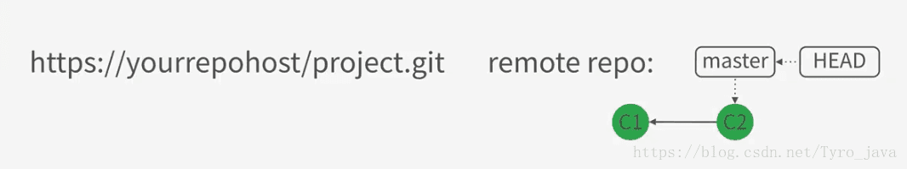
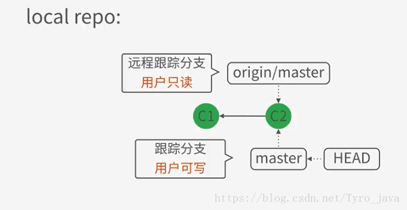
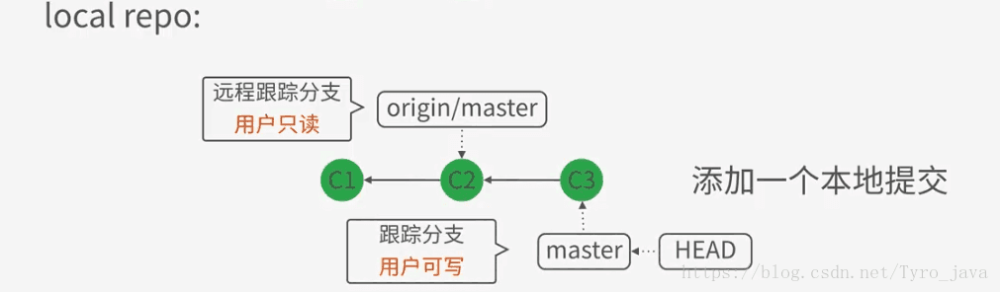
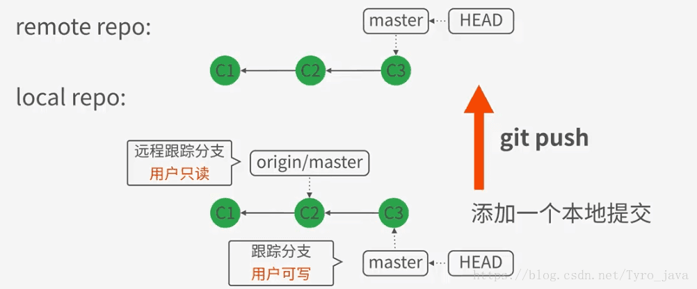
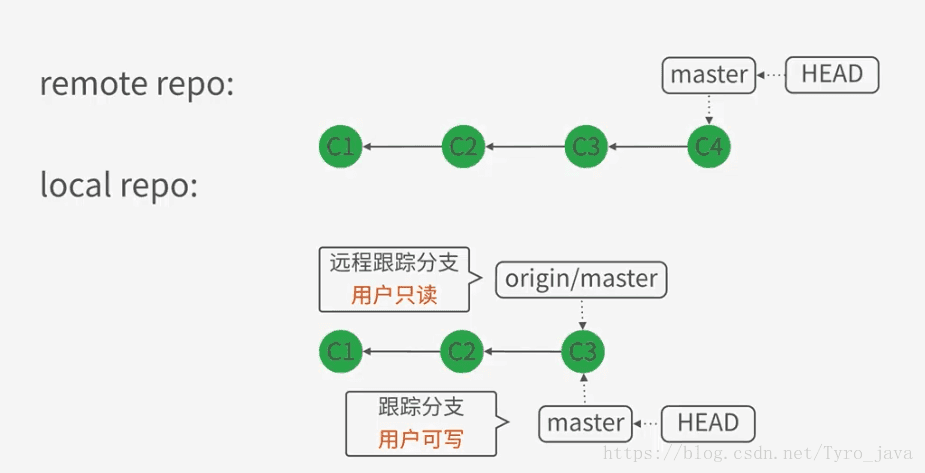
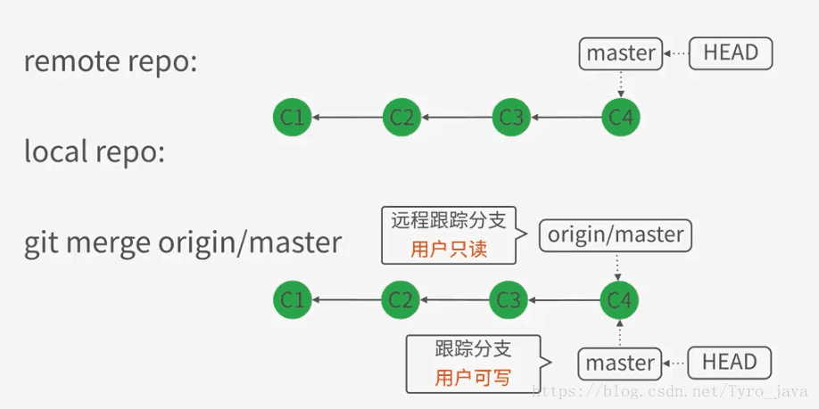
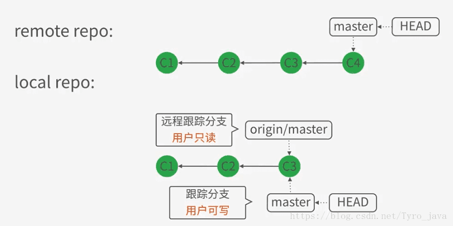

### 概念区分

- 分支(branch)：是指向某个commit对象的引用
- 跟踪分支(tracking branch)：本地的分支，比如master分支，用户可写
- 远程跟踪分支(remote tracking branch)：远程的分支origin/master, 用户只读

### 通过git clone操作来了解仓库同步的过程

- 克隆前【远程仓库】的状态：远程仓库master分支指向c2的commit
    

        
    

- 将数据克隆到本地之后：
  * 首先会生成一个origin/master的引用指向最新的提交c2，这个orgin/master 就是远程跟踪分支，用户只读。
    

        
    

 * 然后根据origin/master 生成一个master分支指向同一个提交c2, 如下：
    

        
    

### 通过git push操作来了解仓库同步的过程

- 项目克隆之后，修改本地文件并提交，此时master分支的head处于c3的位置【git push前的一个状态】
    

        
    

- 通过git push 命令会对远程和本地都作出修改
 * 修改远程的master指向至c3，如下图所示：
    

        
    

 * 修改本地的origin/master分支指向c3，如下图所示
    

        
    

### 关于checkout 的操作

- 通过 git checkout master 会把分支切换到master分支上
- 而当 git checkout origin/master 时，这个操作会处于‘detached Head' 状态，在这种状态下不会修改origin/master上的数据，可以修改并提交做一些实验性的操作，但是切换回master分支后，再次从master切换回origin/master时，之前的改变不会同步，因为origin/master 是用户只读的

### 通过git fetch origin获取数据

- 在fetch之前，远程处于c4，本地处于c3
    

        
    

- fetch之后，本地的origin/master分支指向了最新的c4
    

        
    

- 对比修改的地方：git diff master origin/master

### 通过git merge origin/master合并本地分支

- 备注：可以merge的前提是在无冲突的状态下，有冲突要手动解决
- merge之后，master分支指向c4, 如下图：
    

        
    

### 通过git pull获取同步最新数据

- 备注：前提是没有冲突，有冲突手动解决
- git pull 之前的状态：远程在c4, 本地在c32
    

        
    

- git pull 之后的状态：本地仓库更新了origin/master,将其指向c4; 然后更新master分支, 将其指向c4
    

        
    

- git pull = git fetch + git merge
- git pull --rebase = git fetch + git rebase

### 更新版本建议的操作

- git fetch + git merge
- git fetch + git rebase
- git pull --rebase