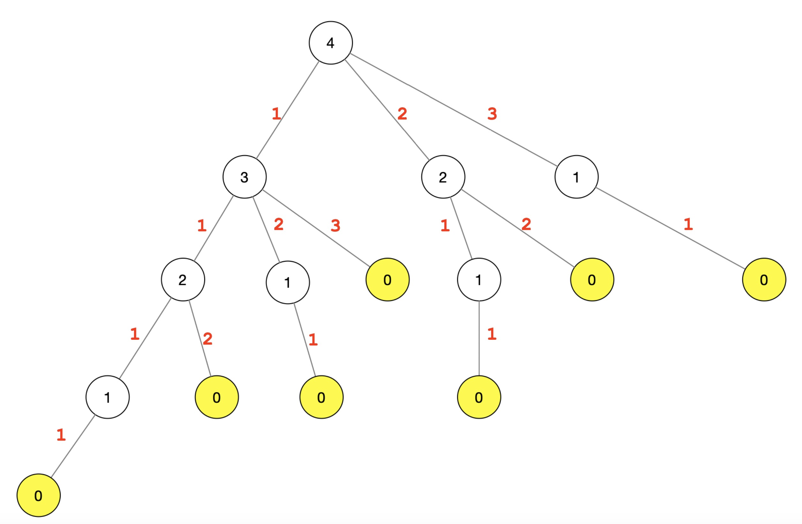
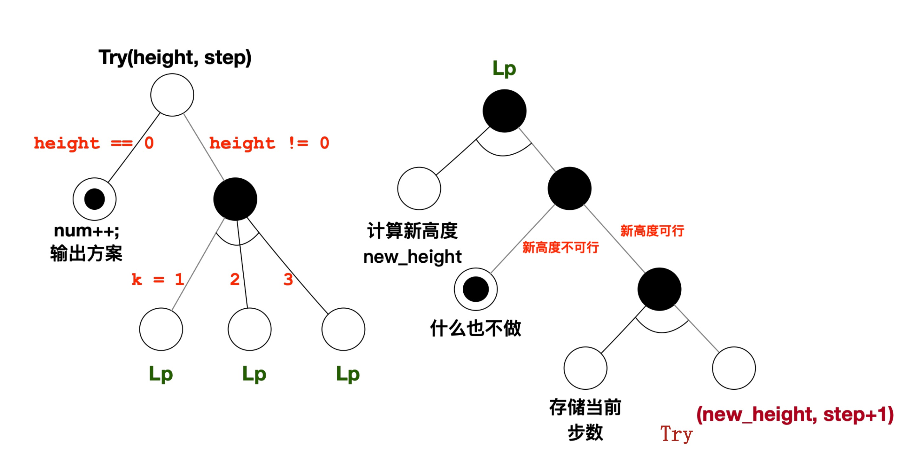
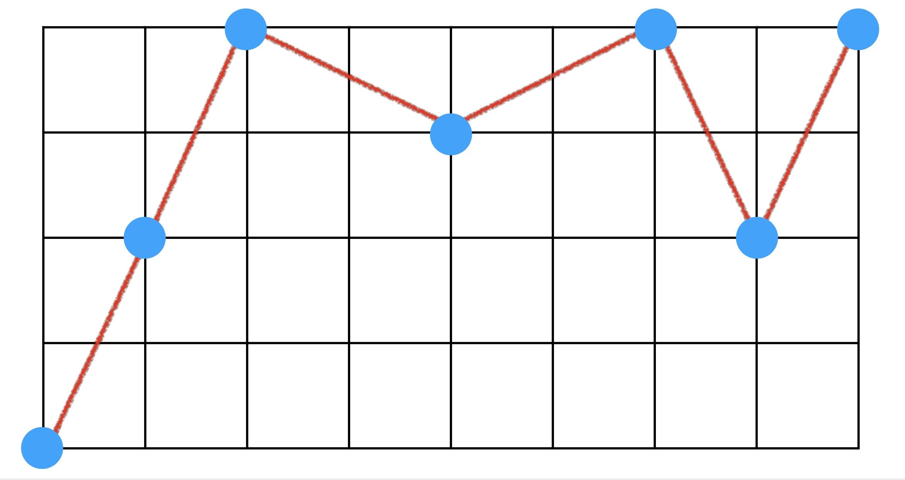
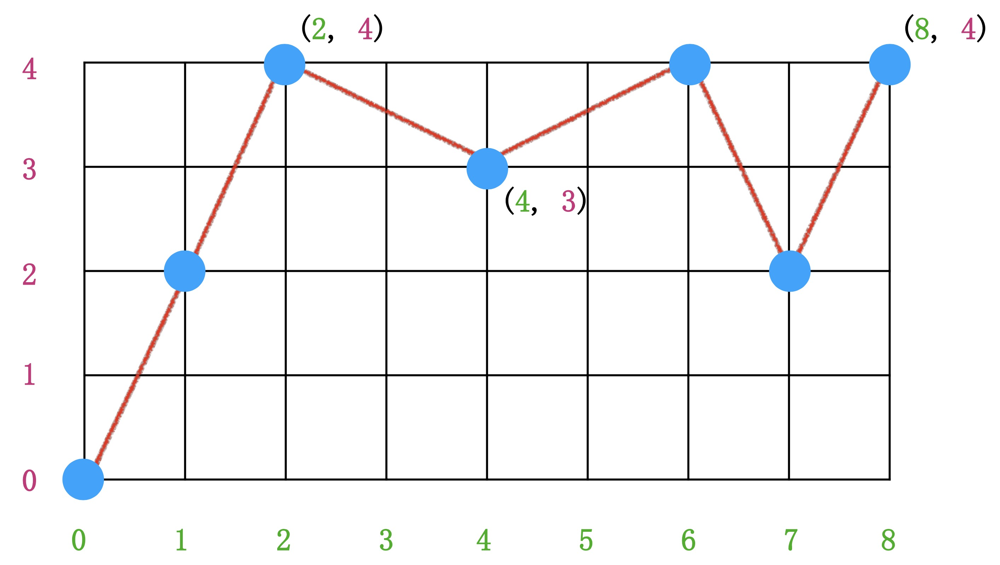
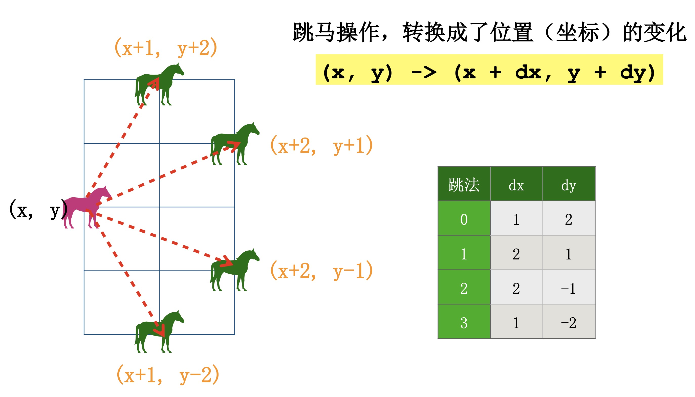
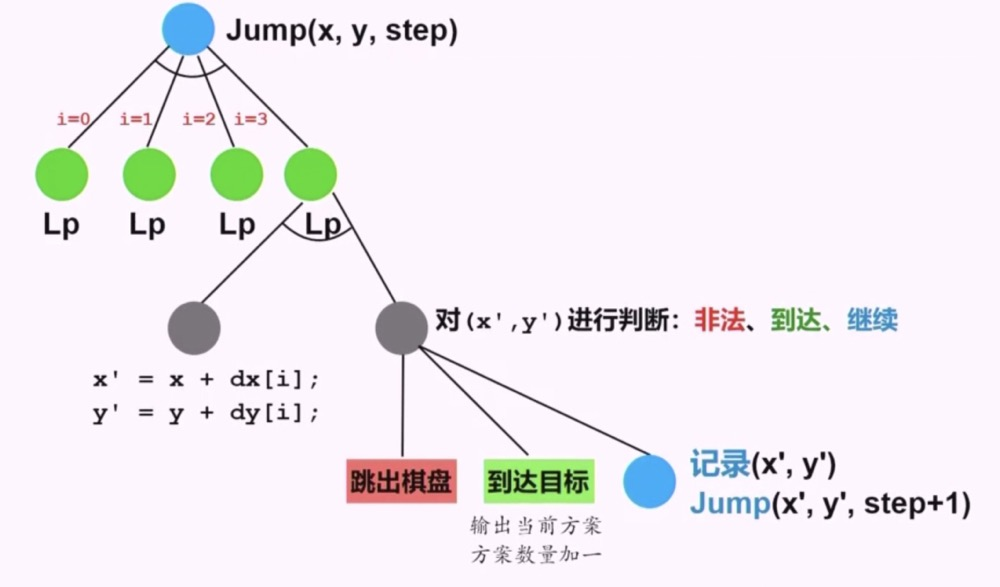
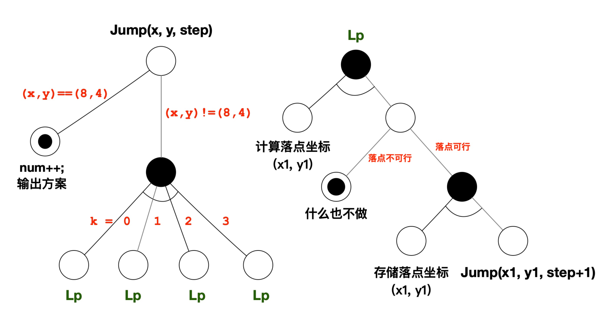

### 下台阶问题

1 ) **问题描述**

- 从楼上走到楼下共有 h 个台阶，每一步有三种走法
    * 走一个台阶;
    * 走二个台阶;
    * 走三个台阶。
- 问:一共可以走出多少种方案? 即共要多少步? 每一步走几级台阶?

2 ) **分析**

**初始思路**

- 我们根据题目给定的场景，先简单模拟一下，设定 $h=4$

<div align="center">
    
    <br />
    <div style="text-align:center">备注：图片托管于github，请确保网络的可访问性</div>
    <br />
</div>

- 如上图所示, 这里有4阶楼梯, 红色数字代表每一步走几级台阶
- 这里枚举了4层台阶的所有可能情况, 但是不管具体有几级台阶，下楼方式都是一样的
- 如果超过3层，那么每次三种方式：1级,2级和3级，如果不超过3层，那么只有1级和2级，这可以用for循环来实现。
- 这个4层是我们建立的一种模型，如果h无限大，那么这个问题的规模将会很大，我们要找到一种统一的方式来缩小问题的规模
- 不管这个h是几，也就是说，你在第$h_i$级台阶和在第$h_k$级台阶面临的问题都是同一类问题，只有参数不同而已
- 这里有个思想就是递归
    * 试着一步一步地走，从高到低，让变量i先取台阶数h
    * 从楼上到楼下，每走一步，变量i的值会减去每一步所走的台阶数j
    * 开始时，i = h(初值)，以后 i=i-j，(j=1,2,3)
    * 当 i = 0 时，剩余台阶数为0，这说明已走到楼下
    * 每一步走法策略都相同，故可以用递归算法
- 程序实现
    ```cpp
    #include <iostream>
    using namespace std;
    // 方案细节记录在take中(take数组记录了第几步(索引)采用的下台阶方案(1,2,3))，方案数用num累计 
    int take[99], num = 0;
    void Try(int i, int s); // 有i级台阶，从第s步开始, 初始是第1步(我们这里可设定索引从1开始)

    int main() {
        cout << "请输入楼梯台阶数:"; int h;
        cin >> h; // 输入楼梯的台阶数
        Try(h, 1); // 从第h级，开始下第一步
        cout << "总方案数:" << num << endl;
        return 0; 
    }

    // 有i级台阶，从第s步开始
    void Try(int i, int s) {
        for (int j=3; j>0; j--) {
            if (i >= j) {
                // 记录第s步走j个台阶
                take[s] = j;
                // 这里是终止条件，也就是最后一步完成的条件：如果已经到了楼下，最后一步剩下的台阶数和最后一种方案一样，那么直接完成
                if (i==j) {
                    num++; // 方案数加1
                    // 已经完成输出相关方案信息
                    cout << "方案" << num << ": ";
                    // 从1开始循环输出方案数
                    for (int k=1; k<=s; k++) {
                        cout << take[k]; 
                    }
                    cout << endl;
                } else {
                    // 尚未走到楼下
                    Try(i-j, s+1); // 再试剩下的台阶
                }
            }
        }
    }
    ```
- 我们可以看到这个程序上来就是一个循环，在循环体里面套了一个自身的递归

**改进版本**

- 上面那种思维是我们日常的解决问题的思维
- 一般用递归算法的时候，为了保证不出错，上来就要做终止条件的判断，这样也更容易把问题想清楚，更为高效和准确

<div align="center">
    
    <br />
    <div style="text-align:center">备注：图片托管于github，请确保网络的可访问性</div>
    <br />
</div>

- 这是一张与或图，分成左右两边
- 在左边有两个分支，高度为0作为终止条件，输出；高度不为0，有三种可能性需要尝试
- 在右边是左边第二个分支的进行计算和判断的逻辑
- 上面这张图经常在递归算法中用到
- 实心黑色的圈加下面的弧线表示`与节点`；没有弧线的的实心黑圆是`或节点`
- 代码实现
    ```cpp
    #include <iostream>
    using namespace std;

    // 楼梯高度(台阶数量)
    int h;
    // 方案总数
    int num;
    // 方案内容
    int *path = new int[h];
    // 第step步，从高度height开始，继续下楼 
    void Try(int height, int step);

    int main() {
        // 让用户自己输入台阶数
        cout << "请输入楼梯台阶数:"; 
        cin >> h;
        // 总方案数初值为0
        num = 0;
        // 第0步，从高度h出发 
        Try(h, 0);
        return 0;
    }

    /// 第step步，从高度height开始，继续下楼
    void Try(int height, int step) {
        /// 递归中止条件:到达楼梯底层 
        if (height == 0) {
            num ++;
            // 输出该方案
            cout << "方案:" << num << ": ";
            // 循环输出当前方案的具体内容
            for (int i = 0; i < step; i++) {
                cout << path[i] << ' ';
            }
            // 最后换行
            cout << endl;
            return;
        }
        /// 依次尝试不同的下楼步数(循环变量i是步数) 
        for (int i = 1; i <= 3; i++) {
            // 1. 计算新高度
            int new_height = height - i;
            // 2. 高度是否可行?
            if (new_height < 0) continue;
            // 3. 记录当前步数
            path[step] = i;
            // 4. 继续向目标前进, 自身递归运算
            Try(new_height, step+1);
        }
    }
    ```

### 象棋跳马问题

1 ) **问题描述**

- 在半张中国象棋的棋盘上，一只马从左下角跳到右上角，只允许往右跳，不允许往左跳，问能有多少种跳步方案。
- 要求:输出方案数和各方案的具体跳法。

<div align="center">
    
    <br />
    <div style="text-align:center">备注：图片托管于github，请确保网络的可访问性</div>
    <br />
</div>

2 ) **分析**

- 按照题目要求，这里跳马从左下角开始跳，不考虑马在实际象棋中的位置
- 棋盘跳马应该怎么算, 我们要把实际问题转化为数学模型
- 我们将棋盘坐标化, 数字化，棋盘上的每个位置用数字来表示，计算机才有可能去计算它
- 棋盘左下角坐标(0,0), 右上角坐标(8,4)

<div align="center">
    
    <br />
    <div style="text-align:center">备注：图片托管于github，请确保网络的可访问性</div>
    <br />
</div>

- 跳马应该怎么跳，也需要数字化跳法，跳马操作应该是一个坐标的变化
- 我们取一个通用的位置，一次跳马可以有以下四种可能

<div align="center">
    
    <br />
    <div style="text-align:center">备注：图片托管于github，请确保网络的可访问性</div>
    <br />
</div>

- 这时候4种跳法都变成了数学上的加减操作
    * `(x,y) -> (x + dx, y + dy)`
        * 0: `(x,y) -> (x + 1, y + 2)`
        * 1: `(x,y) -> (x + 2, y + 1)`
        * 2: `(x,y) -> (x + 2, y - 1)`
        * 3: `(x,y) -> (x + 1, y - 2)`
- 我们只需要用数组存储所有跳法，用循环枚举实现所有遍历
- 从(0,0)到(8,4)，中间变化的过程就是跳马的方案，有多少种变化就有多少种方案
- 伪代码实现
    ```cpp
    for i from 0 to 4 do:
        (x,y) -> (x + dx[i], y + dy[i])
        ...
    ```
- 这里每一步的跳法都对应一个新坐标的变化, 同时要对新坐标的合法性和是否达到终点进行判断
- 思路(1): 第step步从(x,y)位置开始遍历

<div align="center">
    
    <br />
    <div style="text-align:center">备注：图片托管于github，请确保网络的可访问性</div>
    <br />
</div>

- 遍历从当前位置出发的所有可能性，并对各种可能性得到的方案进行记录，累计方案的总数
- 程序实现
    * 可以参考上面关于下楼问题的初始思路代码
    * 不再提供代码，不推荐使用此方法，推荐下面更为规范的方法
- 思路(2): 先判断是否中止，再枚举递归

<div align="center">
    
    <br />
    <div style="text-align:center">备注：图片托管于github，请确保网络的可访问性</div>
    <br />
</div>

- 简单的设计一下数据结构
    * 根据马的不同跳法，使用"平行数组", 两个数组，成对使用
        * `int dx[] = {1, 2, 2, 1}, dy[] = {2, 1, -1, -2};`
    * 操作步骤记录:二维数组，一维是跳步的次序，一维是位置坐标
        * `int path[100][2]; // 总步数取一个较大的值(估计值)`
        * 每一步记录两个值 path[step][0], path[step][1]，分别对应x和y
- 代码实现
    ```cpp
    #include <iostream>
    using namespace std;
    int dx[] = {1, 2, 2, 1}, dy[] = {2, 1, -1, -2}; 
    // 定义总方案数和存放方案的二维数组
    int num, path[100][2];
    void Jump(int x, int y, int step);

    int main() {
        // 初始方案数置0
        num = 0;
        // 第0步，从(0,0)出发
        Jump(0, 0, 0);
        cout << "总方案数：" << num << endl;
        return 0;
    }

    void Jump(int x, int y, int step) {
        // 是否到达目标? 终止条件的判断
        if((x==8) && (y==4)) {
            num++; // 方案数加1
            cout << num << ": ";
            // 从起点开始输出各步的坐标
            for (int i=0; i<step; i++) {
                cout << "(" << path[i][0] << ", " << path[i][1] << ") "; 
            }
            cout << endl;
            return; 
        }
        // 遍历四种跳步方向
        for (int k=0; k<4; k++) {
            int x1 = x + dx[k], y1 = y + dy[k]; // (x1, y1)是否可行?
            if ((x1 < 0) || (x1 > 8) || (y1 < 0) || (y1 > 4)) {
                continue;
            }
            path[step][0] = x1;
            path[step][1] = y1;
            // 跳一步,探索不同的跳步方案
            Jump(x1, y1, step+1);
        }
    }
    ```
- 代码重构，数据结构的优化：用结构类型struct表示落点坐标(结构和坐标建立联系)
- 具体实现
    ```cpp
    #include <iostream>
    using namespace std;
    struct position { int x, y; };
    position dxy[4] = {{1,2}, {2,1}, {2, -1}, {1, -2}}; 
    position start_pos = {0, 0};
    position path[100];
    int num;
    void Jump(position pos, int step);

    int main() { 
        num = 0; // 初始方案数置0
        Jump(start_pos, 0);  // 跳第一步
        cout << "总方案数：" << num << endl;
        return 0; 
    }

    void Jump(position pos, int step) {
        // 是否到达目标?
        if ((pos.x == 8) && (pos.y == 4)) {
            num++; // 方案数加1
            cout << num << ": ";
            for (int i=0; i<step; i++) {
                // 从起点开始输出各步的坐标
                cout << "(" << path[i].x << ", "<< path[i].y << ") ";
            }
            cout << endl;
            return;
        }
        // 遍历四种跳步方向
        for (int k=0; k<4; k++) {
            position next_pos = {pos.x + dxy[k].x, pos.y + dxy[k].y}; // 检查next_pos是否可行?
            if ((next_pos.x < 0) || (next_pos.x > 8) || (next_pos.y < 0) || (next_pos.y > 4)) {
                continue; 
            }
            path[step] = next_pos; // 记录方案!结构变量可以直接赋值!
            Jump(next_pos, step+1); // 跳下一步
        }
    }
    ```
- 继续优化，用自定义函数检查落点坐标
- 代码实现
    ```cpp
    #include <iostream> 
    using namespace std;
    struct position { int x, y; };
    position dxy[4] = {{1,2}, {2,1}, {2, -1}, {1, -2}}; 
    position start_pos = {0, 0}, goal_pos = {8, 4}; 
    position path[100];
    int num;
    void Jump(position pos, int step);

    int main() {
        num = 0;
        Jump(start_pos, 0);
        cout << "总方案数：" << num << endl;
        return 0;
    }

    // 是否合法
    bool IsValid(position pos) {
        return (pos.x >= 0) && (pos.x <= 8) && (pos.y >= 0) && (pos.y <= 4);
    }

    // 是否到达终点
    bool IsGoal(position pos) { 
        return (pos.x == goal_pos.x) && (pos.y == goal_pos.y); 
    }

    void Jump(position pos, int step) {
        // 是否到达目标?
        if (IsGoal(pos)) {
            num++; // 方案数加1
            cout << num << ": ";
            // 从起点开始输出各步的坐标
            for (int i=0; i<step; i++) {
                cout << "(" << path[i].x << ", "<< path[i].y << ") ";
            }
            cout << endl;
            return; 
        }
        // 遍历四种跳步方向
        for (int k=0; k<4; k++) { 
            position next_pos = {pos.x + dxy[k].x, pos.y + dxy[k].y}; 
            if (!IsValid(next_pos)) continue; // 检查next_pos是否可行? 
            path[step] = next_pos; // 记录这一步的方案
            Jump(next_pos, step+1); // 跳下一步
        }
    }
    ```