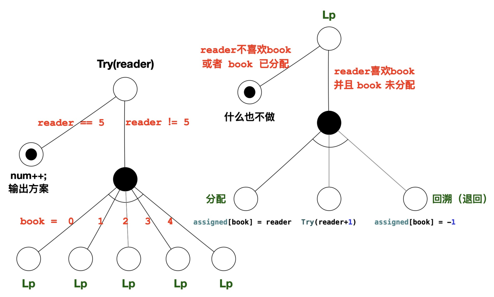
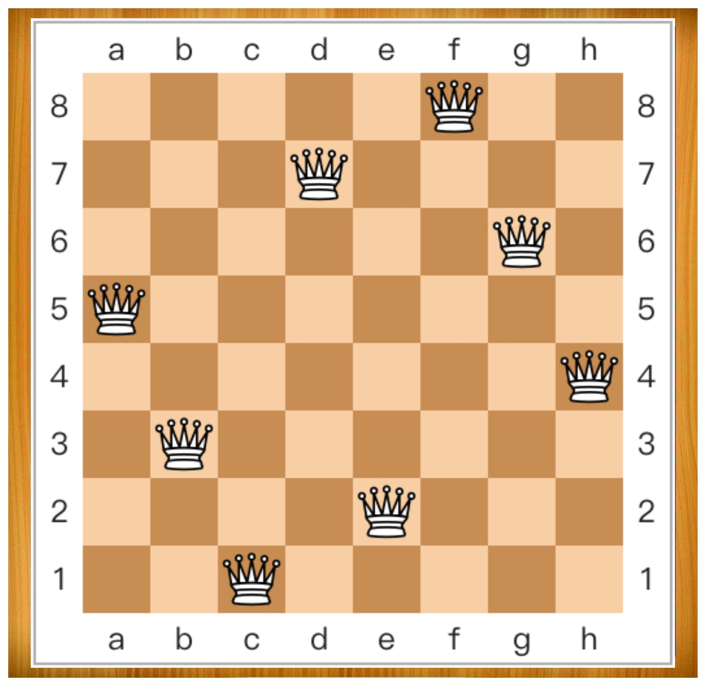
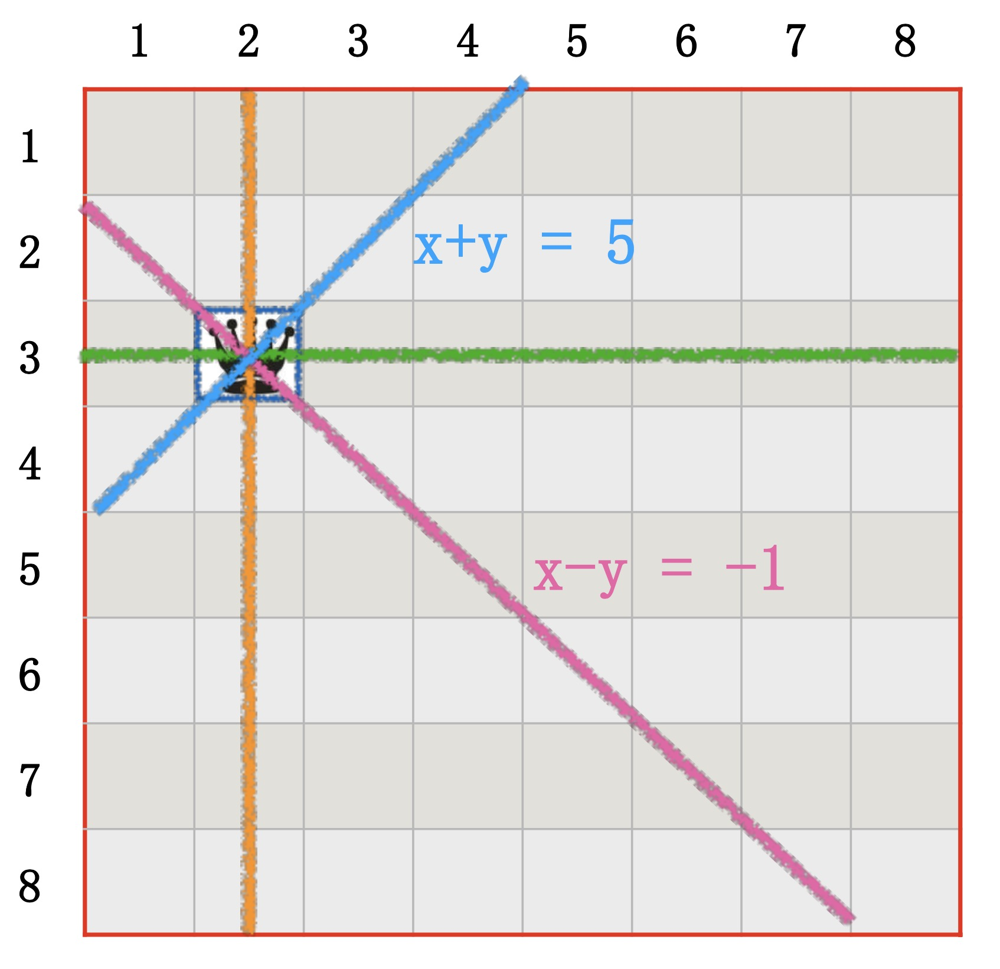
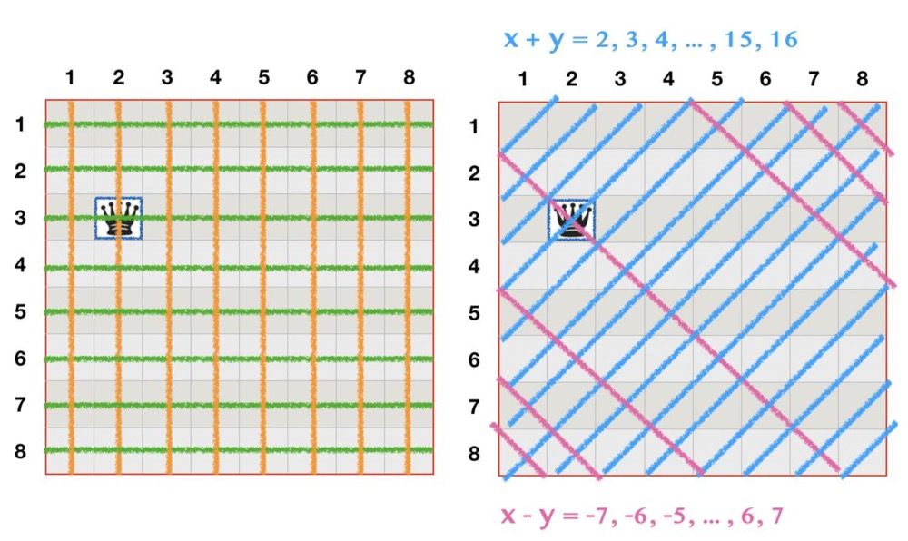
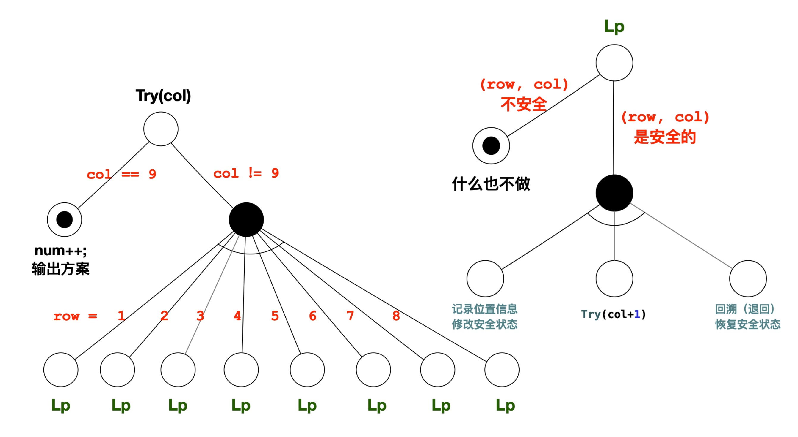

### 分书问题

1 ) **问题描述**

- 有编号分别为 0、1、2、3、4 的五本书，准备分给A、B、C、D、E五个人。
- 请你写一个程序，输出所有的分书方案，要求每个分书方案都能让每个人都皆大欢喜(即每人都分到感兴趣的书)。
- 假定这5个人对5本书的阅读兴趣如下表:

<div align="center">
    
    <br />
    <div style="text-align:center">备注：图片托管于github，请确保网络的可访问性</div>
    <br />
</div>

2 ) **分析**

**初步分析**

- 上面的这个阅读兴趣表格可以用一个二维数组描述
    ```cpp
    int like[5][5] = {
        {0, 0, 1, 1, 0},
        {1, 1, 0, 0, 1},
        {0, 1, 1, 0, 1},
        {0, 0, 0, 1, 0},
        {0, 1, 0, 0, 1}
    };
    ```
    * 关于这个`like[i][j]`数组
        * 值为0时，表示编号i的人不喜欢编号j的书籍
        * 值为1时，表示编号i的人喜欢编号j的书籍
- 书籍的状态也可以用一个一维数组来描述：`int asigned[5];`
    * 数组元素存储的是分配到下标对应书本的读者编号
    * 若 `assigned[book_id] == -1` 则表示`book_id`这本书没有分配
    * 注意:数组下标是书的编号
    * 开始时，设置所有书本均未分配出去。有两种方法:
        * `int assigned[5] = { -1, -1, -1, -1, -1 };`
        * `for (int i=0; i<5; i++) assigned[i] = -1;`
- 解题思路

<div align="center">
    
    <br />
    <div style="text-align:center">备注：图片托管于github，请确保网络的可访问性</div>
    <br />
</div>

- 这里有个重要的点是在每次尝试的时候，将书的状态重置，我们称之为回溯
- 代码实现
    ```cpp
    #include <iostream>
    using namespace std;

    /// 读者与书本的编号从0开始，这个二维数组维护了读者的阅读兴趣 like[reader][book], 0表示不喜欢，1表示喜欢
    int like[5][5] = { 
        {0, 0, 1, 1, 0},
        {1, 1, 0, 0, 1}, 
        {0, 1, 1, 0, 1}, 
        {0, 0, 0, 1, 0}, 
        {0, 1, 0, 0, 1}
    };
    // 方案数
    int num;
     // assigned[book_id] = reader_id，值为-1表示没有被分配, 这是我们最终要的方案内容
    int assigned[5];
    // 递归函数
    void Try(int reader);

    int main() {
        // 设置分书方案数初始值为0
        num = 0;
        /// 设置书本初始状态为未分配
        for (int book = 0; book < 5; book++) {
            assigned[book] = -1;
        }
        // 从第0个读者开始，寻找所有分书方案
        Try(0);
        return 0;
    }

    void Try(int reader) {
        // 递归中止条件:所有读者均已分配合适书籍
        if (reader == 5) {
            num++;
            cout << "第" << num << "个方案(5本书的读者编号): "; 
            for (int i = 0; i < 5; i++) {
                cout << assigned[i] << ' ';
            }
            cout << endl;
            return;
        }
        // 逐一为每本书找到合适的读者，每本书都要被所有的读者尝试一次
        for (int book = 0; book < 5; book++) {
            // 是否满足分书条件的判断: reader不喜欢book或者book已被分配，这时什么也不做, 去尝试下一本书
            if ((like[reader][book] != 1) || assigned[book] != -1) {
                continue;
            }
            // 此时：reader 喜欢 book 并且book未被分配
            // 记录当前这本book的分配情况，标记当前book分配给了谁
            assigned[book] = reader;
            // 当前读者已分配书籍，为下一位读者分配合适书籍
            Try(reader + 1);
            // 注意，这里当一种方案已经敲定的时候才会进行状态的重置
            // 也就是Try函数 return的时候(所有读者都有了阅读方案)
            // 当所有读者都分配完成之后，也就是assigned[]的内容完成之后，将书退还(回溯)，尝试另一种方案
            assigned[book] = -1;
        }
    }
    ```

**代码优化**

- 考虑不使用回溯，改变数据结构，借助函数调用形参与实参的关系，把被改变的量用新的临时变量来代表
- 本次循环结束后临时变量没用，下次循环仍旧使用函数传进来的变量
- 代码实现
    ```cpp
    #include <iostream>
    using namespace std;

    int like[5][5] = {  
        {0, 0, 1, 1, 0},
        {1, 1, 0, 0, 1},
        {0, 1, 1, 0, 1},
        {0, 0, 0, 1, 0},
        {0, 1, 0, 0, 1}
    };
    // 方案数
    int num;
    /// 分配方案:记录5本book分别分给谁(用户编号), 也就是解决问题的一种方案内容
    struct assign_state { int assigned[5]; } state;
    void Try(int reader, assign_state state);

    int main() {
        num = 0; // 分书方案数初始值
        for (int book = 0; book < 5; book++) {
            state.assigned[book] = -1; 
        }
        // 从第0个人(A)开始分书
        Try(0, state);
        return 0;
    }

    void Try(int reader, assign_state state) {
        // 递归中止条件:所有读者均已分配合适书籍
        if (reader == 5) {
            num++;
            cout << "第" << num << "个方案(5本书的读者编号): ";
            for (int i = 0; i < 5; i++) {
                cout << state.assigned[i] << ' ';
            }
            cout << endl;
            return;
        }

        // 逐一为每本book找到合适的读者
        for (int book = 0; book < 5; book++) {
            // 是否满足分书条件
            if (like[reader][book] != 1 || state.assigned[book] != -1) {
                continue;
            }
            // 记录当前这本book的分配情况 产生新的状态变量记录方案
            assign_state next_state = state; 
            next_state.assigned[book] = reader;

            // 为下一位读者分配合适书籍
            Try(reader+1, next_state);
        }
    }
    ```

### 八皇后问题

1 ) **问题描述**

- 在国际象棋的棋盘上，放置8个皇后(棋子)，使皇后两两之间互不攻击。
- 所谓互不攻击，是说任何两个皇后都要满足: 
    * (1) 不在棋盘的同一行; 
    * (2) 不在棋盘的同一列; 
    * (3) 不在棋盘的同一对角线上

<div align="center">
    
    <br />
    <div style="text-align:center">备注：图片托管于github，请确保网络的可访问性</div>
    <br />
</div>

1 ) **分析**

**初步思路**

- 以皇后为对象，有8个皇后，枚举8个皇后所有可能的情形(记录所有8个皇后的位置)
- 难点在于：已知8个皇后的位置，如何判断它们是否可以相互攻击
    * 即：是否有两个以上的皇后位于同一行、同一列、同一对角线上?
    * 就这一问题，提出两种思路：
        * 思路(1): 以皇后为枚举对象，对皇后两两之间进行攻击性的判断，按行或列的次序，将每一个皇后跟前面所有皇后依次进行攻击判断(类似“插入排序”的思想)。
        * 思路(2): 以行、列、对角线为枚举对象，统计各方向上的皇后数量(类似“词频统计”的思想)。
- 关键代码实现(不完全参考)
    ```cpp
    #include <iostream>
    using namespace std;

    // 判断它们是否可以相互攻击(是否有两个以上的皇后位于同一行、同一列、同一对角线上)
    bool isSafe(int q[9]) {
        // ? todo 两种方式来处理
        bool flag = true; // or false
        return flag;
    }

    int main() {
        int q[9], num = 0;
        for (q[1] = 1; q[1] <= 8; q[1] ++){
            for (q[2] = 1; q[2] <= 8; q[2] ++){
                for (q[3] = 1; q[3] <= 8; q[3] ++){
                    for (q[4] = 1; q[4] <= 8; q[4] ++){
                        for (q[5] = 1; q[5] <= 8; q[5] ++){
                            for (q[6] = 1; q[6] <= 8; q[6] ++){
                                for (q[7] = 1; q[7] <= 8; q[7] ++){
                                    for (q[8] = 1; q[8] <= 8; q[8] ++) {
                                        // 判断是否安全
                                        if(isSafe(q)) {
                                            num++;
                                            // 输出当前方案
                                            cout << num << ": ";
                                            for (int i = 1; i <= 8; i++) {
                                                cout << q[i] << ' ';
                                            }
                                            cout << endl;
                                        }
                                    }
                                }
                            }
                        }
                    }
                }
            }
        }
        return 0;
    }
    ```

**方案优化**

- 如果不使用暴力枚举，是否有比较好的方案呢?
- 从第一列开始逐一摆放皇后，直至8列均放上皇后。
- 对于第i个皇后(在第i列)，逐一检查该列的8行，判断是否会被前i-1个皇后攻击到，选择一个安全位置。
- 当8个皇后都成功放到棋盘上之后，这个布局就是题目的一个解。
- 为了找到所有可能的解，需要记录下这一布局，然后继续尝试其他可能的行(对各列均应如此)。
- 关键实现代码：
    ```python
    def solve():
        s = []
        stack = [[]]
        while stack != []:
            a = stack.pop()
            if len(a) == 8:
                s.append(a)
            else:
                for i in range(1, 9):
                    if valid(i, a):
                        stack.append(a + a[i])

    def valid(x, a):
        y = len(a) + 1
        for i in range(1, y):
            if x == a[i - 1] or abs(y - i) == abs(x - a[i - 1]):
                return False
        return True

    s = solve()
    for r in s: print(r)
    print('Total %d solutions.' % len(s))
    ```

**进一步优化**

- 假定按列摆放皇后。棋盘共有8列(横轴方向)，每列能有且只能有一个皇后，至多能放8个皇后。
- 因此，这8个皇后“分别应该放在哪一行上(纵轴方向)?” 就成为求解任务要回答的问题。
- 我们采用试探方法: “向前走(放置皇后)，碰壁回头(取走 皇后)”的策略，即“回溯法”的解题思路。
- 每一个皇后放上去之后，就相当于删掉了一些行和列，在剩下的行和列中放皇后
- 这个问题于是就转换成了一个规模不断缩小的同一类问题
- 关键难点在于棋盘上指定位置的安全性的判断，这里需要将这些信息用数学来表述

<div align="center">
    
    <br />
    <div style="text-align:center">备注：图片托管于github，请确保网络的可访问性</div>
    <br />
</div>

- 这里可以看到了一些规律
    * 行:对比纵坐标
    * 列:对比横坐标
    * 对角线:比较横纵坐标的关系
    * 蓝色：x+y=5
    * 紫色：x-y=-1
    * 可以看到共线的一些点都是符合一定的数学关系的

- 当画出更多线条的时候(不完全线条)，进一步，可以看到

<div align="center">
    
    <br />
    <div style="text-align:center">备注：图片托管于github，请确保网络的可访问性</div>
    <br />
</div>

- 绿色和橙色的线条的共线分别要求纵坐标y和横坐标x相等
- 蓝色和紫色的线条的共线分别要求x+y和x-y是相等的
- 这就转换成了判断皇后是否相杀只要看他们的坐标是否满足相应的关系即可
- 这里就形成了初步的递归方案，如下图：

<div align="center">
    
    <br />
    <div style="text-align:center">备注：图片托管于github，请确保网络的可访问性</div>
    <br />
</div>

- 实现代码如下：
    ```cpp
    #include <iostream> 
    using namespace std;

    int Num; // 方案数
    int Q[9]; // 8个皇后所占用的行号
    bool S[9]; // S[1]~S[8]，当前行是否安全
    bool L[17]; // L[2]~L[16]，(i-j)对角线是否安全
    bool R[17]; // R[2]~R[16]，(i+j)对角线是否安全
    const int OFFSET = 9; // 用来统一数组下标范围[2,3,...,16]
    void Try(int col); 

    int main() {
        Num = 0;
        for(int i=0; i<9; i++) {
            S[i]=true;
        }
        for (int i = 0; i < 17; i++) {
            L[i] = R[i] = true;
        }
        Try(1); // 从第1列开始放皇后
        cout << "方案总数为：" << Num << endl;
        return 0;
    }

    void Try(int col) {
        /// 递归中止条件:所有列均已放上皇后了 
        if (col == 9) {
            Num ++;
            cout << "方案" << Num << ":";
            for (int k = 1; k <= 8; k++) {
                cout << Q[k] << " ";
            }
            cout << endl;
            return;
        }
        // 依次尝试当前列的 8 行位置
        for (int row = 1; row <= 8; row++) {
            /// 判断拟放置皇后的位置是否安全 
            if (!S[row] || !R[col + row] || !L[col - row + OFFSET]) continue; 
            Q[col] = row; /// 记录位置信息(行号)
            /// 修改三个方向的安全性标记 
            S[row] = false;
            L[col - row + OFFSET] = false;
            R[col + row] = false;
            Try(col + 1); /// 递归尝试放下一列

            /// 回溯:恢复三个方向原有安全性 
            S[row] = true;
            L[col - row + OFFSET] = true; 
            R[col + row] = true;
        }
    }
    ```

**程序优化**

- 考虑不使用回溯的方式
- 代码实现
    ```cpp
    #include <iostream> 
    using namespace std;

    int Num; // 方案数

    struct place_state { 
        int Q[9]; // 8个皇后所占用的行号
        bool S[9]; // S[1]~S[8]，当前行是否安全
        bool L[17]; // L[2]~L[16]，(i-j)对角线是否安全
        bool R[17]; // R[2]~R[16]，(i+j)对角线是否安全
    } state;

    const int OFFSET = 9; // 用来统一数组下标范围[2,3,...,16]
    void Try(int col, place_state state); 

    int main() {
        Num = 0;

        for (int i = 0; i < 17; i++) {
            if(i < 9) {
                state.S[i]=true;
            }
            state.L[i] = state.R[i] = true;
        }

        Try(1, state); // 从第1列开始放皇后
        cout << "方案总数为：" << Num << endl;
        return 0;
    }

    void Try(int col, place_state state) {
        /// 递归中止条件:所有列均已放上皇后了 
        if (col == 9) {
            Num ++;
            cout << "方案" << Num << ":";
            for (int k = 1; k <= 8; k++) {
                cout << state.Q[k] << " ";
            }
            cout << endl;
            return;
        }
        // 依次尝试当前列的 8 行位置
        for (int row = 1; row <= 8; row++) {
            /// 判断拟放置皇后的位置是否安全 
            if (!state.S[row] || !state.R[col + row] || !state.L[col - row + OFFSET]) continue; 
            place_state next_state = state;
            next_state.Q[col] = row; /// 记录位置信息(行号)
            /// 在新的状态变量中，记录三个方向的安全性(作标记) 
            next_state.S[row] = false;
            next_state.L[col - row + OFFSET] = false; 
            next_state.R[col + row] = false;
            // 递归尝试放下一列
            Try(col + 1, next_state);
        }
    }
    ```