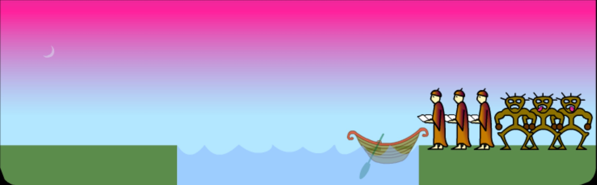
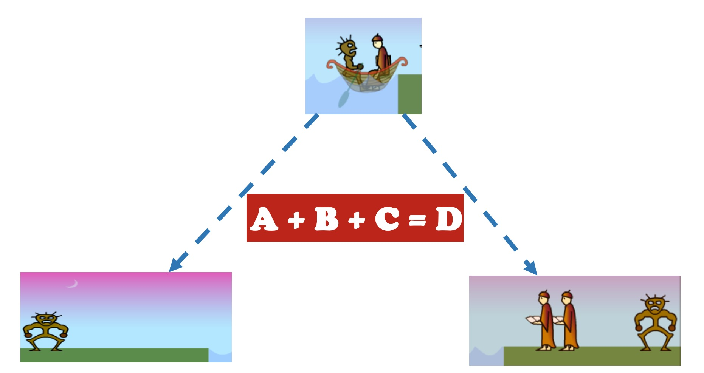
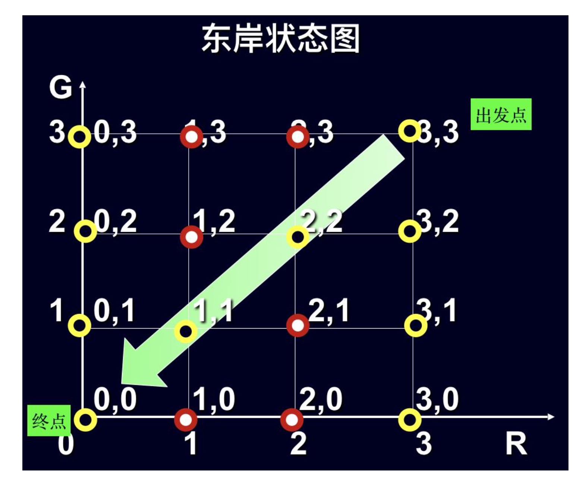
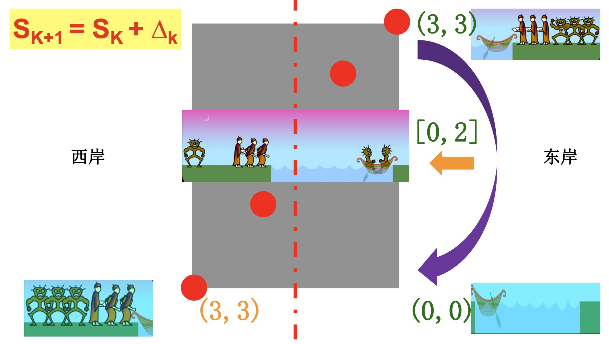
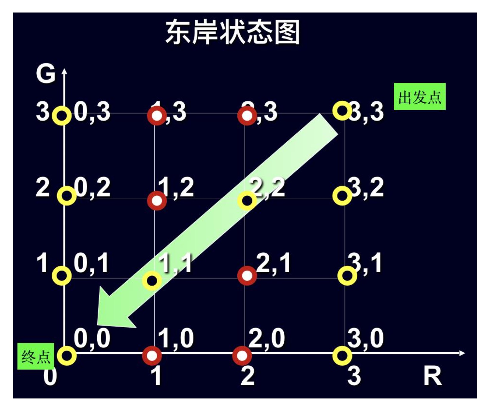
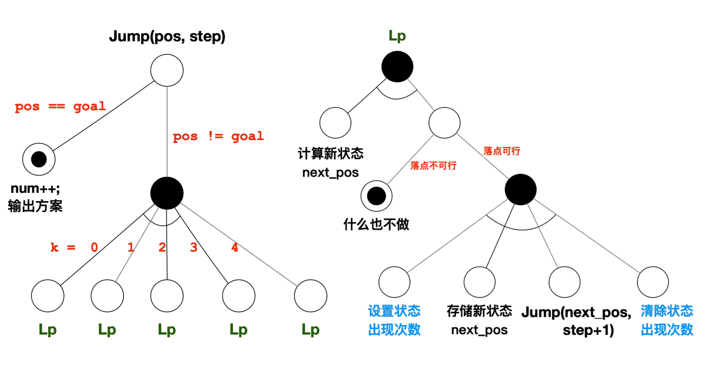

### 人鬼渡河问题

1 ) **问题描述**

- 目标:将东岸的3人3鬼通过一只小船安全转移到西岸，希望摆渡次数尽可能少
- 条件
    * 船的容量有限，一次最多只能坐2人(或2鬼或1人1鬼)
    * 无论是在河的东岸还是在河的西岸，一旦鬼数多于人数，则人将被鬼吃掉
    * 怎样渡河的大权掌握在人的手中
- 说明:划船的时间忽略不计。船一靠岸即将船与岸视为一体，人和鬼即使还没有下 船也视为已上岸
- 任务:编写程序，求出一种渡河方案

<div align="center">
    
    <br />
    <div style="text-align:center">备注：图片托管于github，请确保网络的可访问性</div>
    <br />
</div>

2 ) **分析**

- 目标是找到一种策略，能将人鬼安全摆渡至对岸。这里的方案: 一系列“指令”。
- 计算机擅长做计算的问题，也就是说指令必须是对数的运算(将一个数转变为另一个数)
- 对于上面的渡河问题让计算机来处理必须将他们转化成数学领域可以计算的东西，也就是我们必须要建立一种数学模型
- 所以，在确定指令之前，应该确定是哪些数需要被计算，它们是什么？
- 我们需要考察变化的量，我们需要分析什么东西在变
    * 船的方向
    * 船里面的乘客(人鬼)数量
    * 左岸(西岸)的乘客数量
    * 右岸(东岸)的乘客数量
    * 可以观察到有一个恒定的值就是乘客的总数不变，东西两岸的乘客与船上的乘客之和不变
    * 两岸人鬼数量的变化是由渡船上的人鬼数量与船的运动方向决定的

<div align="center">
    
    <br />
    <div style="text-align:center">备注：图片托管于github，请确保网络的可访问性</div>
    <br />
</div>

- 现在思路就清晰了，我们约定人鬼分别用R,G来表示，即：(R,G)。
- 这里有一个动态的场景
    * 东岸的(R,G)也就是从一开始的(3,3)经过一系列的船来船往变成了(0,0)
    * 我们只要选定一个岸边就行了，因为总和是一样的
    * 每一个渡河中的“东岸场景”都与一个数对(R，G)相对应
    * 东岸所有可能场景(人鬼数)，会组成平面上的一个网格，如下图所示

<div align="center">
    
    <br />
    <div style="text-align:center">备注：图片托管于github，请确保网络的可访问性</div>
    <br />
</div>

- 现在这个数学模型基本确定了，从(3,3)到(0,0)这个过程是加加减减的问题，也就是渡河的方案
- 拿东岸来说, 如果乘坐2个鬼过去，那么就是从(3,3)到(3,1)的操作，我们可以把(R,G)看作复数或二维向量
- 现在可以用S表示(R,G)，代表一个整体，我们将在一次操作中改变人鬼的数量记为$\triangle_k$, 则有
    * $S_{k+1} = S_k \pm \triangle_k$
    * k表示一次操作(一次渡河方案)
    * 这个式子表示一次渡船操作前和操作后的关系，可见这个$\triangle_k$是船上人鬼的数量

<div align="center">
    
    <br />
    <div style="text-align:center">备注：图片托管于github，请确保网络的可访问性</div>
    <br />
</div>

- 还有一个需要确定船的方向，船过去船回来加减问题很重要，这个方向如何数字化，而且要求方便计算
- 设k为摆渡行船的次数(序号，从1开始计数)，用奇偶性来表示渡船的方向，从东岸到西岸或从西岸到东岸记1次。显然
    * 船从东到西，k为奇数, 此处东岸乘客数量减少
    * 船从西到东，k为偶数, 此处东岸乘客数量增加
- 定义一个2维向量$d_k$为第K次渡河的摆渡策略: $d_k = (r_k, g_k)$
    * 其中，$r_k$为上船的人数，$g_k$为上船的鬼数，则所有合法(规则:船上最多只能坐2人)的渡河摆渡决策集合D定义如下:
    * $D = \{(r,g)\}$
        * r = 2, g = 0;
        * r = 1, g = 0;
        * r = 1, g = 1;
        * r = 0, g = 1;
        * r = 0, g = 2;

- 还有就是渡河前东岸的安全状态问题，用2维向量$S_k = (R_k, G_k)$定义为第k次渡河前东岸的渡河状态，则安全渡河东岸状态集合S有：
    * $S = \{(R,G)\}$
      * $R=0, G=0,1,2,3$
      * $R=3, G=0,1,2,3$
      * $R=1, G=1$
      * $R=2, G=2$
    * 根据规则，推导出安全性检测标准: 在东岸，人数等于3或人数等于0，或人数鬼数相等, 用代码表示相关逻辑为：
        ```cpp
        // r表示东岸人数,g表示东岸鬼数
        bool AQ = (r == 3) || (r == 0) || (r == g) // 是否安全
        if(!AQ) continue; // 如果不安全，则舍弃当前决策
        ```

<div align="center">
    
    <br />
    <div style="text-align:center">备注：图片托管于github，请确保网络的可访问性</div>
    <br />
</div>

- 可以看到上图中红色的点表示不安全
- 由之前的 $S_{k+1} = S_k \pm \triangle_k \Leftrightarrow S_{k+1} = S_k \pm d_k \Leftrightarrow S_{k+1} = S_k + (-1)^k d_k$
    * 注意:k的范围是[1..n]，从1开始，到未知待求的n结束
- 整个模拟过程如下：

<div align="center">
    
    <br />
    <div style="text-align:center">备注：图片托管于github，请确保网络的可访问性</div>
    <br />
</div>

- 这里算法实现的思想是：迭代 + 枚举 + 递推
    * 迭代：从起始到结束
    * 枚举：所有可能决策
    * 递推：状态转移方程

- 算法实现：
    ```cpp
    #include <iostream>
    #include <iomanip>
    using namespace std;

    // 定义描述渡河状态东岸人数与鬼数的结构变量。R: 状态中的人数, G: 状态中的鬼数 
    struct state { int R, G; };
    //结构数组记录渡河时的状态转移过程
    state s[20];
    //记录状态转移过程的决策号，初始化都为0
    int choice[20] = {0};
    //状态号
    int k;

    // 摆渡策略(数组) 0号策略不用, 有用的只有5个, 其中从{2,0}到{0,2} 这有用的5个, 决策编号依次为：1,2,3,4,5
    state d[6] = {{0, 0}, {2, 0}, {1, 0}, {1, 1}, {0, 1}, {0, 2}};
    void display(); // 输出渡河状态
    void transfer_state(); // 渡河状态转移函数

    int main() {
        transfer_state();
        display();
        return 0;
    }

    void transfer_state() {
        k = 1; //初始状态设为1, 也就是第一次从东岸走，是奇数，减法操作
        s[1].R = 3; //初始状态东岸有3人 
        s[1].G = 3; //初始状态东岸有3鬼

        do {
            int fx = 1; //摆渡方向，东向西或西向东
            if (k % 2 == 1) {
                fx = -1; //奇数表明摆渡要从东岸到西岸
            }
            int i; //决策号

            // 针对下一状态(次序为k+1，choice数组元素初值为0)，依次尝试所有决策(决策号从1到5)
            for (i = choice[k + 1] + 1; i <= 5; i++) {
                //试探采用哪个决策能安全走1步
                int r = s[k].R + fx * d[i].R; //按第i号策略走1步后，东岸的人数 
                int g = s[k].G + fx * d[i].G; //按第i号策略走1步后，东岸的鬼数
                // 判断是否越界
                bool cross = r > 3 || g > 3 || r < 0 || g < 0;
                // (1) 越界，舍弃当前决策
                if (cross) continue;
                bool AQ = (r == 3) || (r == 0) || (r == g); //是否安全
                //(2) 不安全，舍弃当前决策
                if (!AQ) continue;
                bool CHF = false; //是否重复 
                //查历史信息(倒序)，仅考虑摆渡方向一致的状态(增量为-2) 
                for (int j = k - 1; j >= 1; j -= 2) {
                    if (s[j].R == r && s[j].G == g) {
                        CHF = true; //若人鬼数一致，则是重复状态 
                    }
                }
                //(3) 重复，则舍弃当前决策，继续(continue)尝试下一决策
                if (CHF) {
                    continue;
                }
                // 按策略渡河，状态号加1
                k++;
                s[k].R = r; 
                s[k].G = g;
                //记录决策号
                choice[k] = i;
                //已找到一个决策，跳出(break)循环，**暂停** 尝试其他策略
                break;
            }
            // 所有摆渡决策都没成功，则需要回退
            if (i > 5) {
                choice[k+1]=0; 
                k--;
            }
        } while (!(s[k].R == 0 && s[k].G == 0)); // 目标是东岸既无人又无鬼
    }

    void display() {
        for (int i = 1; i <= k; i++) {
            cout << setw(2) << i << ": choice = " << choice[i] // 决策号
            << " {" << d[choice[i]].R << "," << d[choice[i]].G << "}" // 决策内容
            << " (" << s[i].R << "," << s[i].G << ") "// 状态内容
            << endl;
        }
    }
    ```

### 人鬼渡河问题升级

1 ) **问题升级**

- 目标: 将东岸的3人3鬼通过一只小船安全转移到西岸，希望摆渡次数尽可能少
- 条件:
    * 船的容量有限，一次最多只能坐2人(或2鬼或1人1鬼)
    * 无论是在河的东岸还是在河的西岸，一旦鬼数多于人数，则人被鬼扔到河中
    * 怎样渡河的大权掌握在人的手中
- 任务: 编写程序，求出所有的渡河方案，要求没有多余的重复步骤

2 ) **分析**

- 视某一时刻东岸的(人，鬼)数对，是状态空间中的坐标点!
- 于是:
    * 任务转换为从起点状态(3，3)“跳”到终点状态(0，0) 
    * 坐标变化操作规则按照题目关于安全性的要求，可得
        * `dxy[] = {{1,0}, {0,1}, {1,1}, {2,0}, {0,2}};`
    * 对每一个状态，枚举尝试所有可能的决策
    * 若当前状态与终点状态一致，则输出此方案
- 按照这个思路，这一问题就转换成了跳马问题，使用枚举,递归的方式来解决

<div align="center">
    
    <br />
    <div style="text-align:center">备注：图片托管于github，请确保网络的可访问性</div>
    <br />
</div>

- 代码实现
    ```cpp
    #include <iostream>
    using namespace std;
    struct position { int x, y; }; // 不同决策对应的状态坐标变化
    position dxy[] = {{1,0}, {0,1}, {1,1}, {2,0}, {0,2}};
    // 起始状态，结束状态 
    position start_pos = {3, 3},
            goal_pos  = {0, 0};

    // 决策序列的记录
    position path[100]; 
    int num; // 总的方案数
    /// 记录出现次数，防止重复!!!
    int pos_cnt[2][4][4] = {{{0}}};

    // 坐标是否相等
    bool IsEq(position pos1, position pos2) {
        return (pos1.x == pos2.x) && (pos1.y == pos2.y);
    }

    // 是否完成
    bool IsDone(position pos) { 
        return IsEq(pos, goal_pos);
    }

    // 是否有效
    bool IsValid(position pos, int step) {
        // 声明合法性，安全性，重复性
        bool v, s, r;
        // 方向：0表示从左(西)到右(东), 1表示从右到左
        int dir = step % 2; 
        // 合法性检查
        v = (pos.x >= 0) && (pos.x <= 3) && (pos.y >= 0) && (pos.y <= 3); 
        // 安全性检查，根据游戏规则推导出来 
        s = (pos.x == pos.y || pos.x == 0 || pos.x == 3);
        // 重复性检查，根据算法特点推导出来的
        r = pos_cnt[dir][pos.x][pos.y] == 0;
        return v && s && r;
    }

    // 计数
    void SetCount(position pos, int step, int cnt) {
        // 获取方向：0表示从左(西)到右(东), 1表示从右到左
        int dir = step % 2;
        pos_cnt[dir][pos.x][pos.y] = cnt;
    }

    // 获取新的位置
    position GetNewPos(position pos, int k, int step) {
        // 次序决定方向，方向决定加减
        int dir = (step % 2 == 0) ? -1 : 1;  
        //通过引入方向变量，使下面的新坐标计算公式成为通用的，对两个方向均适用 
        position next_pos = {pos.x + dir * dxy[k].x, pos.y + dir * dxy[k].y}; 
        return next_pos;
    }

    void LogStep(position pos, int step) {
        path[step] = pos;
    }

    void OutStep(position pos) {
        cout << "(" << pos.x << ", "<< pos.y << ") ";
    }

    void OutAll(int step) {
        for (int i=0; i<=step; i++) {
            OutStep(path[i]); 
        }
        cout << endl;
    }

    void Jump(position pos, int step) {
        if (IsDone(pos)) { // 是否到达目标?
            num++; // 方案数加1 
            cout << num << ": "; OutAll(step); // 输出方案 
            return;
        }

        // 遍历N种方案
        for (int k=0; k<sizeof(dxy)/sizeof(dxy[0]); k++) {
            position next_pos = GetNewPos(pos, k, step);
            if (!IsValid(next_pos, step+1)) continue; // next_pos是否可行?
            SetCount(next_pos, step+1, 1); // 设置次数!!! 
            LogStep(next_pos, step+1); // 记录方案 
            Jump(next_pos, step+1); // 走下一步 
            SetCount(next_pos, step+1, 0); // 清除次数!!!(回溯)
        }
    }

    int main() {
        num = 0; // 初始方案数置0 
        SetCount(start_pos, 0, 1); // 第0步在起点(第一次)!!! 
        LogStep(start_pos, 0); // 记录起点 
        Jump(start_pos, 0); // 走第一步
        return 0;
    }
    ```

**代码优化，不要回溯**

- 代码实现：
    ```cpp
    #include <iostream>
    #include <iomanip>
    using namespace std;

    struct position { int x, y; };
    position dxy[] = {{1,0}, {0,1}, {1,1}, {2,0}, {0,2}};

    struct state {
        int dir;
        position pos; 
    };

    state start = {-1, {3, 3}}, goal = {1, {0, 0}};
    state path[100];
    int num;

    bool IsEq(state st1, state st2) {
        return (st1.dir == st2.dir) && (st1.pos.x == st2.pos.x) && (st1.pos.y == st2.pos.y);
    }

    bool IsDone(state st) { 
        return IsEq(st, goal); 
    }

    bool IsValid(state st, int step) {
        /// 1. 合法性检查
        if (st.pos.x < 0 || st.pos.x > 3 || st.pos.y < 0 || st.pos.y > 3) {
            return false;
        }
        /// 2. 安全性检查【根据游戏规则推导出来】
        if (st.pos.x != 0 && st.pos.x != 3 && st.pos.x != st.pos.y) {
            return false;
        }
        /// 3. 重复性检查
        for (int i=step-2; i>=0; i-=2) {
            if (IsEq(st, path[i])) {
                return false;
            }
        }
        return true;
    }

    state GetNewState(state st, int k, int step) {
        state next_st = {-st.dir, {st.pos.x + st.dir * dxy[k].x, st.pos.y + st.dir * dxy[k].y}};
        return next_st;
    }

    void LogStep(state st, int step) { 
        path[step] = st; 
    }

    void OutStep(state st) {
        cout << setw(2) << st.dir << " (" << st.pos.x << ", "<< st.pos.y << ") ";
    }

    void OutAll(int step) {
        for (int i=0; i<=step; i++) {
            OutStep(path[i]);
        }
        cout << endl;
    }

    void Jump(state st, int step) { 
        // 是否到达目标?
        if (IsDone(st)) {
            num++;
            cout << num << ": "; 
            OutAll(step); 
            return;
        }
        // 遍历N种决策
        for (int k=0; k<sizeof(dxy)/sizeof(dxy[0]); k++) {
            state next_st = GetNewState(st, k, step);
            if (!IsValid(next_st, step+1)) continue;
            LogStep(next_st, step+1); // 记录该决策
            Jump(next_st, step+1); // 转到下一状态
        }
    }

    int main() {
        num = 0; // 初始方案数置0 
        LogStep(start, 0); // 记录起点 
        Jump(start, 0); // 从起点出发 
        return 0;
    }
    ```

### 相关问题扩展

- 青蛙换位问题
- 华容道问题
- 分水问题