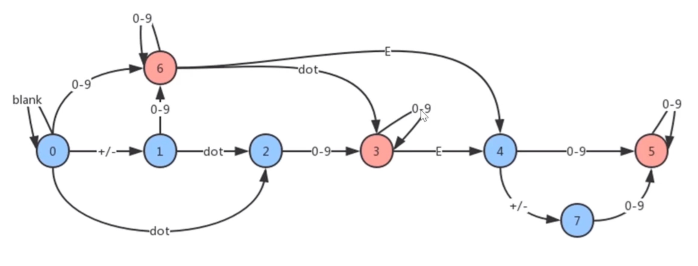

### 有效数字

- https://leetcode.cn/problems/valid-number/

### 描述

- **有效数字**（按顺序）可以分成以下几个部分：
  * 一个 小数 或者 整数
  * （可选）一个 'e' 或 'E' ，后面跟着一个 整数

- **小数**（按顺序）可以分成以下几个部分：
  * （可选）一个符号字符（'+' 或 '-'）
  * 下述格式之一：
    * 至少一位数字，后面跟着一个点 '.'
    * 至少一位数字，后面跟着一个点 '.' ，后面再跟着至少一位数字
    * 一个点 '.' ，后面跟着至少一位数字

- **整数**（按顺序）可以分成以下几个部分：
  * （可选）一个符号字符（'+' 或 '-'）
  * 至少一位数字

- 部分有效数字列举如下：["2", "0089", "-0.1", "+3.14", "4.", "-.9", "2e10", "-90E3", "3e+7", "+6e-1", "53.5e93", "-123.456e789"]
- 部分无效数字列举如下：["abc", "1a", "1e", "e3", "99e2.5", "--6", "-+3", "95a54e53"]
- 给你一个字符串 s ，如果 s 是一个 有效数字 ，请返回 true 。

### 示例 1

```
输入：s = "0"
输出：true
```

### 示例 2：

```
输入：s = "e"
输出：false
```

### 示例 3

```
输入：s = "."
输出：false
```

### 提示

- 1 <= s.length <= 20
- s 仅含英文字母（大写和小写），数字（0-9），加号 '+' ，减号 '-' ，或者点 '.' 。

### 算法实现

1 ）正则

```ts
function isNumber(s: string): boolean {
    return new RegExp(`^([+-]?\\d+\\.?\\d*|[+-]?\\d*\\.?\\d+)([eE]([+-]?\\d+))?$`).test(s);
};
```

- 一般在前端工具中, 会提供一个工具类，判断是否是有效的数字，而这个工具类，一般也用正则处理


2 ）原生API

```ts
function isNumber(s: string): boolean {
    if(s == "Infinity"||s=="-Infinity"||s=="+Infinity") return false
    return !isNaN(Number(s));
}
```

- 这是Javascript中提供的原生API直接可进行判断


3 ）邻接表(图)标识的状态机

```ts
function isNumber(s: string): boolean {
    const graph = {
        0: {'blank': 0, 'sign': 1, '.': 2, 'digit': 6},
        1: {'digit': 6, '.': 2},
        2: {'digit': 3},
        3: {'digit': 3, 'e': 4},
        4: {'digit': 5, 'sign': 7},
        5: {'digit': 5},
        6: {'digit': 6, '.': 3, 'e': 4},
        7: {'digit': 5},
    }
    let state = 0; // 记录一个变量
    // 遍历字符串, 先取出字符串的前后空格
    for(let c of s.trim()) {
        // 接下来把字符稍微做一些转化
        if(c >='0' && c <= '9') {
            // js做比较时候，会把字符转换成数字
            c = 'digit';
        } else if(c === ' ') {
            c = 'blank';
        } else if(c === '+' || c === '-') {
            c = 'sign';
        }
        // 获取新的状态  这里 toLowerCase 防止 E 的出现, 其他字符不是字母也不会报错
        state = graph[state][c.toLowerCase()];
        if(!state) return false;
    }
    return [3, 5, 6].includes(state);
}
```

<div align="center">
    
    <br />
</div>

- 解题思路
    * 用一张图的数据结构，存储节点
    * 节点是字符串的8种状态，这8种状态只有3,5,6是合法的数字
    * 状态之间可以相互转换
        * 对于一个空字符串来说，它的状态是0，如果在空字符串后面加上一个+/-号，它就会从状态0变成状态1
        * 在状态1这个状态下，后面再加上点这个符号，它会变成状态2
        * 对于状态2来说，后面再加上0-9这个数字，它就会变成状态3
        * 后面依次类推
    * 有了这个图我们可以方便判断字符串是否是有效数字了
    * 从状态0开始，一个字符一个字符的走，最终能走到3,5,6这三个状态，它就是有效的
    * 否则，不管是走不到，还是到某个节点没路走了，它都是无效的
- 解题步骤
    * 构建一个表示状态的图的数据结构，用邻接表的表示法
    * 遍历字符串中的每个字符，并沿着图走，从状态0开始，如果到了某个节点无路可走就返回false
    * 遍历结束，如果走到3,5,6状态，则返回true, 否则返回false
- 时间复杂度，O(n)
    * 循环n次
- 空间复杂度, O(1)
    * 一个图，不变化，常量