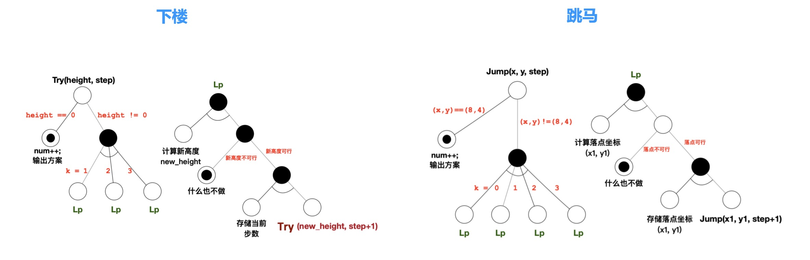

### 关于抽象思维

- 我们需要快速应对世界的复杂多变性，我们就需要有抽象思维
- 抽象思维可以帮助我们提取共性，应对变化
- 抽象思维是我们认识和表达复杂世界的关键
- 抽象思维可以帮助我们分析藏在复杂现象背后的本质和规律

### 对比算法，发现共性

1 ) **对比下楼问题和跳马问题**

<div align="center">
    
    <br />
    <div style="text-align:center">备注：图片托管于github，请确保网络的可访问性</div>
    <br />
</div>

- 两个问题的具体分析在前面的文章中已经完成，我们来对比一下两者
- 两者结构很像，都用递归枚举算法, 下楼问题有三个分叉，跳马问题有四个分叉
- 两者与或图基本相同，在算法上是同一类问题，可以使用基本相同的程序来求解
- 两个不同场景下的问题是具有同一性质，但是它们并不能用同一个程序来做，因为它们之间是有差异的
- 两个问题的差异
    * 是否达到目标不一致：对下楼而言，高度是否为0；跳马问题，位置坐标是否等于(8,4)
    * 新位置的计算：对下楼而言，高度只需要减下来；跳马问题，需要根据规则计算落点坐标
    * 判断是否合法：对下楼而言，剩余高度大于等于0；跳马问题，要保证在棋盘之上

2 ) **下楼问题算法重构**

```cpp
#include <iostream> 
using namespace std;

int h;
int num;
struct position { int x; };
position dxy[] = {{1}, {2}, {3}}; 
position start_pos = {0}, goal_pos = {h};
position path[100];

/* --------------------- 辅助函数 开始 ------------------------ */
bool IsEq(position pos1, position pos2) { 
    return (pos1.x == pos2.x);
}
bool IsDone(position pos) {
    return IsEq(pos, goal_pos);
}

bool IsValid(position pos) {
    return (pos.x >=0) && (pos.x <= h);
}

position GetNewPos(position pos, int k) {
    position next_pos = {pos.x + dxy[k].x};
    return next_pos;
}
void LogStep(int step, position pos) {
    path[step] = pos;
}

void OutStep(position pos) { 
    cout << pos.x << ' ';
}

void OutAll(int step) {
    for (int i=0; i<step; i++) {
        OutStep(path[i]);
    }
    cout << endl;
}
/* --------------------- 辅助函数 结束 ------------------------ */

// 递归函数
void Jump(position pos, int step) {
    // 是否达到目标
    if(IsDone(pos)) {
        num++; // 方案数+1
        cout << "当前位置" << num << ": ";
        OutAll(step); // 输出方案
        return;
    }
    // 遍历N种方案
    for (int k = 0; k < sizeof(dxy) / sizeof(dxy[0]); k++) {
        position next_pos = GetNewPos(pos, k);
        if(!IsValid(next_pos)) {
            continue; // nex_pos是否可行？
        }
        LogStep(step, next_pos); // 记录方案
        Jump(next_pos, step + 1); // 走下一步
    }
}

// main函数
int main() {
    // 要求用户输入来更新最终位置
    cout << "请输入楼梯台阶数："; 
    cin >> h;
    position h_num = {h};
    goal_pos = h_num;

    num = 0; // 初始方案数置0
    Jump(start_pos, 0); // 走第一步
    cout << "总方案数: " << num << endl;
    return 0;
}
```

- 这个下楼问题算法重构是逆向思维转化为上楼问题，都是状态的转变
- 当然稍微修改下算法就可以变成下楼问题了，两者方案都是一样的解决方案
- 之前的算法是输出步骤，现在的算法是输出位置

3 ) **跳马问题算法重构**

```cpp
#include <iostream>
using namespace std;

struct position { int x, y; };
position dxy[] = {{1,2}, {2,1}, {2, -1}, {1, -2}}; 
position start_pos = {0, 0}, goal_pos = {8, 4};
position path[100];
int num;

/* --------------------- 辅助函数 开始 ------------------------ */
bool IsEq(position pos1, position pos2) {
    return (pos1.x == pos2.x) && (pos1.y == pos2.y);
}

bool IsDone(position pos) {
    return IsEq(pos, goal_pos);
}

bool IsValid(position pos) {
    return (pos.x >= 0) && (pos.x <= 8) && (pos.y >= 0) && (pos.y <= 4);
}

position GetNewPos(position pos, int k) {
    position next_pos = {pos.x + dxy[k].x, pos.y + dxy[k].y}; 
    return next_pos;
}
void LogStep(int step, position pos) {
    path[step] = pos;
}

void OutStep(position pos) {
    cout << "(" << pos.x << ", "<< pos.y << ") ";
}
void OutAll(int step) {
    for (int i=0; i<step; i++) OutStep(path[i]);
    cout << endl;
}
/* --------------------- 辅助函数 结束 ------------------------ */

void Jump(position pos, int step) {
    // 是否达到目标
    if(IsDone(pos)) {
        num++; // 方案数+1
        cout << "当前位置" << num << ": ";
        OutAll(step); // 输出方案
        return;
    }
    // 遍历N种方案
    for (int k = 0; k < sizeof(dxy) / sizeof(dxy[0]); k++) {
        position next_pos = GetNewPos(pos, k);
        if(!IsValid(next_pos)) {
            continue; // nex_pos是否可行？
        }
        LogStep(step, next_pos); // 记录方案
        Jump(next_pos, step + 1); // 走下一步
    }
}

int main() {
    num = 0; // 初始方案数置0 
    Jump(start_pos, 0); // 走第一步
    cout << "总方案数：" << num << endl;
    return 0;
}
```

- 从两个问题的算法重构可以看出：
    * 通过辅助函数把两个问题的共同特点找回来了，同时把差异的地方隔离开来
    * 递归程序完全相同，main函数也趋近一致
    * 不管是下马，跳楼，还是是类似的问题，只要稍微修改下，即可成为一个solid的解决方案
- 所以算法重构有很多的好处

4 ) **下楼和跳马问题通用算法框架**

```cpp
void Jump(position pos, int step) {
    // 是否达到目标
    if(IsDone(pos)) {
        num++; // 方案数+1
        cout << "当前位置" << num << ": ";
        OutAll(step); // 输出方案
        return;
    }
    // 遍历N种方案
    for (int k = 0; k < sizeof(dxy) / sizeof(dxy[0]); k++) {
        position next_pos = GetNewPos(pos, k);
        if(!IsValid(next_pos)) {
            continue; // nex_pos是否可行？
        }
        LogStep(step, next_pos); // 记录方案
        Jump(next_pos, step + 1); // 走下一步
    }
}

int main() {
    num = 0; // 初始方案数置0 
    Jump(start_pos, 0); // 走第一步 
    return 0;
}
```

- 算法框架的三个关键点: 
    * 判断结束状态
    * 产生新的状态
    * 判断是否合法