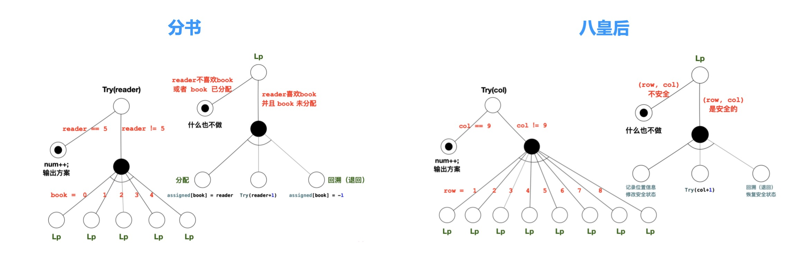
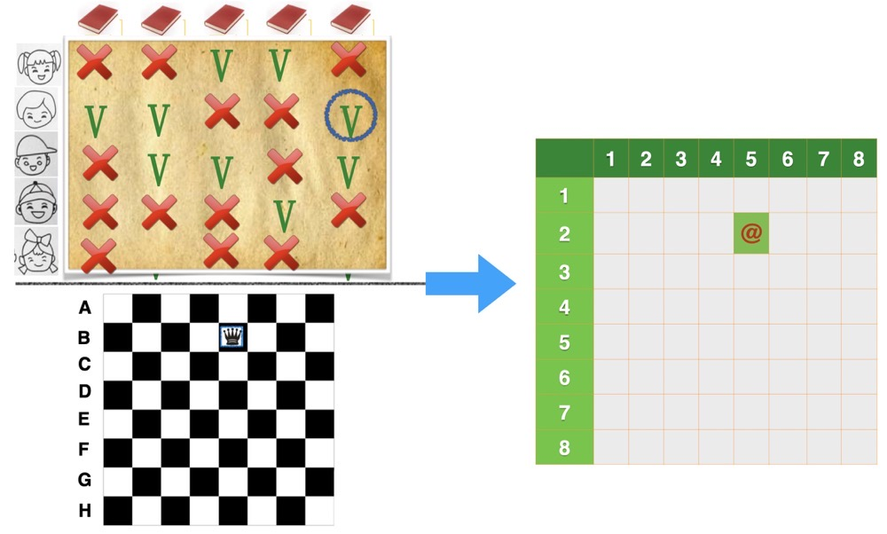
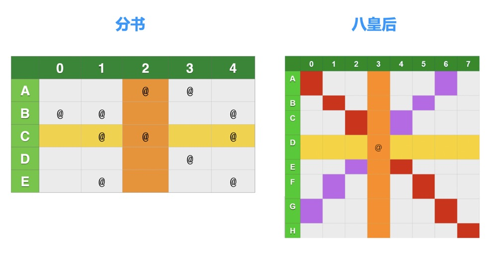

### 转换视角，提炼共性

- 有时算法本身乍一看是不一样的，而且很不一样，比较结构特点，看不出来有什么共性
- 如果我们转换下看问题的视角，是否能够找到共性呢

1 ) **对比分书问题和八皇后问题**

<div align="center">
    
    <br />
    <div style="text-align:center">备注：图片托管于github，请确保网络的可访问性</div>
    <br />
</div>

- 这两个问题，其实差异很大，但是两者的与或图却非常类似
- 这意味着，这两者在算法上是同一类问题，可以使用相同的程序来求解
- 现在我们来转换一下视角

<div align="center">
    
    <br />
    <div style="text-align:center">备注：图片托管于github，请确保网络的可访问性</div>
    <br />
</div>

- 右边的坐标就是左上位置和右下位置分别对应的喜好和棋子的简化表示
- 对于书和棋子这两类问题都是往坐标上占一个位置
- 好，顺着这个思路：

<div align="center">
    
    <br />
    <div style="text-align:center">备注：图片托管于github，请确保网络的可访问性</div>
    <br />
</div>

- 对分书而言
    * C同学挑了2号书，那么C同学不能再挑其他书籍了(即水平的黄线表示)
    * 同时2号书不能被其他同学挑了(即竖直的橙线表示)
    * 所以，这个水平竖直的交叉点代表了这个位置的四个方向不能再次被占用，约等同于皇后的8个方向不能被占用
- 经过对比，发现它们都可抽象成同一问题，即在限定条件下设置矩阵元素
- 共同都有的限定条件是: 行列不重复、不遗漏
- 而在八皇后任务中，又增加了一个限定条件，即每条斜线上只能设置一个元素
- 当然，这两个问题也有区别:
    * 分书问题中，可以设置元素的位置是矩阵的一个子集，即题面描述中给出的用户与图书之间的喜好关系表
    * 八皇后问题中，所有位置均可以选择，没有限制
      * 如果棋盘上有破洞，或者有些地方放置地雷等，增加了限制，那就另当别论了

2 ) **分书和八皇后问题算法重构**

```cpp
#include <iostream>
using namespace std;
// #define QUEEN // 条件编译：根据条件进行打开操作
#ifdef QUEEN
const int SIZE = 8;
#else 
const int SIZE = 5;
#endif

// 定义各行当中的位置
struct place_state {
    // 各行中的位置
    int Q[SIZE];
    // 当前行、(i-j)对角线、(i+j)对角线是否安全 对角线在分书问题中用不到
    bool S[SIZE], L[2*SIZE-1], R[2*SIZE-1];
};
// 方案数 
int num;

// 判断某一个位置是否合法
bool IsValid(int row, int col) {
#ifdef QUEEN
    return true; /// 八皇后棋盘上的所有位置均可以放置皇后，所以总是返回 true 
#else
    int like[5][5] = {  {0, 0, 1, 1, 0},
                        {1, 1, 0, 0, 1},
                        {0, 1, 1, 0, 1},
                        {0, 0, 0, 1, 0},
                        {0,1,0,0,1} };
    return like[row][col]; /// 分书问题要求皆大欢喜，只有喜欢的书才返回 true, 0 会转为false, 1会转换为true
#endif
}

// 是否安全
bool IsSafe(place_state state, int row, int col) {
#ifdef QUEEN
    return state.S[row] && state.R[col + row] && state.L[col - row + (SIZE - 1)]; 
#else
    return state.S[row]; 
#endif
}

// 是否完成
bool IsDone(int col) { 
    return col == SIZE; 
}

// 输出状态
void OutState(place_state state) {
    for (int k = 0; k < SIZE; k++) cout << state.Q[k] << ' '; 
    cout << endl;
}

// 产生新的状态
place_state GetNewState(place_state state, int row, int col) { 
    state.Q[col] = row;
    state.S[row] = false;
#ifdef QUEEN
    state.L[col - row + (SIZE - 1)] = state.R[col + row] = false; 
#endif
    return state;
}

// 初始化棋盘状态
place_state CreateInitState() {
    place_state state;
    for (int i = 0; i < SIZE; i++) {
        state.Q[i] = -1;
        state.S[i] = true; 
    }
#ifdef QUEEN
    for (int i = 0; i < 2*SIZE-1; i++) state.L[i] = state.R[i] = true;
#endif
    return state;
}

void Try(int col, place_state state) { 
    // 递归中止条件:所有列均已处理
    if (IsDone(col)) {
        num ++;
        cout << "方案" << num << ": "; 
        OutState(state);
        return;
    }

    for (int row = 0; row < SIZE; row++) { 
        // 1.1 判断当前位置是否合法 针对分书 或者有炸弹的8皇后，目前8皇后不需要
        if (!IsValid(row, col)) continue;
        // 1.2 判断当前位置是否可行
        if (!IsSafe(state, row, col)) continue;
        // 2. 记录位置，更新状态
        place_state next_state = GetNewState(state, row, col);
        // 3. 递归求解下一个位置
        Try(col+1, next_state);
    }
}

int main() {
    num = 0;
    place_state state = CreateInitState();
    Try(0, state);
    return 0;
}
```

- 经过我们的抽象处理, 两个问题都变成了在限定条件下设置矩阵的元素的问题
- 再来对比下之前的下楼和跳马，这四个问题也有通用的地方
    * 它们的与或图都很像, 都是递归和一些分叉
    * 都可以继续抽成同一个算法框架