### 编程输出N*N的数字方阵

1 ) **任务**

- 编程输出N*N的数字方阵，将1~N*N的自然数逆时针旋转填充到矩阵中。例如一个6*6的矩阵完成填充后的示意图如下所示

<div align="center">
    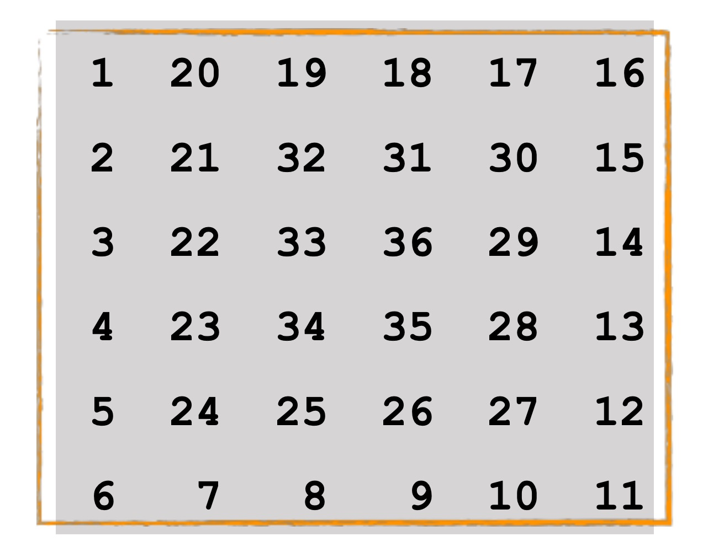
    <br />
    <div style="text-align:center">备注：图片托管于github，请确保网络的可访问性</div>
    <br />
</div>

2 ) **一般思路**

- 每次填完一个矩形，剩下的又是一个矩形
- 每次矩形的起点都不一样，如下图所示：1，21，33

<div align="center">
    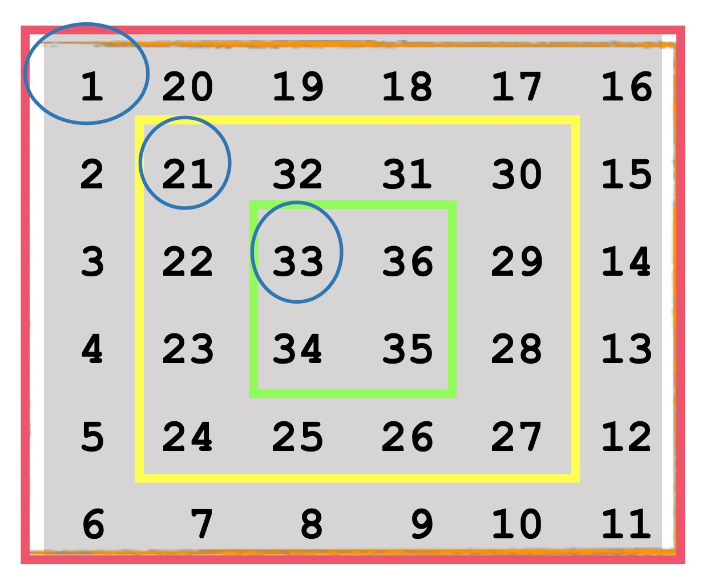
    <br />
    <div style="text-align:center">备注：图片托管于github，请确保网络的可访问性</div>
    <br />
</div>

- 每一次小的矩形填写都与前一个矩形有类似的算法实现，我们自然想到了递归实现
- 设函数Fill(number, begin, size)表示将number开头的数，从位置(begin, begin)开始填写，矩阵大小为size*size
- 递归算法的与或图如下

<div align="center">
    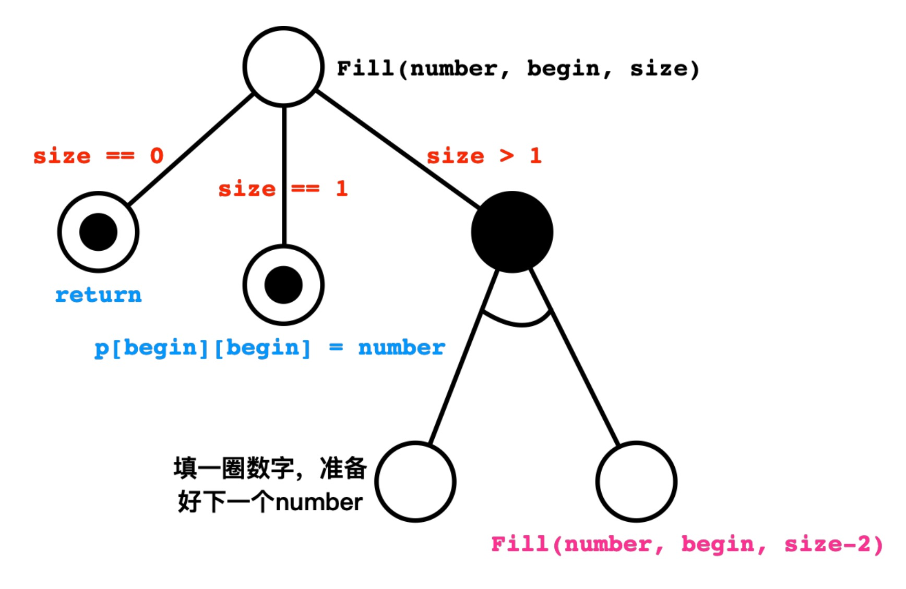
    <br />
    <div style="text-align:center">备注：图片托管于github，请确保网络的可访问性</div>
    <br />
</div>

- Fill的过程形象的描述为下图：

<div align="center">
    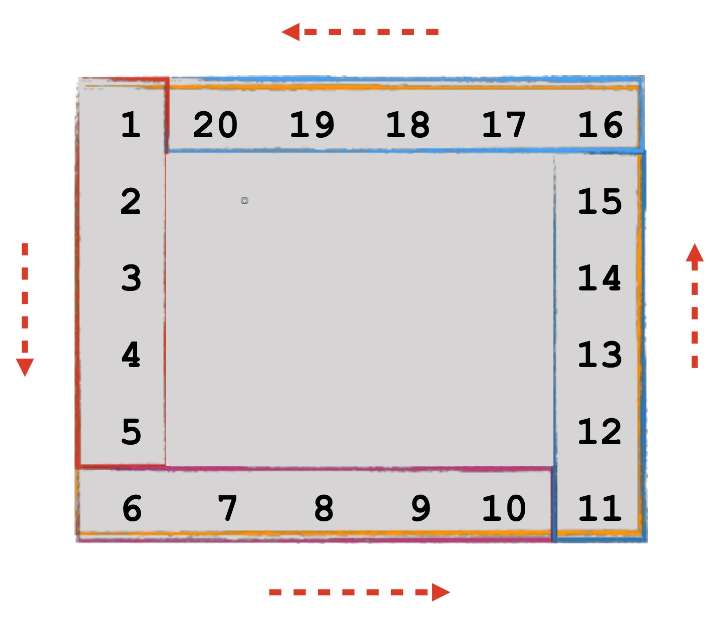
    <br />
    <div style="text-align:center">备注：图片托管于github，请确保网络的可访问性</div>
    <br />
</div>

- 代码实现

```cpp
#include <iostream>
#include <iomanip>
using namespace std;

int m[6][6] = {{0}};

void Show() {
    for (int i=0; i<6; i++) {
        for (int j=0; j<6; j++)
            cout << setw(2) << m[i][j] << ' '; cout << endl;
    } 
}

void Fill(int num, int begin, int size);

int main() {
    Fill(1, 0, 6);
    Show();
    return 0;
}

void Fill(int num, int begin, int size) { 
    if (size == 0) return;
    if (size == 1) {
        m[begin][begin] = num;
        return;
    }
    // 四个边的遍历
    for (int j=0; j<size-1; j++) m[begin+j][begin+0] = num++; 
    for (int j=0; j<size-1; j++) m[begin+size-1][begin+j] = num++; 
    for (int j=size-1; j>0; j--) m[begin+j][begin+size-1] = num++; 
    for (int j=size-1; j>0; j--) m[begin+0][begin+j] = num++; 
    Fill(num, begin+1, size-2);
}
```

- 输出结果：

```shell
 1 20 19 18 17 16 
 2 21 32 31 30 15 
 3 22 33 36 29 14 
 4 23 34 35 28 13 
 5 24 25 26 27 12 
 6  7  8  9 10 11
```

- 当然这个6可以很容易的抽离出来变为n, 由用户填写可得N*N的矩阵

3 ) **使用OOP的思路来做(优化版)**

- 在面向对象OOP中，可以借助对象来执行相应的方法来做
- 代码实现

```cpp
#include <iostream>
#include <iomanip>
using namespace std;

class matrix {
    int **M;
    int N;

public:
    void init(int size);
    void fill(int num, int begin, int size);
    void print();
    void clear();
};

void matrix::init(int size) {
    // 初始化数据结构：N*N的矩阵
    // 用下面这种方式初始化一个N*N的矩阵
    M = new int*[size];
    N = size; // 用于后面的打印和清理
    // r means 'row'
    for (int r=0; r<size; r++) {
        M[r] = new int[size];
        memset(M[r], 0, sizeof(int)*size); // 矩阵清零，表示无数字 
    }
}

void matrix::fill(int num, int begin, int size) {
    if (size == 0) {
        return;
    }
    if (size == 1) {
        M[begin][begin] = num;
        return;
    }
    // 四个边的遍历
    for (int j=0; j<size-1; j++) M[begin+j][begin+0] = num++;
    for (int j=0; j<size-1; j++) M[begin+size-1][begin+j] = num++;
    for (int j=size-1; j>0; j--) M[begin+j][begin+size-1] = num++;
    for (int j=size-1; j>0; j--) M[begin+0][begin+j] = num++;
    fill(num, begin+1, size-2);
}

// print 打印矩阵格子
void matrix::print() {
    for (int i = 0; i < N; i++) {
        for (int j=0; j< N; j++) {
            cout << setw(2) << M[i][j] << ' ';
        }
        cout << endl;
    }
}

void matrix::clear() {
    for (int r=0; r<N; r++) delete[] M[r];
    delete[] M;
}

int main() {
    matrix obj;
    cout << "Please input N: ";
    int size; 
    cin >> size;
    obj.init(size); // 根据输入大小做准备
    obj.fill(1, 0, size); // 按规则完成数字填充
    obj.print(); // 输出填充结果
    obj.clear(); // 一些必要的善后处理
    return 0;
}
```

- 当然，除了这一种递归算法，也可以通过制定一些走路的规则来填充矩阵，如下图

<div align="center">
    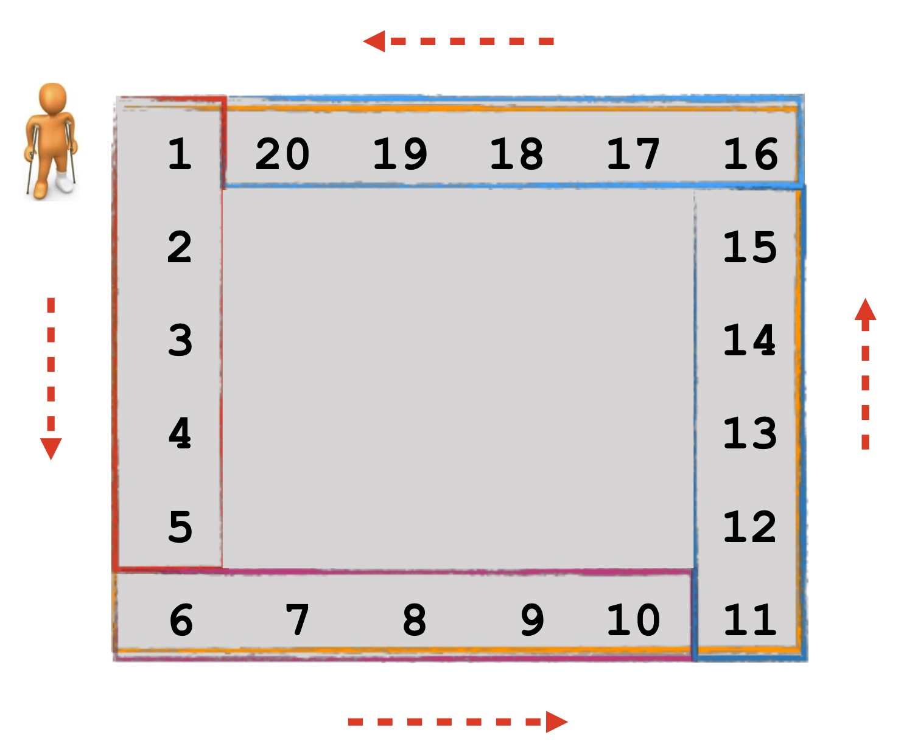
    <br />
    <div style="text-align:center">备注：图片托管于github，请确保网络的可访问性</div>
    <br />
</div>

- 把画矩形这事抽象成一个小人走格子，每走一个格子就写一个值，一路走下去，当然走的规则需要进行指定，一些规则参考如下：

```cpp

class matrix {
    char dir; // 'D', 'R', 'U', 'L' 注：这里有四个边，左下右上，逆时针方向，其中左边的方向是向下，用D来表示，其他依次类推
}

// 'D', 'R', 'U', 'L' 注：这里有四个边，左下右上，逆时针方向，其中左边的方向是向下，用D来表示，其他依次类推
void matrix::place(int num) {
    // 根据前一位置、方向，以及摆放规则(DRUL)确定下一个摆放数据的位置
    switch (dir) {
        case 'D':
            // 先保证row在合法范围内，再考虑该处是否已有数字(是否为0) 
            if (row < N-1 && M[row+1][col] == 0) row++; 
            else {
                dir = 'R'; // next direction
                col++;
            }
            break;
        // 仅展示部分源码
        // ...
}
```

- 一路走下图，如图：

<div align="center">
    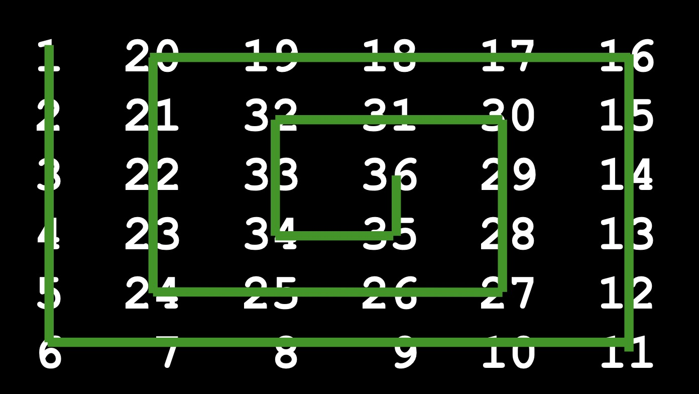
    <br />
    <div style="text-align:center">备注：图片托管于github，请确保网络的可访问性</div>
    <br />
</div>

- 可以看到，填充算法的执行过程与矩阵结构有关，两者紧密耦合

### 场景变化

- 我们所处的世界复杂多变，就这一类填充问题，就可以有无数的变形。
- 如果旋转方向从逆时针变成顺时针，则程序应该如何修改?
- 如果希望两种旋转方向的填充策略都能支持，程序又应该如何修改?
- 更进一步地，如果希望扩展到其他类型的填充次序，如蛇形、Z字形、U字形...等，应该如何修改类的对外接口与具体实现?

<div align="center">
    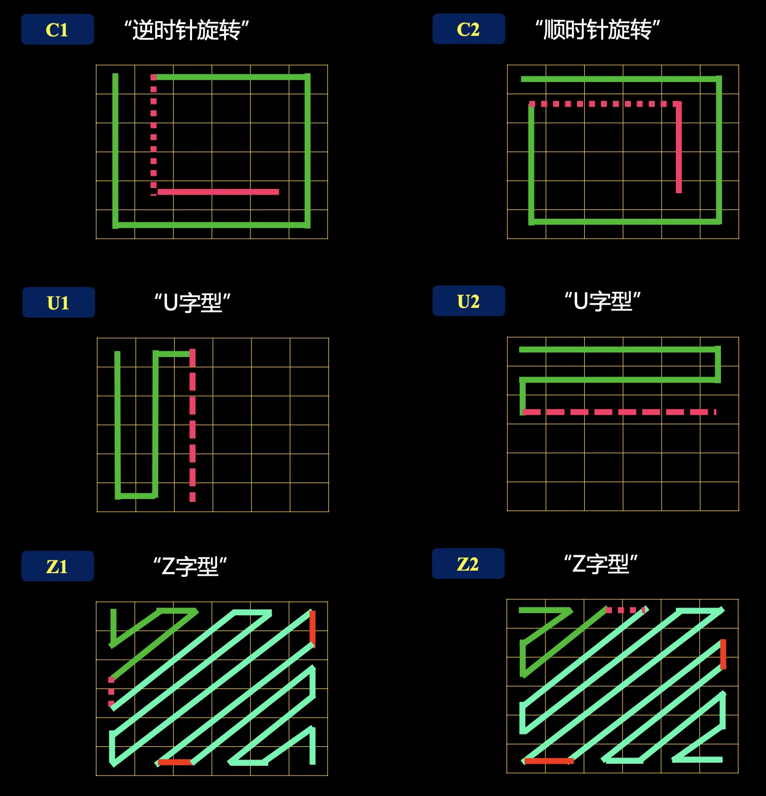
    <br />
    <div style="text-align:center">备注：图片托管于github，请确保网络的可访问性</div>
    <br />
</div>

- 针对不同的填充路径(顺逆时针，U，Z形等)或不同的图形(矩形，三角形，圆形，椭圆，多边形等)，如何做到尽最大效率同时满足需求？
- 也就是说我们应该怎样抽象模型做到很少的改动来面对复杂的变化，我们应该怎样设计程序用最高的效率面对这些变化？
- 以目前这种设计肯定无法满足，复杂的变化用同样的程序去面对，必须要抽象出共性，隔离出差异，这些差异用极小的代价表示出来
- 进一步我们深入思考矩阵到底是什么？在下面的接口示意图中:
    * 用M表示矩阵的数学运算接口，如矩阵的加、减、乘、除、幂 、逆等常见数学运算，目前我们并没有实现，主要是来填充。
    * 用F表示旋转填充的操作接口

<div align="center">
    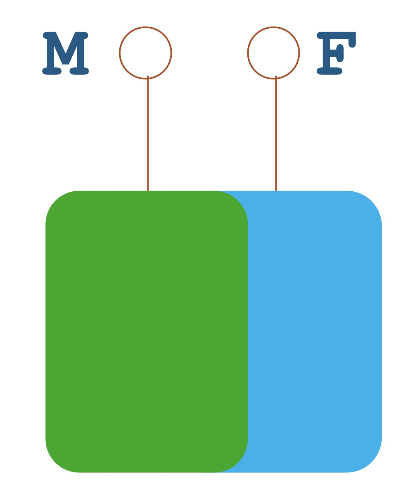
    <br />
    <div style="text-align:center">备注：图片托管于github，请确保网络的可访问性</div>
    <br />
</div>

- 回归矩阵的数学的本质——结构化的多维数据
- 填充操作(接口F)只是一种特定的算法操作，它并不是矩阵这个数学概念所固有的!它也可以用来填充其他“形状”，如三角形。

<div align="center">
    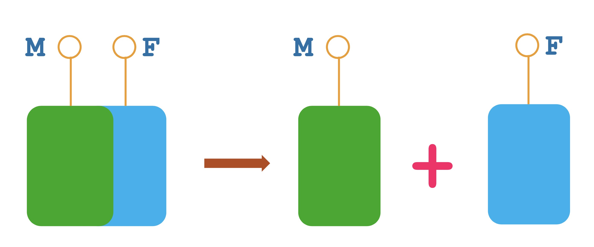
    <br />
    <div style="text-align:center">备注：图片托管于github，请确保网络的可访问性</div>
    <br />
</div>

- 基于上述思考，重新设计矩阵，定义这个矩阵类

```cpp
#ifndef MATRIX_H 
#define MATRIX_H
#include <iostream>

using namespace std;

class matrix
{
    int row, col, **buf;
public:
    matrix(int, int); // 矩阵初始化
    ~matrix(); // 矩阵的析构
    int& operator() (int r, int c); // matrix_obj(r,c) 这里取一个值出来，返回一个引用
    friend ostream& operator << (ostream&, const matrix&); // 运算符的重载输出
};
#endif
```

- 实现代码

```cpp
#include "matrix.h"
#include <iostream> // cout 
#include <iomanip> // setw() 
using namespace std;

matrix::matrix(int r, int c)
   : row(r), col(c)
{
buf = new int*[row];
for (int i=0; i<row; i++)
        buf[i] = new int[col];
}

matrix::~matrix() {
    for (int i=0; i<row; i++) 
        delete[] buf[i];
    delete buf;
}

// 用函数运算符()，实现对矩阵多下标访问的支持 
int& matrix::operator() (int r, int c)
{
    return buf[r][c];
}

ostream& operator << (ostream& o, const matrix& m)
{
    for (int i=0; i<m.row; i++) {
        for (int j=0; j<m.col; j++)
            o << setw(2) << m.buf[i][j] << ' ';
        o << endl; 
    }
    return o;
}

#ifdef TEST_MATRIX // 下面是matrix类的测试代码 
int main()
{
    matrix m(4, 5);
    for (int i=0; i<4; i++)
            for (int j=0; j<5; j++)
                m(i, j) = i*j;
    cout << "Matrix 4X5:" << endl;
    cout << m << endl;
    return 0;
}
#endif

// g++ -DTEST_MATRIX matrix.cpp
```

- 这个例子说明，把填充剥走之后，是如何设计的，目前还没有涉及多种多样的填充
- 那填充算法是什么呢？如果之前的填充算法是这样设计的

```cpp
// 根据前一位置，方向以及拜访规则(DRUL)确定下一个摆放数据的位置
// dir:  'D', 'R', 'U', 'L' 注：这里有四个边，左下右上，逆时针方向，其中左边的方向是向下，用D来表示，其他依次类推
switch(dir) {
    case 'D':
        // 先保证row在合法范围内，再考虑该处是否已有数字(是否为0)
        if(row < N-1 && M[row+1][col] == 0) {
            row ++;
        } else {
            dir = 'R'; // 下个方向
            col ++;
        }
        break;
    // ...
}
```

- 我们把这种填充算法抽象成如下图阐述

<div align="center">
    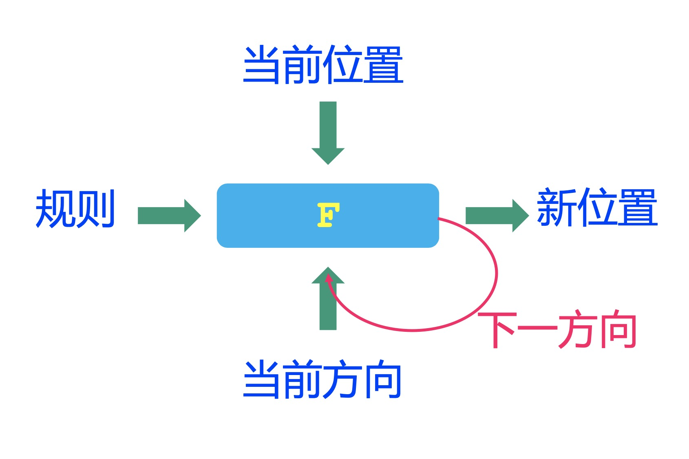
    <br />
    <div style="text-align:center">备注：图片托管于github，请确保网络的可访问性</div>
    <br />
</div>

- 填充算法F需要规则，当前位置，当前算法这三个信息就可以得到新的位置和方向
- 那填充，到底是什么? 回归填充的算法本质——按指定规则，依次生成位置信息。也就是**输入**和**输出**
- 不同规则的共性如何抽取? 如何描述?
- 其实，我们可以自定义"语言"，用字母符号表示规则，不同的字母表示不同的方向，区分大小写，如下图所示

<div align="center">
    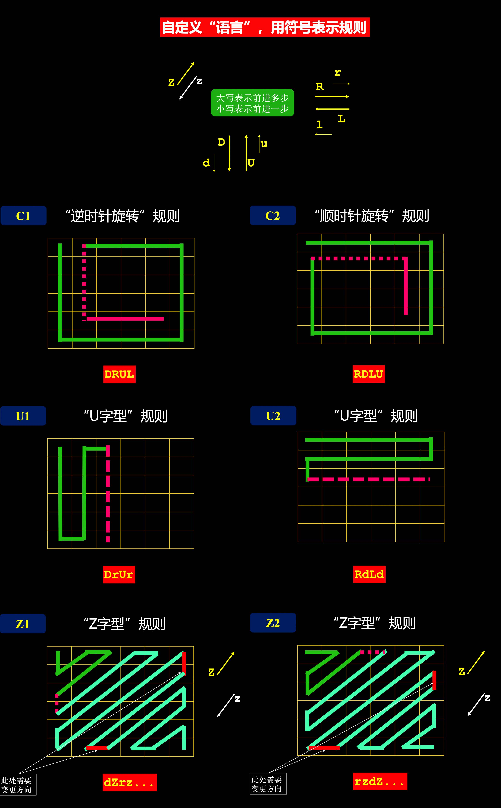
    <br />
    <div style="text-align:center">备注：图片托管于github，请确保网络的可访问性</div>
    <br />
</div>

- 这里我们把填充的运动用字母来标识，设定一套字母集合，每个字母有特定含义
- 填充规则就是用这些特定的含义的字母拼凑出来，也就是用我们自己定义的语言来描述这个规则
- 实行这些规则就变成了根据这些字符串的规则去解析它
- 简单来说，根据规则写字符串，根据字符内容去解析它，根据每个字符的定义在矩阵上进行操作计算
- FILLER的类

```cpp
#ifndef FILLER_H
#define FILLER_H
struct location { int row, col; };

class filler {
    location pos ;
    char rule[4];
    int idx; // 填充方向 dir = rule[idx]
    int row_num, col_num;
    int r_min, r_max, c_min, c_max; /// 用于实现旋转方阵 
public:
    filler(int, int); // range
    void reset(); // 重置
    void set_rule(const char*); // 用于更换规则
    location operator * ();   // get current location
    filler operator ++ (int); // post ++, next location
};
#endif
```

- 代码实现, 仅供参考

```cpp
#include "filler.h"
#include <cstring> // strncpy 
using namespace std;

filler::filler(int rn, int cn)
  : row_num(rn), col_num(cn)  {  reset();  }

void filler::reset() { 
    pos.row = pos.col = 0; 
    idx = 0;
    r_min = c_min = 0; 
    r_max = row_num - 1; 
    c_max = col_num - 1;
}

void filler::set_rule(const char* r) {   
    strncpy(rule, r, 4); 
}

location filler::operator * () {   
    return pos;
}

filler filler::operator ++(int) {
    filler res = *this;

    // 规则可以周而复始地使用，故取模
    switch (rule[idx%4]) {
        // 以下为旋转方阵的规则，矩阵的大小是在不断变化的
        // ESVM: anti-clockwise
        case 'E': // 旋转阵比较特殊，用'E'表示向下(与'D'对应)
            pos.row++;
            if (pos.row == r_max) {
                idx++;
                c_min++; // 最左列已填充， 故 c_min 加 1 
            }
            break;
         // 旋转阵比较特殊，用'S'表示向右(与'R'对应)
        case 'S':
            pos.col++;
            if (pos.col == c_max) {
                idx++;
                r_max--; // 最下行已填充， 故 r_max 减 1 
            }
            break;
        case 'V': // 向上 'U' 
            pos.row--;
            if (pos.row == r_min) {
                idx++;
                c_max--; // 最右列已填充， 故 c_max 减 1 
            }
            break;
        
        case 'M': // 向左 
            pos.col--;
            if (pos.col == c_min) {
                idx++;
                r_min++; // 最顶行已填充， 故 r_min 加 1 
            }
            break;

        // semv: 顺时针旋转的规则，分别为“s向右、e向下、m向左、v向上”
        case 'e': // 向下 
            pos.row++;
            if (pos.row == r_max) {
                idx++;
                c_max--; 
            }
            break;
        case 's': // 向右 
            pos.col++;
            if (pos.col == c_max) { 
                idx++; 
                r_min++;
            }
            break;
        case 'v': // 向上 
            pos.row--;
            if (pos.row == r_min) { 
                idx++; 
                c_min++;
            }
            break;
        case 'm': // 向左 
            pos.col--;
            if (pos.col == c_min) { 
                idx++; 
                r_max--;
            }
            break;

        // 以上是旋转方阵使用的规则(顺时针和逆时针)

        // D, R, U, L前进多步，直到边界
        case 'D': 
            pos.row++;
            if (pos.row == row_num - 1) idx++; 
            break;
        case 'R': 
            pos.col++;
            if (pos.col == col_num - 1) idx++; 
            break;
        case 'U': 
            pos.row--;
            if (pos.row == 0) idx++; 
            break;
        case 'L': 
            pos.col--;
            if (pos.col == 0) idx++; 
            break;

        // d, u, r, l 只前进一步 
        case 'd':
            pos.row++;
            idx++;
            break;
        case 'r': 
            pos.col++;
            idx++;
            break;
        case 'u': 
            pos.row--;
            idx++;
            break;
        case 'l': 
            pos.col--;
            idx++;
            break;

        // up-right
        case 'Z': 
            pos.row--;
            pos.col++;
            if (pos.row == 0 || pos.col == col_num - 1) idx++;
            if (rule[idx%4] == 'r' && pos.col == col_num - 1) rule[idx%4] = 'd'; // 根据Z型规则, 此处需要变更方向 
            break;

        // down-left
        case 'z': 
            pos.row++;
            pos.col--;
            if (pos.row == row_num - 1 || pos.col == 0) idx++;
            if (rule[idx%4] == 'd' && pos.row == row_num - 1) rule[idx%4] = 'r'; // 根据z型规则, 此处需要变更方向 
            break;
    }
    // SWITCH-END
    return res;
}

// class filler 的“单元”测试

#ifdef TEST_FILLER
#include <iostream> 
using namespace std;

void test(const char* rule, int rn, int cn) {
    filler obj(rn, cn); 
    obj.set_rule(rule);
    for (int i=0; i<rn*cn; i++) {
        location pos = *obj++;
        cout << '[' << pos.row << ',' << pos.col << ']';
        cout << ( (i+1) % cn == 0 ? '\n' : ' '); 
    }
}

int main() {
    int rn, cn;
    cout << "Please input row num & col num:"; 
    cin >> rn >> cn;

    const char* C2 = "semv"; // clockwise 
    const char* Z1 = "dZrz"; // Z1

    cout << "CLOCKWISE\n";
    test(C2, rn, cn);

    cout << "Z1\n"; 
    test(Z1, rn, cn);
    
    return 0; 
}
#endif
// filler.cpp
```

- 编译运行

<div align="center">
    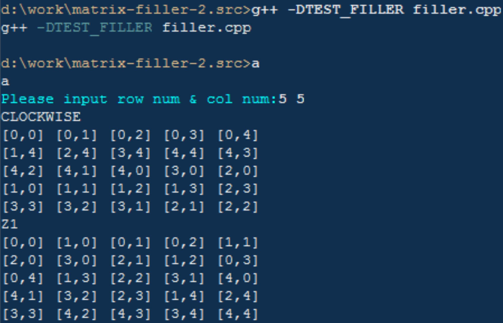
    <br />
    <div style="text-align:center">备注：图片托管于github，请确保网络的可访问性</div>
    <br />
</div>

- 修改填充测试代码

```cpp
#include "matrix.h" 
#include "filler.h" 
#include <iostream> 
using namespace std; 

int main() {
    int rn = 9, cn = 9; 
    filler obj(rn, cn); 
    obj.set_rule("ESVM"); // anti-clockwise
    matrix m(rn, cn);
    for (int i=0; i<rn*cn; i++) {
        location pos = *obj++;
        m(pos.row, pos.col) = i; 
    }
    cout << m;
    return 0;
} // fill-matrix.cpp
```

- 编译运行

<div align="center">
    
    <br />
    <div style="text-align:center">备注：图片托管于github，请确保网络的可访问性</div>
    <br />
</div>

- 到这里，我们把矩阵类和填充方法分别剥离开来，进而又组合再一起，可以完成任意的填充方案

### 延伸

1 ) **容器，算法，迭代器**

- 通过上述拆分的过程，我们看出和一些东西很像，如cpp中的标准模板库STL：容器，算法，迭代器三者之间的关系
- 从矩阵的填充这个案例中，填充算法是独立于被填充的对象(矩阵类)的数据结构的，一个负责回答位置，一个负责存储数据
- 如果把这种继续推下去，参考标准模板库里面的思想，看下代码会发生什么变化
- 我们来深入思考下:规则到底是什么
    * 关于如何填充前进的指令，不同“填充要求”对应不同的规则指令
    * 所以“规则”在本质上是独立于填充算法而单独存在的

<div align="center">
    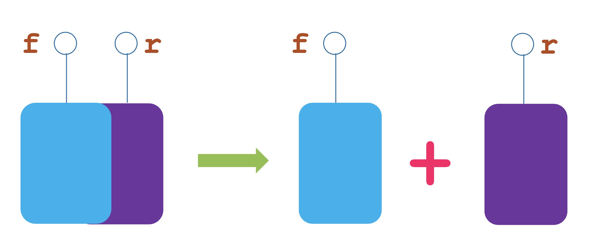
    <br />
    <div style="text-align:center">备注：图片托管于github，请确保网络的可访问性</div>
    <br />
</div>

- f表示填充算法，r表示填充规则，三者之间的关系如下：

<div align="center">
    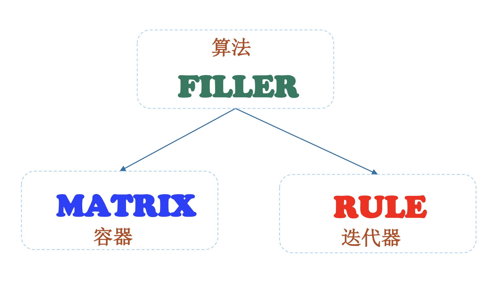
    <br />
    <div style="text-align:center">备注：图片托管于github，请确保网络的可访问性</div>
    <br />
</div>

- 被填充的矩阵，填充的操作算法，以及规则三者之间的关系，有点类似在STL中的容器(数据结构) + 操作(算法) + 迭代器(容器对外的接口)
- 通过迭代器可以获得位置，算法是根据迭代器操作容器
- 我们根据这个思想，进行如下代码改写，仅供参考
- class rule 的设计思路
```cpp
class rule {
    char* data;
    int idx, len;
public:
    rule(const char*); 
    ~rule();

    char operator* ();
    rule& operator++ (); // prefix ++
};

// 规则中的不同字符表示不同的填充(前进)命令

rule::rule(const char* r) {
    len = strlen(r);
    data = new char[len]; 
    strncpy(data, r, len); 
    idx = 0;
}

rule::~rule() {
    delete data;
}

char rule::operator* () {
    return data[idx];
}

rule& rule::operator++ () {
    idx = (idx + 1) % len; // 设规则指令是循环使用的 return *this;
}

```

- class filler 的主要修改

```cpp
class filler {
    location pos ;
    int row_num, col_num;
    int r_min, r_max, c_min, c_max;
    rule* cmd;
public:
    filler(int, int); // range
    void reset();
    void set_rule(rule*);

    location opeator * (); // current location 
    filler operator ++ (int); // post ++, next location
}

filler filler::operator ++(int) {
    filler res = *this;

    // *cmd 指向 rule object
    switch (**cmd) {
        case 'D': /// D, U, R, L 大写字母表示进行多步 pos.row++;
            if (pos.row == row_num - 1) ++(*cmd);
            break;
            // ..... URL类似，略

        case 'd': /// d, u, r, l 小写字母表示只前进一步 
            pos.row++;
            ++(*cmd);
            break;
            // ..... url 类似，略
        
        case 'E': // down, anti-clockwise 
            pos.row++;
            if (pos.row == r_max) { 
                ++(*cmd);
                c_min++; 
            }
            break;
        
        case 'e': // down, clockwise 
            pos.row++;
            if (pos.row == r_max) { 
                ++(*cmd);
                c_max--; 
            }
            break;
        // 其他指令字母的处理类似.....略
    }
}
```

- 如果被填充的是迷宫，要求根据指定规则，生成从入口到出口的路径(即坐标序列)，则应如何抽象它们的共性?
- 迷宫分成很多格子，有些是通的，有些是不通的，有些有炸弹，等等规则和限制，又当如何去做呢？

2 ) **正则表达式**

- 一个正则表达式本身也是一个字符组成的序列，它定义了能与之按规则(定义)匹配的字符串的集合。
- 正则表达式也是一种语言!
- 有一些特殊的字符，被称为元字符(meta-character)，它们分别表示重复、成组或位置。
- 如字符^表示字符串开始，$表示字符串结束，圆点.能 与任意字符匹配 ..... 等等。
    *  ^x 只能与位于字符串开始处的x匹配
    *  x$ 只能匹配结尾的x
    * ^x$ 只能匹配单个字符的串里的x
    * ^$ 只能匹配一个空串

**printf() 函数中的格式串参数**

<table>
    <tr>
        <th>格式符</th>
        <th>含义</th>
    </tr>
    <tr>
        <td>%d</td>
        <td>按十进制整型数据的实际长度输出</td>
    </tr>
    <tr>
        <td>%ld</td>
        <td>输出长整型数据</td>
    </tr>
    <tr>
        <td>%md</td>
        <td>如果数据位数小于 m，则左端补以空格，若大于 m，则按实际位数输出</td>
    </tr>
    <tr>
        <td>%u</td>
        <td>输出无符号整型(unsigned)</td>
    </tr>
    <tr>
        <td>%c</td>
        <td>用来输出一个字符</td>
    </tr>
    <tr>
        <td>%f</td>
        <td>用来输出实数，包括单精度和双精度，以小数形式输出。不指定字段宽度 时，由系统自动指定，整数部分全部输出，小数部分输出6位，超过6位的四舍五入</td>
    </tr>
    <tr>
        <td>%.mf</td>
        <td>输出实数时小数点后保留 m 位</td>
    </tr>
    <tr>
        <td>%o</td>
        <td>以八进制整数形式输出</td>
    </tr>
    <tr>
        <td>%s</td>
        <td>用来输出字符串</td>
    </tr>
    <tr>
        <td>%x,%X</td>
        <td>以十六进制形式输出整数</td>
    </tr>
</table>

- 上面printf()函数的表格就像是和填充矩阵一样，也是一些指令用于控制函数内部的代码，输出数据用的
- 数据应该如何输出是看调用这个printf函数的时候给的参数指令是什么，也就是printf函数定义了所有的规范
- 我们只需要按我们的需求，选择你要的规范，写出格式化字符串，printf就会输出相应的数据
- 这个思路在两者之间有异曲同工之妙
- 而正则表达式则提供了更为丰富的表达

**正则表达式工具grep简版**

- 最有名的一个正则表达式工具是grep程序。这个程序将一个正则表达式作用于输入的每一行，打印出所有包含匹配字符串的行。
- 为了简单起见，这里采用的元字符只包括 ^ $ . 和 * :
    * 圆点•能与任意字符匹配;
    * 星号*表示位于它前面的单个圆点或一个字符的重复出现;
    * 如果正则表达式以^开头，则正文必须从起始处与表达式的其余部分匹配;
    * 如果正则表达式以$结尾，则正文必须也到达末尾才能匹配成功。
- 上面只是一般正则表达式的一个子集，但也能完成大部分的任务了。

```cpp
#include <stdlib.h> 
#include <stdio.h> 
#include <string.h>

int matchstar(int c, char *regexp, char *text); 
int matchhere(char *regexp, char *text);
int match(char *regexp, char *text);
// 函数grep扫描一个文件，对其中的每一行调用 match 函数 
int grep(char *regexp, FILE *f, char *name);

int main(int argc, char *argv[]) {
    int i, nmatch;
    FILE *f;
    // 命令行参数 < 2 提示并退出
    if (argc < 2) {
        printf("argc < 2\n"); 
        return 1;
    }
    nmatch = 0;
    if (argc == 2) {
        // 正则表达式存入到 argv[1] 中了，argv[0] 是程序的名字
        if (grep(argv[1], stdin, NULL)) nmatch++;
    } else {
        for (i=2; i<argc; i++) {
            f = fopen(argv[i], "r"); 
            if (f == NULL) {
                printf("fopen() == NULL\n");
                continue; 
            }
            if (grep(argv[1], f, argc > 3 ? argv[i] : NULL) > 0) nmatch++;
            fclose(f); 
        }
    }
    return nmatch == 0; 
}

int grep(char *regexp, FILE *f, char *name) {
    int n, nmatch;
    char buf[BUFSIZ];

    nmatch = 0;
    while (fgets(buf, sizeof buf, f) != NULL) {
        n = strlen(buf);
        if (n > 0 && buf[n-1] == '\n') buf[n-1] = '\0';
        if (match(regexp, buf)) {
            nmatch++;
            if (name != NULL) printf("%s:", name); 
            printf("%s\n", buf);
        } 
    }
    return nmatch;
}

int match(char *regexp, char *text) {
    if (regexp[0] == '^') return matchhere(regexp+1, text);
    do {
        if (matchhere(regexp, text)) return 1;
    } while (*text++ != '\0');
    return 0;
}

int matchhere(char *regexp, char *text) {
    if (regexp[0] == '\0') return 1;
    if (regexp[1] == '*') return matchstar(regexp[0], regexp+2, text);
    if (regexp[0] == '$' && regexp[1] == '\0') return *text == '\0';
    if (*text != '\0' && (regexp[0] == '.' || regexp[0] == *text)) return matchhere(regexp+1, text+1);
    return 0;
}

int matchstar(int c, char *regexp, char *text) {
    do {
        if (matchhere(regexp, text)) return 1;
    } while (*text != '\0' && (*text++ == c || c == '.')); 
    return 0;
}

// 第一个参数是星号的参数(即*之前的那个字符)
```

- 编译链接

<div align="center">
    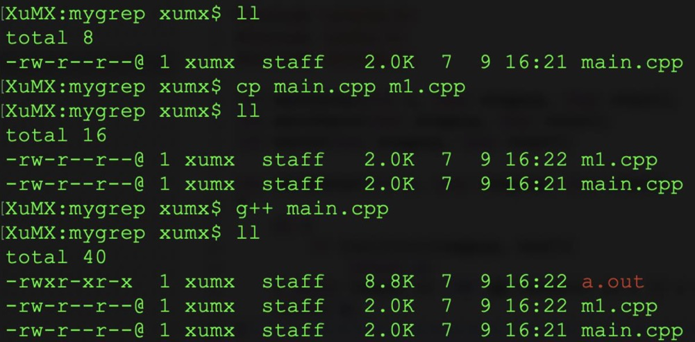
    <br />
    <div style="text-align:center">备注：图片托管于github，请确保网络的可访问性</div>
    <br />
</div>

- 运行测试

<div align="center">
    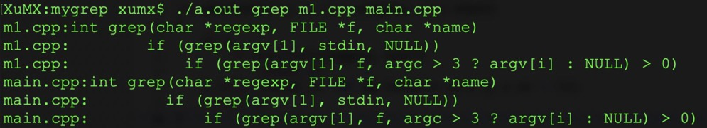
    <br />
    <div style="text-align:center">备注：图片托管于github，请确保网络的可访问性</div>
    <br />
</div>

<div align="center">
    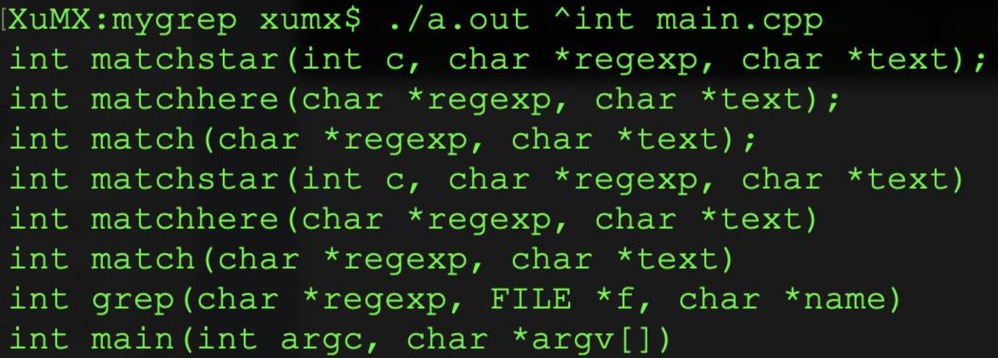
    <br />
    <div style="text-align:center">备注：图片托管于github，请确保网络的可访问性</div>
    <br />
</div>
