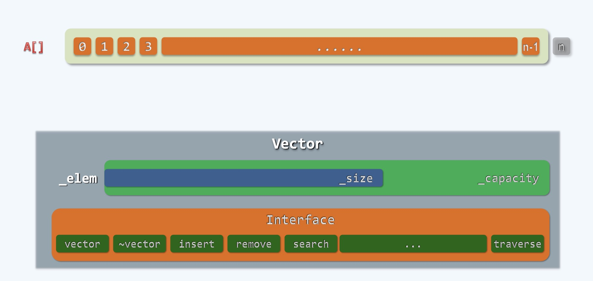
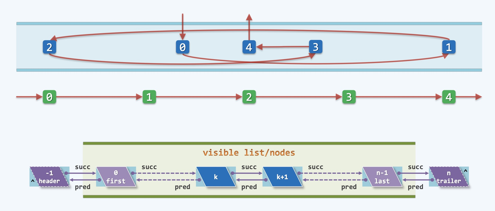
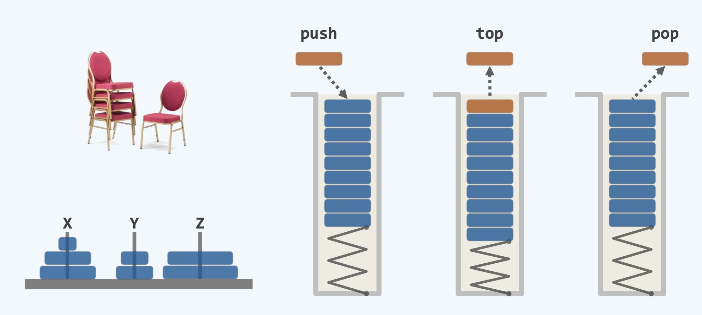
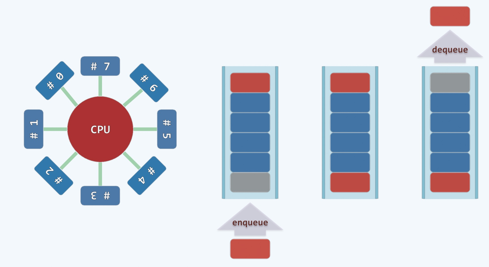
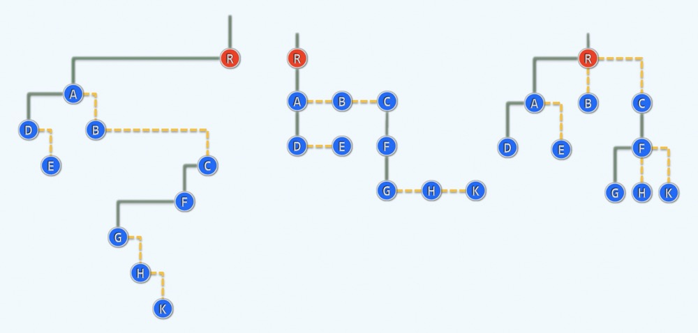
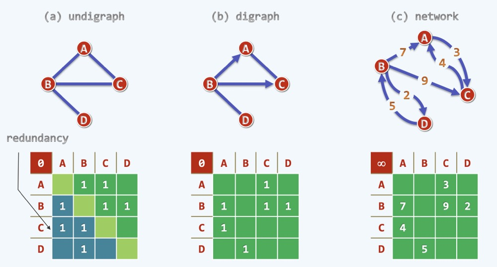
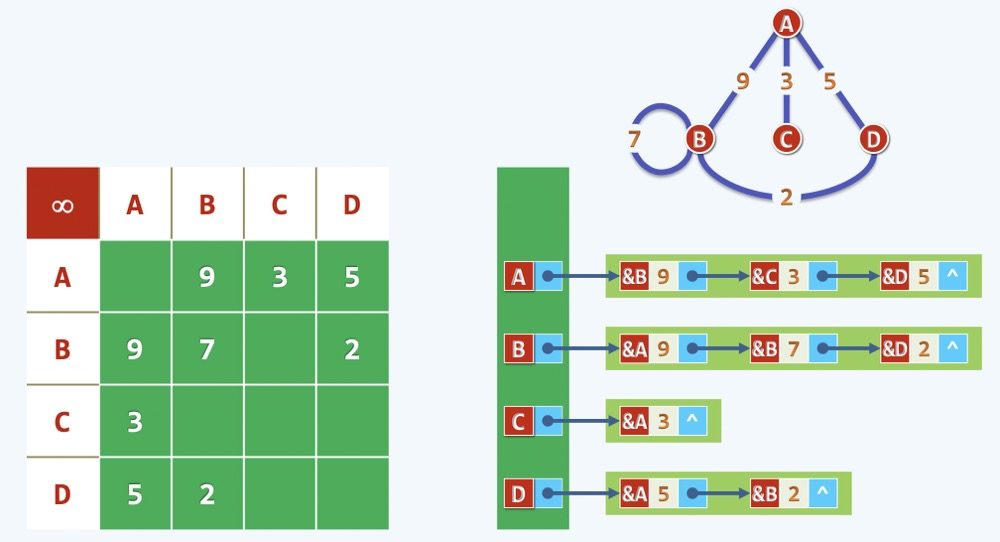

### 算法和数据结构的关系

- 算法和数据结构是一个硬币的两面, 好的算法在研究透了以后会慢慢积淀为数据结构
- 高级算法的支撑都来自于数据结构

### 几种基本的数据结构

1 ) **Array & Vector**

    
     
    
备注：图片托管于github，请确保网络的可访问性

     

- 最基本的线性结构是Array，一个线性的序列
- n个元素排成一行，下标从0开始，到n-1结束，如果要用n表示，请注意左闭右开
- 表示方法：`A[n]、A[0, n-1]、A[0, n)`
- Array后来被封装起来变成了Vector，对外提供快速操作的接口
- Array和Vector都可以以常数O(1)的时间找到某一下标k对应的元素`A[k]`
- 但是移动元素(删除、插入)很麻烦，需要一个个的操作

3 ) **List & Linked List**

    
     
    
备注：图片托管于github，请确保网络的可访问性

     

- 和Vector对应的另一种线性结构List, 由一组元素构成，它们之间排成队
- 在List的内部，拿第k号元素来说，有它的后继和前驱元素, 它们之间都是以一个切实的称之为link(succ,pred)的东西来彼此指引
- 在Array和Vector中是以`call by rank`的方式来操作元素，在List中是以`call by position`的方式来操作
- List的好处是拆掉某一元素只要重新拼接断点处即可，所以这种数据结构操作元素(添加,删除)很简单
- List在查找的时候,比如从某一端0顺藤摸瓜找到1，继而找到其他, 所以查找操作很慢，和Vector正好互补

3 ) **Stack**

    
     
    
备注：图片托管于github，请确保网络的可访问性

     

- 栈也是一个线性的次序，像是堆椅子一样, 后进先出，LIFO
- 添加元素push只能加到开放的一端，也就是栈顶
- 栈顶元素叫做top
- 弹出元素pop也是从栈顶弹出
- 算法的精妙都蕴含在这些push，pop的组合之中

6 ) **Queue**

    
     
    
备注：图片托管于github，请确保网络的可访问性

     

- 和栈并列的一种数据结构叫做Queue队列，是个线性结构，先进先出 FIFO
- 进队操作叫做 enqueue, 出队操作叫做 dequeue, 分别由两端各司其职
- 队列入口的地方叫做rear后端, 出口叫做front前端
- 从后端 enqueue，从前端 dequeue
- 这是一种效率最高最公平的资源分配机制
- 在计算机中，CPU的时间在不同进程中享用，多个进程并发使用CPU
- CPU会把所有占用资源的进程组织成一个queue, 以这种方式来轮值服务，从而达到一种整体公平和高效

7 ) **(Binary) Tree**

    
     
    
备注：图片托管于github，请确保网络的可访问性

     

- 树是一种半线性模型(分叉有方向)，树就像是一个家族一样慢慢繁衍，分支越来越多，形成代际关系，是一种无环的结构
- 树结构举例：互联网域名，计算机目录等，一层套一层其实是比较头疼的，主要是不规范，难以管理，如上图的第三颗树
- 进而衍生了上图的第二颗树, 每个父节点只需要管理它自己的'长子' 由'长子'管理'次子'，以及'长子'的孩子, 依次有章法的管理下去
- 对于第二棵树的优势是：只需要记住谁是自己的'弟弟'，谁是自己的'长子'即可。
- 注：这里不考虑性别，只按男性称为来表示，当然也可以用女性称谓。
- 继而优化变形，八字排开，变成了第一棵树，对于A节点来说, 长子D和弟弟B并列排开，变成了二叉树结构
- 这时候每个节点不再有任意节点了，而最多只有两个孩子
- 我们很多时候研究树的结构都是倾向于二叉树结构，有时候也会有多叉树结构

8 ) **Graph as Matrix**

    
     
    
备注：图片托管于github，请确保网络的可访问性

     

- 图是一种较为复杂的数据结构，如微信里的好友关系，对等和不对等
- 第一个图是无向图，第二个是有向图，第三个是网络图
- 分别可用下面矩阵形式表示
    * 无向图对称型, 有冗余，真正有效的只有一半
    * 有向图, 不对称, 不浪费
    * 网络图，有关系，也有权重，可对称，可不对称，来源于数学
- 网络图占用资源非常巨大，有很多没有用的东西，需要进一步优化, 下面来谈谈

9 ) **Graph as Vector< List >**

    
     
    
备注：图片托管于github，请确保网络的可访问性

     

- 通过`Vector<list>`来表示Graph, 也就是 `Graph as Vector<list>`
- 竖向用一个Vector表示，Vector的每一行都是一个个的List
- 只记录有效的部分，无效部分略过，节省了很多空间
- 但是在查找效率上有一定的低效，需要找到Vector的入口，期望在相应的List中找到目标元素
- 其实数据结构和算法没有万能的，没有万能的算法解决所有问题
- 我们学的其实是一种折中的方法，找到一个解决问题的平衡策略