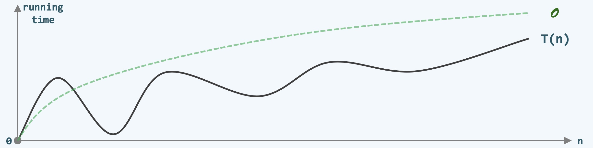

### 关于算法

- 算法其实有无数种，就市面上的算法而言，普通人可能知道的算法不到千百分之一，但是我们却可以一定程度上驾驭算法，是因为我们知道算法设计的策略
- 我们在解决问题的时候，头脑中想到的都是策略，这些算法可以串成一串，每一串可能都是基于一种策略设计出来的

### Big-O 记号

- 我们研究算法，需要懂得如何判断算法的优劣，越好的算法消耗的资源就越少
- 计算的资源有两点：一个是时间，另一个空间，我们最主要关注的其实还是时间

<div align="center">
    
    <br />
    <div style="text-align:center">备注：图片托管于github，请确保网络的可访问性</div>
    <br />
</div>

- 同一个算法在解决某一个问题的时候，针对不同的n(问题的规模), 它所需要的时间成本running time, 画成一条曲线T(n)
- T(n)这个函数就是当我们给定了一个规模为n的特例之后，用这个算法在某一个特定n所需要消耗的时间成本，一般来说，是一条这样的曲线。
- 在实际情况中，并不能精确得到这条曲线，其实也没有必要得到这条曲线，我们只要知其大略即可，即粗略的估计
- T(n) = O(f(n))
    * 用一个f(n)去粗略的估计T(n), 如果这个估计可行的话，再在其前面加个O，这样来表示。
    * 可以估计的条件：$\exists \ c > 0 \ \ s.t. \ \ T(n) < c·f(n) \ \ \ \forall n >> 2$
        * 取一个c，当问题规模足够大的时候(这里$\forall n >> 2$表示足够大)，使得 $T(n) < c·f(n)$
        * 也就是这时候的$c·f(n)$ 可以估计T(n), 这个f(n)的曲线如上图虚线表示
        * 这样估计的好处是：常系数，低次项从此可忽略，即：$O(f(n)) = O(c·f(n)) \ \ ; \ \ O(n^a + n^b) = O(n^a), a \geq b > 0$
        * 举个例子：$E_x : \sqrt{5n · [3n · （n + 2) + 4] + 6} < \sqrt{5n · [6n^2 + 4] + 6 <  \sqrt{35n^3 + 6} < 6 · n^{1.5} = O(n^{1.5})}$

### 贪心 greedy 策略

1 ) **关于贪心策略**

- 贪心策略强调的是眼前能看到的，一种苟且的东西
- 也就是关注的只是这个问题当下的局部，使它最大化，使它朝向最后的目标最大化

2 ) **贪心策略之排序方法对比**

- 以下是几种针对给定一组元素进行排序的算法对比

```cpp
#include <bits/stdc++.h>
using namespace std;

vector<int> sort1(vector<int>);
vector<int> sort2(vector<int>);
vector<int> sort3(vector<int>);
vector<int> sort4(vector<int>);
vector<int> sort5(vector<int>);
vector<int> sort6(vector<int>);

int main() {
    // 接收数据
    int n;
    cin >> n;
    vector<int> vec;
    for (int i = 0; i < n; ++i) {
        int tmp;
        cin >> tmp;
        vec.push_back(tmp);
    }

    // 排序测试
    // vector<int> result = sort1(vec); // 侏儒排序 Gnome sort 或 Stupid sort
    // vector<int> result = sort2(vec); // 侏儒排序改进版本
    // vector<int> result = sort3(vec); // 冒泡排序
    // vector<int> result = sort4(vec); // 冒泡排序优化 若有序提前终止，节省无必要循环
    // vector<int> result = sort5(vec); // 冒泡排序优化 跳跃比较
    vector<int> result = sort6(vec); // 冒泡排序优化 跳跃比较并提前终止

    // 输出结果
    for(auto it = result.begin(); it < result.end(); ++it) {
        cout << *it << ' ';
    }

    cout << endl;
    return 0; 
}

// 侏儒排序
vector<int> sort1(vector<int> vec) {
    int n = vec.size();
    for(int i=1; i < n;) {
          if(i < 1 || vec[i - 1] <= vec[i]) { // greedy
            ++i; // inefficient backtracking
        } else {
            swap(vec[i-1], vec[i]);
            --i;
        }
    }
    return vec;
}

// 侏儒排序 改进版
vector<int> sort2(vector<int> vec) {
    int n = vec.size();
    // k是当前比较的位置
    for(int k = 1; k < n; ++k) {
        // 通过i进行内部比较排序
        for(int i = k; i > 0 && vec[i - 1] > vec[i]; --i) {
            swap(vec[i-1], vec[i]);
        }
    }
    return vec;
}

// 冒泡排序
vector<int> sort3(vector<int> vec) {
    int n = vec.size();
    // 第一层循环表示经过n-1趟扫描即可，每比较一趟，问题规模缩小1级
    for(int i=0; i<n-1; ++i) {
        // 第二层循环表示每一趟进行两两逐个比较，找到最大的元素, 这里的 j<n-i-1表示，上层i循环每循环一遍，问题规模缩小1级
        for(int j=0; j<n-i-1; ++j) {
            // 当前元素和后一个元素进行比较，若逆序
            if(vec[j] > vec[j+1]) {
                // 则交换
                swap(vec[j], vec[j+1]);
            }
        }
    }
    return vec;
}

// 冒泡排序 改进版 提前终止
vector<int> sort4(vector<int> vec) {
    int n = vec.size();
    bool sorted = false;
    while (!sorted) {
        sorted = true;
        for (int i = 0; i < n - 1; i++) {
            if (vec[i] > vec[i + 1]) {
                swap(vec[i], vec[i + 1]);
                sorted = false;
            }
        }
        n--;
    }
    return vec;
}

// 冒泡排序 改进版 跳跃版
vector<int> sort5(vector<int> vec) {
    int n = vec.size();
    int k = n - 1;
    int last = 0;

    // 第一层循环表示经过n-1趟扫描即可，每比较一趟，问题规模缩小1级，第一层循环次数必须不变 n-1 次
    for(int i=0; i<n-1; ++i) {
        // 第二层循环表示每一趟进行两两逐个比较，找到最大的元素
        for(int j=0; j<k; ++j) {
            // 当前元素和后一个元素进行比较，若逆序
            if(vec[j]>vec[j+1]) {
                // 则交换
                swap(vec[j], vec[j+1]);
                // 更新交换的位置
                last = j;
            }
        }
        // 在一层循环之后跳跃到最后交换的那个地方
        k = last;
    }
    return vec;
}

// 冒泡排序 改进版 提前终止+跳跃版
vector<int> sort6(vector<int> vec) {
    int n = vec.size();
    int k = n - 1;
    int last = 0; // 用于记录最后交换的位置
    bool flag = true; // 用于终止遍历条件

    // 第一层循环表示经过n-1趟扫描即可，每比较一趟，问题规模缩小1级，第一层循环次数必须不变 n-1 次
    for(int i=0; i<n-1 && flag; ++i) {
        flag = false;
        // 第二层循环表示每一趟进行两两逐个比较，找到最大的元素
        for(int j=0; j<k; ++j) {
            // 当前元素和后一个元素进行比较，若逆序
            if(vec[j]>vec[j+1]) {
                // 则交换
                swap(vec[j], vec[j+1]);
                // 更新交换的位置
                last = j;
                flag = true;
            }
        }
        // 在一层循环之后，若有交换跳跃到最后交换的那个地方，节省不需要交换的时间资源
        k = last;
    }
    return vec;
}
```

- 测试输入
    * `6`
    * `5 3 6 1 4 2`
- 测试输出
    * `1 2 3 4 5 6`

**相关分析**

- sort1算法称之为侏儒排序(Gnome sort 或 Stupid sort)
    * 其时间复杂度为：$O(n^2)$
    * 优点是简单明了，一眼就能看出来是干什么(顺序往前走，逆序往回走并进行交换达到当前变成顺序)
    * 每向前移动一个位置(这里记当前位置为k)，就要求将当前位置的所有序排好
    * 缺点是：比较苟且, 只针对眼前，当排好一次序之后，还要重新比较才能回到之前k的位置, 浪费了时间
    * 最坏的情况是输入序列完全逆序, 要将当前所有元素都比较一遍，最好的情况是已经有序了, 会一直i++下去(这不是我们研究的范围)
    * 衡量算法复杂度我们只研究最坏的情况
    * 无论成功或是失败，这个算法的目光只盯住当前相邻的两个元素，不断的一点点儿的努力，总有一天会到头的

- sort2算法(侏儒排序改进版)
    * 其时间复杂度为：$O(n^2)$
    * 是sort1的改进版本，改进了不需要重复比较已经有序的元素了

- sort3算法(冒泡排序 Bubble Sort)
    * 其时间复杂度为：$O(n^2)$
    * 该算法通过两两比较盯住当前最大的元素，逐渐将其移动到最后，继而一次有序，逐次比较达到整个序列完全有序
    * 不变性：经k趟扫描交换后，最大的k个元素必然就位
    * 单调性：经k趟扫描交换后，问题规模缩减至n-k
    * 正确性：经至多n趟扫描后，算法必然终止，且能给出正确解答
    * 它的核心思想是自左至右，逐一检查各对相邻元素，若有逆序，则交换
    * 这个算法其实只需要经过n-1趟比较就足够了, 有改进的空间
    * 如果某一趟比较后整体已经有序了，就没有必要继续比较到n-1趟了，即提前终止版

- sort4算法(冒泡排序 Bubble Sort 改进版 提前终止)
    * 其时间复杂度为：$O(n^2)$, 最佳情况可至$O(n)$
    * 这里添加了数据类型为bool型的sorted变量判断
    * 如果比较一遍，有逆序则整体尚未有序，若没有则整体已经有序
    * 这样可节省很多时间资源

- sort5算法(冒泡排序 Bubble Sort 改进版 跳跃)
    * 其时间复杂度为：$O(n^2)$
    * 在做一遍比较时，若逆序则更新逆序对的位置
    * 在再次比较时，最大只需要比较到上一次逆序对记录的位置即可
    * 节省了重复比较的时间

- sort6算法(冒泡排序 Bubble Sort 改进版 提前终止+跳跃)
    * 其时间复杂度为：$O(n^2)$, 最佳情况可至$O(n)$
    * 综合了sort4和sort5的优点

3 ） **总结一下**

- 也许一个算法的思想在一开始是基于很low的策略，比如greedy
- 当基于这个greedy的算法不断做优化, 也能表现的非常好
- 如果要革命性的改进，我们就需要了解积累更多的算法策略