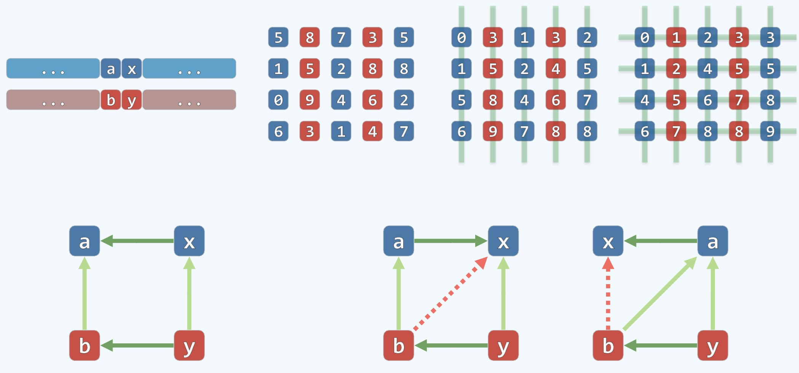
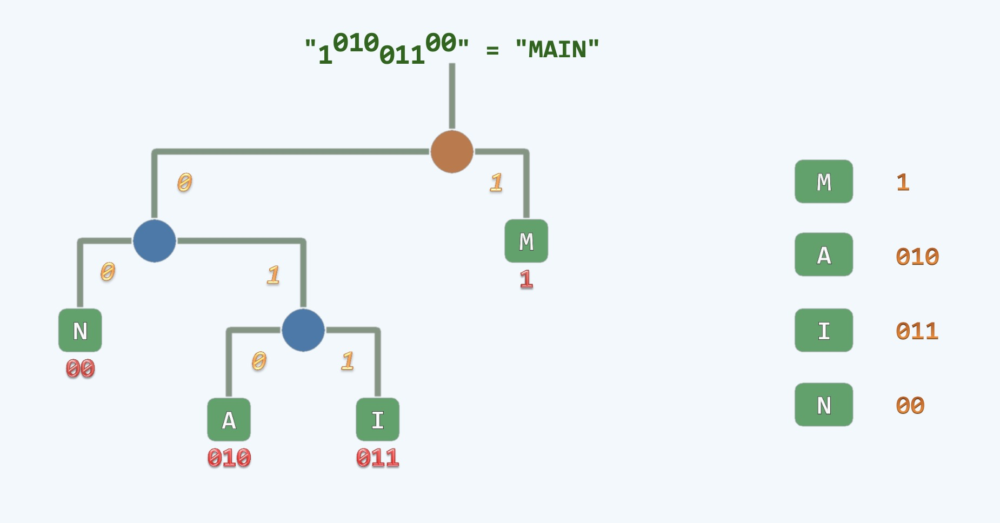
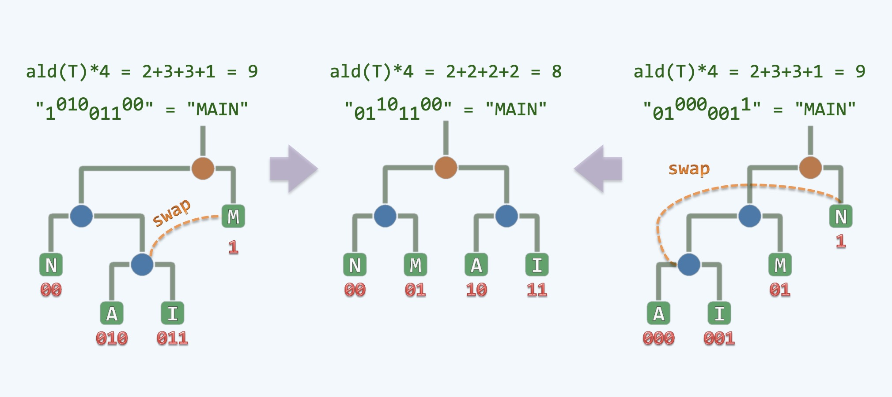
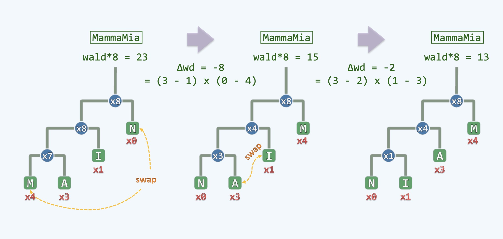
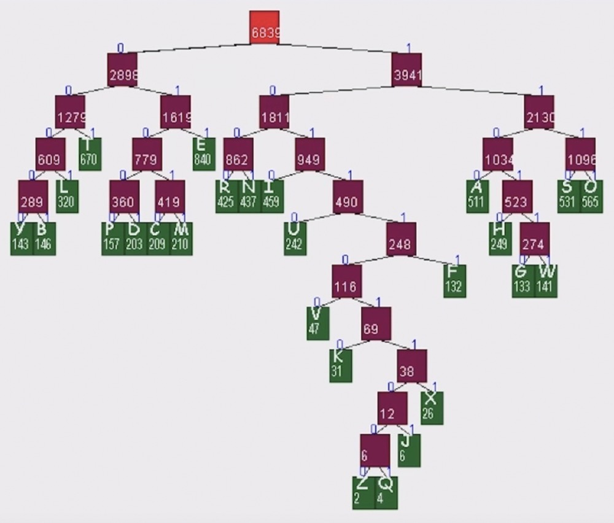

### 矩阵排序 Matrix Sorting

- 一个矩阵先进行逐列排序，再进行逐行排序，之后逐列仍旧保持有序

    
     
    
备注：图片托管于github，请确保网络的可访问性

     

- 上图分上下两排, 一排二图为一个随机的矩阵, 一排三图为列排序后的矩阵，一排四图为行排序后的矩阵
- 可见，一排四图在列上虽然元素发生了变化，但仍旧有序，如何证明这个问题?
- 分析
    * 在进行完列上的排序后, 比如得到上图的从上到下依次递增的一排三图, 之后我们开始进行行上的排序
    * 假如我们使用同一排序算法比如: bubble sort, 我们知道每一行中相邻的两个元素位于同一列中
    * 我们可以将问题的规模缩小，一排一图为我们选取的其中一个内部矩阵，两行两列
    * 当进行行排序的时候，如果都用bubble sort而且是同步并行来实现的, 那么每一行中相邻的两个元素都位于同一列中
    * 比如一排四图中的三四两行，一二两列中：4, 5; 6, 7。其中4, 6以及5, 7分别都在同一列上，也就是对齐的
    * 而bubble sort排序是移动相邻两个窗口的元素，像下排一图中的元素：a <= b; x <= y; 我们只需要检验
    * 当它们变换位置变成了下排二图，下排三图的时候，下面的元素总大于上面的元素即可

### 哈夫曼编码 Huffman PFC Coding

- 我们发送文字，一般会把字母转换成01比特的二进制流
- 下图是一棵二叉树的结构，通过这个结构来完成可行编码的设计

    
     
    
备注：图片托管于github，请确保网络的可访问性

     

- 右边的字母分别由一串01数字组成，左边是组成整个信息流的二叉树
- 这个二叉树的特点是左孩子都是0，右孩子都是1
- 由此可知，M是1，A是010, 每次解码完成一个字母就会reset到树根节点准备下一次解码
- 通过这个方法，解码完成所有的字母
- 这个二叉树对应的编码规则叫做前缀无歧义编码(PFC Coding)
- 这种编码有好坏之分，在信道上传递数据都是需要用到带宽的，所以我们希望传递比特越少越好
- 传递一个字符需要几个比特取决于这个字符在这棵树中的深度，比如A这个字符010, 深度是3

    
     
    
备注：图片托管于github，请确保网络的可访问性

     

- 上图是优化二叉树的过程，上图从1树到2树做了一个交换, 总计从9到8节省了一个比特
- 如果有2片叶子的深度差至少有2层，比如：M节点与(A和I)节点
- 那么就可以将这个悬殊两层之深的叶子节点(A、I)的父亲元素(这个父亲比M还要深一层)和M进行一个交换
- 就会得到损失一个，收获两个的效果，这时候就会得到一份的净利润
- 同理树3转换成树2，一个道理，像是中间的这棵树的结构，我们叫做**满树**
- 如果两片叶子深度差不超过1，都是一个完美的解决方案
- 但是，这离我们真实的场景还很远，上面每个叶子节点的权重都是1，或者说没有进行权重计算

    
     
    
备注：图片托管于github，请确保网络的可访问性

     

### 哈夫曼树 Huffman Tree

- 如上图，不仅要考虑字符的深度(编码比特数)，还要考虑出现的次数，此时平衡树并不是最完美的树了
- 上图三种不同的排列方式消耗不同的带宽，可见第三棵树是消耗最小的
- 我们把M和A放到高处，是希望出现的次数越多，深度越小，这样可以达到总体最小
- 我们的贪心原则是把出现频率最高(权重最高)的字符放到高处
- 这个贪心策略是Huffman在MIT读博士的时候发明出来的

    
     
    
备注：图片托管于github，请确保网络的可访问性

     

- 上图这是一棵哈夫曼树(Huffman Tree) 是最终构造的结果，哈夫曼用贪心策略生成出的一棵树
- 一开始随便抓一些文字统计一下各自出现的频率，接下来构造树结构，绿色方块中是我们的字符和字符的频次
- 这个树结构不是从根部生长而是从叶子开始生长，从叶子慢慢向着根部来生长，这棵树的生长方式只能是合并而非分割
- 把叶子不断的合成子树，再把子树构成更大的子树，不断的合成，直到最后合成最后一棵完整的树，这棵树就按贪心原则构造出来了
- 我们把出现次数最高的字符放到最高，把出现次数次高的字符放到次高...出现频率最低的放到最低
- 这是我们最后的目标，我们就奔着这个目标贪心的构造，下面我们就开始来构造：
  * 我们把出现频率最低的两个字符(权重分别是2,4)取出来合并变成一棵子树(变成了6)，再把这棵子树(权重用6来代表)重新插回去
  * 再去其中找两个频率最低的两个字符(权重分别是6,6)合并成一棵子树，再插回去，以此方式，直到最终得到一棵整树
- 这里有一个技巧是每次插回去的时候就按权值重新排序，这样每次都可以很快找到2个频率最低的字符
- 哈夫曼的运气在于当我们把两棵树合并起来以后变成了一棵新树，新树用树根表示，将来继续参加竞选，这棵新树的权重就是两棵子树的权重之和