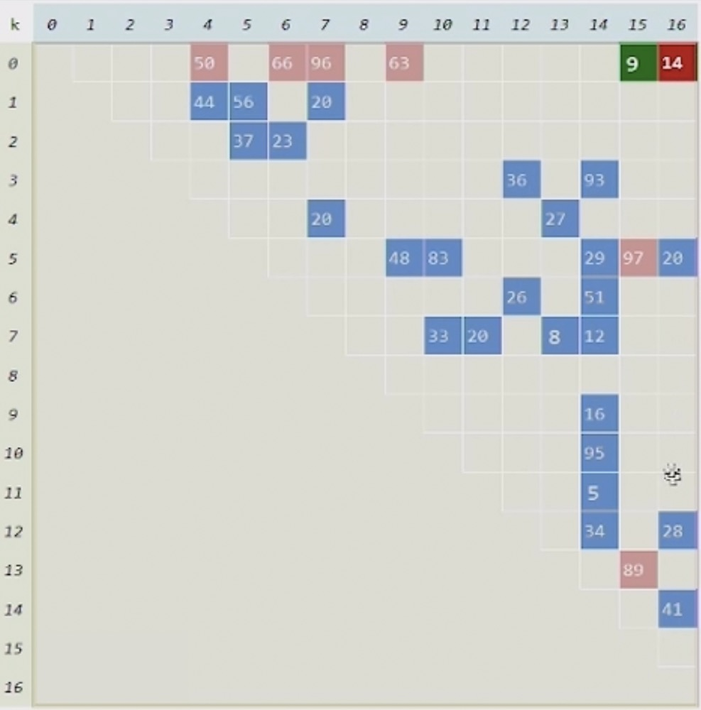

###  BST & BBST

- BST(Binary Search Tree) 二叉搜索树，也就是使用二叉树来做查找
- BBST(Balanced Binary Search Tree) 平衡二叉搜索树

1 ) **BST**

<div align="center">
    
    <br />
    <div style="text-align:center">备注：图片托管于github，请确保网络的可访问性</div>
    <br />
</div>

- 比如我们有一堆书，需要经常在其中找到某一本数，如何有效查找呢？
- 将所有的书先做一遍预处理：编个号，排个序，接下来就可以很方便的在其中做查找
- 树的查找每次都是从根部开始进行比较，比较之后将我们的目光转向其中一侧，比如说如果我搜索是28或29
- 28 > 20, 所以, 20左边的全部都不需要看了，我们现在看右边，其实右边本质上是一个规模缩小的子树，sub tree
- 38 > 28, 所以, 我们只需要关注这棵子树的左侧即可，按照这种方式，逐次比较，不断深入, 直到找到29号元素
- 如果我们搜索条件的是28，那么可见经过比较，提示找不到元素，如果搜索的是29，那么直接返回，提示找到即可
- 这样做的好处是既可以完成所有的查找却不需要将所有元素都遍历一次
- 对树的预处理是：对于任何一个位置，所有的左后代都比它小，所有的右后代都比它大
- 这种树查找在一般的时候性能不错，但是它的弱点在那些深的一些位置上

2 ) **BBST**

<div align="center">
    
    <br />
    <div style="text-align:center">备注：图片托管于github，请确保网络的可访问性</div>
    <br />
</div>

- 在上面的场景中，如果要找较深的节点，显然会花更多的时间，需要更多的比较，就像哈夫曼编码一样，需要更多的比特
- 有一种技巧就是把这种树平衡化，不仅在一开始是平衡的，而且在所有的操作，插入和删除都可以保持一个平衡态
- 即便要攻击它最弱的一点，也不至于太弱，这就是BBST

### Hashtable + Dicionary + Map

- 很多时候我们希望直接找到某个东西，如：

```python
beauty = dict({
    "沉鱼":"西施",
    "落雁":"昭君",
    "闭月":"貂蝉",
    "羞花":"玉环"
})
beauty["红颜"] = "圆圆"
print beauty

for alias, name in beauty.items():
    print alias, ":", name
```

- 这种直接找到某个东西的方法是非常的快
- 这种方法我们一般叫做 Hashtable 散列表或哈希表
- 它的内部其实是先准备好了一个数组(数组的好处是查找非常快，一下就能找出来)

<div align="center">
    
    <br />
    <div style="text-align:center">备注：图片托管于github，请确保网络的可访问性</div>
    <br />
</div>

- 这里有 (0 ~ 46) 47个元素, 如果这个值是156，那么关于47的模余就是15，那么156就存储于15这个位置上
- 当有很多数，我们都想存储于这个数组中，那么就会有位置的冲突，如：768 和 580，这时候，我们通过List来存储冲突的元素
- 按照这种结构来组织成一个叫散列表的数据结构
- 查找的时候，任何查找的对象都可以把它转换成数字，取模以后，对应到数组中的某一个，之后顺着里面的List查找
- 如果有的话则找到, 没有则报告查找失败
- 散列表最重要的事情是如何做映射，映射有很多种，我们上面使用取模的方式
- 这个模在数学上叫做mod, 在很多语言中用 % 表示
- 直接对某一个数取模，一般这个数就取这个散列表的长度，就像上面的47，但是这里我们倾向于取值 90001
- 同时，这个值我们倾向于取素数，这样的话我们可以很方便的进行查找
- 我们看到一旦底层用了Hashtable, 那么接近于在常数时间内找出任何一个元素对应的值
- 在python中的dict, map存储查询等操作起来非常快的原因就是这个底层机制

### Priority Queue ~ Heap

1 ) **对比Huffman Tree的问题**

- 在之前的Huffman Tree中我们知道它是维护了一棵森林，每个元素都是一棵树，都有各自的权重
- Huffman的策略是挑2个最小的，通过引入一个新节点将这两个最小的合二为一，将新节点这棵树重新插回森林
- 这一过程，森林中少了一棵树(出了2个，进去1个，净损失1个)，反复这么处理
- 我们知道这个过程从n到1，总共有n-1次的迭代
- 我们如何将这个结构组织起来，方便我们快捷的找到权重最小的两个，是我们需要讨论的问题
- 之前我们用的方式是通过Vector或List的结构，找到其中最小的两个，需要逐个比较，这个过程需要n的时间
- 所以，总计是 n*(n-1)的时间，也就是时间复杂度为：$O(n^2)$
- 我们可以看出这个n-1次的迭代是无法进行优化的，是必须的过程
- 而每一次的迭代需要花n的时间(这个n的时间是在n棵树中找出最小的两个), 这个n的时间这块可以优化

2 ) **引出Priority Queue ~ Heap数据结构**

- 如何优化呢？我们需要使用一个新的数据结构，一种三角形的树形结构，可以方便的进行`getMin()`, `delMin()`等操作
- 这时候找出两个最小树的时间复杂度为O(logn), 总体时间复杂度为：O(nlogn) 我们把这种数据结构叫做 Heap 堆
- 以Heap为代表的这一类问题，我们统一称之为 Priority Queue 优先级队列

<div align="center">
    
    <br />
    <div style="text-align:center">备注：图片托管于github，请确保网络的可访问性</div>
    <br />
</div>

- 如上图，它看上去是一棵树，对应的可以存成一个向量，它可以很方便的进行`getMax()`或`getMin()`操作，也可以以同样的效率支持`insert(x)`操作
- 它会把你需要的max或min放到你唾手可得的地方(树根或堆顶)，也就是说我们在取一个元素的时候不是看谁大或谁近，而是看谁优先级最高

3 ) **Huffman Tree的另一种优化方案**

- 而针对Huffman Tree的问题，我们并不一定要用 Priority Queue ~ Heap 这个数据结构，我们可以通过Stack + Queue的方式模拟出来O(nlogn)的解决方案

<div align="center">
    
    <br />
    <div style="text-align:center">备注：图片托管于github，请确保网络的可访问性</div>
    <br />
</div>

- 当我们拿到了一组哈夫曼要编码的字符的频率表之后，首先把他们全部排序，如：2, 5, 13, 16, 19, 37 
    * 这一步排序，我们不推荐使用时间复杂度为$O(n^2)$的bubble sort来排序, 我们使用更快的方式来处理，这一步时间复杂度记为：O(nlogn)
- 之后将排好序的元素通过栈来组织起来(最小元素存放于栈顶位置), 还需要一个辅助的数据结构为队列
- 在第一次中，我们在栈中找到最小的两个: 2,5(栈顶和次栈顶), 通过合并为7, 存入队列中，完成首次迭代
- 进而，在栈和队列中找到最小的两个元素: 13, 7, 通过合并为20, 存进队列中, 完成第二次迭代
- 再次，在栈和队列中找到最小的两个元素: 16, 19, 通过合并为35, 存进队列中, 完成第三次迭代
- 继续, 在栈和队列中找到最小的两个元素: 20, 35, 通过合并为55, 存进队列中, 完成第四次迭代
- 最后, 在栈和队列中还剩两个元素：37, 55, 合并它们, 得到了最终的92
- 在这个过程中，我们同样构造出来了Huffman Tree, 我们依赖全是栈和队列的操作，每个操作都是常数时间
- 总共有n步，每一步常数，所有的时间为O(n), 这是一个线性的复杂度
- 这里面的奥妙是：
    * 在任何一个时刻，如果在整个森林中挑选最小的两个, 只要在栈和队列这两个子集中挑选即可
    * 无论任何时候，栈亦或是队列中的元素都是有序分布的
    * 无论在栈还是在队列中找，只需要考虑前面的两个，充其量4个元素就够了
    * 可能最小的两个元素只来自于栈或只来自于堆或一个来自于栈，一个来自于堆
    * 这样每一次比较都是常数，整体上来说就是线性的

### Minium Spanning Tree

<div align="center">
    
    <br />
    <div style="text-align:center">备注：图片托管于github，请确保网络的可访问性</div>
    <br />
</div>

- Minium Spanning Tree 最小支撑树或最小生成树(MST)
- 我们知道图可以描述城市网络，交通网络，计算机网络等，这些网络都是由点和线构成的
- 我们希望将这些点连成一个有效的结构(有效指的是，保持联通性，任何两点之间都要有一条路连通)
- 而我们知道，每一条边都是有成本的, 比如修路的成本，也就是权重，所以这张图是一张有权图
- 我们要实现整体的连通，需要有两个原则：
    * 边不能太少，太少了肯定连通不了；边不能太多，不能出现环路
    * 权重问题，总体权重最小，即总成本最小
- 我们需要既要连通也没有环的树结构中，在所有可能的树结构中找到权重最小的树
- 这样的树可以把所有的点都支撑起来，同时它的成本又能达到最小

<div align="center">
    
    <br />
    <div style="text-align:center">备注：图片托管于github，请确保网络的可访问性</div>
    <br />
</div>

- 为了完成这件事，我们依然使用贪心法

1 ) **Prim算法**

- 早年Prim经过自己的观察分析，找到了一种方案
- 他引入了图论中的一个知识叫 **Cut** (割)
- 将图中的所有点归为两类，一类集合叫U, 另一类是U的补集V, 记为 V\U，如图(a)所示
- 一旦我们将彼此不重叠的两部分分出来了，我们就称之为 Cut
- Cut 把点给分了，同时无形中也把边给分了
- 边被分成了两类：
    * 一类是连接于同一侧点集内的边，比如U或V\U内的边
    * 另一类是跨界的边，连接的两点恰好属于被Cut的两端：u和v，这类边我们可以称为桥或跨越边，这类边也有权重
    * 一旦有个割以后，就会有一系列的cross边(桥)和noncross边(各自集合内的边)
- 这样我们知道，点和边都会被分类，Prim说我们把目光关注到所有的cross边，这些边都有权重
- Prim说把这些权重最小的cross边标记出来并断言这些边必定会被MST所采用
- 也就是说，任何被Cut的最短的cross边都会被MST所采用
- 严格地表述：这样一条最短的跨边至少会被某一棵MST采用
- 我们现在使用反证法来看下这个问题，假设在选取cross边的时候不取最小的uv边,而是像图(b)中的st边
- 那么这时候选取的st这条cross边一定比uv这条边权重高，然后我们再强行的加入uv边，如图(c)
- 此时图变成了环而非树结构了，对于树而言, 任何一棵树，如果有n个节点, 那么它的边不多不少恰好有n-1个
- 而这个环因为多加了一条，是n条边，而且不符合MST的原则, 我们将这条st边移除，如图(d)，这时候边的数目又变成了n-1
- 重新变成了一棵树，这样连通性并没有破坏, 只是将桥换了一下: st边换成了uv边
- 图(b)和图(d)的差异在于所选取的连通边的权重，所以选择uv边来说，更加合理更符合MST
- 这里有一个算法实例，在prim算法中, 任何Cut的最小边一定会被MST所采用，他把目光始终注意在某一个Cut的最小跨边上

<div align="center">
    
    <br />
    <div style="text-align:center">备注：图片托管于github，请确保网络的可访问性</div>
    <br />
</div>

- 如何构成这个Cut? 构成Cut的条件是任何两边非空即可, 最简单的构成割的方法是，在所有的点中找到一个点如下图A点

<div align="center">
    
    <br />
    <div style="text-align:center">备注：图片托管于github，请确保网络的可访问性</div>
    <br />
</div>

- 然后相对于A，剩下的n-1个点相对于A点则构成了一个Cut，即此时集合U中只有A这一个元素
- 对于A点来说，AB, AD, AG 都是cross边，它们各自的权重：4,6,7, 显然我们应该选择AB这条边作为cross边
- 接下来将B纳入集合U中，此时的U有A,B两个元素，构成一个新的整体

<div align="center">
    
    <br />
    <div style="text-align:center">备注：图片托管于github，请确保网络的可访问性</div>
    <br />
</div>

- 同样，我们贪心的继续下去，相对于新的集合U而言，UD, UG, UC 都是cross边，各自权重分别为：6,7,12
- 根据Prim原理，我们将目光盯在这个苟且的局部，可见6是最小的权重, UD为最佳cross边
- 将D加入集合U, 此时集合U中的元素: A,B,D, 根据这个原理，我们有

<div align="center">
    
    <br />
    <div style="text-align:center">备注：图片托管于github，请确保网络的可访问性</div>
    <br />
</div>

- 继续这个过程，有

<div align="center">
    
    <br />
    <div style="text-align:center">备注：图片托管于github，请确保网络的可访问性</div>
    <br />
</div>

- 继续，有

<div align="center">
    
    <br />
    <div style="text-align:center">备注：图片托管于github，请确保网络的可访问性</div>
    <br />
</div>

- 继续，有

<div align="center">
    
    <br />
    <div style="text-align:center">备注：图片托管于github，请确保网络的可访问性</div>
    <br />
</div>

- 继续，有

<div align="center">
    
    <br />
    <div style="text-align:center">备注：图片托管于github，请确保网络的可访问性</div>
    <br />
</div>

- 最后，有

<div align="center">
    
    <br />
    <div style="text-align:center">备注：图片托管于github，请确保网络的可访问性</div>
    <br />
</div>

- 此时已经扩无可扩了，这就是贪心最后期待的大馅饼
- 这个过程从任何一点开始都可以，也类似Huffman Tree, 最终结果也不见得唯一
- 也就是说MST或Huffman Tree同时可能有多棵, 虽然形状上有多棵，但是指标上是一样的

<div align="center">
    
    <br />
    <div style="text-align:center">备注：图片托管于github，请确保网络的可访问性</div>
    <br />
</div>

**矩阵方式**

- 如上图，现在有一个演示，这个矩阵代表了带权图结构, 这是一个无向图，所以忽略了下面的一半
- 这里是0~16, 共计17个点的图, 这里就像之前取A点一样，我们默认取0这一点(这里不是必须的, 但我们不妨从这里开始)
- 如果第一个点是0这个点，其他16个点全在另一侧的话，等同于从0发出的边，这些边无一例外都会在0对应的这一行里
- 在第一次的时候，还没开始这个预处理已经做好了，红色的方框代表的是cross边，权重最小的9染色最重
- 也就是0-15这条边是我们选择的边，我们给它标记出来为绿色

<div align="center">
    
    <br />
    <div style="text-align:center">备注：图片托管于github，请确保网络的可访问性</div>
    <br />
</div>

- 现在无论是从0发出的边还是从15发出的边都要标记颜色，因为它们都可能是cross边
- 此时15这一列开始染色了，表示15这一点找到了cross边
- 可见, 5-15, 13-15 都是cross边, 同时我们也看到它们的边权重比较重，分别是97, 89
- 所以接下来，我们选择0-16这条边，它的权重是14, 现在16被加入这个阵营了

<div align="center">
    
    <br />
    <div style="text-align:center">备注：图片托管于github，请确保网络的可访问性</div>
    <br />
</div>

- 同时16这一列也会有相应的染色，表示cross边

<div align="center">
    
    <br />
    <div style="text-align:center">备注：图片托管于github，请确保网络的可访问性</div>
    <br />
</div>

- 我们找到了5-16这条边，权重为20, 我们将其再次加入阵营，从以上的分析可以得到下图

<div align="center">
    
    <br />
    <div style="text-align:center">备注：图片托管于github，请确保网络的可访问性</div>
    <br />
</div>

- 重复这一过程，直到最后，我们得到

<div align="center">
    
    <br />
    <div style="text-align:center">备注：图片托管于github，请确保网络的可访问性</div>
    <br />
</div>

- 此时17个点都会被加入进来，绿色格子有16个，表示除了初始0点的其他16个点以及相应的cross边
- 而灰色的格子都是某个阶段的noncross边，在集合内部自己连着的，对MST扩展不起作用
- 以上整个过程即是算法的原理，我们使用上图的矩阵方式来实现该原理，所有操作都在矩阵上，同时我们可以画出相关连接图
- 最后的结果是一个连通的无环的图，也就是我们的支撑树，同时这棵树也是权重最小的
- 由于和矩阵打交道，所以这种方式效率较低

**堆方式**

- 处理Prim算法，用优先级队列是最好的，我们需要用到堆结构

<div align="center">
    
    <br />
    <div style="text-align:center">备注：图片托管于github，请确保网络的可访问性</div>
    <br />
</div>

- 堆结构逻辑上是一棵树结构，物理上，通过数组即可实现

TODO

2 ) **Kruskal算法**

- TODO