###  BST & BBST

- BST(Binary Search Tree) 二叉搜索树，也就是使用二叉树来做查找
- BBST(Balanced Binary Search Tree) 平衡二叉搜索树

1 ) **BST**

<div align="center">
    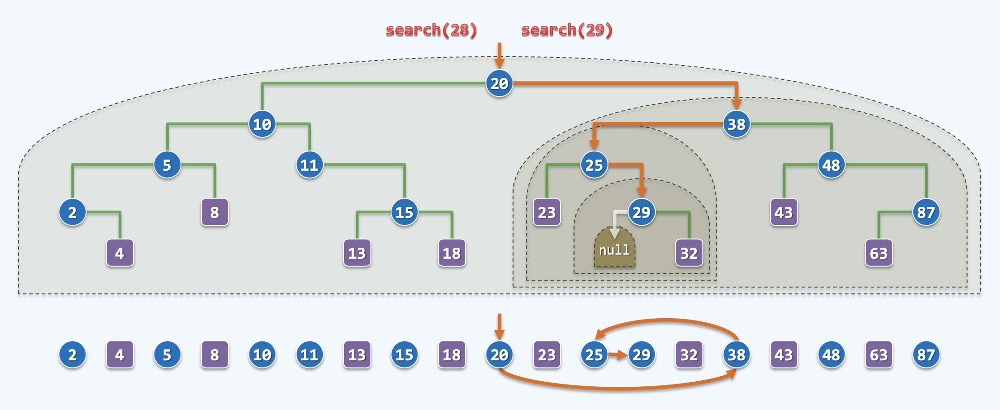
    <br />
    <div style="text-align:center">备注：图片托管于github，请确保网络的可访问性</div>
    <br />
</div>

- 比如我们有一堆书，需要经常在其中找到某一本数，如何有效查找呢？
- 将所有的书先做一遍预处理：编个号，排个序，接下来就可以很方便的在其中做查找
- 树的查找每次都是从根部开始进行比较，比较之后将我们的目光转向其中一侧，比如说如果我搜索是28或29
- 28 > 20, 所以, 20左边的全部都不需要看了，我们现在看右边，其实右边本质上是一个规模缩小的子树，sub tree
- 38 > 28, 所以, 我们只需要关注这棵子树的左侧即可，按照这种方式，逐次比较，不断深入, 直到找到29号元素
- 如果我们搜索条件的是28，那么可见经过比较，提示找不到元素，如果搜索的是29，那么直接返回，提示找到即可
- 这样做的好处是既可以完成所有的查找却不需要将所有元素都遍历一次
- 对树的预处理是：对于任何一个位置，所有的左后代都比它小，所有的右后代都比它大
- 这种树查找在一般的时候性能不错，但是它的弱点在那些深的一些位置上

2 ) **BBST**

<div align="center">
    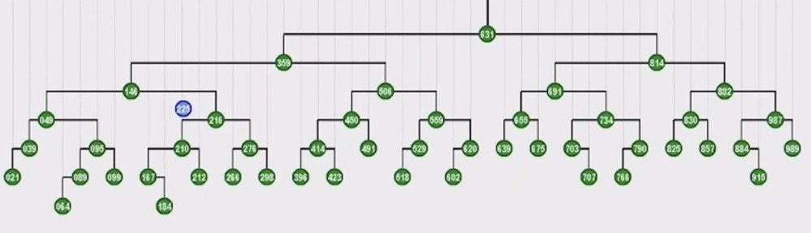
    <br />
    <div style="text-align:center">备注：图片托管于github，请确保网络的可访问性</div>
    <br />
</div>

- 在上面的场景中，如果要找较深的节点，显然会花更多的时间，需要更多的比较，就像哈夫曼编码一样，需要更多的比特
- 有一种技巧就是把这种树平衡化，不仅在一开始是平衡的，而且在所有的操作，插入和删除都可以保持一个平衡态
- 即便要攻击它最弱的一点，也不至于太弱，这就是BBST

### Hashtable + Dicionary + Map

- 很多时候我们希望直接找到某个东西，如：

```python
beauty = dict({
    "沉鱼":"西施",
    "落雁":"昭君",
    "闭月":"貂蝉",
    "羞花":"玉环"
})
beauty["红颜"] = "圆圆"
print beauty

for alias, name in beauty.items():
    print alias, ":", name
```

- 这种直接找到某个东西的方法是非常的快
- 这种方法我们一般叫做 Hashtable 散列表或哈希表
- 它的内部其实是先准备好了一个数组(数组的好处是查找非常快，一下就能找出来)

<div align="center">
    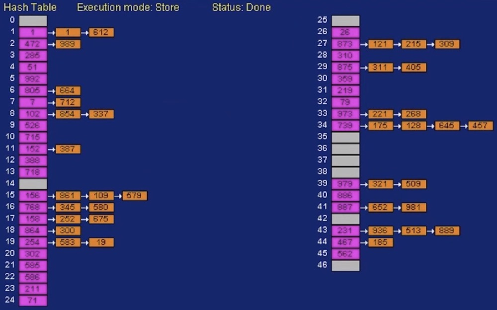
    <br />
    <div style="text-align:center">备注：图片托管于github，请确保网络的可访问性</div>
    <br />
</div>

- 这里有 (0 ~ 46) 47个元素, 如果这个值是156，那么关于47的模余就是15，那么156就存储于15这个位置上
- 当有很多数，我们都想存储于这个数组中，那么就会有位置的冲突，如：768 和 580，这时候，我们通过List来存储冲突的元素
- 按照这种结构来组织成一个叫散列表的数据结构
- 查找的时候，任何查找的对象都可以把它转换成数字，取模以后，对应到数组中的某一个，之后顺着里面的List查找
- 如果有的话则找到, 没有则报告查找失败
- 散列表最重要的事情是如何做映射，映射有很多种，我们上面使用取模的方式
- 这个模在数学上叫做mod, 在很多语言中用 % 表示
- 直接对某一个数取模，一般这个数就取这个散列表的长度，就像上面的47，但是这里我们倾向于取值 90001
- 同时，这个值我们倾向于取素数，这样的话我们可以很方便的进行查找
- 我们看到一旦底层用了Hashtable, 那么接近于在常数时间内找出任何一个元素对应的值
- 在python中的dict, map存储查询等操作起来非常快的原因就是这个底层机制

### Priority Queue ~ Heap

1 ) **对比Huffman Tree的问题**

- 在之前的Huffman Tree中我们知道它是维护了一棵森林，每个元素都是一棵树，都有各自的权重
- Huffman的策略是挑2个最小的，通过引入一个新节点将这两个最小的合二为一，将新节点这棵树重新插回森林
- 这一过程，森林中少了一棵树(出了2个，进去1个，净损失1个)，反复这么处理
- 我们知道这个过程从n到1，总共有n-1次的迭代
- 我们如何将这个结构组织起来，方便我们快捷的找到权重最小的两个，是我们需要讨论的问题
- 之前我们用的方式是通过Vector或List的结构，找到其中最小的两个，需要逐个比较，这个过程需要n的时间
- 所以，总计是 n*(n-1)的时间，也就是时间复杂度为：$O(n^2)$
- 我们可以看出这个n-1次的迭代是无法进行优化的，是必须的过程
- 而每一次的迭代需要花n的时间(这个n的时间是在n棵树中找出最小的两个), 这个n的时间这块可以优化

2 ) **引出Priority Queue ~ Heap数据结构**

- 如何优化呢？我们需要使用一个新的数据结构，一种三角形的树形结构，可以方便的进行`getMin()`, `delMin()`等操作
- 这时候找出两个最小树的时间复杂度为O(logn), 总体时间复杂度为：O(nlogn) 我们把这种数据结构叫做 Heap 堆
- 以Heap为代表的这一类问题，我们统一称之为 Priority Queue 优先级队列

<div align="center">
    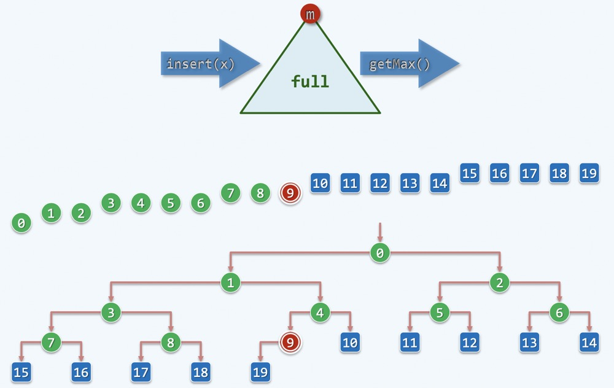
    <br />
    <div style="text-align:center">备注：图片托管于github，请确保网络的可访问性</div>
    <br />
</div>

- 如上图，它看上去是一棵树，对应的可以存成一个向量，它可以很方便的进行`getMax()`或`getMin()`操作，也可以以同样的效率支持`insert(x)`操作
- 它会把你需要的max或min放到你唾手可得的地方(树根或堆顶)，也就是说我们在取一个元素的时候不是看谁大或谁近，而是看谁优先级最高

3 ) **Huffman Tree的另一种优化方案**

- 而针对Huffman Tree的问题，我们并不一定要用 Priority Queue ~ Heap 这个数据结构，我们可以通过Stack + Queue的方式模拟出来O(nlogn)的解决方案

<div align="center">
    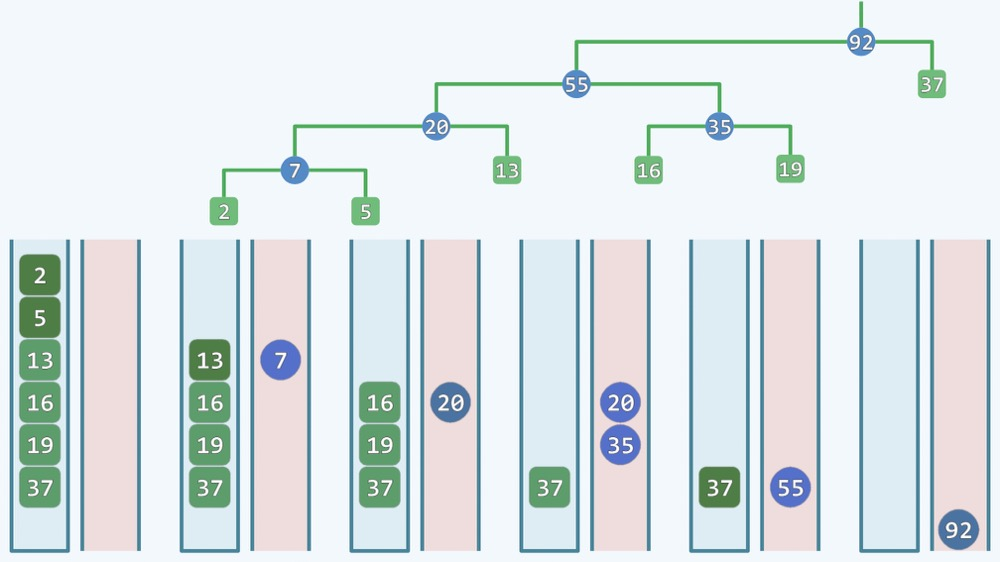
    <br />
    <div style="text-align:center">备注：图片托管于github，请确保网络的可访问性</div>
    <br />
</div>

- 当我们拿到了一组哈夫曼要编码的字符的频率表之后，首先把他们全部排序，如：2, 5, 13, 16, 19, 37 
    * 这一步排序，我们不推荐使用时间复杂度为$O(n^2)$的bubble sort来排序, 我们使用更快的方式来处理，这一步时间复杂度记为：O(nlogn)
- 之后将排好序的元素通过栈来组织起来(最小元素存放于栈顶位置), 还需要一个辅助的数据结构为队列
- 在第一次中，我们在栈中找到最小的两个: 2,5(栈顶和次栈顶), 通过合并为7, 存入队列中，完成首次迭代
- 进而，在栈和队列中找到最小的两个元素: 13, 7, 通过合并为20, 存进队列中, 完成第二次迭代
- 再次，在栈和队列中找到最小的两个元素: 16, 19, 通过合并为35, 存进队列中, 完成第三次迭代
- 继续, 在栈和队列中找到最小的两个元素: 20, 35, 通过合并为55, 存进队列中, 完成第四次迭代
- 最后, 在栈和队列中还剩两个元素：37, 55, 合并它们, 得到了最终的92
- 在这个过程中，我们同样构造出来了Huffman Tree, 我们依赖全是栈和队列的操作，每个操作都是常数时间
- 总共有n步，每一步常数，所有的时间为O(n), 这是一个线性的复杂度
- 这里面的奥妙是：
    * 在任何一个时刻，如果在整个森林中挑选最小的两个, 只要在栈和队列这两个子集中挑选即可
    * 无论任何时候，栈亦或是队列中的元素都是有序分布的
    * 无论在栈还是在队列中找，只需要考虑前面的两个，充其量4个元素就够了
    * 可能最小的两个元素只来自于栈或只来自于堆或一个来自于栈，一个来自于堆
    * 这样每一次比较都是常数，整体上来说就是线性的

### Minium Spanning Tree

<div align="center">
    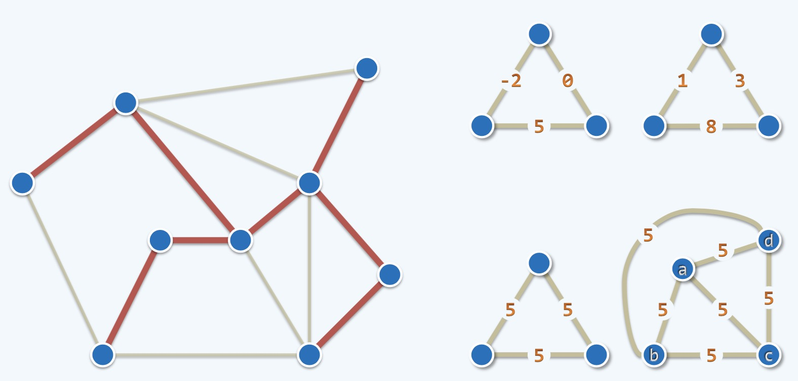
    <br />
    <div style="text-align:center">备注：图片托管于github，请确保网络的可访问性</div>
    <br />
</div>

- Minium Spanning Tree 最小支撑树或最小生成树(MST)
- 我们知道图可以描述城市网络，交通网络，计算机网络等，这些网络都是由点和线构成的
- 我们希望将这些点连成一个有效的结构(有效指的是，保持联通性，任何两点之间都要有一条路连通)
- 而我们知道，每一条边都是有成本的, 比如修路的成本，也就是权重，所以这张图是一张有权图
- 我们要实现整体的连通，需要有两个原则：
    * 边不能太少，太少了肯定连通不了；边不能太多，不能出现环路
    * 权重问题，总体权重最小，即总成本最小
- 我们需要既要连通也没有环的树结构中，在所有可能的树结构中找到权重最小的树
- 这样的树可以把所有的点都支撑起来，同时它的成本又能达到最小

<div align="center">
    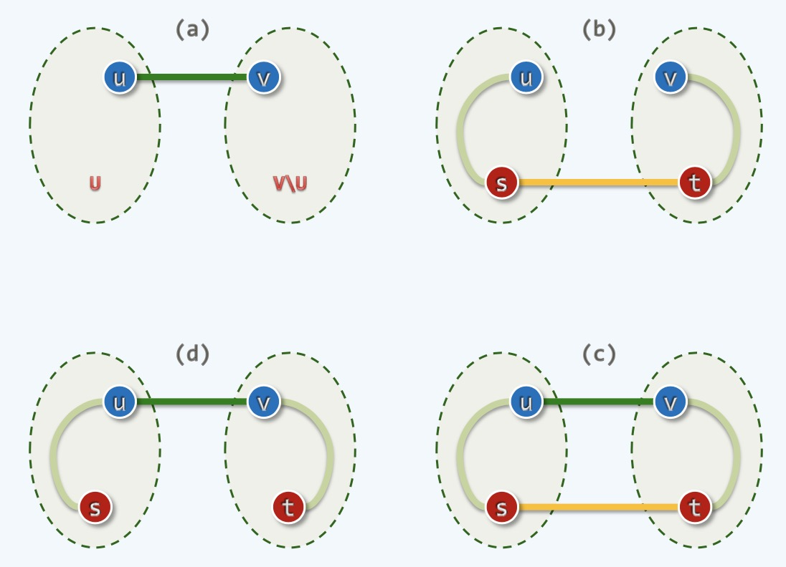
    <br />
    <div style="text-align:center">备注：图片托管于github，请确保网络的可访问性</div>
    <br />
</div>

- 为了完成这件事，我们依然使用贪心法

1 ) **Prim算法**

- 早年Prim经过自己的观察分析，找到了一种方案
- 他引入了图论中的一个知识叫 **Cut** (割)
- 将图中的所有点归为两类，一类集合叫U, 另一类是U的补集V, 记为 V\U，如图(a)所示
- 一旦我们将彼此不重叠的两部分分出来了，我们就称之为 Cut
- Cut 把点给分了，同时无形中也把边给分了
- 边被分成了两类：
    * 一类是连接于同一侧点集内的边，比如U或V\U内的边
    * 另一类是跨界的边，连接的两点恰好属于被Cut的两端：u和v，这类边我们可以称为桥或跨越边，这类边也有权重
    * 一旦有个割以后，就会有一系列的cross边(桥)和noncross边(各自集合内的边)
- 这样我们知道，点和边都会被分类，Prim说我们把目光关注到所有的cross边，这些边都有权重
- Prim说把这些权重最小的cross边标记出来并断言这些边必定会被MST所采用
- 也就是说，任何被Cut的最短的cross边都会被MST所采用
- 严格地表述：这样一条最短的跨边至少会被某一棵MST采用
- 我们现在使用反证法来看下这个问题，假设在选取cross边的时候不取最小的uv边,而是像图(b)中的st边
- 那么这时候选取的st这条cross边一定比uv这条边权重高，然后我们再强行的加入uv边，如图(c)
- 此时图变成了环而非树结构了，对于树而言, 任何一棵树，如果有n个节点, 那么它的边不多不少恰好有n-1个
- 而这个环因为多加了一条，是n条边，而且不符合MST的原则, 我们将这条st边移除，如图(d)，这时候边的数目又变成了n-1
- 重新变成了一棵树，这样连通性并没有破坏, 只是将桥换了一下: st边换成了uv边
- 图(b)和图(d)的差异在于所选取的连通边的权重，所以选择uv边来说，更加合理更符合MST
- 这里有一个算法实例，在prim算法中, 任何Cut的最小边一定会被MST所采用，他把目光始终注意在某一个Cut的最小跨边上

<div align="center">
    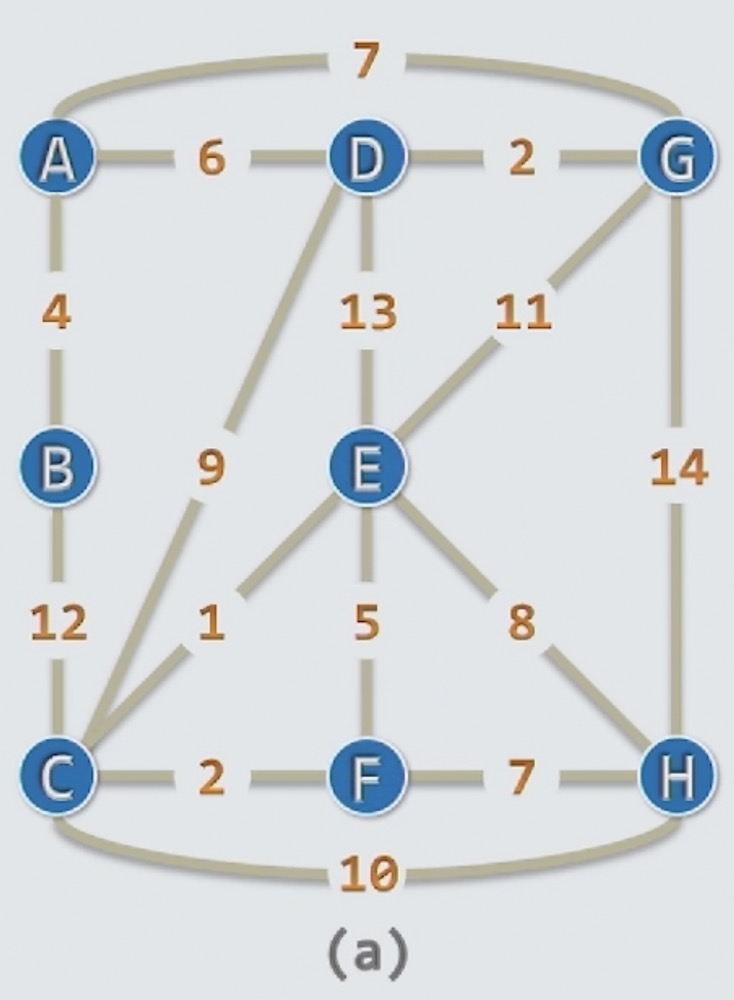
    <br />
    <div style="text-align:center">备注：图片托管于github，请确保网络的可访问性</div>
    <br />
</div>

- 如何构成这个Cut? 构成Cut的条件是任何两边非空即可, 最简单的构成割的方法是，在所有的点中找到一个点如下图A点

<div align="center">
    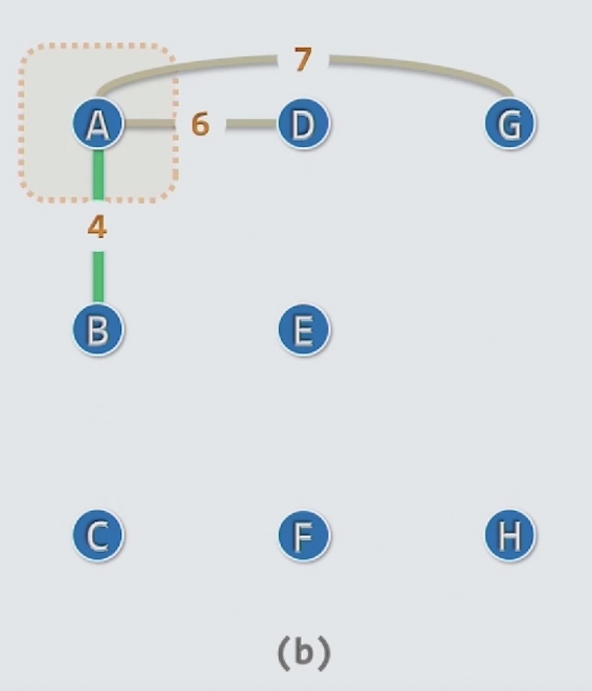
    <br />
    <div style="text-align:center">备注：图片托管于github，请确保网络的可访问性</div>
    <br />
</div>

- 然后相对于A，剩下的n-1个点相对于A点则构成了一个Cut，即此时集合U中只有A这一个元素
- 对于A点来说，AB, AD, AG 都是cross边，它们各自的权重：4,6,7, 显然我们应该选择AB这条边作为cross边
- 接下来将B纳入集合U中，此时的U有A,B两个元素，构成一个新的整体

<div align="center">
    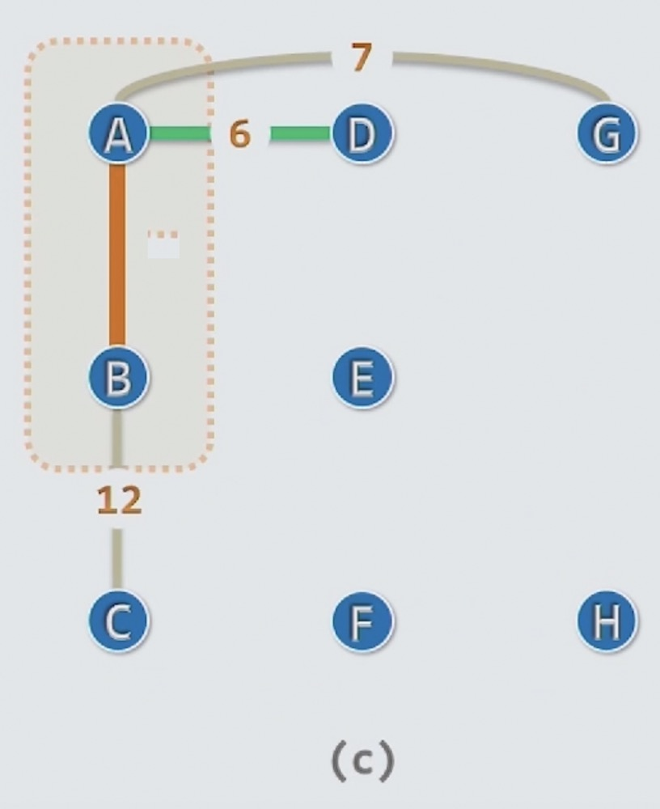
    <br />
    <div style="text-align:center">备注：图片托管于github，请确保网络的可访问性</div>
    <br />
</div>

- 同样，我们贪心的继续下去，相对于新的集合U而言，UD, UG, UC 都是cross边，各自权重分别为：6,7,12
- 根据Prim原理，我们将目光盯在这个苟且的局部，可见6是最小的权重, UD为最佳cross边
- 将D加入集合U, 此时集合U中的元素: A,B,D, 根据这个原理，我们有

<div align="center">
    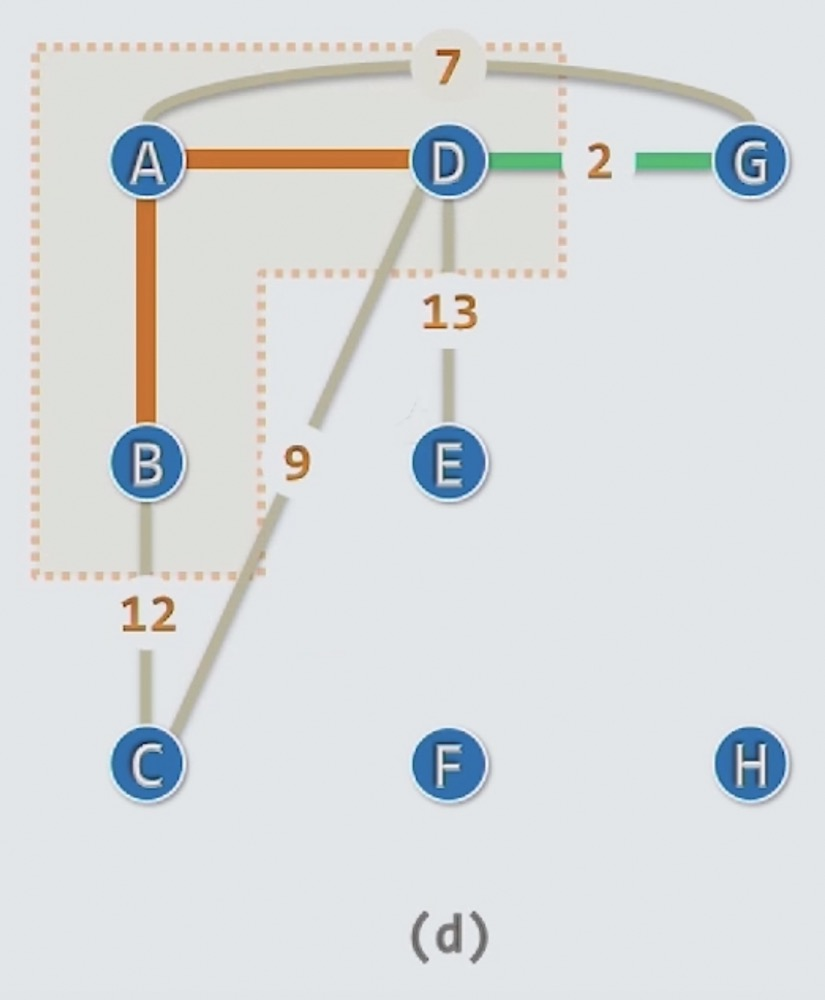
    <br />
    <div style="text-align:center">备注：图片托管于github，请确保网络的可访问性</div>
    <br />
</div>

- 继续这个过程，有

<div align="center">
    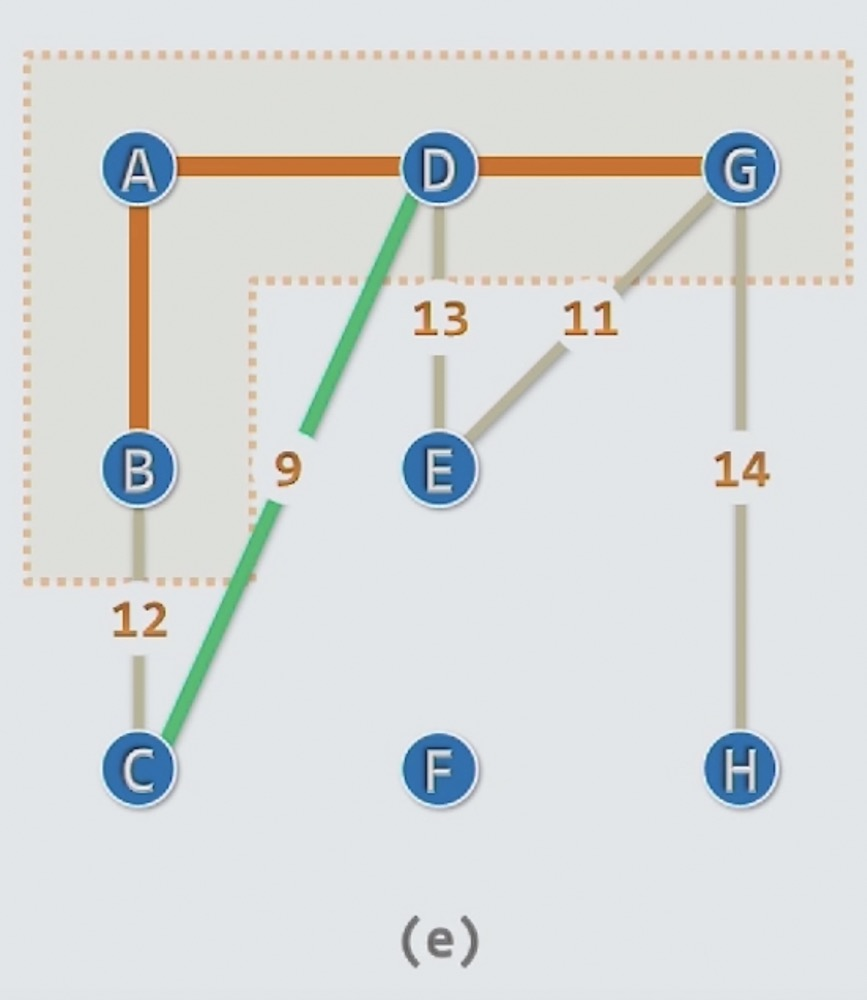
    <br />
    <div style="text-align:center">备注：图片托管于github，请确保网络的可访问性</div>
    <br />
</div>

- 继续，有

<div align="center">
    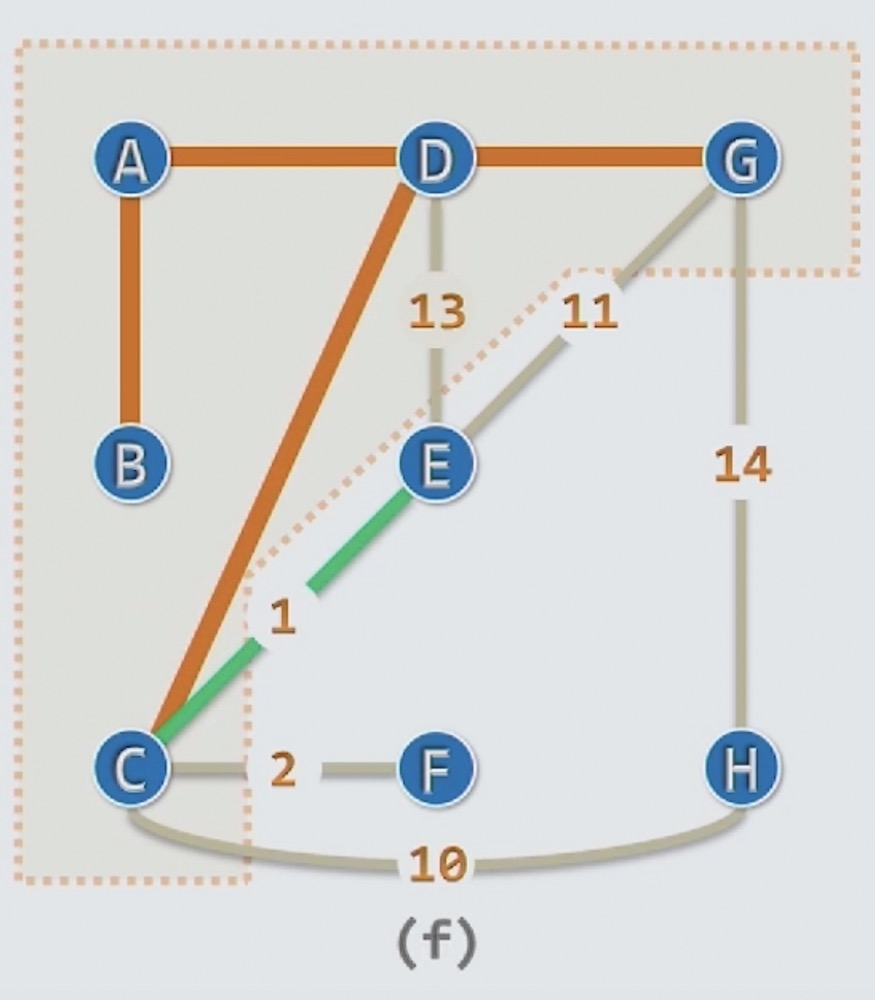
    <br />
    <div style="text-align:center">备注：图片托管于github，请确保网络的可访问性</div>
    <br />
</div>

- 继续，有

<div align="center">
    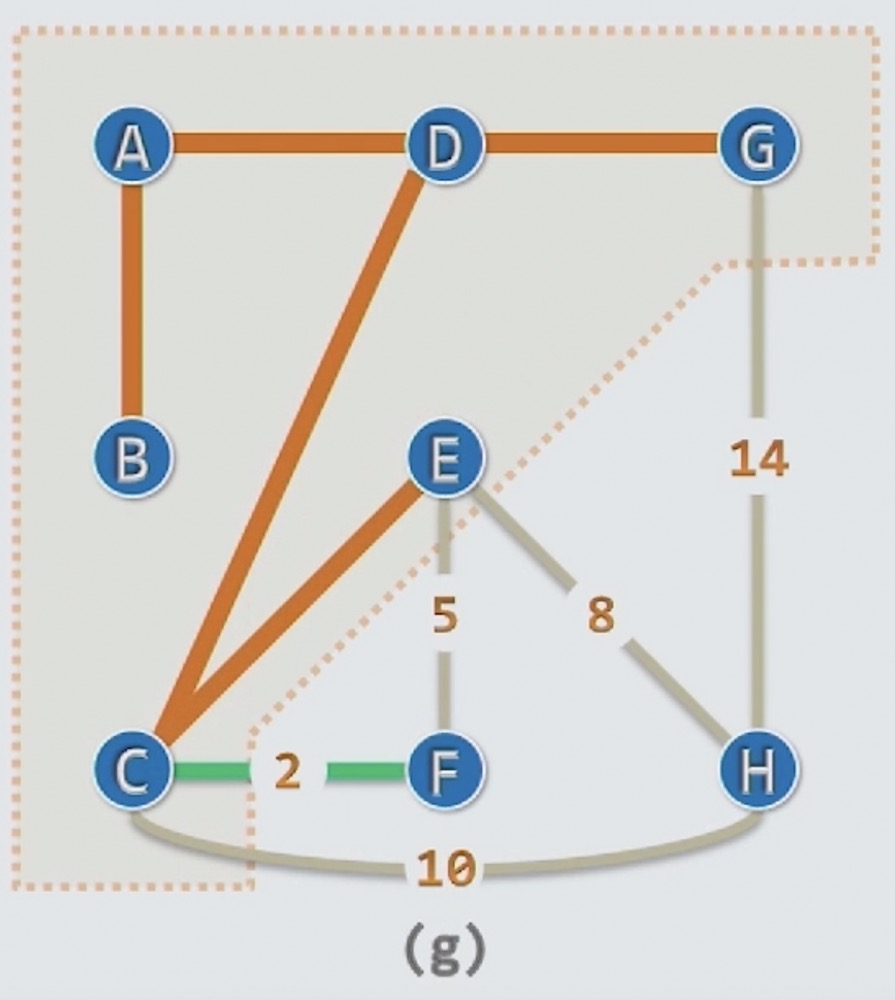
    <br />
    <div style="text-align:center">备注：图片托管于github，请确保网络的可访问性</div>
    <br />
</div>

- 继续，有

<div align="center">
    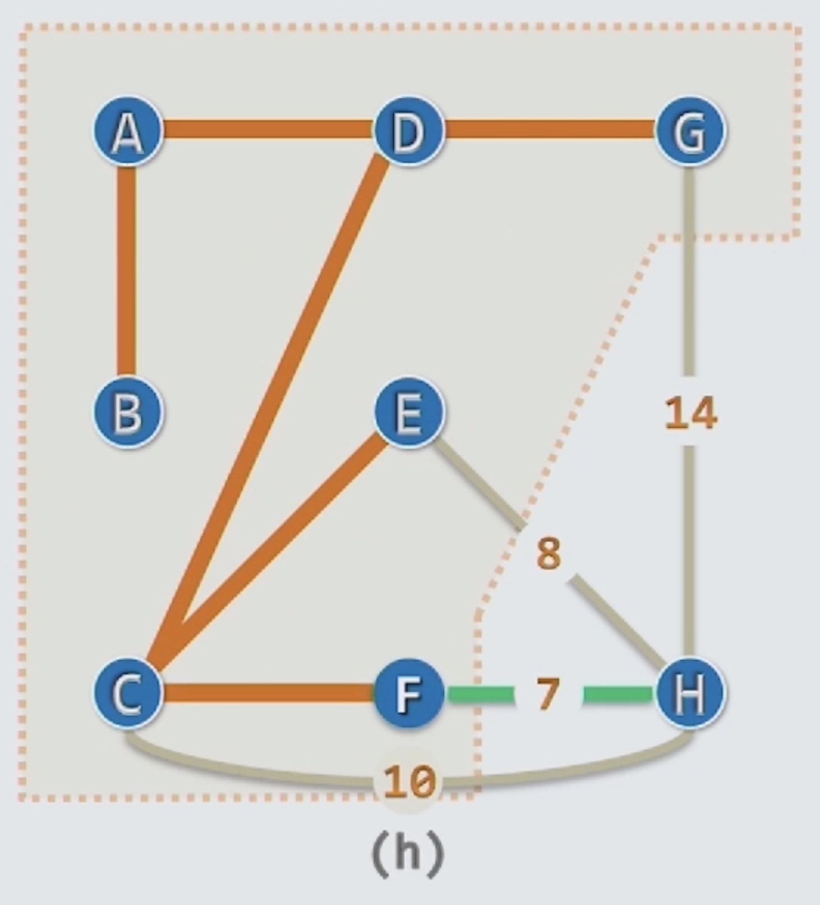
    <br />
    <div style="text-align:center">备注：图片托管于github，请确保网络的可访问性</div>
    <br />
</div>

- 最后，有

<div align="center">
    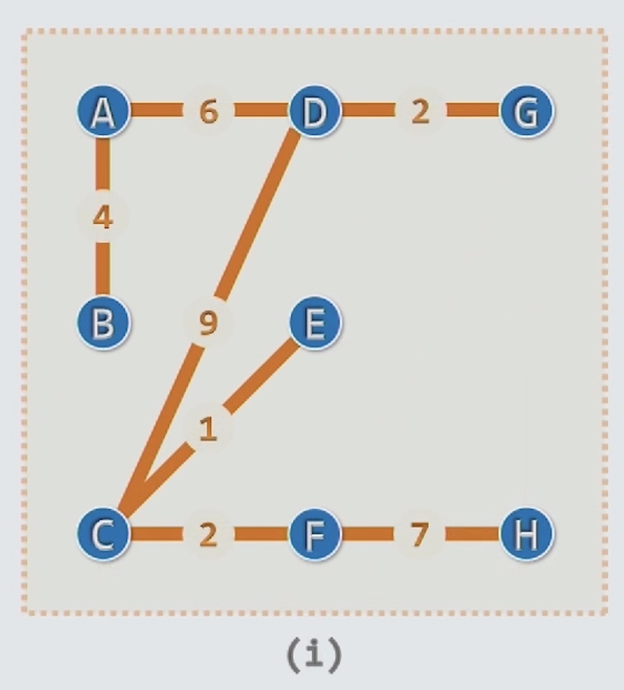
    <br />
    <div style="text-align:center">备注：图片托管于github，请确保网络的可访问性</div>
    <br />
</div>

- 此时已经扩无可扩了，这就是贪心最后期待的大馅饼
- 这个过程从任何一点开始都可以，也类似Huffman Tree, 最终结果也不见得唯一
- 也就是说MST或Huffman Tree同时可能有多棵, 虽然形状上有多棵，但是指标上是一样的

<div align="center">
    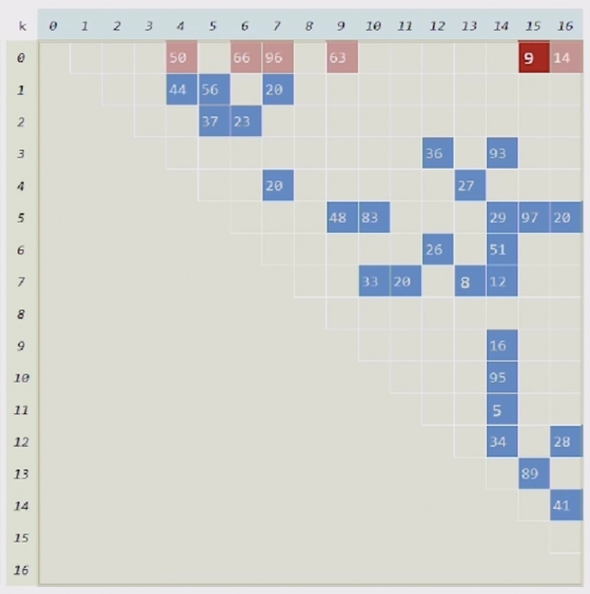
    <br />
    <div style="text-align:center">备注：图片托管于github，请确保网络的可访问性</div>
    <br />
</div>

**矩阵方式**

- 如上图，现在有一个演示，这个矩阵代表了带权图结构, 这是一个无向图，所以忽略了下面的一半
- 这里是0~16, 共计17个点的图, 这里就像之前取A点一样，我们默认取0这一点(这里不是必须的, 但我们不妨从这里开始)
- 如果第一个点是0这个点，其他16个点全在另一侧的话，等同于从0发出的边，这些边无一例外都会在0对应的这一行里
- 在第一次的时候，还没开始这个预处理已经做好了，红色的方框代表的是cross边，权重最小的9染色最重
- 也就是0-15这条边是我们选择的边，我们给它标记出来为绿色

<div align="center">
    
    <br />
    <div style="text-align:center">备注：图片托管于github，请确保网络的可访问性</div>
    <br />
</div>

- 现在无论是从0发出的边还是从15发出的边都要标记颜色，因为它们都可能是cross边
- 此时15这一列开始染色了，表示15这一点找到了cross边
- 可见, 5-15, 13-15 都是cross边, 同时我们也看到它们的边权重比较重，分别是97, 89
- 所以接下来，我们选择0-16这条边，它的权重是14, 现在16被加入这个阵营了
- 同时16这一列也会有相应的染色，表示cross边

<div align="center">
    
    <br />
    <div style="text-align:center">备注：图片托管于github，请确保网络的可访问性</div>
    <br />
</div>

- 我们找到了5-16这条边，权重为20, 我们将其再次加入阵营，从以上的分析可以得到下图

<div align="center">
    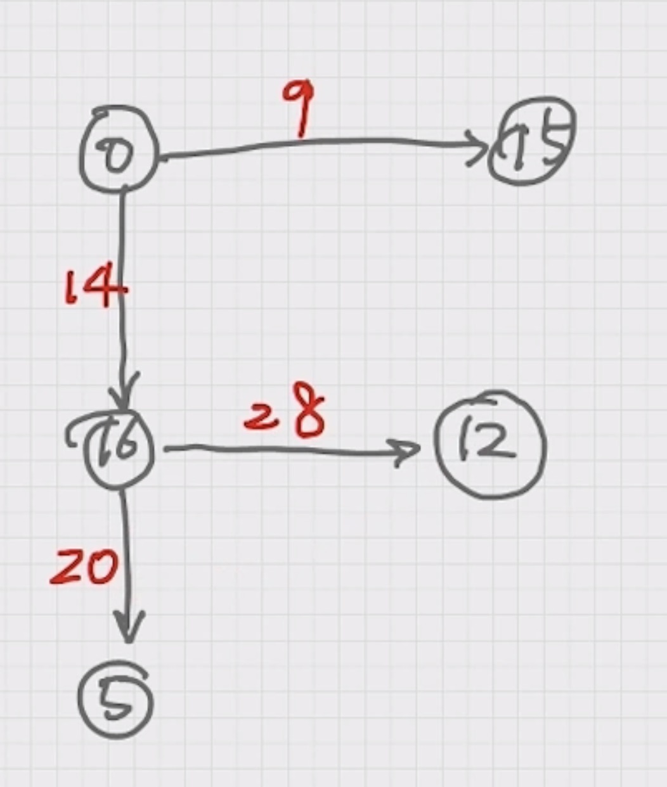
    <br />
    <div style="text-align:center">备注：图片托管于github，请确保网络的可访问性</div>
    <br />
</div>

- 重复这一过程，直到最后，我们得到

<div align="center">
    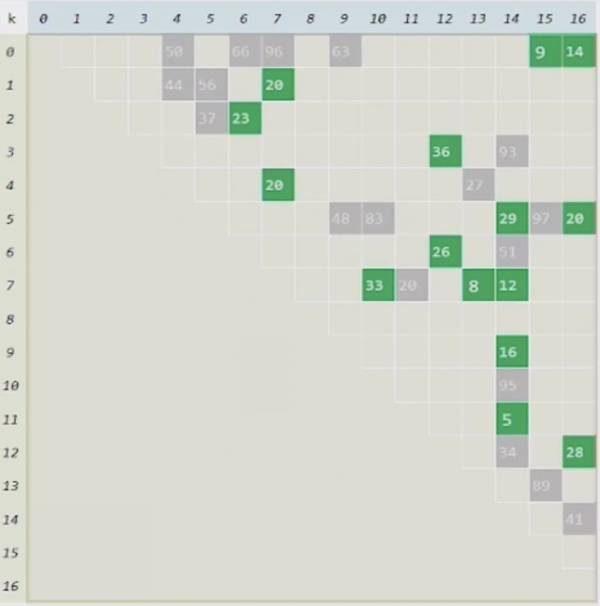
    <br />
    <div style="text-align:center">备注：图片托管于github，请确保网络的可访问性</div>
    <br />
</div>

- 此时17个点都会被加入进来，绿色格子有16个，表示除了初始0点的其他16个点以及相应的cross边
- 而灰色的格子都是某个阶段的noncross边，在集合内部自己连着的，对MST扩展不起作用
- 以上整个过程即是算法的原理，我们使用上图的矩阵方式来实现该原理，所有操作都在矩阵上，同时我们可以画出相关连接图
- 最后的结果是一个连通的无环的图，也就是我们的支撑树，同时这棵树也是权重最小的
- 由于和矩阵打交道，所以这种方式效率较低

**堆方式**

- 处理Prim算法，用优先级队列是最好的，我们需要用到堆结构

<div align="center">
    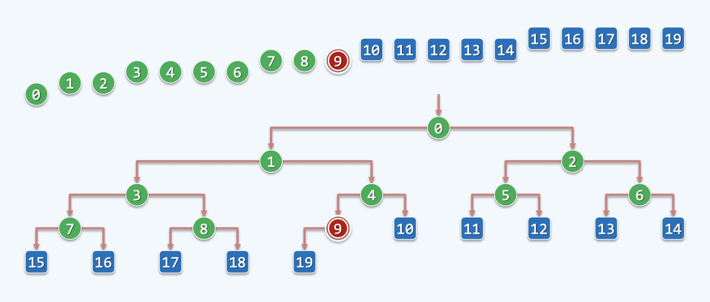
    <br />
    <div style="text-align:center">备注：图片托管于github，请确保网络的可访问性</div>
    <br />
</div>

- 堆结构逻辑上是一棵树结构，物理上通过数组即可实现
- 我们可以把图上所有的节点组织成一个Priority Queue(PQ), 这其中有很多的点

<div align="center">
    
    <br />
    <div style="text-align:center">备注：图片托管于github，请确保网络的可访问性</div>
    <br />
</div>

- 在算法过程中，包括从第一步开始, 有一些点进入到集合U中, 上面是集合U, 下面是U的补集: V\U
- 我们的算法会从0号或者A开始(找到一个点开始即可), 依次地把这些点拉上去, 直到把所有的点都拉上去
- 拉上去的方法就是贪心方法, 我们要找到在所有的这些可能的cross边中最短的一条
- 当然在一般情况下将来还会有其他点来贡献可能的跨边，同样找到最短的一条
- 我们可以把下面的每一个点自己来记一个数, 即自己所拥有的权重
- 这里的权重可以认为是集合V\U中的点到集合U中的距离 distance
- 这里的距离表示：$dist(v) = min{|v, u|, u \in U}$
- v是集合V\U中的元素, u是集合U中的元素，这个距离即：当前v和来自集合U中所有的u的距离的最小值
- 下面的所有v根据这个原则将自己的权重指标优化到最小, 我们只要扫描一遍，在其中找到在最小中的总体的最小的
- 其实我们通过这个堆的数据结构没有必要扫描所有，我们只要调用堆的`delMin()`接口即可把最短的边找到，这里的效率是O(logn)
- 这样的话，用O(logn)的时间处理好一个，总体处理只需要O(nlogn)
- 从这里可以看出，当研究算法到了一定程度的时候, 数据结构是绕不过去的
- 数据结构是算法的积淀, 很多算法会在成熟研究后会积淀到某一个数据结构中

2 ) **Kruskal算法**

- 无论是Prim算法还是Kruskal算法都是贪心的算法
- 它们一开始都有一个美好的愿景(最终目标), 但在实施的过程中都采用了一种苟且的行为(每次都挑最小的)
- Kruskal算法是如何挑选最小的呢? Kruskal认为不用考虑最小的桥, 在图中每个边都有自己的权重, 都可以先按大小先排个序，比如单调递增
- Kruskal说我们把目光盯住最短的一条边, 因为要求总体最短, 那么组成树的边各自要尽可能的短, 这条最短的边要优先引入, 并且被所有的MST采用(这条最短的边会出现在所有的MST中)
- 也就是说我们选的这条最短的边在Prim算法中也会被采用
- 再回到Kruskal算法中来, 我们继续把目光盯住次最短边,也就是单调递增排好序的第二条边
- 这条的次最短边也会被MST所采用, 也会被所有的MST所采用, 为什么?
    * 拿这条次最短边来说, 当一个端点加入集合U中的时候, 另一个端点也会很快加入, 但可能不是马上加入
    * 因为这时候有可能最短边也是其中的一座桥, 就轮不到次最短边了, 这时候它只能退而求其次, 所以可能并不会马上被加入
        * 当最短边已经在集合U中了, 那次最短边的另一个端点会马上被拉进集合U中
        * 当最短边距离还很远并没有被探测到, 那么也不会影响次最短边的另一个端点的立刻加入
        * 但是当最短边此时也构成了一座桥, 那么显然, 次最短边会退居其次, 优先考虑最短边
        * 最短边加入集合U中之后, 次最短边的另一端将立即加入集合U
    * 所以在这个排好序的集合中的第一和第二两条边都可以被所有MST所采用
- 但是这种推论并不适合第三条边和以后的边, 第一和第二两条边我们都可以通过以上来证明出来，但是第三条边(第三最短边)不能
- 因为第三条边可能和第一和第二两条边构成一个环路, 而且是集合U内部的一条边(无用边), 如果是环路则违背了MST的原则, 而且树中是不能有环的
- 而且构成环路的风险随着后面边的加入越来越大, 下面我们来看下Kruskal算法的具体实现

- 把所有的边按权重先排个顺序, 前两个最小的不用考虑, 直接加入集合U中
- 当第三个开始的时候就有可能碰到环路了, 如果构成了环路, 那么用灰色来标记(相当于扔掉)
- 如何判断新引入的边造成了环路呢? 可以通过判断这条边是来自两棵树中的点还是来自同一棵树中的点
- 如果新引入的边是来自两棵树那不会构成环路，否则构成环路

<div align="center">
    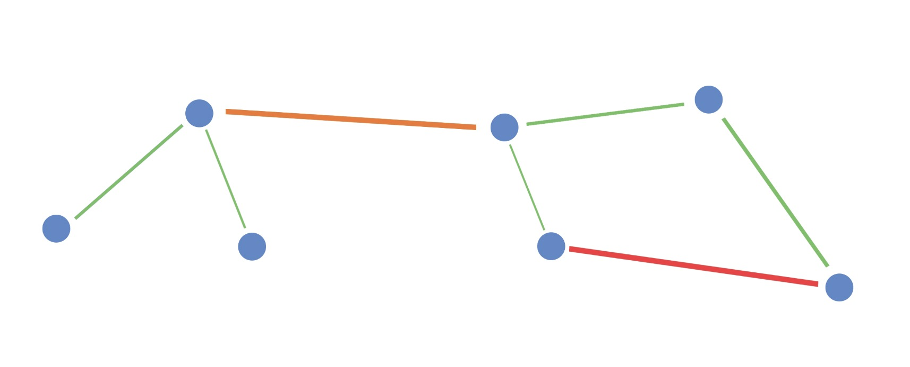
    <br />
    <div style="text-align:center">备注：图片托管于github，请确保网络的可访问性</div>
    <br />
</div>

- 如上图，如果新引入的边是橙色或红色的边(两种情形举例)，我们可以看到，橙色的边不会构成环路，而红色的边构成了环路
- 橙色的边将两棵树合二为一，是安全的，符合MST原则，我们按照这种安全的方式来添加, 最终合并成一棵树，就是我们最终要的馅饼
- 仍旧假设我们有17个点，一开始的时候我们可以看做是17棵树，逐个归类，如何归类?

<div align="center">
    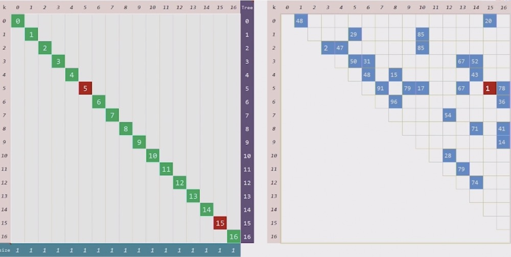
    <br />
    <div style="text-align:center">备注：图片托管于github，请确保网络的可访问性</div>
    <br />
</div>

- 还是按之前说的，先将具有权重的边按大小进行排序
- 比如，权重最小的边是权重为1的边, 连接着5, 15两点, 此时我们将8, 13归为一类(挪到同一列表示归为一类, 也就是合并成一棵树)

<div align="center">
    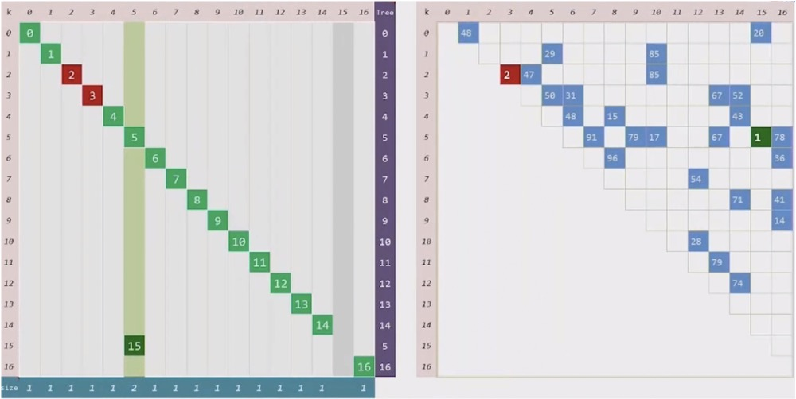
    <br />
    <div style="text-align:center">备注：图片托管于github，请确保网络的可访问性</div>
    <br />
</div>

- 此时，深绿色表示当前的边或端点, 红色表示接下来的边和端点
- 紧接着, 找到权重次小的2, 连接着2, 3两点, 将2, 3归为一类

<div align="center">
    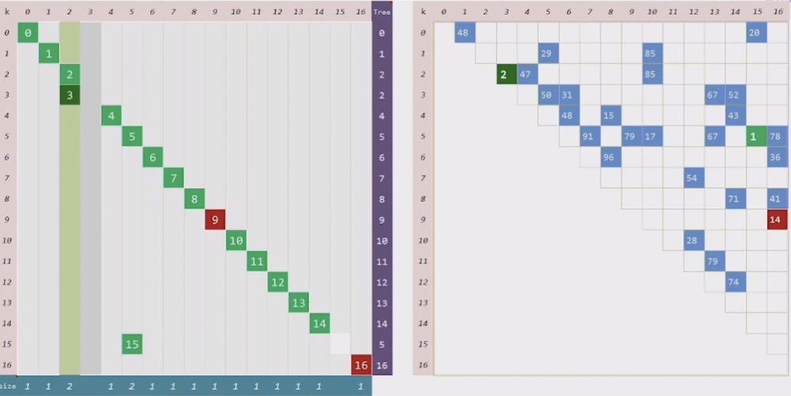
    <br />
    <div style="text-align:center">备注：图片托管于github，请确保网络的可访问性</div>
    <br />
</div>

- 好的，现在是第三条最短边了，此时权重为14, 连接着9, 16两点, 将9, 16归为一类

<div align="center">
    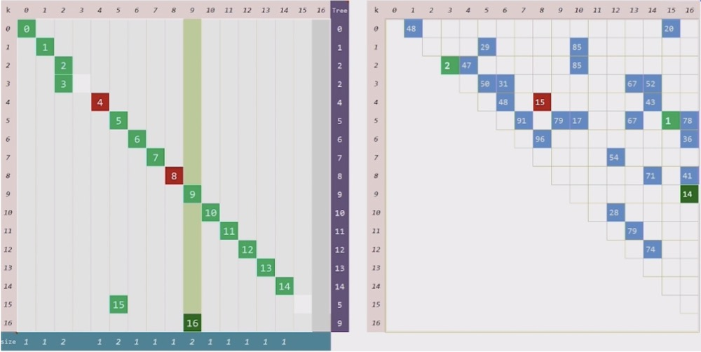
    <br />
    <div style="text-align:center">备注：图片托管于github，请确保网络的可访问性</div>
    <br />
</div>

- 按照这种方式持续走下去 ...
- 当将要到权重为20的这条边时，它连接着0, 15, 将它们归为一类 (注意归类之前, 5, 10, 15是在同一棵树上, 下图为归类之前的状态)

<div align="center">
    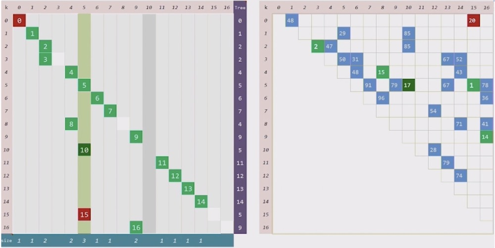
    <br />
    <div style="text-align:center">备注：图片托管于github，请确保网络的可访问性</div>
    <br />
</div>

- 此时到了权重为20的这条边, 开始对0, 15进行归类, 可以看到 0, 5, 10, 15 四个端点形成了一棵树, 如下图

<div align="center">
    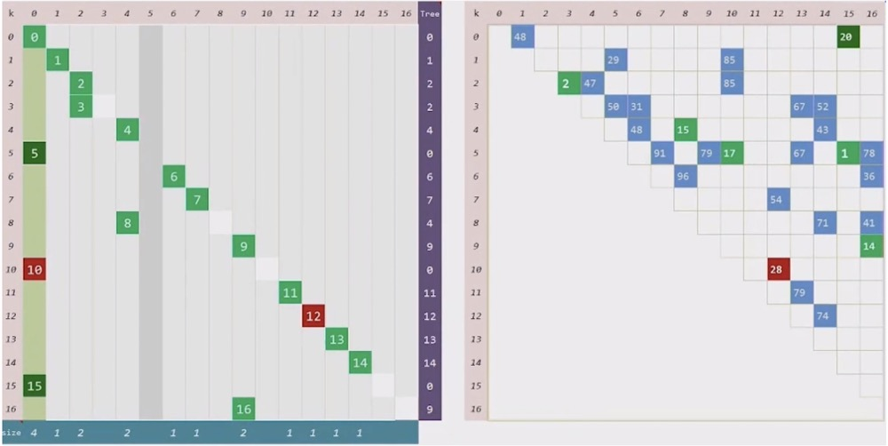
    <br />
    <div style="text-align:center">备注：图片托管于github，请确保网络的可访问性</div>
    <br />
</div>

- 按照这种方式继续走下去 ...
- 当将要到权重为47的这条边时，它连接着2, 4, 但是从下图可见，2, 4 这两点已经在同一棵树中的, 如果再次将 2, 4连起来将构成一个环路

<div align="center">
    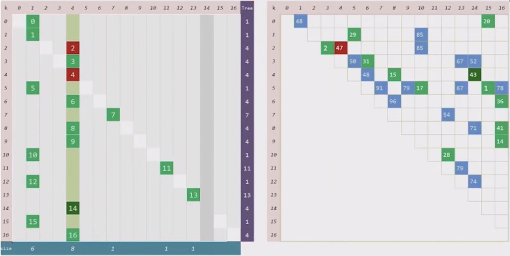
    <br />
    <div style="text-align:center">备注：图片托管于github，请确保网络的可访问性</div>
    <br />
</div>

- 果断舍弃此边, 权重为47的这条边变灰

<div align="center">
    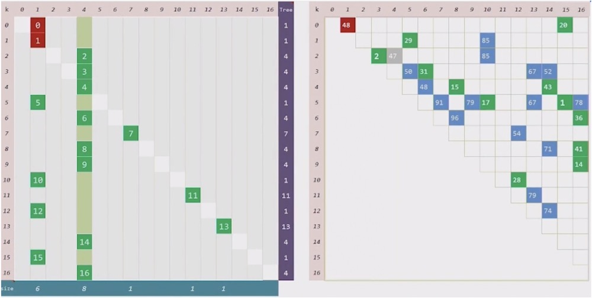
    <br />
    <div style="text-align:center">备注：图片托管于github，请确保网络的可访问性</div>
    <br />
</div>

- 只要遇到环路就立即舍弃，进入下一步，按照这个规则持续往下走, 不断的完成树的合并，直到最后一棵，构成了我们的最小生成树

<div align="center">
    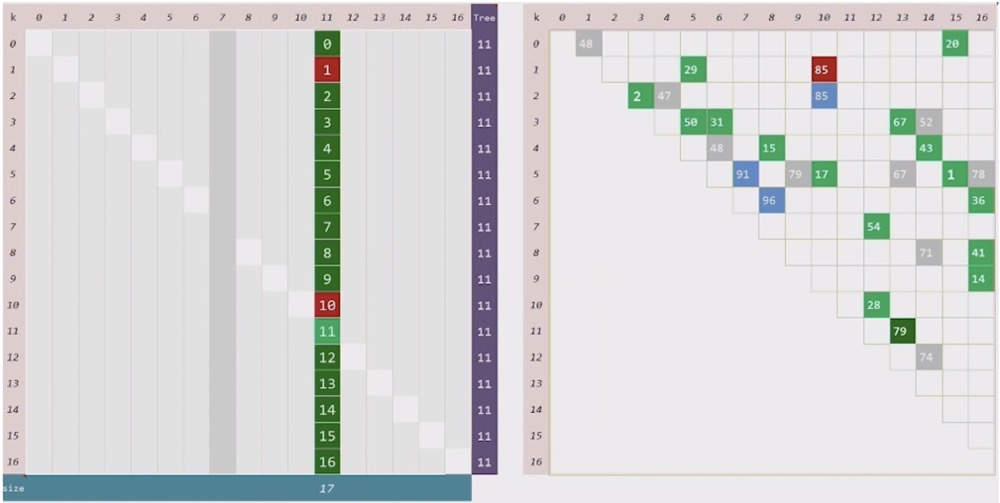
    <br />
    <div style="text-align:center">备注：图片托管于github，请确保网络的可访问性</div>
    <br />
</div>

- 以上就是Kruskal算法的原理
- Kruskal算法最核心的工作是判断由若干个节点构成的一棵树与另一棵由若干个节点构成的一棵树是否是同一棵树
- Kruskal算法中的一个技巧是将同一棵树中的元素归为一列里面，这种专门的数据结构叫做并查集(Union Find)

**关于并查集的扩展**

1 ) 并查集的概念

- 并查集支持的操作就是在Kruskal算法中支持的操作，有两种：Find 和 Union

<div align="center">
    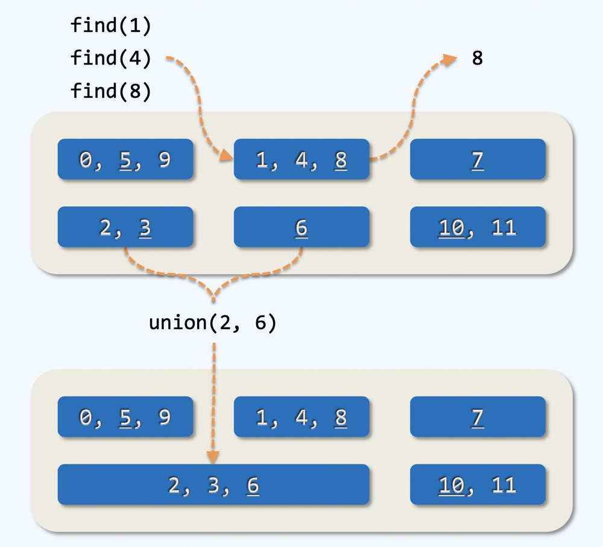
    <br />
    <div style="text-align:center">备注：图片托管于github，请确保网络的可访问性</div>
    <br />
</div>

- 关于Find操作：对于任何一个点，无论是1, 4, 8 我都来确定一下它归属于哪个子集(小树)
- 我们在每棵小树中都取一个代表元素(叶子节点)来作为这棵树的标识, 比如: 在1,4,8这棵小树中, 无论查谁返回的都是8
- 就像在Kruskal算法中无论是谁都把它标到同一列中去是一样的，这个标识用谁都可以，表示一下即可(因为都是不重复元素)
- 比如上图中，我们这样来定：查5返回5, 查9返回5；查10或11，返回10; 查2或3, 返回2; 查6, 返回6
- 根据这个数据结构, 当我们准备连接1和4, 我们进行find(1)和find(4)操作, 如果返回值是一样的(这里都为8), 代表的是同一棵树(跳过)
- 当我们准备连接1和10, 我们进行find(1)和find(10)操作, 结果返回值不同(8, 10), 代表是两棵树, 可以进行连接
- 将1和10连连起来后, 也就是将两棵树连在了一起, 这就是并查集的另一个操作：Union
- 关于Union操作：按上图, 假设我们要连的是树(2, 3) 和 树(6), 构成一棵新的由三个元素(2, 3, 6)构成的子树, 只需要进行Union(2,6)即可
- 所以，我们看到通过并查集的这两个操作Find和Union，我们即可高效实现Kruskal算法
- 并查集(Union Find)也叫做独立集(Disjoint-Set)

2 ) 并查集的实现

- 按照上面Kruskal算法原理的演示, 其实也暗示了并查集的实现原理

<div align="center">
    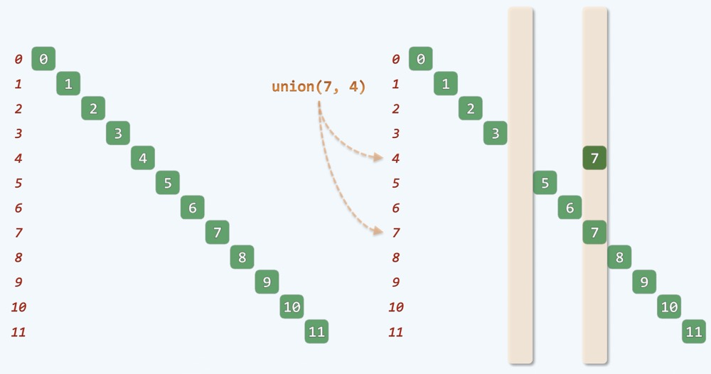
    <br />
    <div style="text-align:center">备注：图片托管于github，请确保网络的可访问性</div>
    <br />
</div>

- 在一开始的时候，每片叶子(元素)都是一棵独立的树, 分别独立的呆在各自的行和列上, 是一个对角线的分布
- 每片叶子都是独立集中初始的元素, 如果试图连接某两个点, 比如上图的4, 7, 我们就要把4, 7这两棵树进行Union合并
- 合并是这样进行的: 4或7随便谁(4或7)跑到对方所在的列中即可, 即可构成一棵新树
- 我们可以看到, 在同一列中存在了两个7, 上面的深绿色的7其实是4搬过来的, 我们这里直接把4改成7, 这里我们通过7代表这棵树的标识
- 这样做的原因是，比如在这个例子中, 当我们去实现时，就是0~11的数组, 每一个元素都是一个叶子节点
- 每个节点的标识通过下标即可标识，不必重复标识，而更重要的不是标识每个节点，而是标识当前节点归在哪个类中
- 既然4归在了7这一类中，那就把7这个标识直接写上
- 上图对角线画法是一种障眼法，这样做可以看得更明白, 我们可以把这些对角线点都齐刷刷的移到与0对齐，就变成了一个数组
- 这种对角线拉开布局和存在一个数组里完全是等效的，之前每个各自为一类，现在4归到7类，在数组中则把4修改为7即可
- 接下来我们继续做Union, 如下：

<div align="center">
    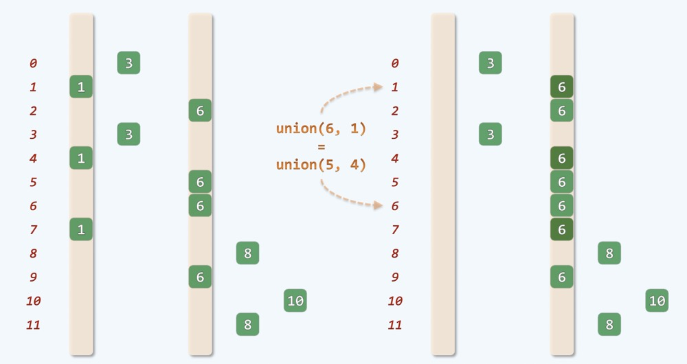
    <br />
    <div style="text-align:center">备注：图片托管于github，请确保网络的可访问性</div>
    <br />
</div>

- 现在我们试图将1和6进行Union, 我们发现1是标识, 代表一类, 在这一类(列, 每一列都可看成一棵树)中, 除了1, 还有4和7, 4和7也标成1, 代表同一类
- 这时候我们做Union可能比较困难, 我们能找到1, 但是找6的时候, 发现6也是一类的标识, 在6这一类中还有2, 5, 9
- 无论是1类还是6类, 类中的成员都很多, 无论将1类归为6类, 还是将6类归为1类, 每次搬家都耗费很多时间
- 但是当我们要查询，比如：2号是哪一类，5号是哪一类等，都可以在常数时间内查询到
- 当所有元素归到最左边时候，看得非常清楚，任何元素属于哪一类，都可以在O(1)的时间找到，常数查询是非常快的，这叫**Quick-Find**
- 唯一的问题是在做Union的时候很麻烦，需要将每个元素都移动到对方类中，这种方式我们称为**Slow-Union**
- Slow-Union的效率较低, 复杂度很高, 时间上会受到惩罚，我们要考虑如何把Union变得更快
- 这里拖家带口的搬法很像Vector或Array，它们的特点是所有东西都及时更新, 无论在任何时候, 举个例子，有任意一个数组
- 如果需要在这个数组的某个位置上加一个元素, 我们会把这个位置前面的元素复制一份, 后面的所有元素向后挪一位，然后把新元素加入该位置
- 这样的动作非常致命，效率特别低下，这就是上面我们拖家带口的搬家是一样的，所以我们考虑使用List来做，List的好处是所有操作都是局部的
- 我们可以考虑将1类和6类这两类比作是2个班级，每个班级都有一个班长(该类的标识)，当我们在一个班级(比如1类)中问，同学你是哪个班的?
- 该同学回答，我在1号(该类标识)所在的班，当我们在另一个班级(比如6类)中问，同学你是哪个班的? 该同学回答，我在6号(该类标识)所在的班
- 所以，在真正合并的时候, 不必真正全部归到一类中去，而是采用链表List的方式，进行Link处理, 如下

<div align="center">
    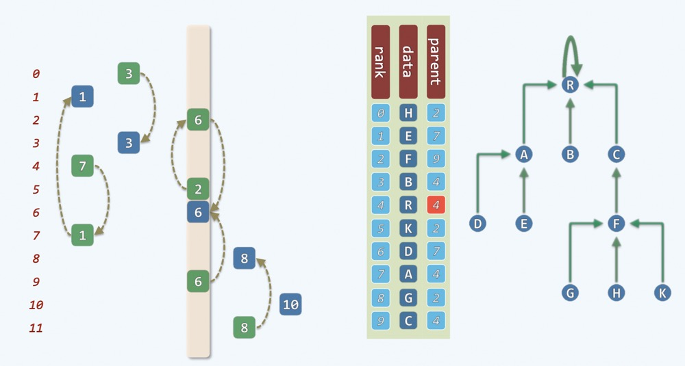
    <br />
    <div style="text-align:center">备注：图片托管于github，请确保网络的可访问性</div>
    <br />
</div>

- 我们把一个班上的同学根据来到这个班时候的前后顺序Link起来, 比如1号这个班，在其中问4号同学, 它不会直接回答他是1号所在的班
- 他会说，我是7号所在的班，然后再问7号，7号回答我是1号所在的班，最后问1号，1号淡定的回答我是1号所在的班
- 1号属于1号这个班，这个话外之音是1号就是班长(该类的标识)，同样的6号班级也可以同样的进行组织
- 我们只需要按照这个Link，顺藤摸瓜往上摸就可以将所有相关的类全部连接起来，这样虽然有些别扭，但是我们可以很清楚的明白这个关系
- 它的好处在于，将来如果要做Union, 将1号和6号所在的列合并，我们可以很轻松的直接把1号指向6号就可以了(或6号指向1号,二选一)，如下图

<div align="center">
    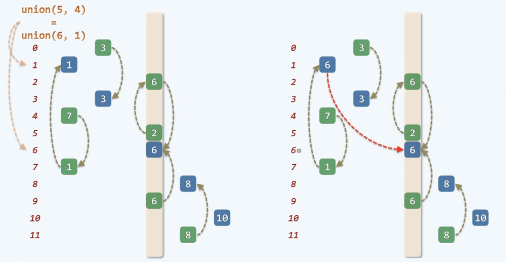
    <br />
    <div style="text-align:center">备注：图片托管于github，请确保网络的可访问性</div>
    <br />
</div>

- 可见，这个Union只需要花费O(1)的时间，这种方式我们称为**Quick-Union**
- 我们可以知道，算法没有绝对万能的，此长彼短，这个Union很快，但是Find效率却不高
- 在这里查找是比较繁琐耗时的，不管在List还是在Huffman Tree中都是一样
- 在Huffman Tree中，任何点的Find所需要的成本，取决于它在树中的深度，我们需要继续改进它
- 所以，最好的组成一个班的姿势是，构造一个深度为2的树，班长作为树根，其他成员作为叶子节点(扁平化组织)，这时候高度达到最小
- 任何一次Find, 叶子到班长只需要O(1)的时间, 班长会自己指向自己, 从而结束查找，按照这种思路启发
- 我们要加强Find, 需要改进Union来做到，如何改进Union？这里有一些技巧
- 比如A,B两个班级(树)，最主要的差异在于高度, 在Union的时候, A归到B中还是B归到A中结果是一样的，但是按照贪心原则
- 我们想着把高度较低的树归到高度较高的树中去, 这样使得整体高度趋向于矮，当然最理想的还是构造深度为2的树
- 在每次Union的时候, 用矮的加到高的里去，整体的每一个班的规模如果是n的话，它的高度在Big-O的意义上来说不超过O(logn)
- 这意味着，无论是Find还是Union都可以在O(logn)的时间内完成，在之前的方式是Find是O(1), Union是O(N)
- 总体衡量，看下改进，Find从O(1)到O(logn), Union从O(N)到O(logn), Find是倒退, Union是改进
- 因为Union的改进的幅度巨大, Find倒退幅度很小, 所以整体改进较大
- 关于Union还有一个技巧，在这里记录一下，就是Path Compression
- 我们为了尽可能贪心的往深度为2的目标去凑，有个诀窍是在Find的时候
- Find操作看上去是静态操作，比如从某一点开始，顺藤摸瓜向上找到班长，其实，可以把Find变成动态的
- 我们设想Find的路径有一个"折叠"的效果, 也就是压缩，如下图

<div align="center">
    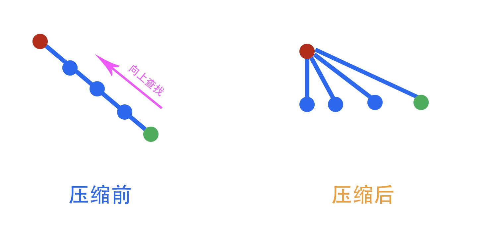
    <br />
    <div style="text-align:center">备注：图片托管于github，请确保网络的可访问性</div>
    <br />
</div>

- 之前我们是这样的，比如在绿色的点的位置逐层查找，现在我们将每层都直接挂载到树根位置，做这样一个结构的转换
- 我们可以看到之前每层的高度已经被压缩了，这个就叫做路径压缩 Path Compression
- 在这里上图是我们给出的主要路径图，当然树中还有其他叶子节点(或分支)，我们为了看得更清晰，省略了而已

<div align="center">
    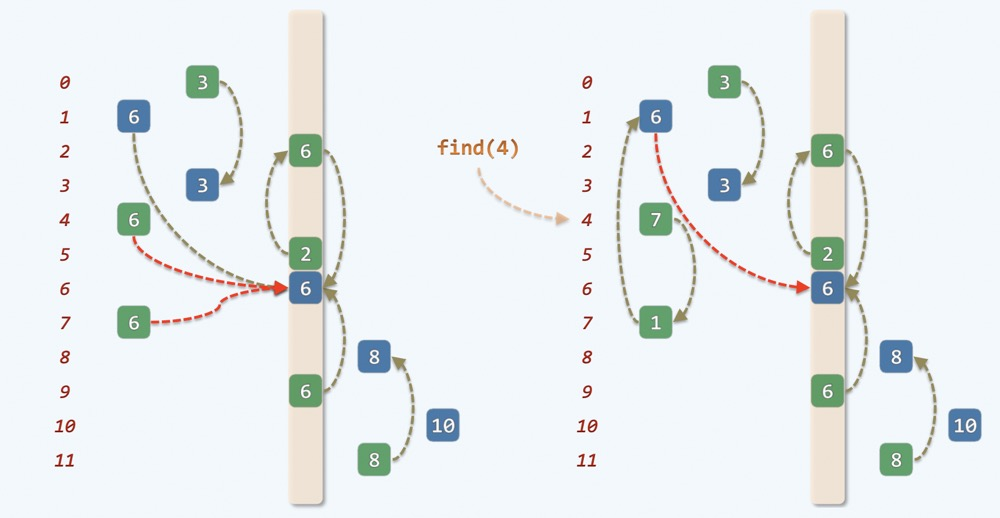
    <br />
    <div style="text-align:center">备注：图片托管于github，请确保网络的可访问性</div>
    <br />
</div>

- 如上图，右边我们要find(4), 它需要找到7,1,6(这个过程是：7再找1, 1再找6, 6告诉你本人就是最终结果), 这条路径最终返回6
- 也就是说find(4)要花3份的时间, find(7)要花2份的时间, find(1)要花1份的时间
- 所以，按照路径压缩的逻辑，我们在走这条路的同时可以把这些点都摘下来，连接到班长(树根)上去, 方法是直接将自己的值变成班长的值
- 如上图左边所示，这样的方式就相当于之前的方式来说就完成了一次路径压缩