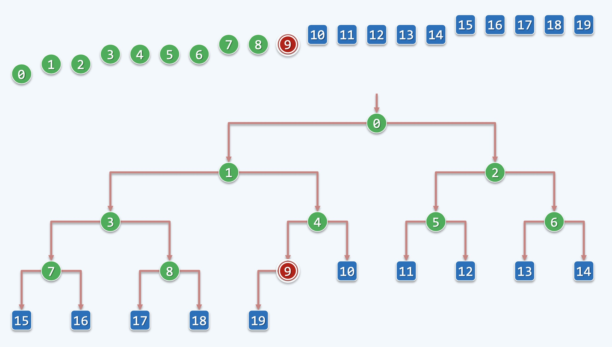
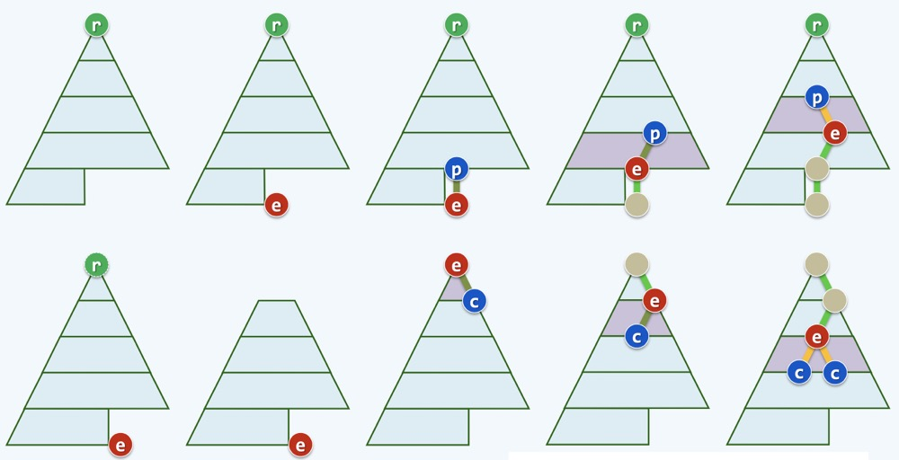
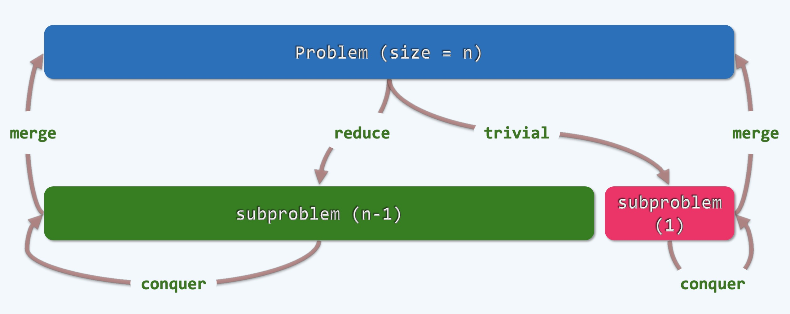
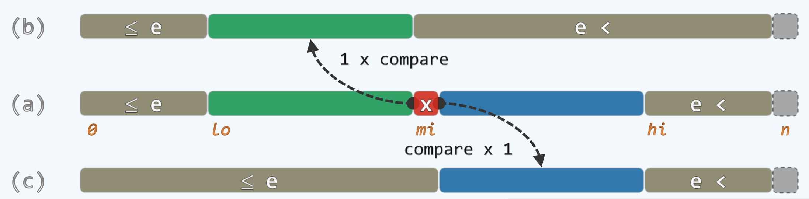
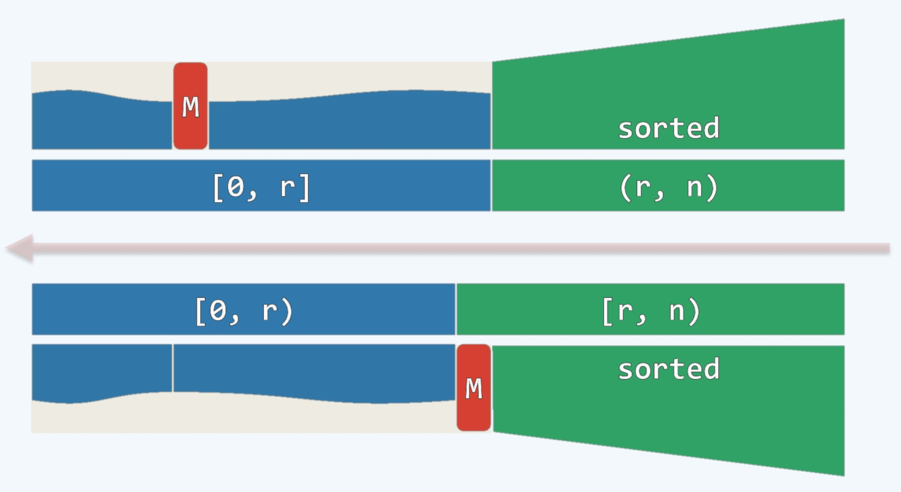
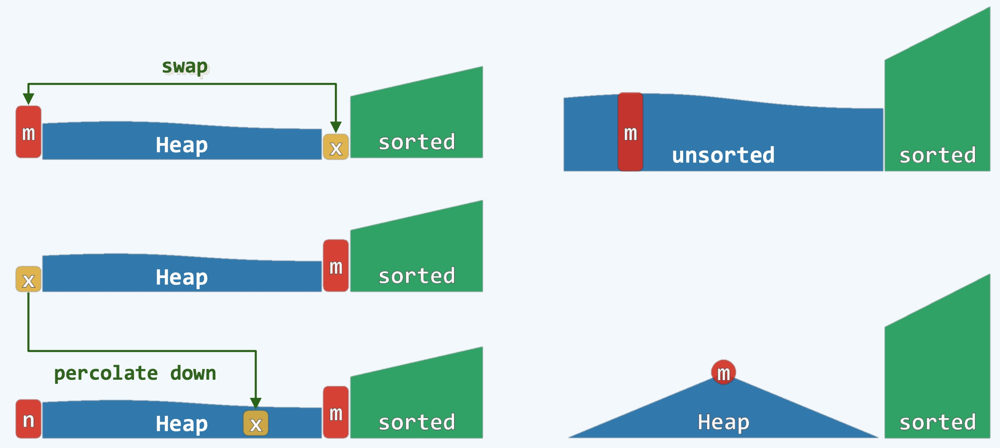
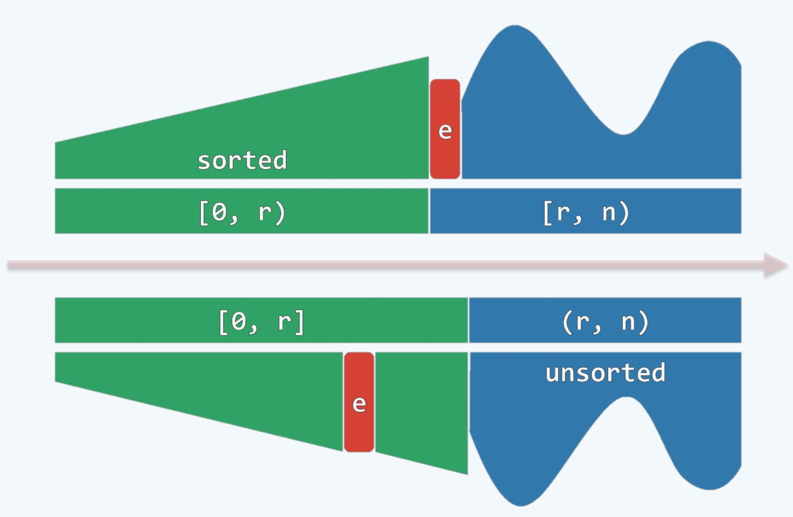
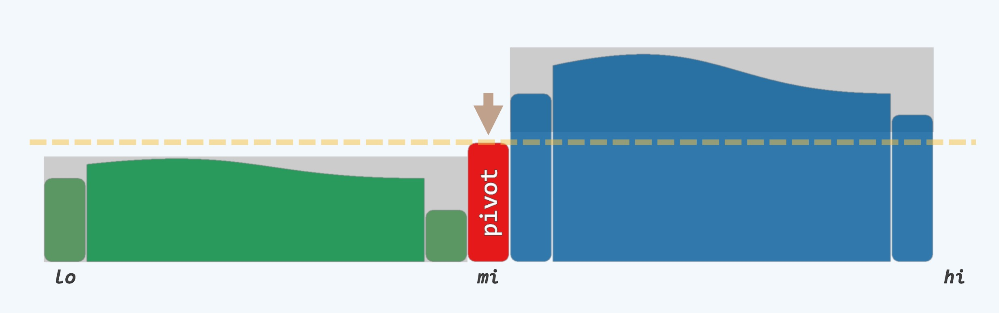
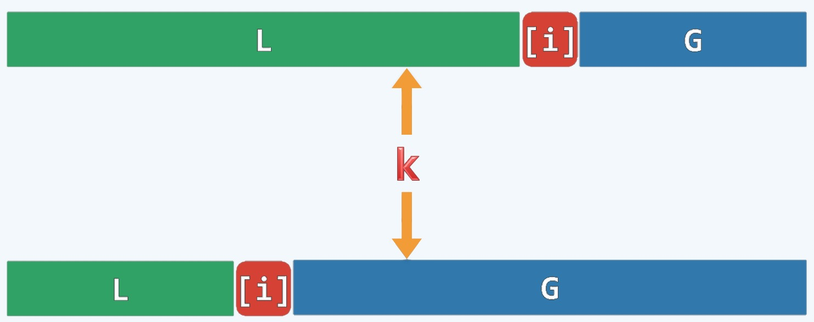
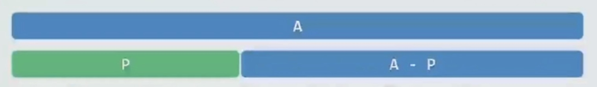

### Heap 堆的补充

<div align="center">
    
    <br />
    <div style="text-align:center">备注：图片托管于github，请确保网络的可访问性</div>
    <br />
</div>

- 从逻辑结构上理解堆是一种树形结构，这种树是一种几乎完美的树，也就是完全二叉树
  * 完全二叉树 complete binary tree
  * 特点是：
    * 在非(倒数第一和倒数第二)层结构上的节点都是孩子双全的
    * 在倒数第一和倒数第二层结构上的节点是没有分支或单分支的
    * 在倒数第二层：叶子节点必须紧密排列在右侧
    * 在倒数第一层：叶子节点必须紧密排列在左侧
    * 宏观上看就像是一棵三角形的树，在右下侧可能会有一定的缺失
    * 这就是完全二叉树，如上图树形结构所示
    * 如果没有单分支的节点(宏观上看右下侧没有缺失)叫做满二叉树 full complete binary tree
    * 满二叉树是完全二叉树的特例
- 完全二叉树可以非常有效的存储，可以排成一列，变成一个数组
    * 这样排好后会非常方便
    * 每一个节点的下标和它的两个孩子之间的关系是: 
    * 假如一个节点是1，那它的左孩子节点是1 x 2 + 1 = 3，右孩子节点是：1 x 2 + 2 = 4
    * 也就是节点下标是n，则左孩子节点下标是：2n+1, 右孩子节点下标是：2n+2
    * 用计算机表示：左孩子：Lc(n) = (n << 1) + 1, 右孩子：Rc(n) = (n+1) << 1 , 其中 << 表示左移
    * 上图下标排列成阶梯状的原因是暗示层与层之间的关系: 0是第一层；1，2是第二层；3，4，5，6是第三层 ...
- 在堆中有两类常规操作：insert(e) 和 getMax()
    * 插入和查找最大，两类操作相互配合就不那么直观了
    * 如果这些元素不是按下标来处理，而是有一个优先级的大小关系，那么把最大优先级的元素找出的效率往往关乎算法整体的效率
    * 如果每个都遍历一次来查询最大值, 其复杂度是O(n), 这几乎没有任何意义，我们期望它的复杂度是O(logn)
    * 大致如下图所示

<div align="center">
    
    <br />
    <div style="text-align:center">备注：图片托管于github，请确保网络的可访问性</div>
    <br />
</div>

- 堆顶元素r, 也就是树根(root), 我们认为r是优先级最高的元素，在物理上就存在那，这样getMax()和delMax()操作就非常的方便
- 当insert(e)的时候，我们要保持最大元素要动态的更新, 下面说下具体的更新做法
    * 简单的来说，更新的办法就是减而治之
    * 要把新元素放到最底部缺口的位置，如果没有缺口，则另起一行放到最下面，如上图一排第2个，就相当于在原来数组的最后新增了一个元素
    * 对比新节点和它的父节点的优先级关系，如上图一排第三个，在堆中，父节点的优先级一定比子节点的优先级高，如果不是，则要修复大小关系
    * 父节点下降一层，新节点上升一层，交换父子关系，按照这种思路逐一向上对比，如果关系顺了，则停下来，如果不顺则继续交换
    * 如上图一排的第四、第五，第这个过程可持续到树根的位置，这种做法叫做 shift up 或 percolate up (上滤操作)
- 反之，如果是删除操作，同样的道理
    * 直接删除树根节点，并将最末尾的节点补充到树根节点的位置，也就是删除r，将e补充到r的位置，这个过程如上图二排的1~3图
    * 这时候形式上恢复成了树形，但会破坏堆的有序性，为了维护有序性，在其孩子上找到一个最大的交而换之，重复这一过程，直到恢复堆的有序性。
    * 如上图二排的3~5，这个过程叫做 shift down 或 percolate down (下滤操作)
- 综上，我们可知道Heap的这种基本结构(其实Heap有很多种结构)
- 它的特点是：
    * 我们假想的用刚才那种对应方法，把存在于一个数组中的那些元素，逻辑上根据他们的rank(索引或下标)指定父子关系，比如：3和7,8; 5和11,12 ...
    * 也就是用一个数组实现逻辑上的一个树形结构
    * 然后在所有父子节点之间限定一下，它们的优先级上，父亲必须必儿子的优先级高
    * 那么我们知道优先级最高的元素只能在树根的位置(没有父节点)
- 我们可以看到，不管是上滤还是下滤操作，只需要logn步
    * 因为有n个节点构成的完全二叉树的高度在渐进上不会超过logn的
    * 每次交换都是常数，总共不到logn步，所以复杂度是O(logn)
- 以上通过堆的示例，我们首先知道了什么是减而治之的策略

### 减而治之的策略

**引例：愚公移山的故事**

- 太行、王屋二山，方七百里，高万仞，本在冀州之南，河阳之北。
- 北山愚公者，年且九十，面山而居。惩山北之塞，出入之迂也，聚室而谋曰：“吾与汝毕力平险，指通豫南，达于汉阴，可乎？”杂然相许。其妻献疑曰：“以君之力，曾不能损魁父之丘，如太行、王屋何？且焉置土石？”杂曰：“投诸渤海之尾，隐土之北。”遂率子孙荷担者三夫，叩石垦壤，箕畚运于渤海之尾。邻人京城氏之孀妻有遗男，始龀，跳往助之。寒暑易节，始一反焉。
- 河曲智叟笑而止之曰：“甚矣，汝之不惠！以残年余力，曾不能毁山之一毛，其如土石何？”北山愚公长息曰：“汝心之固，固不可彻，曾不若孀妻弱子。虽我之死，有子存焉。子又生孙，孙又生子；子又有子，子又有孙；子子孙孙无穷匮也，而山不加增，何苦而不平？”河曲智叟亡以应。
- 操蛇之神闻之，惧其不已也，告之于帝。帝感其诚，命夸娥氏二子负二山，一厝朔东，一厝雍南。自此，冀之南，汉之阴，无陇断焉。

**减而治之 (Decrease and Conquer)**

- 愚公移山的故事就是一个典型的减而治之的案例
- 山有一个定数，即它的problem size：n是一个定数
- 愚公一锹一镐一簸箕，一天一天的去做，总有一天可以把山挖平
- 而针对智叟的问题，愚公的解答方案是子子孙孙无穷匮也
- 而这个问题在现在来说，可以交给计算机去做，计算机是非常强大的工具，反复做一件事是计算机的长处
- 可见愚公是一个算法高手

**图例**

<div align="center">
    
    <br />
    <div style="text-align:center">备注：图片托管于github，请确保网络的可访问性</div>
    <br />
</div>

- 愚公的山就是一个problem, 而这个problem的size是n, 我们可以把它想象成非常大，比如1个亿，但是这也是一个定数
- 我们可以把问题规模分解成1和(n-1)两个, 之后的(n-1)可以再次分解成1和(n-2), ...
- 每个值为1的subproblem就是愚公的一筐土，这个过程就是 conquer
- 这种reduce的方案在算法设计中是一个非常典型的方案，我们称为减而治之

**二分查找 Binary Search**

- 有时候我们针对切分的粒度而言，一次subproblem并非是1，而是非常之大，规模为problem size的一半
- 伪代码：
    ```cpp
    // 基本类型为T的向量S，已经排好序的，预处理了
    // 查找目标为e
    // 查找范围lo ~ hi
    template <typename T> static Rank binSearch(T * S, T const & e, Rank lo, Rank hi) {
        // 不变性：A[0, lo) <= e < A[hi, n)
        while(lo < hi) {
            // 以中点为轴点，经比较后确定深入
            Rank mi = (lo + hi) >> 1;
            // [lo, mi) 或 (mi, hi) 貌似少了mi, 但是这样写即精练又准确: 向左向右都没有覆盖mi
            e < S[mi] ? hi = mi : lo = mi + 1;
        } // 出口时，A[lo=hi]为大于e的最小元素
        // 故lo - 1即不大于e的元素的最大秩
        return --lo;
    }
    ```

<div align="center">
    
    <br />
    <div style="text-align:center">备注：图片托管于github，请确保网络的可访问性</div>
    <br />
</div>

- mi 是 lo ~ hi 的中点位置，已知lo,hi, 找到mi只需要O(1)的时间
- mi与目标元素e进行一次compare比较，如果相等就找到了停止
- 如果不等则根据大小关系寻找合适的位置(lo ~ mi) 或 (mi ~ hi)
- 重复这一过程，直到查找成功或失败
- 从这一过程来看，算法复杂度是O(logn)
- 这个问题我们要区分两种策略
    * decrease and conquer 减而治之：规模减少一半，处理一半，规模不断小
    * devide and conquer 分而治之：把一个分解为两个，每一个都要单独求解
    * 注意这是减而治之和分而治之的区别

**选择排序 Selectionsort**

<div align="center">
    
    <br />
    <div style="text-align:center">备注：图片托管于github，请确保网络的可访问性</div>
    <br />
</div>

- 上图示例就是选择排序的精髓
- 在任何时候，把长度为n的数列，以r为界，分成[0, r], (r, n)两部分，也就是前缀(prefix)和后缀(suffix)两部分
- 后缀在任何时候都是有序的，而无序的前缀中最大值也不会超过后缀的最小值(图中的M暗示前缀中的最大值Max)
- 接下来就是在前缀中找到这个Max最大值, 存入后缀中作为最小值，如上图所示
- 持续这个过程，整个序列将全部有序
- 我们可知，Selectionsort就是在prefix中进行select Max操作，找到之后将这个Max变为suffix的Min
- Selectionsort与Bubblesort本质上一致，不同点在于Selectionsort的前缀是均匀随机的，而Bubblesort处理前缀会消耗更多时间
- Bubblesort可以看做是Selectionsort的一种特例，其时间复杂度都是$O(n^2)$

**堆排序 Heapsort**

<div align="center">
    
    <br />
    <div style="text-align:center">备注：图片托管于github，请确保网络的可访问性</div>
    <br />
</div>

- 基于上面的Selectionsort，我们可知，如果继续进行优化，在前缀中的查找最大值这一过程可以使用一个特定的数据结构Heap堆，也就是Priority Queue
- 从最上面**Heap 堆的补充**内容可知，在前缀中查找最大这一过程可以将n优化为logn
- 整体的排序时间复杂度为 O(nlogn)，这是排序算法中的最优解！！！
- 其实Heapsort和Selectionsort的前缀都是数组，前者是优化后的树形结构(以数组形式存储)方便delMax()操作，后者则较为平坦(是随机序列，无任何优化处理)
- 也就是说两个前缀的数据结构一个是Heap堆，一个是普通数组
- 建堆的算法有很多，可以通过逐一插入来做，也有更高效的做法，此处不再赘述
- 逻辑上的堆顶(树根)就是物理上的第一个元素m，最后一个元素这里是x表示, 将m和x交换，将x倒栽到之前m的位置，然后做一个下滤操作
- 注意之前最后的元素x未必全局最小，所以下滤到上图示例的位置，而且下一个Max(用n表示)也就位了，恢复成一个有序的堆结构，这里仅作说明
- 由此可见，堆排序也属于Selectionsort的家族，也可以看做是一种特例

**插入排序 Insertionsort**

<div align="center">
    
    <br />
    <div style="text-align:center">备注：图片托管于github，请确保网络的可访问性</div>
    <br />
</div>

- 同样的，插入排序将整个序列分为前后两部分，不同的是和选择排序有些对称：前缀是有序的，后缀是无序的
- 这种组合会更好的理解和实现，在整理后缀无序部分的时候只需要将当前元素与前缀有序部分作对比和插入即可
- 选择排序和插入排序看上去很像，但是插入排序有很多好处：自然，在线
    * 自然表示符合人的自然思维
    * 在线的意思是数据无须全部就位，来一个数据处理一个数据，这恰恰是选择排序做不到的
- 插入排序的复杂度虽然是$O(n^2)$, 但很大概率上，也就是大多数情况下可以表现的非常好
- 而对于选择排序，如果不使用堆的数据结构(也就是堆排序)，复杂度一定是$O(n^2)$
- 这里默认堆排序是选择排序的一个特例，上面讲过

**选取问题 QuickSelect ~ Pivot**

- 一般我们从一个序列中找到一个第k大的元素，一般的做法是先排个序，再按下标来取
- 但是这种做法并不好，以最快的排序方式也要O(nlogn)的时间，而目标要求是要找到一个元素，而非去排序
- 就相当于要你拿一个苹果，你却抱来了一筐，能满足需求，但是成本是巨大的，所以这种做法并不合理
- 但是在一个混沌的序列中，要找到第k大的元素，你必须知道所有的元素, 这就说明其复杂度至少也要O(n)
- 这里用减而治之的策略实现，其方法是**猜测**，就像是赌博一样

<div align="center">
    
    <br />
    <div style="text-align:center">备注：图片托管于github，请确保网络的可访问性</div>
    <br />
</div>

- 如上图, 从整个序列中随机抓一个，赌这个就是第k大的元素，之后再来进行验证
- 验证方法是将序列中比这个大的元素全放到右侧，比这个小的全放在左侧，这就形成了左小右大的序列
- 将序列中所有元素全部分拣完成之后，这个之前随机抓的这个元素是否是第k大的元素就会水落石出
- 如果猜对了，那很好，但是概率较低，这个策略的关键是处理猜错的情况
- 猜错有两种情况，猜大了或者猜小了，如下图

<div align="center">
    
    <br />
    <div style="text-align:center">备注：图片托管于github，请确保网络的可访问性</div>
    <br />
</div>

- k的位置如上图橙线所示，如果[i]这个猜测的位置大了，如上排，那么可以去除蓝色的G区域
- 反之，如果猜小了如下排，可以去除绿色的L区域，这就是减而治之的"减"
- 一直按照这种策略，继续猜测，直到变成了一个元素，问题规模逐渐缩小
- 这个问题叫做quick select，这种技巧在后续的quicksort中会有应用，就是找这个pivot
- 伪代码如下，仅供参考
    ```cpp
    template <typename T> void quickSelect(Vector<T> & A, Rank k) {
        for(Rank lo = 0, hi = A.size() - 1; lo < hi;) {
            Rank i = lo, j = hi; 
            T piovt = A[lo];
            while(i < j) {
                // O(hi - lo + 1) = O(n);
                while(i < j && pivot <= A[j]) j--; A[i] = A[j];
                while(i < j && A[j] <= pivot) i++; A[j] = A[i];
            } // assert: i=j
        }
        A[i] = pivot;
        if(k <= i) hi = i - 1;
        if(i <= k) lo = i + 1;
    } // A[k] is now a pivot
    ```

**Majority 查找众数**

- 在集合中若有一半以上元素同为m, 则称之为**众数**，或者叫做主流数
- 在统计学中专门有一个叫Mod,来表示众数
- 举个例子来看一下
    * 在整数集合{3,5,2,3,3}中，众数为3
    * 在整数集合{3,5,2,3,3,0}中，却没有众数
    * 一定要强调的是**一半以上**元素，不包含一半
- 如何求一个序列中的众数呢
    * 如果数值范围不是很大的话，可以选择使用哈希表，但是如果无法确定数值范围，那么也不适合用哈希表
    * 一般我们还是推荐使用减而治之来求解

<div align="center">
    
    <br />
    <div style="text-align:center">备注：图片托管于github，请确保网络的可访问性</div>
    <br />
</div>

- 如上图所示，我们在A的范围来找众数, 我们希望，在慢慢搜索的过程中
- 在某些情况下，有一部分集合{P}(prefix暗示前缀), 可以被切下来
- 之后在与其互补的后缀集合{A-P}中找到的众数与之前A中的众数是一样的
- 验证也非常简单，只需要花O(n)的时间遍历一次集合{A}, 验证集合{A-P}中找到的众数是否在A中有一半以上即可
    * 如果通过，那么就找到了众数
    * 如果不通过，那么集合A中就没有众数
- 现在我们需要知道如何将集合P来减掉
    * 我们认定集合A中的第一个元素为众数的候选者, 可能是众数，也可能不是，我们把它姑且当做众数记为m
    * 用变量c作为m的计数器，其初始值为1, 每遇到了一次m, c就自增一次，没有遇到就自减一次
    * 那么什么时候，我们做一次减法呢? 其实m的图像可以画出来，理论上是一个以次数为x轴，以当前c的值为y轴的折线图
    * 当这个折线图触底的时候，这时候就可以把它给减下来，剩下的集合中的众数不会影响整体的众数取值
    * 这个原理是什么？我们来解释一下
        * 第一个元素m无非有两种可能, 是众数或者不是众数
        * 1 ) 如果是众数，当c值为0的时候，我们可知，m的个数(number of m, 用nm表示)为当前P总数的一半，也即是：$nm = \frac{|P|}{2}$
        * 在此时做减除，也就是从整体集合A中减去集合P(集合P是众数(这里用PM表示)占一半，非众数(这里用PO表示)占一半)
        * 即：$P = PM + PO, A - P = A - PM - PO$
        * 我们用数学的方法来说明：$\frac{1}{2} < \frac{M}{N} < \frac{M-nm}{N-2nm}$
        * 在这里M表示A的众数的个数，N表示总数
        * 换个角度来说就是在做减法之后，经过通分，分母相同时，分子变得更大(众数会更多)，所以不会影响之前众数的取值
        * 2 ) 如果不是众数，当c值为0的时候, 同样使用数学来说明，$\frac{1}{2} < \frac{M}{N} < \frac{M}{N-2nm}$
        * 这个时候可知，分子不变，分母变小了，众数比重变得更多了，当然更不会影响之前众数的取值
        * 所以，这种算法是可行的
- 关键算法如下
    ```cpp
    template <typename T> T majCandidate(Vector<T> A) {
        T maj;
        for (int c=0, i=0; i < A.size(); i++)
            if (0 == c) {
                maj = A[j];
                c = 1;
            } else
                maj == A[j] ? c++ : c--;
        return maj;
    }
    ```
- 可见此算法时间复杂度是O(n), 是线性的