### 最短路径 Shortest Path

<div align="center">
    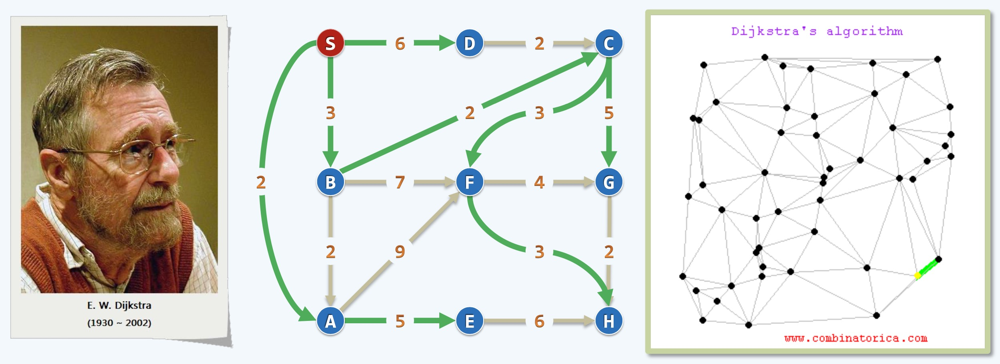
    <br />
    <div style="text-align:center">备注：图片托管于github，请确保网络的可访问性</div>
    <br />
</div>

- 最短路径问题，如上图(右)，求从地图上某一点出发, 到另一点的最短路径
- 解决这类问题，首先要把真实的地图变成计算机中的Graph(图结构)，如上图(中)
- 在这个Graph中的每一个节点都是有意义的一个地点，这些点之间都可能有一些边，表示两者的距离或者称为通信的代价
- 这些代价可能是距离，也可能是时间，也可能是油费，路费，不一而足
- 这个算法出自图领奖得主鼎鼎大名的计算机科学家Dijkstra，中文译为：迪杰斯特拉, 如上图(左)

### 原理 Principle

<div align="center">
    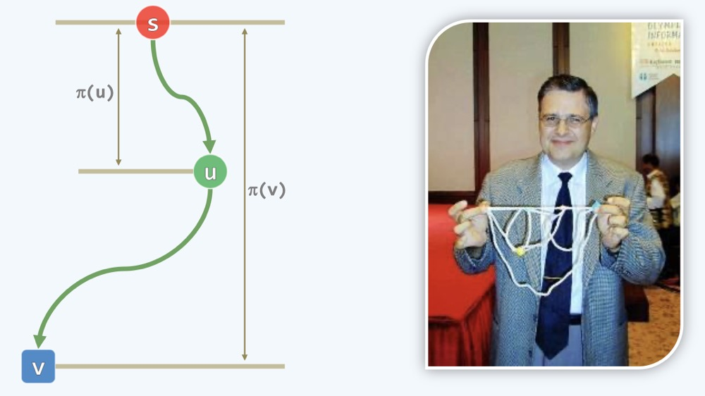
    <br />
    <div style="text-align:center">备注：图片托管于github，请确保网络的可访问性</div>
    <br />
</div>

- 上图右边照片是一位土耳其的教授，照片应该是1999年拍摄的，看上去好像是马克·鲁法洛(Mark Alan Ruffalo, 漫威绿巨人&布鲁斯·班纳博士的扮演者)

<div align="center">
    
    <br />
    <div style="text-align:center">备注：图片托管于github，请确保网络的可访问性</div>
    <br />
</div>

- 在科学界和电影界总是惊人的相似，邓俊辉老师(上左)和演员汤姆·加瓦那(Tom Cavanagh, 闪电侠哈里森·威尔斯博士的扮演者)(上右)，在某些时候也是惊人的相似
- 这位土耳其教授在讲解Dijkstra算法的时候，手中拿着像是编制的网兜一样的线条，就是用这个工具来计算图中两点之间的最短距离
- 如果将计算机中的图，变成教授手中拿着的这个工具，有多少地点就准备几个珠子，然后准备一些丝线，按照计算机中的图结构,如上上上图(中)连接起来
- 两点之间如果权重(通信代价)是几，就用几个单位的线连接起来，这样就把每条边转换为对应长度的丝线
- 有了这样的工具之后，只要用我们的双手一边拉着起点(source)，一边拉着终点(destination)，像是网兜一样拎起来
- 接下来，两只手向相反方向移动，这样可以迅速地(基本上就一次操作，在O(1)的时间)找到一条拉直的路，这条路就是最短路径，这是最自然的思维
- 在一张图(Graph)上，立足于某一点A，计算其他点(B,C,D...)到这一点A的最短路径，我们可以借助重力，也就是只用一只手完成一个点的最短路径计算
- 只需要将这个工具放置于桌面上，用一只手抓住A点, 匀速向上提起，在第0.00001秒(这里指最短的初始时间), 点A就会离开桌面
- 在若干时间之后，下一个点就会离开桌面，这个点就是距离A点最近的一个点，这是人的自然直觉，但也是非常严格的
- 同样的道理，若干时间之后，第三，第四，第五...等分别离开桌面，这个道法自然的过程已经完美的把最短路径问题解决了，并且得到了所有点距离点A的距离
- Dijkstra算法就是用计算机来模拟这个过程，用计算机来模拟这个自然的东西虽然比不过自然，但也能解决问题
    * 如上上图(左), s代表起起点, 意为source, 图上绳子弯曲并不代表没有绷直(这里的弯曲代表中间可能经过多个点，也就是一系列点和线的组合)
    * 在这一系列点线组合中, 可见s早已离开桌面, 从刚要离开桌面的v, 到u, 最后到达s, 这些线段其实都是绷直的
    * 在这条绷直的线上，针对任何一点，如u，到s也应该有一条最短路径, 这恰好是以u为截止的前缀, 即s-u这一段
    * 也就是说在这条线上任何一点的最短路径仍在这条线上，我们假设这些点计算最短路径时，没有两个相等的路径
    * 这样就不会构成环路，也就是构成了连通的无环图，这样的结构就是一个树形结构(从s可以到达任何点, 并且没有环路)
    * 下面我们来模拟一下这个过程
        * 这个网兜模型平摊在桌面上，在桌子上立上一根标尺(可代表距离或时间)
        * 我们可以拉着s点提升网兜，也可以拉住S点让桌子下降，都是等效的
        * 在这个匀速运动的过程中，各个点按ABCD...的次序逐个离开桌面
        * 这里各个点的垂直距离就是该点的最短路径，下图使用直角拐弯的边用于视觉上区分垂直距离(水平的边是没有代价的)，以示区别
        * 在一个将要离开桌子的点上，其最短路径线条上必然连着一个已经离开桌面的点
        * 这样一步一步走的过程，也可以看成一个减而治之的过程
        * 在下图每一个典型的时刻都可分为两大类，绿色和蓝色(红色的s广义上也可以划分到绿色范围中去)
        * 就像是C点将要离开桌面时，它可以被B拉着，也可被D拉着离开，但是在C-S的最短路径中，含有B-C这条线段的明显更短，B是绿色, 而D是蓝色
        * 也就是说，在这个过程中下一个被拉起来的点一定是蓝色的点, 而拉着它的另一个点也一定是绿色的点
        * 所以这种边如果考虑的话，一定是绿色和蓝色之间的边，这个和之前做最小支撑树的时候的"割"的概念很像
        * 每次计算，我们只要考虑这种cross的边(跨绿色和蓝色的边)即可，也就是红色的线条所示
        * 而计算最短路径，我们说最短是该点(蓝色的点)相对于起点S而言的(直接牵引它的有可能是起点S, 也有可能是前一个绷直的绿点)
        * 我们只要把每条红色的边作一次候选，红色的边就是将来潜在被绷直的边
        * 最短路径为：下一个被绷直的红边(最短的红边) + 上一个绿点到起点S的距离(没有绿点则此项省略)
        * 用数学符号表示：$dist(v)= min \left\{ \begin{aligned} dist(v) \\ dist(u) + ||\bar{uv}|| \end{aligned} \right.$，不断对比取最小，持续做下去
        * 我们不考虑负权重的存在，如果存在负权重，则Dijkstra算法会失效
        * 负权重有一定的应用场景，比如在计算路费的时候，客户扫码获得了一些补贴，补贴可反噬代价, 造成负权重的存在
        * 如连接C和D的线条，如果为负数，加成后则生成了更短的路径距离，也就是从C到D, 形成了S-D比S-C还要短
        * 无形中算法复杂度就没法控制了，还有一种更致命的情况，形成了总权重是负权重的一条环路
        * 举个例子，也就是从C-D是负的，从D-C也是负的，而且在一定时间内可反复完成，这种情况要用动态规划来处理
        * 运动过程如下图所示：

<div align="center">
    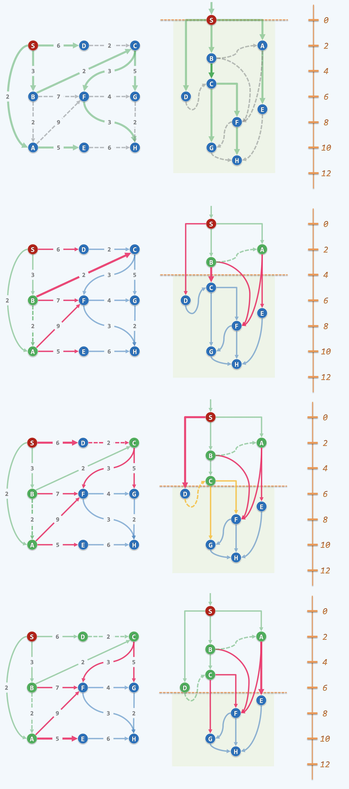
    <br />
    <div style="text-align:center">备注：图片托管于github，请确保网络的可访问性</div>
    <br />
</div>

- 现在的计算机往前面追述是冯诺依曼模型，再往前追溯是图灵机的模型，一脉相承，这些模型的计算在很多方面都会有极限
- 如果有可能，你可以造一个新的工具，当然可能会超越现在的认知，也可能就是这么一个网兜架构，在O(1)的时间就可解决最短路径的问题
- 可以对比下，普通计算机基于图灵机模型，而量子计算机基于量子力学，底层不同，效率更是不同，同样的道理，在此处开开脑洞...

### 算法实现 Algorithm

```cpp
// Dijkstra by PFS

template <typename Tv, typename Te> // 点类型、边类型
template <typename PU> // 优先级更新器 (函数对象)

void Graph<Tv, Te>::pfs(int s, PU prioUpdater) {
    // 优先级更新策略，因算法而异
    priority(s) = 0; status(s) = VISITED; parent(s) = -1; // 起点s加至PFS树中
    
    // 将下一定点和边加至PFS树中
    while(1) {
        // 依次引入n-1个顶点(和n-1条边)
        for(int w = firstNbr(s), -1 < w; w = nextNbr(s,w)) {
            // 对s个邻居w更新顶点w的优先级及其父顶点
            prioUpdater(this, s, w);
        }

        for(int shortest = INT_MAX, w = 0; w < n; w++) {
            if(UNDISCOVERED == status(w)) {
                // 从尚未加入遍历树的顶点中
                if(shortest > priority(w)) {
                    // 选出下一个优先级最高的顶点s
                    shortest = priority(w); 
                    s = w;
                }
            }
        }

        if(VISITED == status(s)) {
            break; // 直至所有顶点均已加入
        }
        status(s) = VISITED;
        type(parent(s), s) = TREE; // 将s加入遍历树
    }
}

g->pfs(0, DijkstraPU<char, int>() ); // 从顶点0出发，启动Dijkstra算法
template <typename Tv, typename Te> // 顶点类型、边类型

struct DijkstraPU {
    // Dijkstra算法的定点优先级更新器
    virtual void operator() (Graph<Tv, Te>* g, int uk, int v) {
        // 对uk的每个尚未被发下的邻居v, 按Dijkstra策略做松弛
        if(UNDISCOVERED != g->status(v)) {
            return;
        }
        // 优先级数字越小越高，因为我们求的是最短路径，这里用大于号
        if(g-> priority(v) > g->priority(uk) + g->weight(uk, v)) {
            g->priority(v) = g-> priority(uk) + g->weight(uk, v);
            g->parent(v) = uk;
        }
    }
}
```

- 核心的一步就是中间的循环，不断循环，逐个把除了起点之外的n-1个点, 及覆盖的n-1条边逐一引入
- 每一次遍历所有邻居，然后把邻居的权重更新，之后做个过滤找到权重的最小者作为新的点加进去
- 从上面代码可见，要持续更新优先级，这个算法应该用堆来实现
    * 以桌面为界，把还没有被提升上去的所有点组织成一个堆结构，堆的作用是始终维护了一个Max
    * 当堆顶元素被提升起来的时候，很快的以O(logn)的时间把剩下的点又恢复成一个堆
    * 除此之外，还要稍微做一个动作，就是找到刚提升点的邻居，为他们提供一种新的可能，这种可能会优化原来的优先级，变得更高
    * 这个时候，只需要对邻居做一个上滤操作，把他们调整到相应的位置，它们可能上升一点，也可能变成新的堆顶
    * 只要有这个堆结构，这个工作就很容易做，只需要给这个堆加一个新接口：`increase(n, p)` 
        * n是邻居点，p是新的优先级priority
        * 如果它的值变化了, 像刚才那样，在内部做的无非就是从它当前的位置，跟它父亲不断的比

**算法演示**

<div align="center">
    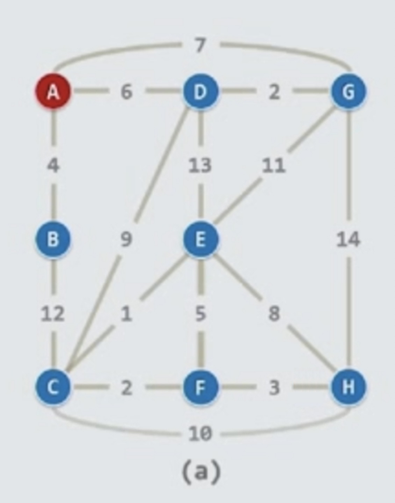
    <br />
    <div style="text-align:center">备注：图片托管于github，请确保网络的可访问性</div>
    <br />
</div>

- 这是一个带权图, 红色表示起点, 蓝色表示桌面上的点, 中间的连线在一开始都是松弛的, 有各自的长度
- 在第0秒的时候，只有A点跃跃欲试，呼之欲出，马上将要离开，但还没有离开桌面

<div align="center">
    
    <br />
    <div style="text-align:center">备注：图片托管于github，请确保网络的可访问性</div>
    <br />
</div>

- 在第0秒后及其短暂的一瞬间离开桌面, 我们把它的时间记为0, 这时整个图已经有了一个cut, 整个cut是1对n-1，一个点被提起来，其他点仍在桌面
- 我们要把目光放在cross边上，即红色的边(连接于提升起来的点和未被提升起来的点之间的边)，当一个点被提升上去后会招呼它的同伴(剩下的所有点)
- 剩下的同伴在数学上都各自有一个到起点的距离, 但是有些我们可能并不知道，这时候我们把这些距离记为无穷大，用$符号来表示，如图
- 最开始的时候，除了红色的起点之外，我们都记为$, 在红色起点被提升完之后，就会发现它的cross边，这些cross边的终点即蓝色的点就各自拥有了一个新的选择的权重了
- 它们不再是无穷，而是一个有穷的数字，准确来说，第一步，它们是平凡的，没有别的点可以连接就是到起点的距离，而且起点自己到自己是0
- 所以这条边是多少，它的权重就会优化成多少，比如：4，6，7 如上图所示，剩下来蓝色的点组织成堆，我们在堆中取最大权重的点(数字越小，优先级越高)
- 所以，在接下来的时间权重为4的边的蓝色点就会被绷直，它就会被提升，离开桌面, 如下图所示

<div align="center">
    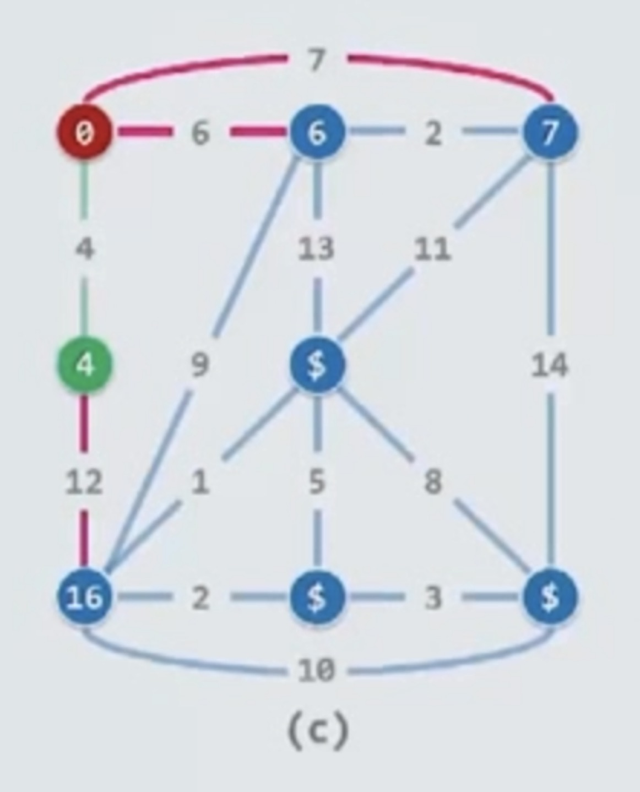
    <br />
    <div style="text-align:center">备注：图片托管于github，请确保网络的可访问性</div>
    <br />
</div>

- 当这个点离开了桌面，它的所有邻居也会因此得到好处，它会发现自己非无穷的有意义的通道
- 这条边权重为12, 基于之前的4，我们将其标记为16，这个16就是这个点到红色起点的距离
- 这样的话就完成了新的update


- 接下来继续减而治之，接下来又是selection, 要在所有的还未离开桌面的蓝色点中(堆中)询问一下，你们谁的权重最大
- 当然那些无穷的不会被考虑，至少是有线连接的，于是就发现了6这个点(计算机遍历发现是6)，如果是堆结构，则需要O(logn)的时间即可找到

<div align="center">
    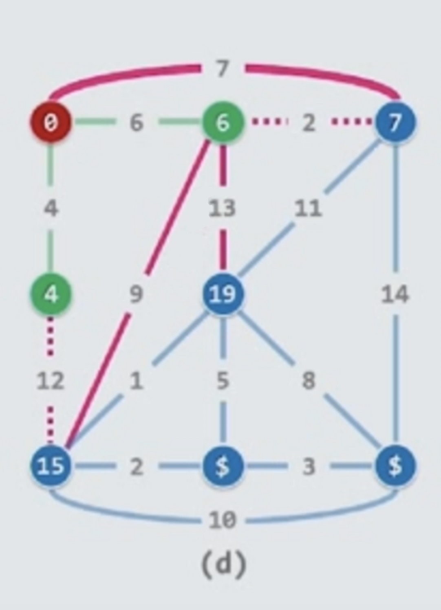
    <br />
    <div style="text-align:center">备注：图片托管于github，请确保网络的可访问性</div>
    <br />
</div>

- 此时由于6这个点被提升了，所以它的邻居们也会沾光(有的是有穷的，有的是无穷的)，一些无穷的会转变成有穷的数字
- 由于绿色的6点的原因，将原来蓝色的16点更新成15(6+9=15)，这个15点在人性上表现的有些见利忘义，我们称之为三姓家奴
- 也就是说谁能使自己离红色起点最近，就投靠谁，同样的道理，比如蓝色7这个点在7和8(6+2=8)两者之间果断选择7的权重

<div align="center">
    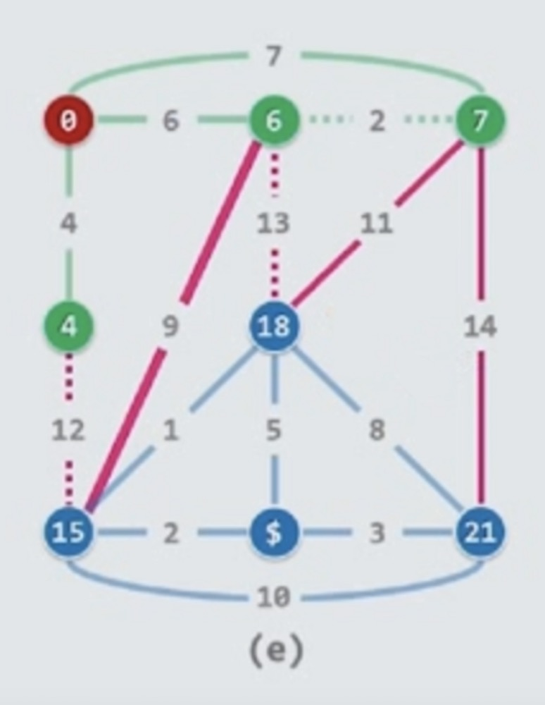
    <br />
    <div style="text-align:center">备注：图片托管于github，请确保网络的可访问性</div>
    <br />
</div>

- 可见权重为7的点又会变成呼之欲出，将要离开桌面的点
- 当蓝色的7被拉起来之后，又会做同样的事情，在剩余的邻居中互换优先级最大的点(权重最大，路径最小)
- 同时它的朋友又可能会见利忘义的改变自身的优先级，可见19变成18，同时把它的父亲从6更新为7
- 无穷大邻居的优先级也同时变成了21

<div align="center">
    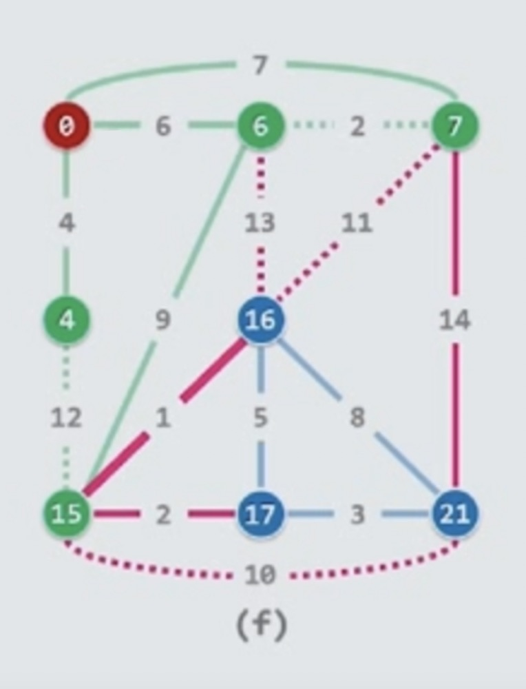
    <br />
    <div style="text-align:center">备注：图片托管于github，请确保网络的可访问性</div>
    <br />
</div>

- 紧接着15呼之欲出，被提升离开桌面，也会因此引出两条新的有效的cross边，如上图红色边
- 同时更新它的邻居节点，18变成16，它的父节点从7变成15，而且最后一个无穷大邻居被更新成了17

<div align="center">
    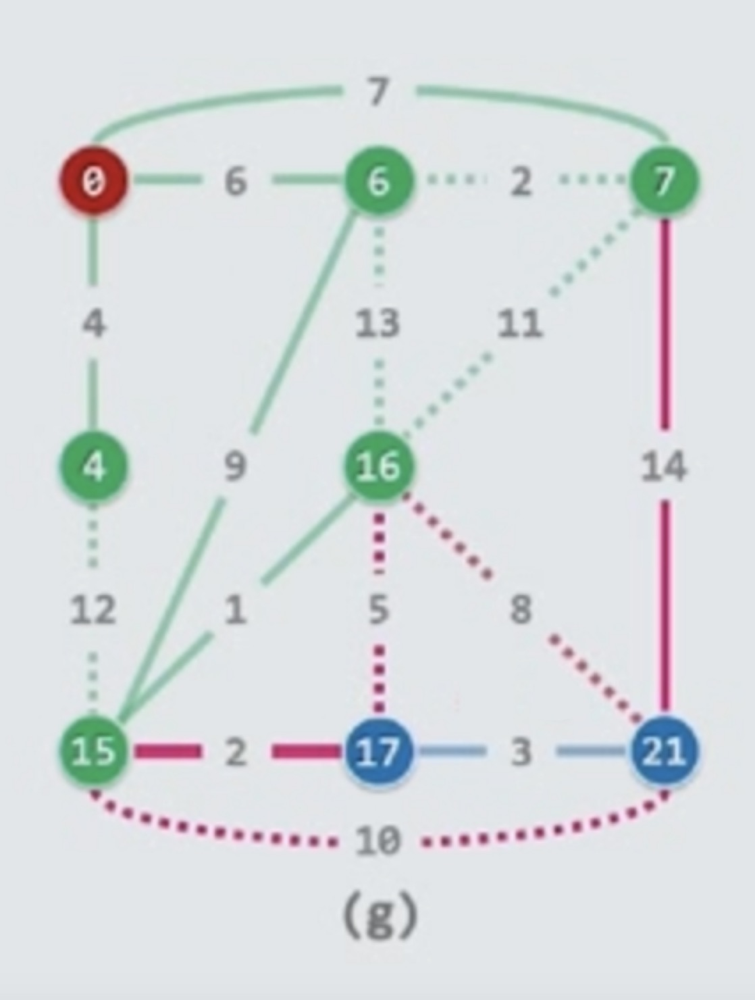
    <br />
    <div style="text-align:center">备注：图片托管于github，请确保网络的可访问性</div>
    <br />
</div>

- 同样，16将会被选中离开桌面，重复之前的逻辑，找到它的cross边，经过对比，这些边对优化没有意义，用红色的虚线表示，如上图

<div align="center">
    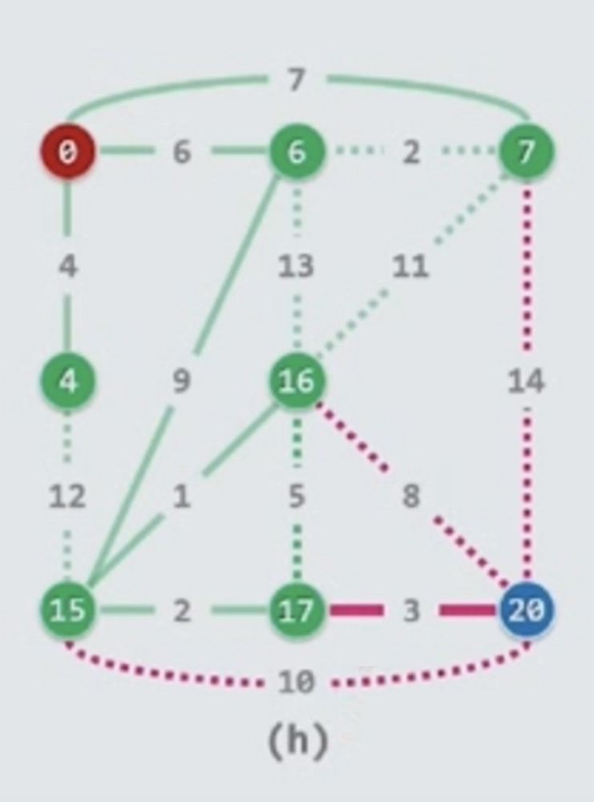
    <br />
    <div style="text-align:center">备注：图片托管于github，请确保网络的可访问性</div>
    <br />
</div>

- 之后是17，如上图，邻居从21变成了20

<div align="center">
    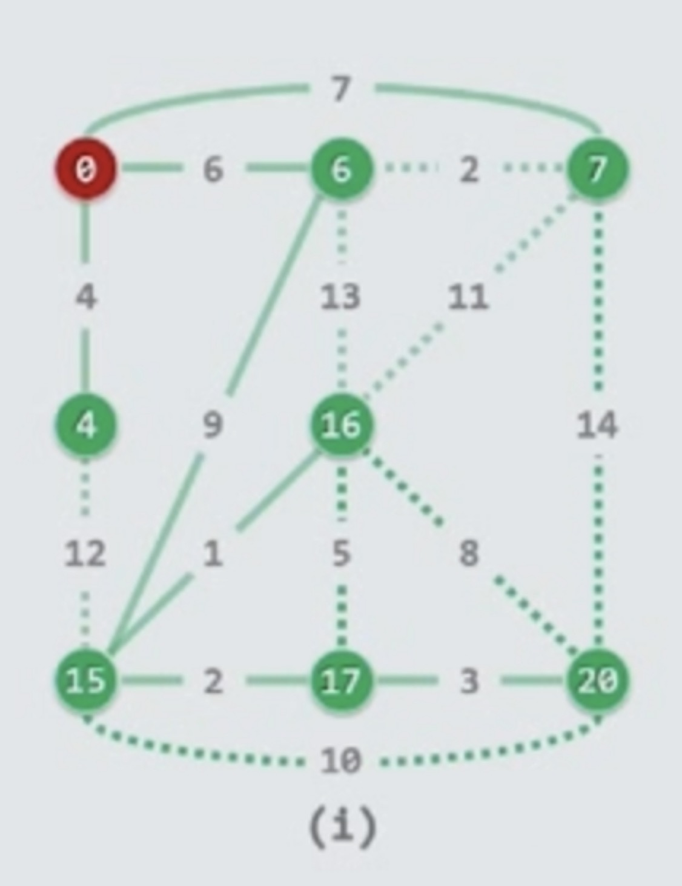
    <br />
    <div style="text-align:center">备注：图片托管于github，请确保网络的可访问性</div>
    <br />
</div>

- 最终是20，如上图所示
- 这个过程完成了一个筛选，原来的边有些用了用实线表示，有的没用，用虚线表示
- 总共用了n-1条边，每一条边都是伴随一个点转绿，每个边拉直都会带动一个点，反之亦然
- 所以，由n个点和n-1条边构成一棵没有环路的树，这棵树就称为最短路径树SPT(shortest path tree)
- 这棵树蕴含了所有最短路径的信息

### Dijkstra: d-Heap

<div align="center">
    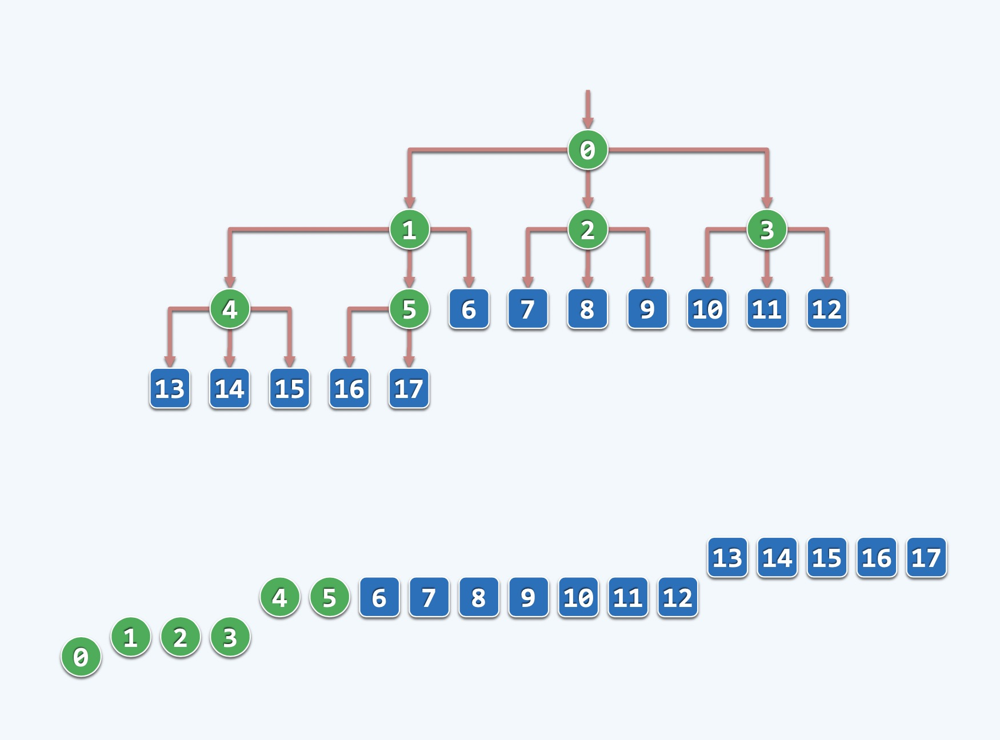
    <br />
    <div style="text-align:center">备注：图片托管于github，请确保网络的可访问性</div>
    <br />
</div>

$$
n \cdot d \cdot log_d n + e \cdot log_d n \\
= (n \cdot d + e) \cdot log_d n \\
= O(e \cdot log_{(e/n+2)} n) (when \  d \approx e/n + 2) \\
= O(max(nlogn, e))
$$