### Divide and Conquer 分而治之概述

- 分而治之，就像是团队合作，将一项工作分解成不同的成员去处理

<div align="center">
    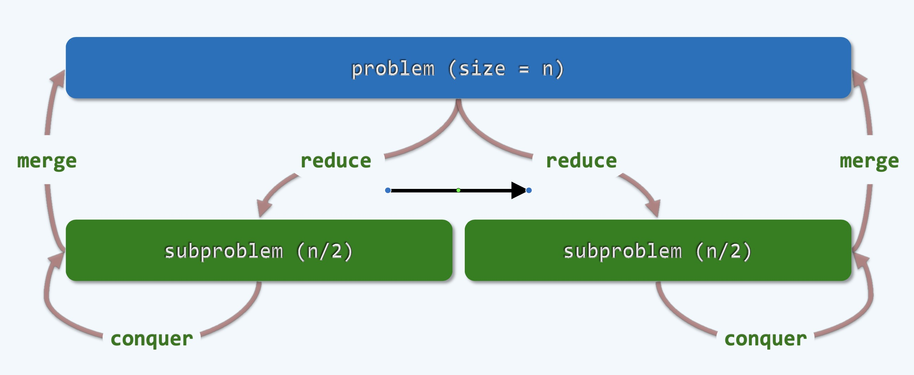
    <br />
    <div style="text-align:center">备注：图片托管于github，请确保网络的可访问性</div>
    <br />
</div>

- 一般情况，我们面临的规模比较大，用n来表示，我们会把它分为若干个任务来同步进行处理
- 一般而言，两个其实就可以了，相较于1个来说有本质的提升
- 分而治之作为解决问题策略的一种，有特殊的条件
    * 分得的两个子问题subproblem的规模要相当，差不太多
    * 两个子问题的规模加在一起不能超过之前的规模 (因为是递归分下去的，一次膨胀一点，很快这个问题本身就会爆炸)
    * 两个子问题彼此不要相关 (有时候往往做不到，我们所研究的大部分都是能做到的，如果两部分耦合性很强，就需要借助动态规划来实现)
- 我们将一个问题分解为两个问题来计算，计算完成之后，就会得到子任务的解，这些解不是最终问题的解，还需要merge起来，最后才能得到原始问题的答案
- 我们大部分实现减而治之的方式就是递归，但是递归都会存在一些问题
    * 系统为了实现递归要维护很多栈的资源，当子任务不断往下递归下去的时候占用资源就会非常多，以至于"爆栈"
    * 使用递归的解决方案不能扩展的很大，总是局限在很小的范围来解决
    * 在这里几乎我们没有其他好的实现办法，只能借助递归
- 在递归算法分析的时候，往往很难直接画出图来，就能知道哪个函数调用的谁，以至很方便的得到复杂度的估计
- 解决办法是使用主定理

### Master Theorem 主定理

- 这时候评估递归算法的复杂度，我们需要以抽象对抽象，用方程或递推式来解决，如下

<div align="center">
    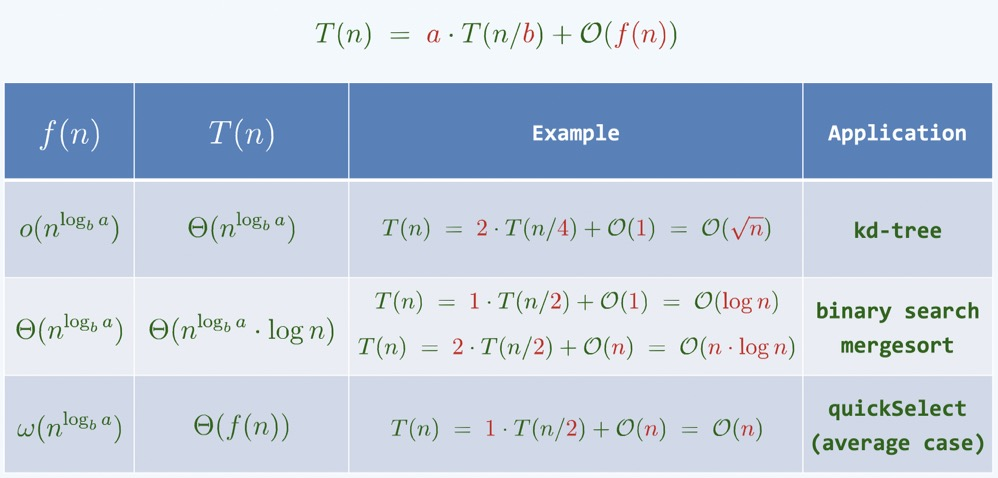
    <br />
    <div style="text-align:center">备注：图片托管于github，请确保网络的可访问性</div>
    <br />
</div>

- 我们经常写出如上的递推式，如：$T(n) = a \cdot T(n/b) + O(f(n))$ 
    * 这个递推式是典型的分而治之的算法性能的描述
    * 分而治之，将规模为n的问题，分为了a个子问题，每个子问题的规模是 $n/b$
    * O(f(n))表示divide任务的时间加上merge任务的时间，它是和n相关的函数f(n)
    * 大多数递推式通过挪项，配平等都可以算出来

- 评估递归算法效率的诀窍可以概括为 Master Theorem **主定理**
	* 它告诉我们这一类的递推式 T(n)，以后只需要看这三个参数即可：a, b, f(n)
     * a: 分出的每一个子任务的数目，一般是2
     * b: $n/b$ 一般是subproblem 的 problem size， b一般来说也是2
     * f(n): 用于计算分与和需要的时间

- a, b, f(n) 总共三种大的情况，如上图所示
     * 一般，我们需要将 $a \cdot T(n/b)$ 构造出一个函数：$log_b a$
     * 这里的b暗示的是取对数的基底: base
     * 三种情况取决于 $n^{log_b a}$ 与 $f(n)$ 之间的大小关系
     * 情况一：上图表格第一排
        * 在 $o(n^{log_b a})$ 这里的 o 叫做Small-O，注意Big-O在英文中准确的叫法是Capital-O, Small-O和Big-O在本质上是一样的，Big-O通常这样表示：$O(f(n))$
        * Big-O里面有一个函数f(n), 这个函数很简明，可以界定等号左边的函数,  它的波动趋势是由这个f(n)来描述的
        * 也就是说它会形成一个上界，可以有这样一个公式：$T(n) = O(f(n))$, 直观一些，可以把等号和Big-O去掉，代之以 $\leq$ ，即： $T(n) \leq c \cdot f(n)$,  c是常数可以忽略, 这时可以认为f(n)就是T(n)的一个上界
        * o与O的区别就在于这个等号，如果是Big-O，就是 $\leq$, 如果是Small-O，就是 $<$
        * 这里 $o(n^{log_b a})$ 的意思是：$f(n) < n^{log_b a}$, 这时候算法的复杂度主要由更大的一项 $n^{log_b a}$ 表示, 即：$T(n) = \Theta(n^{log_b a})$ , 这里的 $\Theta$ 是严格的 "等于"
        * 举个例子：$T(n) = 2 \cdot T(n/4) + O(1) = O(\sqrt{n})$
            * 在求解一个规模为n的问题的时候，把它拆分为2部分，每一部分的规模可以缩小到n/4而非n/2，为此只需要花O(1)常数的时间
            * 这时候我们有：$n^{log_4 2} = n^{\frac{1}{2}} = \sqrt{n}$
            * 典型的代表就是： kd-tree
     * 情况二：上图表格第二排
        * 这是另一种情况，严格的等于，它的标记是 $\Theta$
        * 这时候，$f(n) = n^{log_b a}$ , 此时，$T(n) = \Theta(n^{log_b a} \cdot log n)$ 
        * 注意上式后面一定要乘上一个 $logn$
        * 举个例子：$T(n) = 1 \cdot T(n/2) + O(1) = O(log n)$
            * 在二分查找的例子中，求解一个规模为n的问题，在n个元素中去搜索
            * 把问题转换为规模为n/2的问题, 经过1次时间的比较, 舍弃左边或右边的一半
            * 注意这里我们没有没有拆分子任务而是直接舍弃其中的一半，此时 a=1, b=2
            * 这时候有：$log_2 1 = 0$，$n^{log_2 1} = n^0 = 1$
            * 此时，$T(n) = 1 * logn = logn$
     * 情况三：上图表格第三排
         * 这里又是另一种情况，大于的情况, 它的标记是 $\omega$
         * 为了完成减而治之需要做的分与合的工作量非常大，以至于 $f(n) > n^{log_b a}$
         * 此时，$T(n) = \Theta(f(n))$

- 综上所述，以上都是基于$n^{log_b a}$ 与 $f(n)$ 大小的比较，大就留下来，小就离开，如果相等的时候，要再乘上一个logn

### Greatest Slice

1 ) **概述**

- 这是分而治之解决问题的一个例子，Greatest Slice
- slice 是统计学中的一个概念，有一个统计的对象叫做squence序列，如这个整数的序列，有正有负，可能还是零
- 所谓的slice就是切片，是这个序列中连续的一段，只要一个序列给出后，中间任何连续的一段都是一个slice
- 如果这个序列是由一系列的整数构成，我们就可以为这个序列每一个slice赋予一个整数的指标
- 这个指标就是这个slice所涵盖的整数项的总和，即每一个slice中所涵盖的整数项的总和，就称为这个slice的指标
- Greatest Slice 问题就是找到所有slice中总和最大的指标
- 举一个在商业中的例子：某一个序列可能是一家企业在一段时间经营的盈亏数据
    * 正的表示受益，负数表示亏空，0表示盈亏平衡
    * 需要知道在历史上哪段时间表现的是比较好的，在这个过程中受益达到最大
    * 这种数据可以帮助企业反思，为什么会有这种现象，后续应该怎么做
- 在Greatest Slice中可能会有一些歧义，比如在两个slice中表现相同，这时候我们更倾向于取更短的slice，即项数更少的，如下图

<div align="center">
    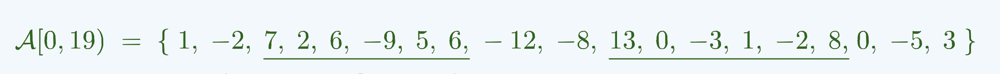
    <br />
    <div style="text-align:center">备注：图片托管于github，请确保网络的可访问性</div>
    <br />
</div>

- 上图除了线条画出来的两个之外暗含第三个，也就是包含第二个之后的0的可能
- 可能有一个0缀在一个Greatest Slice的末尾，当然也可能在其前面
- 我们要求是最短的，这种0会被排除，在选取的时候，我们要盯住最大的指标，而且使序列尽可能的短
- 所以，尽管Greatest Slice可能有多个解，但其总和可能是一样的

2 ) **Brute Force**

- 下面是蛮力算法示例：
    ```cpp
    // 蛮力
    int gs_BF(int A[], int n) {
        int gs = A[0]; // 当前已知的最大和
        for(int i = 0; i < n; i++) {
            // 枚举所有的O(n^2)个区段
            for(int j = i; j < n; j++) {
                int s = 0;
                for(int k = i; k <= j; k++) s += A[k]; // 用O(n)的时间求和
                if(gs < s) gs = s; // 择优更新
            }
        }
        return gs;
    }
    ```
- 这个算法非常的蛮力，达到了$O(n^3)$的复杂度

<div align="center">
    
    <br />
    <div style="text-align:center">备注：图片托管于github，请确保网络的可访问性</div>
    <br />
</div>

- 如上图，如果绿色的为整体的序列，那么任何一个介于i和j之间的一段, 都是一个slice, 既然要找到最大的
- 最笨的方法是把每个slice都枚举一下，把所有介于i和j之间的slice都枚举出来，之后将每个slice的元素累加起来得到该slice的指标
- 最后将指标最大的slice找出来，这种方式可行，但效率太低, 实际中不能应用
- 我们一般不把这个解决方案叫做算法，写出来非常丢人，但是我们可以对其进行优化

2 ) **Incremental Stratey**

- 我们接着上面的蛮力计算，可以对内部的for循环进行优化
- 一开始算法是先枚举i, 每当枚举出固定的i之后, j就会从i开始去枚举所有以i为起点的slice, 长度为:1, 2, 3, ...
- 每当到j之后，无一例外将总和再加起来，这个显然效率非常低，其中间有很多工作可以不必做，这里存在一种递增的玩法
- 如下算法示例

```cpp
int gs_IC(int A[], int n) {
    // 当前已知的最大和
    int gs = A[0];
    // 枚举所有的起始于i终止于j的区间
    for(int i = 0; i < n; i++) {
        int s = 0;
        for(int j = i; j < n; j++) {
            s += A[k]; // 递增得到其总和：O(1)
            if(gs < s) gs = s; // 择优更新
        }
    }
    return gs;
}
```

- 也就是说，我要计算一连串的东西，这一连串的东西有相关性，也就是当我前一段算出来之后，我不必从头算下一个，而是直接累加即可
- 也就是直接做一次update即可，举个例子，从i ~ j-1和从i ~ j两个slice，当计算出i ~ j-1的slice之后，只需要再更新一次(做一次加法)即可得到i ~ j的slice
- 所以，在求所有slice总和的时候，并不需要每次都从头算起，只需要常数次时间O(1), 即可得到下一次总和，总和可增可减，我们只需保留最大的即可
- 整个算法，for循环关于i枚举，嵌套for循环关于j的枚举，只不过在每次i固定之后，它都会将s从内部for循环提升到外部来，s被反复使用，也就是一种incremental的方式
- 一开始s都是0，每一次加上新的单元，一个简单的加法操作代替了一个for循环操作，结果是一样的，但是效率更好
- 每次都将最大的slice得到，通过循环，不断得到所有的解，找到最大的slice
- 这个方法相较于之前有所改进，但是改进不大, 因为依然有两个循环

<div align="center">
    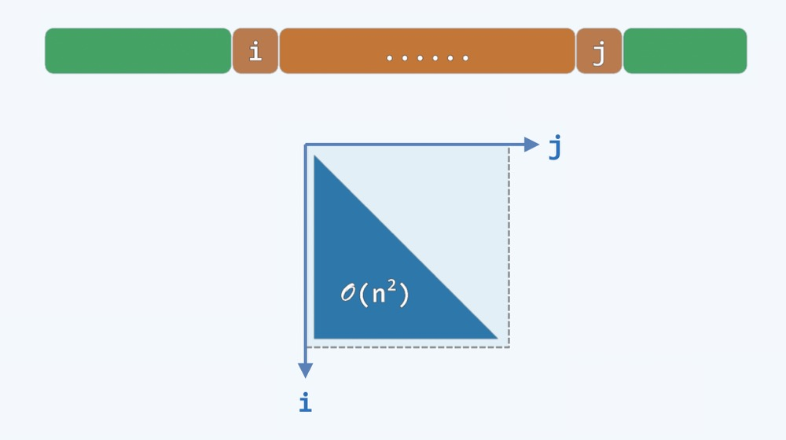
    <br />
    <div style="text-align:center">备注：图片托管于github，请确保网络的可访问性</div>
    <br />
</div>

- 这里两个循环中，尽管每一次跑的长度是不断变化的，越来越短，但其形成的三角形面积也占了矩形的一半，如上图
- 其复杂度仍是O(n^2), 平方的算法其实都不是好的算法, 仍需要改进

3 ) **Divide-and-Conquer**

<div align="center">
    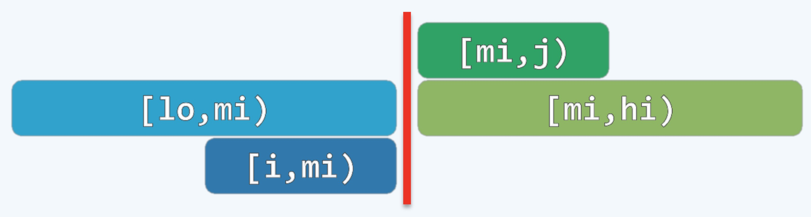
    <br />
    <div style="text-align:center">备注：图片托管于github，请确保网络的可访问性</div>
    <br />
</div>

- 我们首先将这个问题一般化，求在lo~hi之间的这个Greatest Slice
- 一般分而治之，我们一般只需要平均分成两份即可：[lo, mi), [mi,hi)
    * 一般为：$A[lo, hi) = A[lo,mi) U A[mi,hi) = P U S$
- 每一子部分首先各自找到自己的Greatest Slice，之后找到横跨两边的Greatest Slice
    * 这里大概有三种可能：一、完全落在左边；二、完全落在右边；三、横跨左右两边
    * 借助递归，可求出P、S内部的GS
    * 第三种横跨也就是找以上图红线为终点的最大区间(深蓝部分：[i,mi))和红线为起点的最大区间(深绿部分:[mi,j))
        * 准确的说是覆盖A[mi,mi)的区段：$A[i,j)=A[i,mi)+A[mi,j)$
        * $S[i,mi) = max{S[k,mi) | lo \leq k < mi }$
        * $S[mi,j) = max{S[mi,k) | mi \leq k < hi }$
        * 两者可独立计算，累计耗时O(n)
    * 这时候我们用主定理来看下这个算法的复杂度：T(n) = 2 * T(n/2) + O(n) = O(n*logn)
    * 备注：通过比较$n^{log_2^2}$和n比较发现两者相等，之后乘上一个logn
    * 这时候，算法从之前的$n^2$降低到nlogn
- 关键代码
    ```cpp
    // Divide-And-Conquer: O(nlogn)
    int gs_DC(int A[], int lo, int hi) {
        if(hi - lo < 2) return A[lo];
        // 递归基在中点切分
        int mi = (lo + hi) / 2;
        // 枚举
        int gsL = A[mi-1], sL = 0, i = mi;
        // 所有[mi, j)类区段
        while(lo < i--) {
            if(gsL < (sL += A[i])) gsL = sL;
        }
        // 枚举
        int gsR = A[mi], sR = 0, j = mi - 1;
        // 所有[mi, j)类区段
        while(++j < hi) {
            // 更新
            if(gsR < (sR += A[j])) gsR = sR;
        }
        return max(gsL + gsR, max(gs_DC(A, lo, mi), gs_DC(A, mi, hi))); // 继续递归
    }
    ```
- 这个算法是否还可以继续优化呢?

4 ) **Decrease-and-Conquer**

<div align="center">
    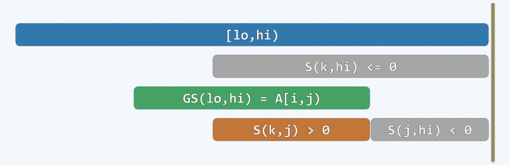
    <br />
    <div style="text-align:center">备注：图片托管于github，请确保网络的可访问性</div>
    <br />
</div>

- 我们还在这个[lo,hi)区间内，虽然一开始不知道GS具体在哪里，但是它总会存在于一段区间内: $GS(lo,hi) = A[i,j)$
- 然后，我们看下lo~hi之间的一些后缀(这里的后缀是指终点锁定在A[hi-1, hi)这一点上的slice)
- 我们要找总和非正的后缀A[k,hi), 即：S(k, hi) <= 0, S是函数不是区间，用()表示
- 假设后缀A[k,hi)这个slice的总和S在第一时间达到了不是正数的条件(<=0)，即有这样一个slice,我们称为slice1，它应该是最短的区间
- 假设这个slice1和我们GS存在交叉，那么交叉区间应该是：S(k,j)
- 我们知道S(k,j)所代表的区间A[k,j)是A[i,j)的后缀，而且这个区间的总和必须是正数
- 为什么这个总和必须为正数，如果非正，能舍弃，那原区间就构不成GS了就完全可以抹除这个后缀了
- 即：S(k,j) > 0，又 S(k,hi) <= 0, 同时 k < j, 通过递推，我们知道: S(j,hi) < 0 这个区间我们用slice2表示
- 这时候，S(j,hi)比S(k,hi)区间上比较还要短，即：slice2比slice1还要短，这时候我们知道这个和slice1是最短的总和为负的区间相矛盾了
- 所以，区间A[i,j)和区间A[k,hi)之间没有交集
- 我们通过反证得到：**最短的总和非正的后缀A[k,hi), 必然与GS(lo,hi)=A[i,j)无交**
- 这时候，我们可以通过**减而治之**的策略，通过一趟线性扫描在线性时间内找出GS
    * 从末尾开始遍历，查找后缀，当总和变成了非正，就可以把该区间割除，不会影响GS所在区间
    * 同时在每个被割除的区间可能存在GS,找到每个区间的GS,更新记录最大的GS
    * 重复不断的做这个事情，找到唯一那个GS，简单明了
- 这时候算法的复杂度为：O(n)

- 图示

<div align="center">
    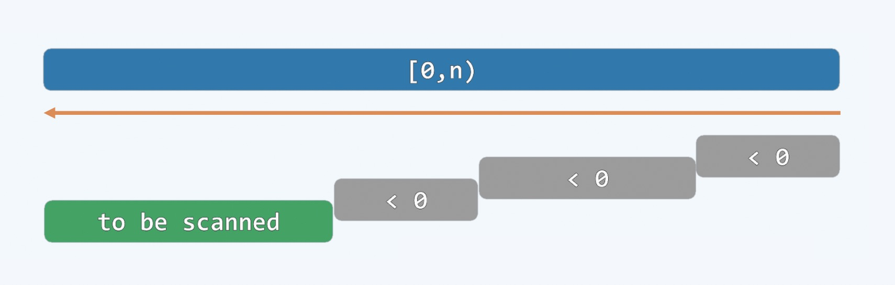
    <br />
    <div style="text-align:center">备注：图片托管于github，请确保网络的可访问性</div>
    <br />
</div>

- 示例代码
    ```cpp
    // Linear Scan: O(n)
    int gs_LS(int A[], int n) {
        int gs = A[0], s = 0, i = n, j = n;
        // 对于当前去加[i,j)
        while(0 < i--) {
            // 递归地得到其总和：O(1)
            s += A[i];
            if(gs < s) gs = s; // 择优，更新
            if(s <= 0) {s = 0; j = i;} // 剪除负和后缀
        }
        return gs;
    }
    ```

### Multiplication: Naive + DAC

<div align="center">
    
    <br />
    <div style="text-align:center">备注：图片托管于github，请确保网络的可访问性</div>
    <br />
</div>

- 这里聊下乘法中的分而治之，如上图
- 一般如果两个n位数相乘，得到的一个新数一定是2n位数字，比如：900*900=810000
    * 但也有例外：100*100=10000
    * 所以我们用一般性来表述，表示一个大约的估计
    * 我们可以把10000看做010000这样占位就说的通了
- 我们做数字的乘法的时候一般都是在稿纸上逐位相乘，现在有了复杂度的概念，我们知道这个算法的复杂度是O(n^2)
- 也就是说被乘数和乘数的每一个数位的组合都要做一次乘法，显然这个算法并不好，我们希望算的更快
- 我们想要用分而治之来优化这个问题，我们把这两个n位数分别拆解成n/2位数
- 这里绿色的n就会分解为n/2的绿色A和n/2的绿色B，同理蓝色的n也做同样分解，如上图
- 在计算的时候，我们把n/2的B与n/2的D相乘计算出一个n位的BD, 同理，对高位而言，得到一个AC
- 作为乘法还有交叉项，不论A和D相乘还是B和C相乘都是n位数，只不过对其的位置不同，也就是存在补位0(后面会有补充)，如上图它们的橙色位置
- 最后把计算出的四位数对齐加起来，得到最后的结果，我们来分析一下这个算法的复杂度
- $T(n) = 4 * T(n/2) + O(n) = O(n^{log_2 4}) = O(n^2)$
    * 这里分成了4个子任务，而且每个子任务的规模都是n/2, 为此只需要花O(n)的时间
    * 关于上面的O(n) 其实是: 4 * n/2 = 2n, 我们注意到AC、BC、AD后面都有补位0, 在计算机中我们用移位起来实现，所以常数时间即可解决问题
    * 所以最后的相加操作的时间复杂度是O(n)
    * 根据主定理，总体耗时：$O(n^2)$
- 显然，这个分治方法并没有优化，问题出在哪儿？我们先前分成了4个子任务，能否进行优化？
- 利用数学恒等式：$B*C + A*D = A*C + B*D - (A - B) * (C - D)$
- 我们知道乘法复杂度远远高于加和减, 上面表面上将2个乘法变成了3个乘法，感觉问题变得更糟糕了
- 但是基于上图我们知道，$A*C$和$B*D$都已经被计算过了，我们只需要关注$(A - B) * (C - D)$即可
- 所以实际上，我们把2个乘法变成了1个乘法，实际上是优化的
- 总体看来，一共有3个乘法，它们分别是:
    * $A*C$
    * $B*D$
    * $(A - B) * (C - D)$
- 这样，我们根据主定理来计算一下它的时间复杂度
- $T(n) = 3 * T(n/2) + O(n) = O(n^{log_2 3}) \approx O(n^{1.585})$
- 如下图示

<div align="center">
    
    <br />
    <div style="text-align:center">备注：图片托管于github，请确保网络的可访问性</div>
    <br />
</div>

### Mergesort: DAC

- 这里我们通过归并排序的例子来说明一下分而治之的策略

<div align="center">
    
    <br />
    <div style="text-align:center">备注：图片托管于github，请确保网络的可访问性</div>
    <br />
</div>

- 当我们面对一个足够长的序列进行排序的时候，我们一般会把问题从中间一分为二，前后两部分各自进行自己的任务
- 当子任务仍旧很大的时候，也就是说不方便排序的时候，继续一分为二，这样不断的一分为二的下去，直到分到足够小，最后剩下一个元素
- 一个元素其实是已经排好序的了，之后进行组合merge，如上图所示，在merge的过程中进行排序
- 由此可知，解决问题的实质过程并不在分的阶段，而在于合的阶段，而每一次merge其实拿到的都是两个有序的序列
- 每一次merge的过程是把两个有序的序列合并起来变成一个整体有序的序列
- 总结一下，Mergesort的过程就是不断自顶而下的去做分，一直分到每一个元素，然后再自底而上的去做归并
- 这个算法可以很简明的写出来，参考代码如下

    ```cpp
    template <typename T>
    // [lo, hi)
    void Vector<T>::mergeSort(Rank lo, Rank hi) {
        if(hi - lo < 2) return; // 单元素区间自然有序
        // 否则
        int mi = (lo + hi) >> 1; // 以中点为界
        mergeSort(lo, mi); // 对前半段排序
        mergeSort(mi, hi); // 对后半段排序
        merge(lo, mi, hi); // 归并
    }
    ```

- 算法图示如下

<div align="center">
    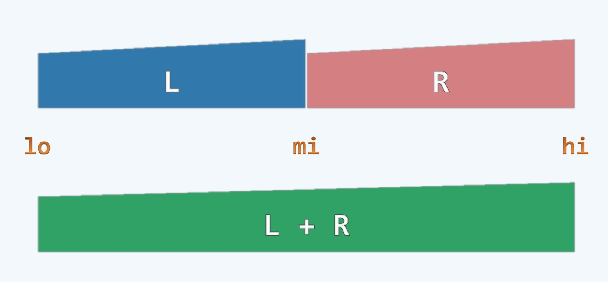
    <br />
    <div style="text-align:center">备注：图片托管于github，请确保网络的可访问性</div>
    <br />
</div>

- 最终merge的技巧是Mergesort实质的技巧，用到了二路归并(2-Way Merge)的算法

**2-Way Merge 二路归并**

<div align="center">
    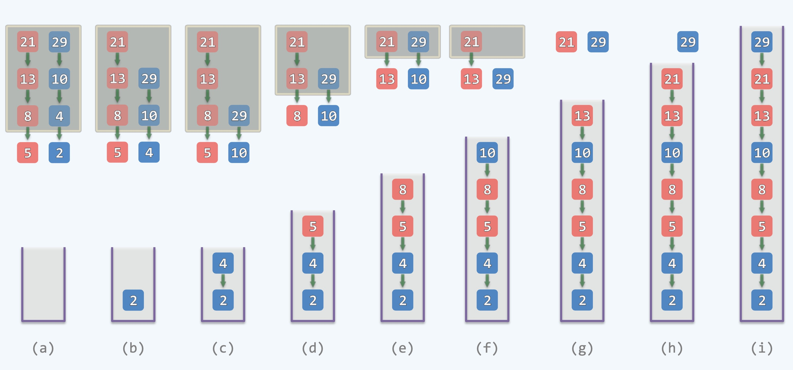
    <br />
    <div style="text-align:center">备注：图片托管于github，请确保网络的可访问性</div>
    <br />
</div>

- 有两个各自有序的序列，我们用红和蓝进行标识，假想它们就是两个队列
- 在任何时候可以忽略队伍后面的所有元素，只看队列中的第一个元素，如：5和2
- 然后将最小的一个元素取出来存入一个空的队列中，如图(b)
- 2被摘除之后，后面的所有元素会顺次的补上来，算法开始进行下一轮的迭代
- 同样的，将目光盯住队列的头部元素，这时候是5和4，取出最小的元素4存入之前的队列中，如图(c)
- 反复进行这类操作，将最小的摘出来存入队列
- 最终会变成一个整体有序的序列，这个过程只需要线性的时间就够了，也就是O(n)
- 由于核心的merge的过程只需要线性的时间，而Mergesort的时间复杂度我们可以计算一下
- T(n) = 2 * T(n/2) + O(n) = O(nlogn)
- 由此可见，Mergesort的时间复杂度为：O(nlogn)
- 其实，mergesort非常的有名，是历史上第一个达到O(nlogn)效率的算法
- 在大数据处理方面，内存不容易操作的时候是一个非常好的算法
- 这个算法背后的哲学依然是分而治之，准确来讲，就是把它分为两个规模相当的任务
- 而且诀窍是无论分还是合，都能够在颇为有效的算法以内完成
- 在这里回顾一下选择排序和插入排序
    * 选择排序
      * 算法思想是：把一个序列分成2部分，一部分是有序的，一部分是无序的, 在无序中找到最大的元素存入有序中，通过这种方式来迭代
      * 选择排序有n步迭代，每次迭代都要把无序走一遍才能确定最大元素，平均来说是n/2的距离，总体来说是$O(n^2)$
      * 效率上没有好的情况，不管是输入元素是怎样的
    * 插入排序
      * 算法思想是：把一个序列分成2部分，一部分是有序的，一部分是无序的, 把无序的顶端元素在有序列中找到合适的位置并插入，通过这种方式来迭代
      * 插入排序有好的情况，比如给定序列都是顺序的，在找合适位置的时候，只需要在有序列中的后面直接插入即可，即查找位置的时间是O(1)
      * 这样来说插入排序最好的效率是O(n), 即线性的
    * 再谈逆序对(inversion)
      * 在完全有序的序列中, 逆序对的对数是0
      * 在无序的序列中，逆序对的对数至少是一对
      * 在任何一个无序的序列中，逆序对是有数目的，一般记做 I
      * 逆序对的多少直接反应了序列的混乱程度，直接决定排序算法的性能
      * 逆序对作为形象算法性能的"锅", 但这口"锅"是由两个元素造成的
      * 一般习惯性的只记在后面元素的账上(比如我们从小到大排列, 记在逆序对中较小的元素身上)
      * 任何元素有多少口"锅"，取决于在它的前面(左边)有多少元素比它大
      * 如果这个元素为k号元素,那么它的"锅"(也就是逆序对)一般我们记为有i(k)个
      * 把所有元素的"锅"做一个总和，记为$\sum_k i(k)$, 即 $I = \sum_k i(k)$
      * 其实第k个元素的"锅"数量可以直接作为度量k元素排序的时间成本
      * 这个时间成本，比如，在插入排序中，把第k个元素插入的时间成本，也就是把当前k元素插入后需要移动的元素个数
      * 所以可以知道插入排序的时间复杂度其实也可以表示为：O(n + I)
      * 同时，我们知道了插入排序的性能和输入序列是相关的(也就是越有序排序越快，越无序排序越慢)
      * 这个性质我们称为"输入敏感性"(input sensitivity), 只有很少的算法有这个性质
      * 这时候，我们很有必要思考一下如何通过分而治之来高效实现统计一个序列中的逆序对的个数I了

**计算逆序对的个数 Counting Inversions**

<div align="center">
    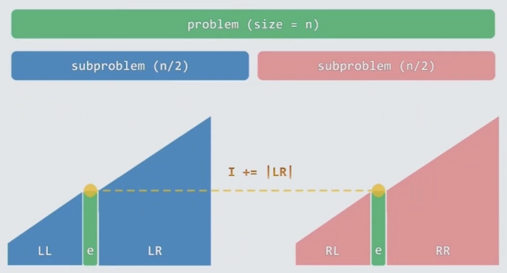
    <br />
    <div style="text-align:center">备注：图片托管于github，请确保网络的可访问性</div>
    <br />
</div>

- 我们可以把这样一件事分给两个任务来做，将序列一分为二, 每个任务(subproblem)各自统计各自的I，可以分别记为$I_L$, $I_R$
- 之后还要统计跨越两部分的逆序对，即$I_M$, 我们可知，有$I = I_L + I_R + I_M$
- 现在我们需要知道如何计算这个跨域两部分的$I_M$
    * 如下图所示，两个梯形结构, 蓝色和粉红色的
    * 我们需要使用归并算法来计算，这里我们还是选择二路归并算法
    * 将一个有序的序列和另一个对等的有序序列合二为一
    * 每次把目光注意在头上，总是把最小的元素摘走，然后扫描下一个
    * 不失一般性，比如扫描到了右边(粉色梯形)的e元素, 这个元素要
    * 蓝色区域的LL其实已经被归并出去了, 剩下的只有LR(是蓝色梯队残余的元素)
    * 如果粉色梯队中的e元素编号是k, 那么LR的数量就是i(k), 也就是粉色区域e元素的逆序对数量
    * 我们只需要把目光盯住一侧，比如右侧(粉红梯队)，右侧任意元素要出队，要被归并的时候
    * 同时用眼睛观察下它的左边剩下多少元素(也就是蓝色梯队的LR部分)，也就是它的逆序对的个数
    * 把所有元素的"锅"一个个的累计起来就会得到我们的$I$, 也就是$I = \sum_k i(k)$
    * 这样我们就可以直接使用i(k)来统计，而非一个一个逆序对的统计，所以会统计的更快
    * 也就是说最多的时候有$n^2$的逆序对，我们所需的时间不会超过O(nlogn)

<div align="center">
    
    <br />
    <div style="text-align:center">备注：图片托管于github，请确保网络的可访问性</div>
    <br />
</div>

### linearSelect(A, k) 线性查找

- 问题描述：从一个数组A中找到第k大的元素，回避排序，一旦排序时间成本就会爆掉
- 一般针对这个问题我们可以通过快排来做，通过猜测，平均和最好情况下，可以达到线性
- 但是这个linearSelect是名副其实的线性算法，即使在最坏的情况
- 这个个问题比较复杂，属于分而治之，也是减而治之，通过线性的时间来找到第k大的元素
- 这个算法实际上很深奥
    * 选择一个较小的数Q作为常量，一般Q推荐是5，这个算法是用递归来处理的
    * 既然是递归，首先要判断终结条件，也就是什么时候不再递归
        * 如果一个n足够小，比这个Q还要小，那么这时候就是一个trivial case, 不用再折腾了, 直接从这里找第k大的元素即可
        * 用伪代码表示为：`if(n = |A| < Q) return trivialSelect(A,k)`
    * 现在，我们来处理这个递归机一般的情况了
        * 1 ) 把A均分为$\frac{n}{Q}$等份, 可知，总量是n, 每一份的大小是Q, 这个任务线性时间即可完成
        * 接下来我们得到了$\frac{n}{Q}$份的"香肠", 因为每一份香肠已经很小了，大小为Q个元素
        * 2 ) 这时候可以很快的对其排序(基本认为排序时间为常数，可以使用插入排序)，找到每份香肠的中位数m
        * 3 ) 在$\frac{n}{Q}$份"香肠"中, 每一份都会有一个m, 我们可以得到由m组成的一个新的序列
        * 在这个新的序列中，找到其中位数M(通过递归机自己调用自己来找), 也就是中位数中的中位数，这个M可以认为是总体的中位数
        * 这个M是一个很好的中位数，因为通过上述方式来查找的这个M会更接近真实的中位数，具有更高的似然性，在复杂度上也会得到更好的收获
        * 4 ) 接下来进行分类，根据M把所有元素分为三类，L表示较小的, E表示相等的, G表示较大的, 线性扫描即可分为三类
        * 用伪代码表示为：$Let \ L \ /\  E \ /\  G = \{ x < / = / > M \ | \  x \in A\}$
        * 这三类内部不需要排序，但是总体上是有序的，即：L < E < G
        * 5 ) 我们最终的问题是要寻找第k大的元素，这时候就会与运气有关了，这时候第k大的元素可能会在L、E、G不同的范围之内
        * 如果k在E中，那么就找到了该元素，直接return即可
        * 如果k在L中，E和G都应该被减去，直接在L中递归查找第k大的元素
        * 如果k在G中，E和L都应该被减去，直接在G中递归查找第k大的元素
        * 用伪代码表示为
            * `if(k <= |L|) return linearSelect(L, k)`
            * `if(k <= |L| + |E|) return M`
            * `return linearSelect(G, k - |L| - |E|)`

<div align="center">
    
    <br />
    <div style="text-align:center">备注：图片托管于github，请确保网络的可访问性</div>
    <br />
</div>

- 在上面算法中, 有两次重要的递归，第一次是找全局中位数的，第二次是在L和G中继续查找的
- 其中查找中位数只用了线性的时间，即 O(n/Q), 而在L和G中继续查找所需要的时间不会超过 O(3n/4)
- 也就是说第二次递归的时间复杂度不会超过总体的75%，为什么呢?
    * 这与M有直接的关系，因为这个M的得出，我们是付出了一定的努力的，得到的这个M是一个有利于计算的M
    * 我们可以把所有的m序列作为一个糖葫芦串一样，每一个m都将之前的"香肠"段均分，上下各一半
    * 基于最中间的M, 我们可以把整个序列分成4等份：蓝色，绿色和2份的黄色
    * 根据大小的传递性，比M要大的m所对应的"香肠"段会被标记成蓝色，比M要小的m所对应的"香肠"段会被标记成绿色
    * 而黄色部分是不确定的，可能是黄色，绿色和蓝色，这个说不准，但是这个不重要，我们已经找到蓝色和绿色的必要部分了
    * 我们知道，蓝色和绿色各占总体的1/4, 当我们递归要减除蓝色或绿色的时候，至少要减掉整体的1/4
        * 表示为：`min(|L|, |G|) + |E| >= n / 4`
    * 而反过来，我们可知，剩下的最多留下3/4
        * 可以表示为：`max(|L|, |G|) <= 3n / 4`
- 这样，主定理递推式可写为：`T(n) = c · n + T(n/Q) + T(3n/4)`
    * 整个算法经历了一大堆的线性操作(花费T(c · n))之后，把这个问题分为了两个部分
    * 一部分是求解这个M, 花费T(n/Q)
    * 另一部分是减而治之的递归任务，花费T(3n/4)
    * 如果后面两部分的时间复杂度加起来不足T(n), 那么这个算法的时间复杂度由前面的线性操作决定
    * 这个时候，整体算法就是线性的，就是我们所说的`linearSelect`
    * 那么如何使得后面两部分的时间复杂度加起来不足T(n)呢?
        * 我们知道 n/Q + 3n/4 < n 即可满足条件，即：1/Q + 3/4 < 1
        * 这个时候，我们知道Q最小的时候，取值为5
- 把话说回来，虽然这个算法在性能上标称的很好，但是现实上只具备理论意义
- 因为其线性操作的常系数c是非常大的，一般表示为：`c >> 2`
- 在实际中，我们还是使用快速排序来完成任务

<div align="center">
    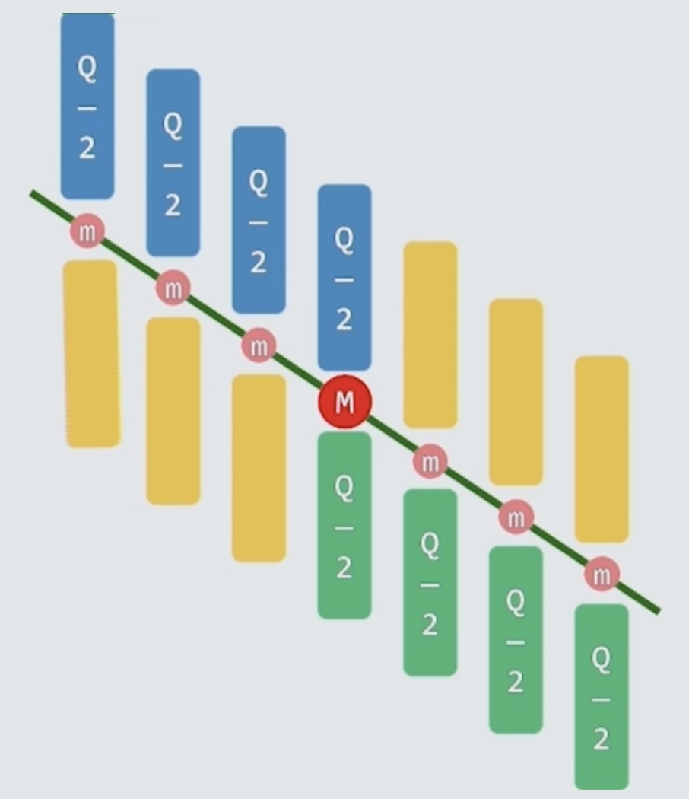
    <br />
    <div style="text-align:center">备注：图片托管于github，请确保网络的可访问性</div>
    <br />
</div>

### Diameter of A Binary Tree 二叉树直径

- 所谓直径，在一般的图中都可以定义为一个直径, 即在一个图中能够找到的**最长的路径**

<div align="center">
    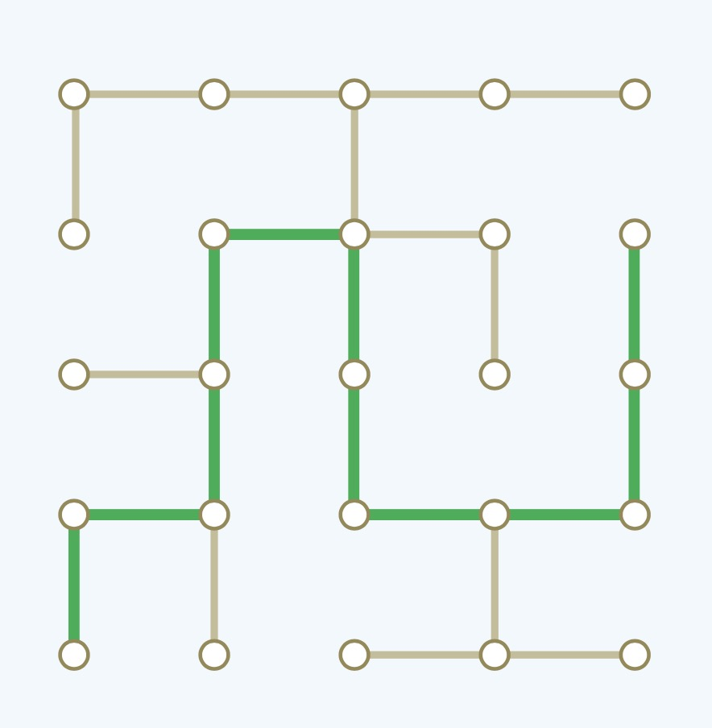
    <br />
    <div style="text-align:center">备注：图片托管于github，请确保网络的可访问性</div>
    <br />
</div>

- 如上图所示，绿色路径即为该图的直径
- 我们一般研究二叉树的直径，二叉树也是图，我们怎么对二叉树求解直径问题进行分而治之呢?
- 我们问题的解决模式是立足于某个局部或者包括全局的一个树根，以x为根的范围内，找到直径
- 既然是二叉树，我们就会想到分而治之，我们会理所当然的想到在左孩子和右孩子分别递归找到其内部最大的直径
- 其实它分为三种情况
    * 最大直径只存在于左孩子树中
    * 最大直径只存在于右孩子树中
    * 最大直径贯穿左右孩子树
        * 这时候需要计算左孩子最深的叶子
        * 计算右孩子最深的叶子
        * 以及根节点x连接左右孩子的路径，长度为2
- 我们需要在这三类中找到最长的直径
- 根据以上分析，我们可以得到以x为根节点的二叉树直径的计算公式
    * `diam(x) = max{diam(x.lc), diam(x.rc), height(x.lc) + height(x.rc) + 2}`
    * `diam(NULL) = -1`

<div align="center">
    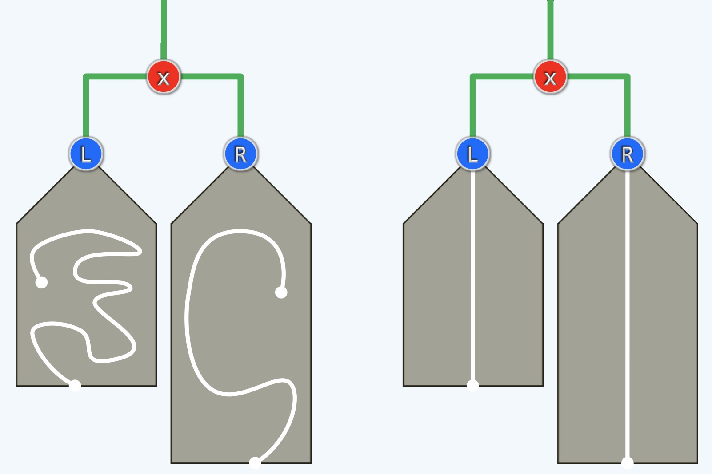
    <br />
    <div style="text-align:center">备注：图片托管于github，请确保网络的可访问性</div>
    <br />
</div>

### Closest Pair 最近邻问题

- 最近邻问题是计算几何很经典的一个问题
- Closest Pair 也可以叫做 Nearest Neighbor
- 问题描述：平面上给定一些点, 问哪两个点的欧式距离最近

<div align="center">
    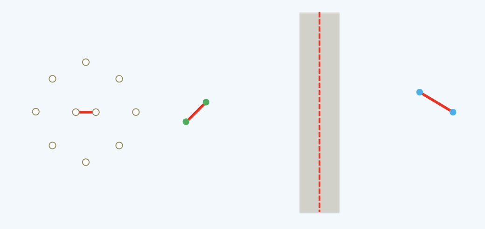
    <br />
    <div style="text-align:center">备注：图片托管于github，请确保网络的可访问性</div>
    <br />
</div>

- 一般如果使用蛮力算法，对每一个点进行组合，找到距离最近的点
- 因为n个点的两两组合的时间复杂度是$O(n^2)$, 我们不应该考虑这种算法
- 那么如何通过分而治之来解决这个问题呢?
- 我们可以在平面上找一个中间点，将这个平面锯成两半
- 也可以认为把所有的点分成了左右两半，分别记为：nn(L), nn(R)
- 这两半分别递归找到各自的最近点对，还要做的工作是找到跨越两部分的最近点对
- 取左、右、以及横跨两部分这三个中距离最近的点对为最终答案
- 这里最复杂的问题是如何找到跨越两部分的最近点对
    * 如果为了解决这个问题而考虑左边n/2个点，以及右边的n/2个点，那么又会回到了$O(n^2)$
    * 其实，算法中有一个Brand-and-Bound(分支定界)的策略, 这是在搜索时候的一种策略
    * 在搜索过程中，会得到一些辅助信息，这些信息对候选者的筛选会有一定的收敛
    * 从而能够更优，从而花上更少的时间
    * 我们已经找到左右两部分中的最近点对，分别记为$\delta_L$,$\delta_R$, 从中取最小的点对，记为$\delta$
    * 在跨越两部分的计算中，我们只需要找离锯齿红线距离为$\delta$的点即可，因为其他点一定不是我们想要的最近点对
    * 为什么不是$\frac{\delta}{2}$, 而是$\delta$，因为有一些点可能就落在锯齿红线处，而非灰色区域的边界
    * 所以，如果使用$\frac{\delta}{2}$，那么灰色条带就是$\delta$的宽度，可能会有一些点会被漏掉
    * 由此，我们设置灰色条带为$2\delta$的宽度，这样更加严谨，这一点很好懂
    * 现在，我们就需要计算灰色条带内的最近点对了，那么如何计算呢?
    * 在确定好横向上的范围之后，我们要考虑纵向上的取值范围，其纵向可以做成一个8段管，每一段的长度都为$\delta$
    * 同样是分支定界，那些符合条件的最近点对，一定在这个8段管的范围之内
    * 而在这8段管内两两点之间的距离不会少于$\delta$，因为之前算过左右两部分最近点对的距离就是$\delta$
    * 这时候，我们知道在8段管内，有意义的点最多不会超过6个，如下图所示，这6个点作为一个window
    * 最后是如何计算的问题了，其实我们可以给在锯齿红线左侧的灰色条带内的点做一个排序，每个点都会有这么一个window
    * 我们只需要移动窗口，这个过程和2-Way Merge非常相似，在移动的过程中，一些点进入window, 一些点离开window
    * 单个window对比过程规模不会超过6，整个对比规模就可以做到线性了
    * 现在我们计算下它的时间复杂度
        * 蛮力算法的时间复杂度是：$\frac{n}{2} * \frac{n}{2} = O(n^2)$
        * 分而治之时间复杂度的计算
            * $\frac{n}{2} * 6 = O(n)$
            * $T(n) = 2 * T(\frac{n}{2}) + O(n) = O(nlogn)$

<div align="center">
    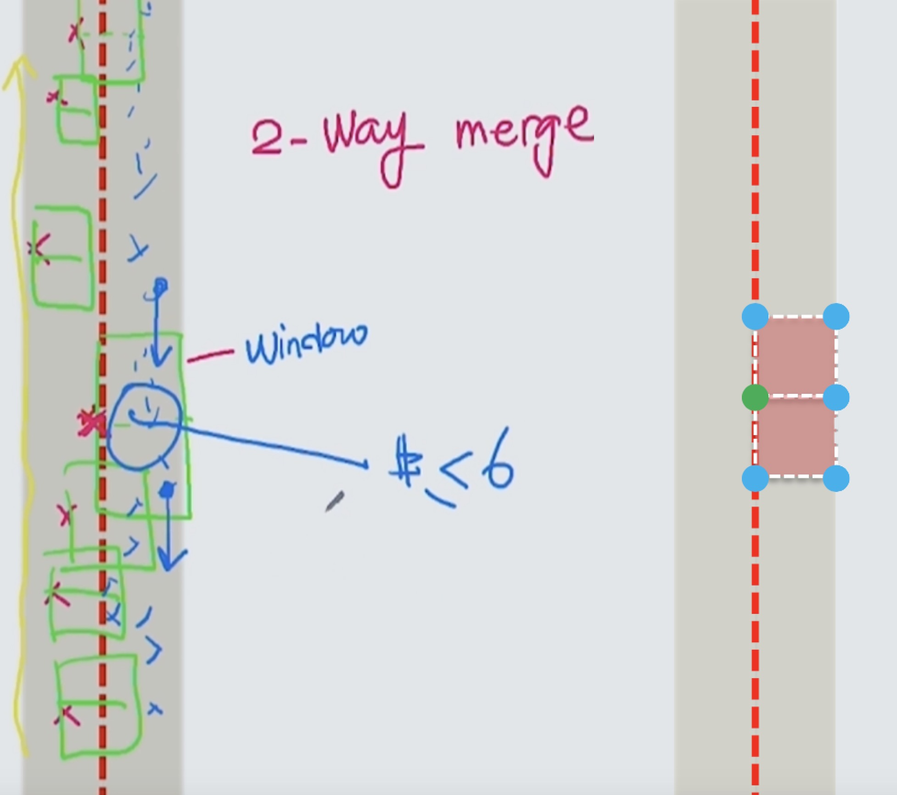
    <br />
    <div style="text-align:center">备注：图片托管于github，请确保网络的可访问性</div>
    <br />
</div>