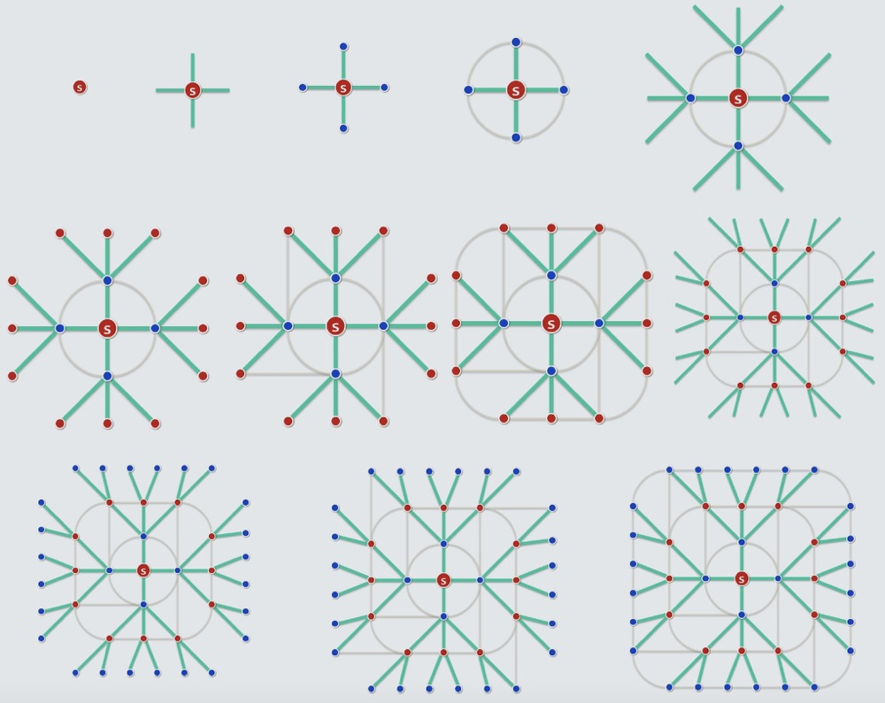
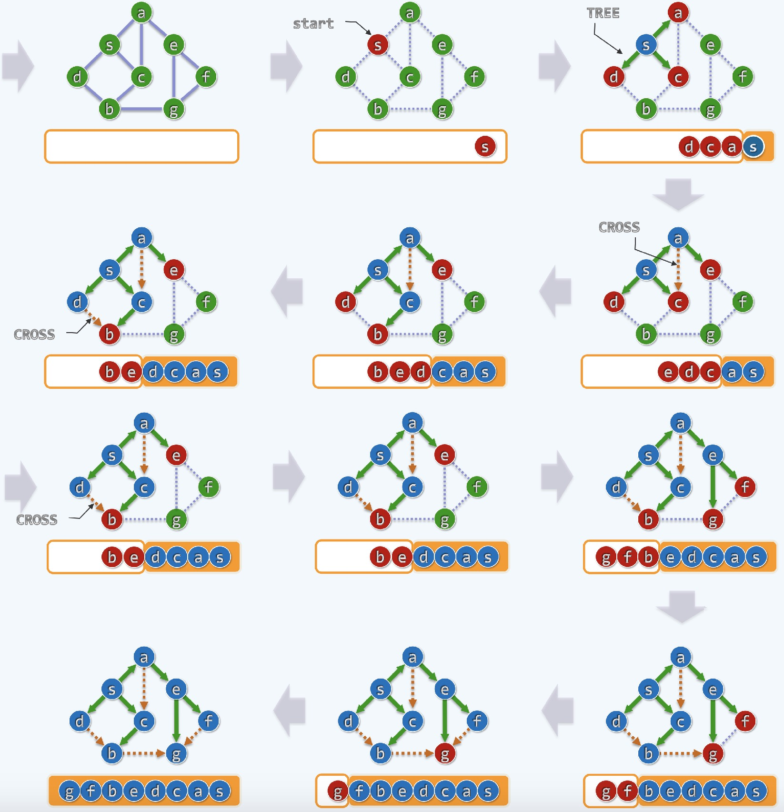
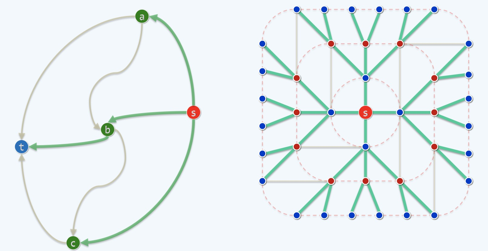
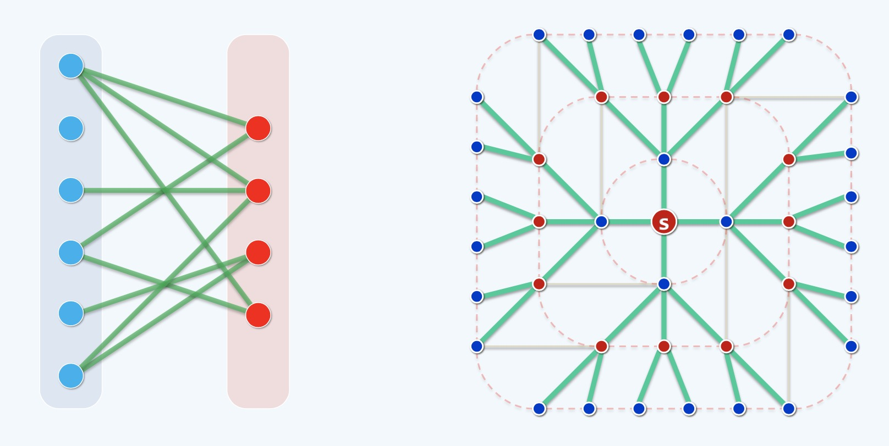
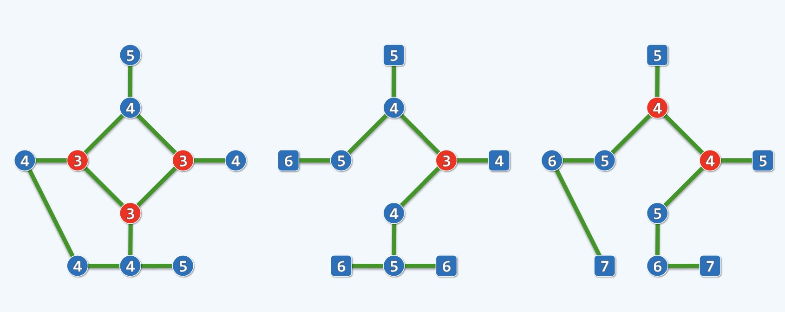
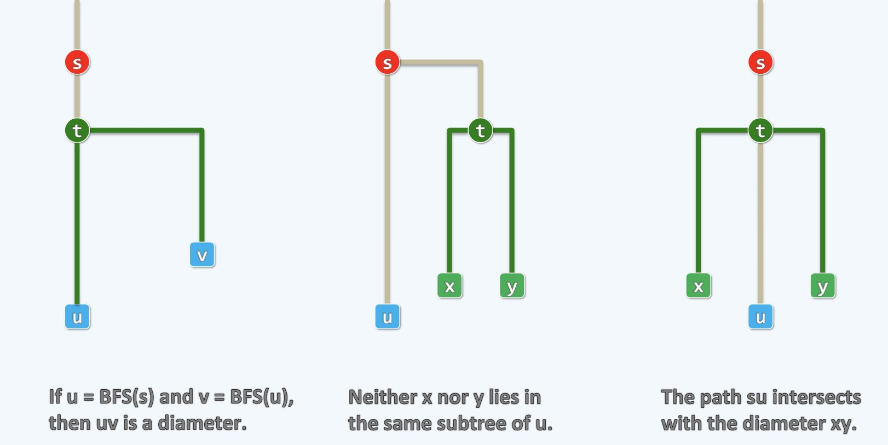
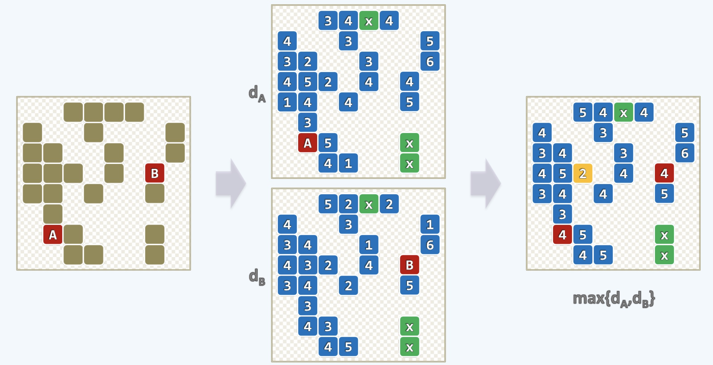

图搜索 Graph Search
---

### 图搜索的分类

- BFS广度优先(宽搜) !!!本文详解!!!
- DFS深度优先(深搜)

### 广度优先搜索BFS

- 我们可以用比喻来说明广度优先搜索算法
    * 在一片草木枯黄的深秋草原上，在草原的某一处出现了一处野火
    * 一开始的时候野火集中于一点之上，在这点野火耗尽当前植被变成灰烬之前点燃了周围的植被
    * 比如节点s是初始火种，假设我们手中有一个秒表，每过1秒，我们的大火会向外迈进一步
    * 这个过程只能向外，不能向内，因为只能点燃植被，不能把灰烬点燃
    * 蓝色的点是即将变为灰烬的点，红色的点是刚被点燃的点，灰色的圆形或圆角矩形是一个前锋面
    * 所谓前锋面是火焰向外传播的一个面，frontier
    * 之后，每一处的植被都按照同样的模型向外去蔓延, 点燃外层的邻居，前锋面越来越大，最终整个草原燃烧殆尽
    * 这个过程是非常自然的，也就是所谓的道法自然，模拟自然的一个过程
    * 整个过程，如下图所示

<div align="center">
    
    <br />
    <div style="text-align:center">备注：图片托管于github，请确保网络的可访问性</div>
    <br />
</div>

- 任何图结构的模型，只要指定一个节点，比如上图中的s点作为"树根"
- 我们可以把整棵树(图)摊平在某个桌面上，接下来就要开始进行模拟计算
- 如果一个点自己是点燃状态的，那么它接下来就通过一个边去点燃外部的邻居
- 如果邻居是灰烬状态不会被点燃(不会向内部传播)，就是这个过程可以点燃整片草原
- 这个方法可以针对s点而言可达的，连通的部分全部访问一遍，这种访问的特点是不重不漏
- 这个方法被称为遍历，也就是traverse或traversal

**算法框架实现**

```cpp
template <typename Tv, typename Te>

// v是初始点，clock是读秒器或称为计时器
void Graph<Tv, Te>::BFS(int v, int & clock) {
    // 1. 初始化
    // 1.1 内部引入一个队列Q, 任何一个点，初始化的时候都是UNDISCOVERED状态，初始的时候v指定为DISCOVERED状态
    // 1.2 换种说法：UNDISCOVERED是未燃烧状态，DISCOVERED是燃烧状态
    // 1.3 初始点入队
    Queue<int> Q; status(v) = DISCOVERED; Q.enqueue(v);
    // 2. 处理当前的前锋面上的所有元素
    // 2.1 进行循环处理, 循环终止条件是队列变空, 也就是燃烧殆尽
    while(!Q.empty()) {
        // 反复地，如果不空, FIFO, 并且添加一个时间标签，这里的dTime, d暗示DISCOVERED
        // 这时候一个元素独立的占据1s，其实同一个前锋面上的点在自然环境中是同时燃烧的
        // 因为我们没法做到, 所以为每一个元素添加一个时间标签，这是一种蹩脚的体现
        int v = Q.dequeue(); dTime(v) = ++clock; // 取出队首顶点v
        // 考察v的每一邻居u，这个for循环是这个v点的使命，-1<u, 表示u不再是邻居了
        for(int u = firstNbr(v); -1 < u; u = nextNbr(v,u)) {
            // 根据u的状态，分别处理
            if(UNDISCOVERED == status(u)) {
                // 若u尚未被发现，则
                status(u) = DISCOVERED; // 当前邻居标记成DISCOVERED状态
                Q.enqueue(u); // 发现该顶点，将该邻居入队尾，进入前锋面的范围
                type(v,u) = TREE; // u之所以会烧起来是被内部的邻居v点燃的, 在将来生成的树中，火传递的方向对应的就是边, 引入树边TREE EDGE
                parent(u) = v; // u要把v作为自己的parent
            } else {
                // 若u已被发现(正在队列中)，或者已经能访问完毕(已出队列),将(v,u)归类于跨边
                type(v,u) = CROSS;
            }
        }
        // 2.2. 此时，当前顶点访问完毕，也就是v变成了灰烬并且处理完成v所有的邻居
        status(v) = VISITED;
    }
}
```

- 代码实现可以有很多风格，每种都会有细微的差异，这里的算法是基于c++模板构成的
- 这个算法是模拟自然的过程，最重要的模拟是如何模拟前锋面
- 只要我们模拟出了前锋面(一圈一圈的，一个单位时间，对应一个半径的增长)，就模拟出了整个燃烧的过程
- 目前，我们没有什么好的并行机制，将任何时候的前锋面模拟出来，我们需要一个数据结构
- 我们需要把所有前锋面上的所有点都收容进去，但是我们不可能理想的并行的去模拟
- 实际上，前锋面上的每个火源都是各向同性，互不干扰，高效地往外传递，但是我们的计算必须要一个点一个点的处理
- 这些前锋面上的火源表面上看都是相等的，但是我们需要人为的指定一个优先级，比如指定一个点A
- 在处理这个点A的时候，我们要模拟它在燃烧模型中的行为，它的外层邻居如：$A'_1,A'_2,A'_3,...$将被点燃
- 这个时候就有意思了，当它的这些外层邻居都点燃了, 点A就会成为灰烬，就可以被删除了
- 而且理想模型下的点A的同辈：B,C,D...这些在前锋面上的同辈兄弟节点都没有了，都可以被删除了
- 这个时候，就形成了第二个前锋面，但是这个理想型的并发模型，我们无法实现
- 所以，当点A变成灰烬之时，就可以组织第二个前锋面了，我们让点A的外层邻居先进来
- 同样的，点A的同辈兄弟节点按着这个模型依次填充第二个前锋面
- 我们可以知道，第一个前锋面上的所有点A,B,C,D...这些点在构成前锋面的时候是FIFO
- FIFO(Fist In, Fist Out)先进先出，所以，我们需要一个队列Queue来组织每一个前锋面
- 里外前锋面是这样用队列来组织的
    * 前锋面上的每一个点都排成一个队列，当队头元素A点燃尽的时候, 会被dequeue出队
    * 之后，被点A点燃的当前外层邻居enqueue入队，之后再以同样的方式处理B,C,D...
- 模拟图如下所示

<div align="center">
    
    <br />
    <div style="text-align:center">备注：图片托管于github，请确保网络的可访问性</div>
    <br />
</div>

- 上图橙色圆角框代表的是队列，入队的元素是红色的，出队的元素是蓝色的，并且用橙色圆角矩形存储
- 需要注意的是，上述过程中举个例子来说明，当点燃到a的时候，a需要去寻找它的外层邻居，如上图有e和c
- 但是c早已经在s化成灰烬前入队了, 也就是说c是s的外层邻居
- 所以到a的时候，有效的外层邻居只有e, 因为a-c这条路径会构成一条CROSS边
- 绿实线是TREE EDGE，黄虚线是CROSS
    * 上图中可见, 从s-d, s-c, s-a, a-e等绿色的线条都是TREE EDGE
    * 为什么叫黄色的叫CROSS, 因为它试图连接出一个环出来，这个在树中是禁忌的
- BFS大概就是上述这么一个过程

**BFS: Shortest Distance/Path 最短路径问题**

- BFS有个特点，叫做最短距离，这个和之前我们聊过Dijkstra算法(比较的复杂)有类似之处
- Dijkstra算法更复杂的原因是图中的每一条边都是有权重的，从某一点开始到其它点的最短距离以及相应的路径
- BFS的简单在于各向同性，每条边的权重相等，每条边都对应一单位的时间，这种情况下，这个最短距离是怎样的呢
- 同Dijkstra算法一样，我们也可以使用同样的模拟，将BFS图中可燃烧的点作为珠子，以边作为丝线，这些边都是等长的
- 把这个图平摊在桌子上，拎起一点如s点，一秒一秒的匀速向上提起，在这个过程中，所有的这些点在这个图的意义下
- 按照它到s的最短距离，依次的被抬离桌面，因为我们的边是等长的，所以在同一个前锋面上的点会同时被拎起来
- 第一圈(圈即前锋面)，第二圈，第三圈... 这样，按照这个过程，我们得到了一棵以s为树根, 绿色为边的BFS Tree
- 这棵树中每一条边中都代表火焰的有效传递，从起点s(火源开始)到任意一点(我们暂且称为t点)，相对于t点来说
- 连接s到t的这条被拎起来的树中路径，都是t到树根s的最短路径，如下图所示，灰色都是Cross边，绿色是燃烧路径

<div align="center">
    
    <br />
    <div style="text-align:center">备注：图片托管于github，请确保网络的可访问性</div>
    <br />
</div>

- 如上图所示，对于t点来说，起点是s, 从t到s的最短路径经过b点，那么对于b点来说，到起点s的最短路径
- 一定是以b为起点，t-s路径的前缀: b-s, 燃烧模型中的火焰会沿着最短路径进行传播
- 上述平摊拎起模型中绷直的绳子也一定是沿着最短路径来绷直，也就是火焰的传播方向

**BFS: Bipartite Graph (Bigraph) 二部图**

- BFS的一个应用就是所谓的二部图，这个和最小支撑树的时候的"割"的概念很像
- 如果有一个图存在某一个割，而且使得在这个割的意义下，无论在蓝边的这一部分还是红边的一部分
- 内部的点之间没有连边，两部分唯一的连边，就是连接红的和蓝的，就是跨越这两个之间的所有的那些桥
- 每一条边都是在这个割的意义下的那些跨边或者叫做桥，可以用磁铁南北极来比喻，异极相吸，同极相斥
- 可以把蓝色理解为南极, 红色理解为北极, 蓝色永远不会和蓝色连边，红色永远不会和红色连边
- 这就是一个二部图，好，现在的问题来了，如果有这么一个图给你，最开始的时候是乱的，分不清所有的蓝和红
- 怎么来断定这个图是一个二部图，也就是说它存在这样的一个割，能够把红的和蓝的，两个截然划分
- 只有它们互相之间的连边(包括孤零零的未与任何异色连接的点这种情况)，只是不能允许同色相连，怎么判断呢？
- 这时候，我们就要用到我们的BFS模型，如下图，左边是二部图，右边是BFS模型

<div align="center">
    
    <br />
    <div style="text-align:center">备注：图片托管于github，请确保网络的可访问性</div>
    <br />
</div>

- 方法比较简单，就是挑任何一个点, 比如上图中的s，不管它是红的还是蓝的，接下来，做一个BFS
- 就像刚才我们拎着网兜一样，随着时间的流逝，第1秒，第2秒... 对应着一环(环即前锋面), 二环, ...
- 这些绿色的边会逐个绷直，他们会被拉起来，按顺序离开桌面
- 所谓的一环上的那些边，他们将会在第1个单位的时间，那个时刻，滴答响的那一声会被拎起来离开桌面
- 这些边是到点s的最短距离，这些边上的点，比如上图标注的一环上的蓝色的点，如果真的将来能够构成一个二部图的话
- 一定会跟s点异色，就像图上的红的和蓝的一样，其实一开始的起点s的指定是无所谓的，不失一般性，可以把它指定为红的
- 因为二部图颜色可以互换的，如果真的是一个二部图的话，接下来被拎起来的点就一定是异色的
- 如上图所示，一环上的一个蓝色的点被点着了，它又会去点燃别人，之所以能够点燃别人，是因为它有边相连
- 而既然它有边相连，如果整体是一个二部图的话，所有的边都应该发生在不同的两部之间，也就是异色的点之间
- 如果二环上的一些红点是被这个一环上某一个蓝色的点着的话，而整个图确实又是一个二部图的话
- 那么这些在二环上的点唯一的可能就是它是红色的点，其他的也是如此，举一反三
- 如果最开始是红的话，那么接下来，就会在下一秒钟点燃所有的蓝色，而蓝色点在下一秒钟又会点燃红色的点
- 不断重复下去，红蓝，红蓝这样在秒数的奇偶意义下不断的翻转
- 好，现在问题又来了，任何图都能做BFS，但任何图未必都是二部图，我们需要一个判定的准则
- 其实，在这里我们除了要看绷直的竖边(绿色的边)，现在最重要的是看那些跨边(灰色的边)
- 因为绷直绿边的最短性，关于灰色的跨边，在这个环路的意义上来说，它不会跨太远
    * 比如说可能有的会在同一环上的跨边，就像刚才一个正在燃烧的点想要点着它的一个邻居
    * 而那个邻居也正在燃烧，这是同一个环路上的点，我们叫做环路线，它们都是同色的
    * 也可能，有一个点想要点燃在和自己同一环路线上的邻居刚刚点着了一个点
    * 比如一环上有$A, B$两点, 二环上有$A', B'$两点, 理论上$A$会点燃$A'$, $B$会点燃$B'$
    * 但是$A$想点燃$B'$, 实际上是无法操作的，这时候就会构成一个跨边
    * 虽然在这个地方来说这两条边$AA'$和$AB'$是一样长，但在我们的算法里头，它是重复点的
- 所以我们的Cross边实际上分为两类
    * 一个是用环路上的，点燃自己同类的同一辈分的那些点，如$AB$，这是同色的跨边，在二部图中是严格被禁止的
    * 另一个是试图去点燃本不该点燃的它下一层的点，如$AB'$，这是异色的跨边，在二部图中是允许的
- 有没有可能会点燃更多的点，比如说一环的点去点燃三环和四环以及以上的点，答案肯定是不会的
    * 在BFS的机制上，不管是自然的火的燃烧过程，还是网兜提拉离开桌面的模拟过程都不会这样的
    * 因为如果真有那样的话，那这个点和它跨环点燃的那个点，就不应该和自己多两环，三环这样，而必然只能多一环，因为最短路径的性质
- 因为$AB$这类跨边是严格禁止的，一旦发现这种同一环路上的跨边，算法就立即被终止
- 这时候可以断定，这个图是不能够像二部图这样切开的，所以它就不是一个二部图
- 反之，如果一直都能做下去，一直做来做去，都没有这种环线上的这种边，那么它自然也就构成了一个二部图
- 以上是一个充要条件，虽然我们上述推理证明都不甚严格，但是其结果是正确的，也是很容易理解的

**Graph/Tree: Eccentricity/Radius/Center/Diameter**

- 对于图来说，还有一些概念比较重要
    * 1.Eccentricity 偏心距
    * 2.Radius 半径
    * 3.Center 中心
    * 4.Diameter 直径
- 上述的概念是在圆中的概念，我们可以把它应用在图内
- 基于BFS的平摊桌面模型，它的骨架实际是一棵树，节点之间的一些跨边被我们扔掉了
- 这个时候对于任何一个节点来说，我们都可以来讨论他的**偏心距(Eccentricity)**
    * 如果一张图上的中心点在某个节点上，比如O点，对于任意一个节点A来说，它都有个偏心距
    * 直觉上，我们认为的偏心距应该是|OA|的距离，但是在图上并不好由此来测度，我们需要找一个替代的东西
    * 我们可以以A为起点做一趟BFS, 就相当于从A点扔一个火源，让其自行燃烧
    * 这时候它会一圈一圈地，就像在一个平静的湖面上一石激起层层浪一样形成涟漪
    * 这个涟漪传递出去的过程，其实也在计时，并且在计距离，它们两个可以理解为一个概念
    * 我们会知道这个涟漪沿着一个方向最终平复的那个位置，一定是这个图中最外层的一个节点，我们可以记为T
    * 从A到T是沿一条最短路径过来的，相对来说消耗的时间也是最短时间
    * 而整体来说，在向周围传播的过程中，因为位置和最短传播距离的原因，周围的一些地方会更早的被平息下来
    * 我们把最后一个被平息下来的点，在这里我们不失一般性，可以记为T点
    * 我们就把这样的一段传播距离，按照BFS模型，从A到T的传播距离，就记做偏心距(Eccentricity)
    * 同时我们可以看到越是偏离图的中心，它的偏心距越长，这就是我们在图上的偏心距，一种替代方案
    * 所以，任何一个点只要对它做一次BFS就会计算出它的偏心距
- 同样的，我们可以讨论图上的**中心(Center)**
    * 从人类直觉上来说，圆的中心就是最中心的那个点
    * 对于图来说，我们可以认为偏心距最小的点就是图的中心
    * 所以，对于图来说，它的中心很可能并不唯一
    * 一般的来说在一个普通的图中，它的Center可能不止一个，为什么呢？
        * 在这里每个点的偏心距都给他算出来，我们可以先验证一下，比如下图1中偏心距为4的点，至少要4s才能把离自己最远的最后一个点点着
        * 偏心距为5的点，需要5个单位的时间(5s)，能够烧完全图
        * 偏心距为3的点，只需3秒钟就把整个图烧完，偏心距为3的点是最小的偏心距，因此也是下图1的图中心有三个
        * 如果一个图是一个匀称规整的环形结构，那么它的中心点的个数取决于节点的个数，即环上的所有点都是中心点
        * 这样来说，一个图的中心点个数一般是<=n(n为节点数)，而正规的树(不会构成环路)的中心点的个数，一般是<=2，如下图1,2,3所示

<div align="center">
    
    <br />
    <div style="text-align:center">备注：图片托管于github，请确保网络的可访问性</div>
    <br />
</div>

- 而同样可知，图中心点的偏心距就是图的**半径(Radius)**
- 最后，我们需要了解一下如何找到图中的**直径(Diameter)**
    * 对于圆来说，它的半径恰好是自己直径的一半，反过来说直径是半径的两倍
    * 但是在图中的直径并不是这样的，至少不见得总是自己半径的两倍，那什么是图的直径呢
    * 其实就是图中距离最长的两个点之间的距离(或者说它们之间的那条通路)
    * 在实际中，我们讨论直径更多的应用于树结构上，毕竟树是一种特殊的图结构
    * 我们之前讨论过二叉树的直径，也就是分而治之
        * 根据树根，将一棵树分成两棵左右子树，我们分别计算左右子树的直径，这里要递归进行计算
        * 然后树根去计算经过自己连通左右孩子的直径(其中左右孩子要确保各自的深度最大,也就是左右子树的高度)
        * 找出三者的最大值即为该二叉树的直径：$d = max\{ d_L, d_R, h_L + h_R + 2 \}$
        * 注意，上面的2是树根连接左右孩子的2条树干(枝)；L,R分别表示左右；d表示直径；h表示高度，这里很容易理解
    * 如果不是二叉树，而是一般的树，这个分而治之的方法可行么
        * 不失一般性，我们可以看下三叉树，每个孩子作为下面子树的树根
        * 理论上这里可以分而治之来处理，逻辑上可以想得通，但是写起来非常麻烦，时间也不好控制
    * 那么BFS能否取而代之呢，算法是这样的
        * 从树的任何一个点，如s点来开始做一个BFS, 涟漪一圈一圈的传递出去，最终前锋面会灭掉，不再能传播，归于平静
        * 我们需要计算在前锋面灭掉的最后一个点, 我们记为u, 接下来，把u作为火种，再进行一次BFS，找到u的灭点v
        * 这里灭点的解释：在BFS模型中, u是s的灭点，v是u的灭点，s-u是s的偏心距，u-v是u的偏心距，这样很容易理解
        * 在这里u-v就是这棵树的直径(Diameter)，其大小也就是u点的偏心距，其证明过程如下图
        * 这样只需要2次BFS即可求出一般树的偏心距，其时间复杂度也是很低的
        * $T(n) = 2 * O(n+e)$, n是所有的点, e是所有的边
    * BFS找到直径的算法原理，证明如下图所示
        * 1 ) **原理**
        * 做两次BFS，第一次BFS从s出发终于u点
        * 接下来以终点u作为起点，又做一次BFS，假设它终止于v
        * 这样u-v之间的路径就是直径
        * 如图下图1所示
        * 2 ) **证明**
        * 我们知道任意一棵树一定会有直径，也不见得只有一条，应该说至少有一条
        * 这里使用反证法，如果原理是错的，假设下图x-y之间的路径是树的直径，它经过t点，如下图2所示
        * 这个路径可能很长，中间点省略掉了，只画了关键几个点
        * 这样的话，从s出发，做了一次BFS，最终终止于u，还是从u出发做BFS都会跳过x-y路径
        * 那么，s做的BFS到u的通路是否和所谓的x-y的直径存在交点：要么有，要么没有
            * 如果有，不失一般性，如s-t-u这样的通路，而t是x-y上的一点，如下图3所示
                * 在s做BFS的时候灭点是u，前锋面一定波及到x-y路径
                * 显然，s-u > s-x 并且 s-u > s-y, 显然 t-u > t-x 并且 t-u > t-y
                * 这时候，x-u > x-y 并且 y-u > x-y
                * 所以，x-y是直径，显然不合理！
            * 如果没有，那么x,y所在的树不会落在s做的BFS中的u所在的子树中
                * 也就是说，u所在子树和x,y所在子树的共同祖先是s, 如下图2所示
                * 只有这样，才会出现s-u和x-y没有交集，但是作为连通图的一部分
                * 当s在做第一次BFS的时候u是最终的灭点，所以会经过x-y上的任意一点, 也就是说会波及到这条路径
                * 不失一般性，我们可以认为s在做BFS的时候，会经过t点，如果x-y是直径，按照下图3
                * u作为最后出队的一点，也是最远的一点，这个最远不仅相对于x,也相对于y最远
                * 也就是说 s-u > s-x > t-x 并且 s-u > s-y > t-y
                * 这样的话 u-x > x-y 并且 u-y > x-y
                * 如此，x-y是该树的直径，显然是荒谬的！
        * 综上所述，从任意一点做两次BFS找到的路径确实是该树的直径

<div align="center">
    
    <br />
    <div style="text-align:center">备注：图片托管于github，请确保网络的可访问性</div>
    <br />
</div>

- **总结一下**
    * 计算图中任何一点的偏心距，只要对其做一次BFS即可找出
    * 计算图中的中心点，需要计算图中所有点的偏心距，找到最小的偏心距所对应的点
    * 计算图中的半径，中心点所对应的偏心距即为半径
    * 计算树(特殊的图)中的直径，任意一点，进行2次BFS所得到的路径

**Knights of the Round Table 圆桌骑士**

- 圆桌骑士案例中关于BFS应用，关于圆桌骑士的故事
    * 亚瑟王和骑士聚会，骑士平常的时候是生活在不同的区域
    * 国土是由一个矩阵所构成的，矩阵是由一格一格的土地构成
    * 我们所说的圆桌代指聚会所用的圆桌，国土是矩形的，两码事，这里特别说明一下
    * 矩阵中的空白处，没有画出来的地方，可以认为是沼泽地，山区等，不能落脚
    * 我们假设有很多个骑士，亚瑟王希望把他们召集到一起，某一天来开个会
    * 显然这里有一个原则，就是希望能找到一个公共的一个聚会的位置
    * 从而使得他对所有骑士的召唤能够在最短的时间内实现
- 这时候我们需要分析如何实现这类算法
    * 不失一般性，我们先说就有两个骑士，如何召唤他们
    * 这个问题本身就是可以转换成图的搜索问题，而且就是BFS
    * 我们假设骑士就像国际象棋里的马，在这样一个矩阵中
    * 一个马从任何一个位置出发，要到任何地方去，不能任性为之
    * 国际象棋和中国象棋的马是一个走法，"日" 字，只有从日字的一个角到另一个角才是正确的走法
    * 如果两个骑士分别是A,B，那么走到指定的聚会地点它们必须走日字型到达该点，而且每走一步都为一个日字型
    * 亚瑟王为了骑士更快的聚到一起，应该选择最合适的地点作为聚会地点，也就是该点可以让所有骑士所走的总步数最小
    * 这里基本的计算是每个骑士都要找到关于该点最短的路径，在这里我们知道这个最短路径就要用到我们的BFS
    * 然后在这些最短路径中找到最长的路径，因为一个人或几个人聚会不是聚会，大家必须全了才叫聚会
    * 在这些最短路径中找到最耗时，最长的路径，所花费的时间才是聚会的成本
    * 所以方法是任何两个马，比如A,B，各自去计算一下到达任何一个拟定的聚会的位置，最快需要几步
    * 有意思的是离自己最近的点，未必一步可以到，因为要走日字型，这个很好理解。
    * 如下图中A周围的点中有相应的数字，这个数字就是A点到达该点需要的步数，这里的计算就是我们的BFS模型
    * 很好想象这个模型是怎样铺展开的，这个蔓延不是像火燃烧那样，而是走马步蔓延，其邻居是马字型的邻居
    * 这样走着走着，早晚一天会走无可走，前锋面会停下来，这时，还有一些格子是幸运的，没有被马踏过
    * 如下图，绿色x格子就是马到不了的格子，自己可以去验证一下，而蓝色的可达地点也有一个最早到达的时间
    * A和B两位骑士都会得到这么一个图，也就是2个骑士有两张图
    * 亚瑟王在选地址的时候，要考虑2个骑士如何最快到达，在他拿到了2张图之后来进行衡量
    * 他会怎么做呢，实际上，亚瑟王很聪明，它会把两张图合并起来
    * 在每个格子上基于2张图取一个最大的值，比如最底部的4旁边的格子，两张图分别是1,5, 最后取值为5
    * 所有格子在自己图上取最小的，合起来后取最大的，这个很好理解，最后的一步是
    * 亚瑟王在这张合并的新图上找到值最小的格子，这个格子就是两位骑士最终聚会的地点
    * 如图中的黄色2格子，这个格子就是当前聚会模型中最优的点，只需要2步的单位即可召集起2位骑士
    * 同理，3个，4个，10个，100个，1w个骑士, 原理是一样的，都是这么来处理
    * 这里最基本的算法是BFS

<div align="center">
    
    <br />
    <div style="text-align:center">备注：图片托管于github，请确保网络的可访问性</div>
    <br />
</div>