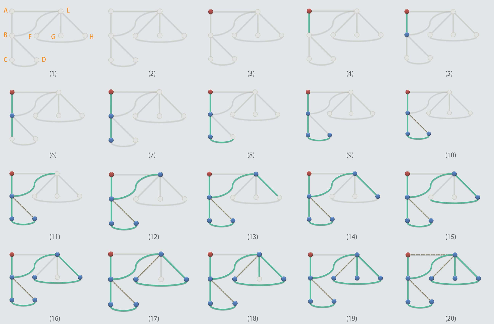
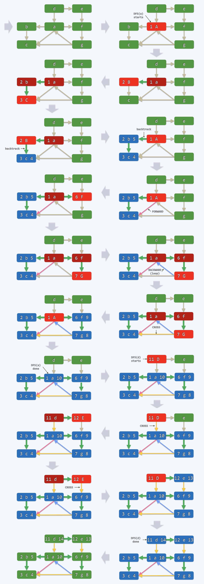
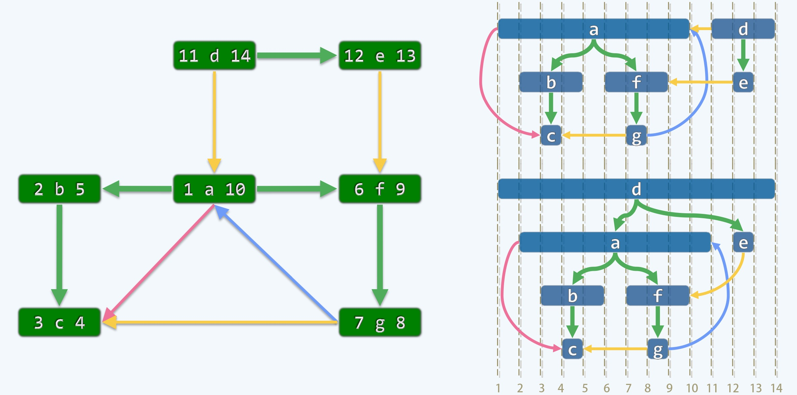
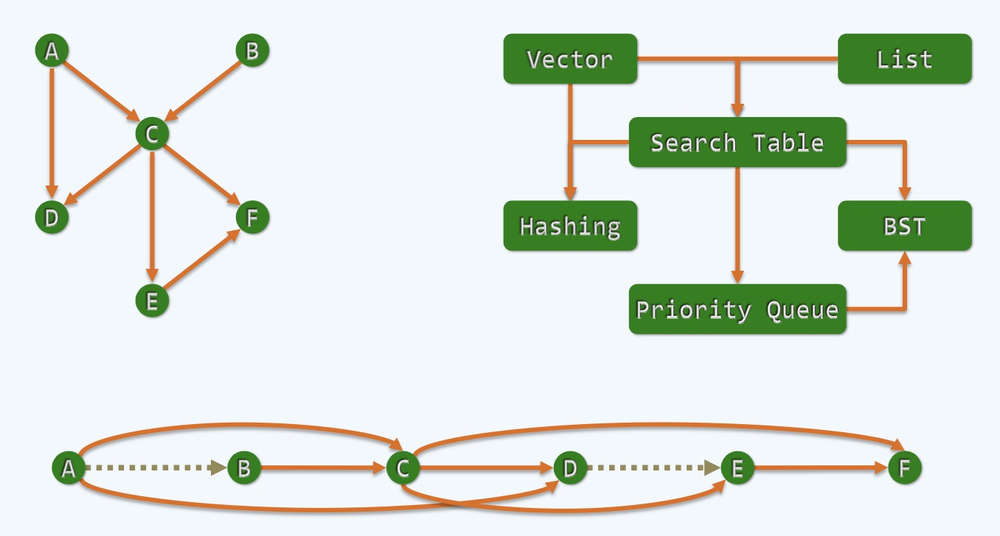
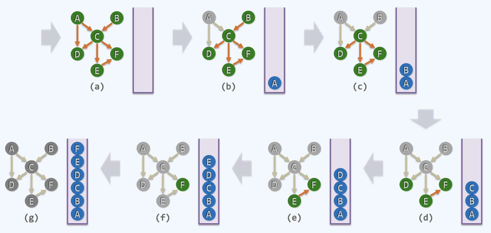
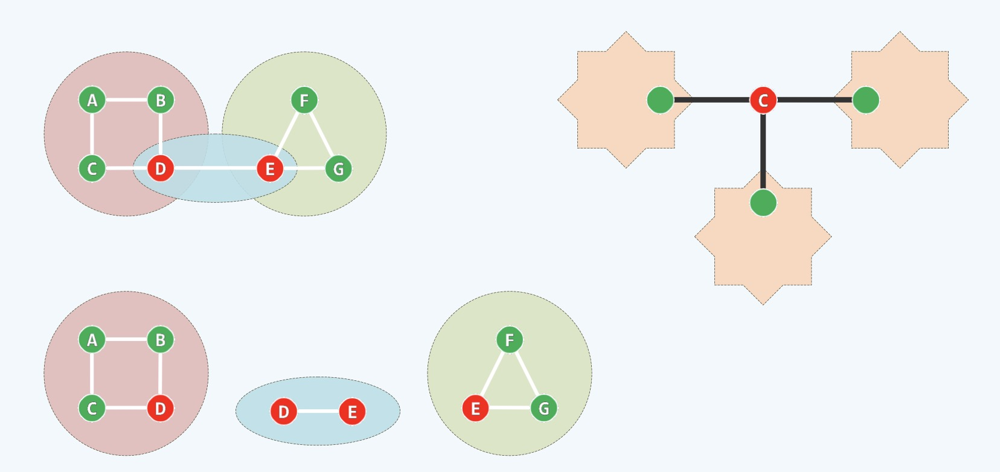
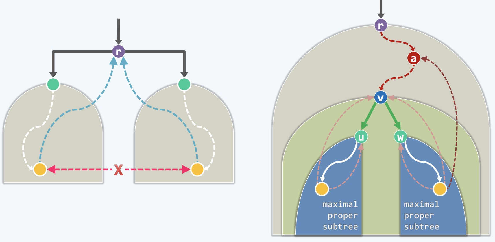
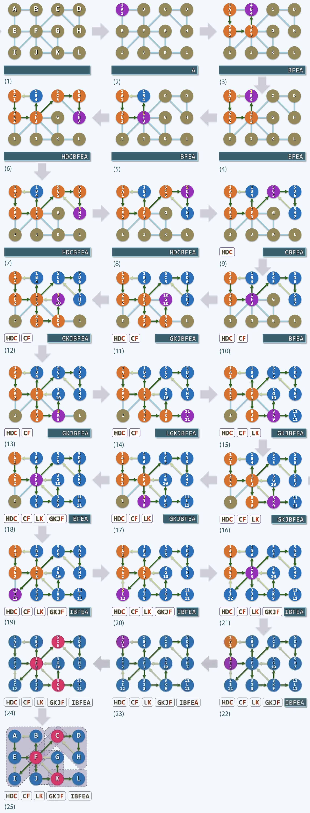

图搜索 Graph Search
---

### 图搜索的分类

- BFS广度优先(宽搜)
- DFS深度优先(深搜) !!!本文详解!!!

### 深度优先搜索DFS

- 深度优先遍历DFS, 这个策略其实是非常stupid or simple的，比BSF要简单的多
- 同样，我们可以通过一个故事来开始
    * 在古希腊神话中, Ariadne是Crete的国王Minos的公主，她给忒修斯(Theseus)一个线团
    * 使得忒修斯成功进入迷宫杀死牛头怪兽，但事后忒修斯抛弃了她
    * 这是一个有道德意义的故事又或者存在不同的版本, 但不是我们的研究的对象
    * 假如你是一位探险家，要降落在一片未知的迷宫做路线探测
    * 比如降落在一个地点(某一点)，你要知道这个点有几条边(方向)到达潜在的拐点
    * 在任何一个点你都应该知道，当然可以做一个标记，比如撒上一点荧光剂(任何实用东西都可)
    * 标记是用来标识出自己走过的地方，接下来的任务就是要把该区域可达路径画出来
    * 不失一般性，我们先画一个未知的路线图，我们随便画一幅图，如下图
    * 我们假设一开始自己未知路线，这个路线图是上帝视角，人类未知(灰色)，只能一点点探索
    * 我们可以把上帝视角下的所有拐点标记为：A,B,...H，以备后续的说明使用
    * 假设我们的降落地点是红色的A点，一开始就通向2个方向，不同于BFS，DFS不能多向走，只能选择一个方向
    * 不失一般性，我们可以选择向下去的一条(绿边)，如下图4所示，持续向下走，会抵达一个拐点，蓝色点，如图5
    * 接下来你会发现又出现了3条可走的路线，你可以继续任意选择一个方向，如下图6所示
    * 继续往前走，每走到一个拐点，就进行一次标记(比如洒下荧光剂)，你会发现这个过程有点stupid
    * 简单来说，就一条路跑到黑，基于这个策略其实是非常美妙的，可以解决很多算法解决不了的问题
    * 这时候，你已经走到如图9的位置了，你会发现似乎有一条边可以过去，但是走过去之后发现了自己洒下的标记
    * 你会知道，这个方向通往的地方，你曾经访问过，这时候这条边可以做一个特别的记号，就是所谓的跨边，如图10所示
    * 按照惯例，我们访问过的这些绿色的边，叫做TREE EDGE, 而灰色的跨边叫做CROSS(因为会构成环路)
    * 当我们发现走进了跨边之后，就要进行回退，因为绿色的边构成的是一棵树
    * 而树中的任意两个点之间有唯一的通路，所以回退的方向是唯一的，就是逐个找到自己的parent
    * 回退到B点之后发现有2条可选的路，我们很快会发现其中有一条路存在标记(CROSS边)
    * 于是就剩下最后一个方向了，如下图11所示，继续往前走，到达拐点，如图12所示，紧接着发现还有3条可选的路
    * 继续按着以往的策略任选一条，如下图13，14，15，到达图16的时候，又会标记一条CROSS边，如图17
    * 继续做回退，当到达E点的时候，发现又可以往前走，最终到达一个死胡同，如图19所示，这样只能继续回退一直到初始红点A
    * 然后对新发现的CROSS边进行标记，如图20，到这个时候，整个遍历完成

<div align="center">
    
    <br />
    <div style="text-align:center">备注：图片托管于github，请确保网络的可访问性</div>
    <br />
</div>

**算法实现框架**

```cpp
template <typename Tv, typename Te> // 顶点类型、边类型

void Graph<Tv, Te>:: DFS(int v, int & clock) {
    // v是起点，clock是计时器，dTime为每个点都加上时间戳
    dTime(v) = ++clock;
    status(v) = DISCOVERED; // 发现当前顶点v
    // 考察v的每一邻居u，枚举所有的邻居，这里的邻居都是当前节点的孩子节点
    for (int u = firstNbr(v); -1 < u; u = nextNbr(v,u)) {
        // 视u的状态，分别处理
        switch(status(u)) {
            case UNDISCOVERED: // u 尚未发现，意味着支撑树可在此拓展 (类比BFS的初始植被状态)
                type(v, u) = TREE; // 树枝向前迈进
                parent(u) = v; // 从v到孩子u之间的关系
                DFS(u, clock); // 新的起点，开始递归，向孩子节点进发，贪心处理
                break;
            case DISCOVERED: // u 已被发现但尚未访问完毕，应属被后代指向的祖先 (类比BFS的燃烧状态)
                type(v, u) = BACKWARD; // 这是一条回边，进行标记处理
                break;
            default: // u已访问完毕(VISITED, 有向图)，则视承袭关系分为前向边或跨边 (类比BFS的灰烬状态)
                // 通过时间戳来判断是向前边还是跨边
                type(v,u) = dTime(v) < dTime(u) ? FORWARD : CROSS;
                break;
        }
    }
    status(v) = VISITED; // 处理完所有孩子节点之后，标记自己为已访问
    fTime(v) = ++clock; // 至此，当前顶点v方告访问完毕，fTime是指结束时间
}
```

- 我们可以看到上述算法中有4种边：TREE、FORWARD、BACKWARD、CROSS, 下面我们会详细来说明

### DFS算法步骤图解

<div align="center">
    
    <br />
    <div style="text-align:center">备注：图片托管于github，请确保网络的可访问性</div>
    <br />
</div>

- 上面是一个有向图, 每一个节点都是一个圆角矩形，不失一般性，我们从a开始
- 圆角矩形上的每个点都有左右两个空间用于记录dTime, fTime的数字
- 圆角矩形的颜色和状态分别对应：绿色(UNDISCOVERED), 鲜红(最活跃的点), 暗红(活跃的点), 蓝色(VISITED)
- 大小写用于辅助颜色的区分, 如果可以看清颜色, **可以忽略字母的大小写**, 此处不再过多说明
- 对于a来说，作为起点, 在第一个单位时间内会被点着，从绿色变成鲜红，a接过控制权之后，去找到他的邻居
- 请注意这时候，它会贪心的找邻居中的一个优先做，不失一般性，在第二个单位时间把b点燃
- 这时候b变成鲜红色，a从鲜红变为暗红，立足于b, 真正的邻居只有c, 这个时候在第三个时间单位
- c被点燃变为鲜红，b变为暗红，因为是有向图，c点走投无路就会执行代码中的default，变为VISITED状态的蓝色
- 而且c点的fTime进行clock++, 从3变为4，意味着这个点从第3个时间单位被发现，但在第4个时间单位被耗尽了
- 这个时候程序是递归的，在递归的意义上它会做一个回溯(backtrack)，从c到b, b的颜色从暗红变为鲜红
- 这时候b想要找周围的邻居，发现已经没有可找的邻居了，b点走投无路变为蓝色，它的fTime变为了5
- 同理，继续进行回溯，从b到a，a从暗红变为鲜红，a还有邻居，如c,f, 如果选择邻居c, 那么这时候就有意思了
- 当前活跃的点a试图通过一条有向边去指向死亡状态的点c，这种情况在有向图才会发生
- 如果不是有向图，而是无向图，每一条边都是对等的，当一开始到达c点的时候，c不会变为蓝色而是会去找无向图中的邻居, 比如a
- 所以这是一件不可能的事情，在有向图中才会发生这种奇特的现象：活跃指向死亡, 从a->c这种
- 按照程序中的设定，`dTime(a) < dTime(c)`, 这时候a->c是一条FORWARD的边，在图上标记为粉红色的边
- 如何理解这个FORWARD边，绿色的箭头都是将来构成树的树枝，一旦构成树就会有辈分高低之分
- c的备份从图上看要比a低2层, 就像是爷爷照顾孙子，我们称之为FORWARD
- 好的，回到流程中来，标记完a->c为FORWARD边之后，a要继续寻找它的邻居，这里找到了f点
- 此时, f的dTime为6，f会试图在第7个时间单位找到g, g会继续寻找它的邻居：a和c
- 好的，这个时候，故事又来了, a的辈分很高, a是g的祖先，我们称之为BACKWARD边(可以理解为孙子照顾爷爷)
- 打个比方，当Theseus在迷宫漫游的时候，他把线团的一头记在了迷宫的洞口，在迷宫中的"遍历"的过程中
- 手里始终攥着那个绳子的线团，每向前走一步，就把线团放一步, 每一次做backtrack, 手就会收这个线团
- 因为收放，绳子忽长忽短，正是这条绳子，可以让他原路返回。回到算法中来，每一个节点都是辈分明确的
- Theseus的线就像是上图中任意时刻红色节点和它们的连边，关于辈分就像是绳子一样, 末端的点辈分最低
- 辈分低的到辈分高的方向的边就叫做BACKWARD边，用浅蓝色箭头表示，如g->a
- 从图上可以看出，每一次BACKWARD的出现，就会构成一个环
- 所谓的环，如果在有向图中是有方向的，如a->f->g->a
- 而a->b->c并不能构成一个环，因为方向的原因，a->c属于FORWARD边
- 这个时候，我们可以判断一个图是否是树，以及找出图中所有的环
- 好的，再次回到流程中来，g会继续寻找它的邻居，找到了c, 这个时候活跃点g试图连接死亡的点c
- 这个情况之前也碰到过，如a试图连接c, 但不同的是，`dTime(g) < dTime(c)`, 这时候g->c就是一条CROSS边
- 所谓CROSS边的理解是共同祖先如a点的不同直系分支下的点，g和c不构成直系的血缘关系，可能是叔伯兄弟的关系
- 也就是跨越两个家族之间的边就是CROSS边，这个算法可以继续跑下去，直到最后

### DFS的一些性质

<div align="center">
    
    <br />
    <div style="text-align:center">备注：图片托管于github，请确保网络的可访问性</div>
    <br />
</div>

- DFS是基于一个非常简单策略支撑下的一个算法，但背后蕴含了非常深刻的道理甚至是哲学思想
- 注意上图中左右两部分，其中右边又分为上下两部分，注意图中箭头的颜色，DFS有四种边
- 粉红色代表FORWARD，绿色代表TREE，蓝色代表BACKWARD，黄色代表CROSS边
- 按照DFS模型，从a点开始会生成一棵树, 但是在这个有向图中并没有耗尽所有的点，比如d，e
- 所以，在有向图中选择不同的点作为起点，可能走的过程会不一样，而且得到的DFS树也不一样
- 有的时候是一片森林(多棵树，比如从a点开始)，有的时候是一棵树(比如从d点开始)
- DFS出来的结果更多的时候出来的是一片森林，我们想从中找出一些不变的性质
- 其中dTime和fTime这对时间戳有非常显著的意义, 通过它们可以把每个点画成一个更长的一个矩形
- 如上图右边部分，横向可以表示程序中clock所走的时间轴，如上图1 ~ 14
- 任何一点，比如a，它是1 ~ 10这个范围(dTime是1,fTime是10)，在图上表示就是跨越1和10的圆角蓝色矩形，如上图所示
- 再比如，f是6 ~ 9，同理是一个跨越6 ~ 9范围的圆角蓝色矩形, 按照这个规则约定，我们画出了上图
- 重点说一下上图右上部分的d点，它是从11开始的，所以，它的后代也都会在11以后
- 我们把蓝色的范围称之为该点的活跃期, 从开始到死亡的周期, 从上图可以看到，任何一个祖先的活跃期一定覆盖它所有的后代节点
- 比如所a的任意一个后代节点，f点的活跃期一定在a点之内，这个关系是几何图形上的关系，从图中很容易理解
- 打个比方说在DFS这个舞台上，无时无刻都在上演一出白发人送黑发人的剧情，祖先先出生，最后再离开
- 在所有的非直系的DFS树中，比如b和f，它们的活跃期永远不会出现重叠，再比如：c和f,g和b
- 通过这个特点，方便我们判断任意两点之间是否直系的血缘关系
- 比较活跃期这个方法，只需要一次比较，也就是O(1)的时间，如果按照回溯的方式，显然比较麻烦

### 基于DFS解决实际问题的算法

1 ) **Topological Sorting 拓扑排序**

<div align="center">
    
    <br />
    <div style="text-align:center">备注：图片托管于github，请确保网络的可访问性</div>
    <br />
</div>

- 这个问题和拓扑没有直接的关系，它是一个离散的关系
- 首先看一下这个图，实际上是我们学习数据结构与算法的一个知识顺序图
- 通过箭头表示知识点的依赖关系，A->C表示要学习C就要先学习A, A是预备知识
- 一般在编写教材的时候要有一个顺序可以让读者能够轻松地看下来，不会因为某一项知识的缺乏导致无法理解
- 有的时候，比如要学习D,就要先学好A和C这样，在编写目录的时候，A和C一定要在D的前面开始
- 最下面的横向图可以理解为目录的组织结构
- 话说回来，任何一个知识体系，其实并不能做到像直线这样的排列，因为很多知识都是平行并列的发生，没有先后之分
- 作为理想的情况，我们可以把知识体系抽象为上面ABCD...这样一个有向图结构
- 我们需要写一个算法来判断是否可以，把这些知识体系排成一个序列使得原来的边都是从前指向后这样的目录关系，而不会倒过来发生
- 如何来做呢？下面我们来说下

1.1 ) **Topological Sorting: In-Degree**

<div align="center">
    
    <br />
    <div style="text-align:center">备注：图片托管于github，请确保网络的可访问性</div>
    <br />
</div>

- 在一个有依托关系的有向图中，必然会出现至少一个点是0入度的点(其Incoming Degree是0，没有Incoming Edge)
- 比如上图的A和B, A和B都是一本书的预备基础知识，找到0入度的点就是我们算法的着眼点
- 如果没有0入度的点，那么每一个点都要依赖其他的点，这样的话就会出现一个死循环就无法进行拓扑排序
- 如果有0入度的点，任择其一，比如选择A点，准备一个栈来记录(存放)，等效的来说，处理完A点之后
- 可以认为A点不存在, 打个比方，第一学期之后，假装没有第一学期，从第二学期开始学习，也就是过河拆桥
- 如果这个过程还能持续下去，到C点之前，还需要一个0入度的点即B点, 处理完B之后，将B忘掉
- 这时候到了C点了，等效于C点是一个0入度的点, 把C取出记录到栈中去，按照这种方式直到最后将所有学期的课程都排好
- 所有的课程都会排列到一个倒序的栈中，自底而上，这是一种解决方案，但还不是很高明
- 如何才能更高明的处理呢? 我们下面来谈

1.2 ) **Topological Sorting: Out Degree + DFS**

<div align="center">
    
    <br />
    <div style="text-align:center">备注：图片托管于github，请确保网络的可访问性</div>
    <br />
</div>

- 以终为始，我们要思考最后一个点应该是怎样的，换句话说，大学中最后一学期应该学什么课程
- 如果大学课程是合理的，可以进行拓扑排序的话，那么最后一门课必然存在, 没有任何一门课依赖于它
- 它应该不作为任何一门课程的先修课(预备课)，用专业术语来说，它的Out Going Degree是0(没有发出的边)
- 如何发现这类点，如果用之前一个个找出来删掉来倒序排列就显得很愚笨了，其实通过一次DFS即可发现
- 从任何一点出发，不失一般性，比如从C点开始最终会到达一个点, 假如第一步到达D点，之后立即回溯并入栈
- 回到了C点又有多种选择, 它可以到E，然后到F, 这时候F开始回溯并入栈，然后从E继续进行回溯并入栈
- 之后又一次回到了C点, C点无路可走随机也入栈，这个过程中逐步回溯，每一次回溯从效果上来看等效于回溯点不存在
- 我们的原则是一旦回溯就要把它push到栈中去，如果这里只有CDEF几个点的话，那么CEFD就是大学中正确学习的一个有效次序
- 这时候，我们可以看到还有A和B没有处理，没有关系，我们可以继续DFS, 比如从B再次开始，B在这个有向图中是祖先
- B->C这条边是FORWARD边, 做了一次标记，随机进行回溯并入栈，这时候还剩下A点，对A继续进行BFS
- 同理，A标记之后也会随即入栈，我们可以看到最后的这两步，A和B的次序是可以颠倒的，没有关系
- 从任意一点开始，按照这种算法都可以得到很多种解决方案，Begin With End In Mind 始终记住以终为始的哲学思想

2 ) **BCC: Bi-connectivity/Cut-Vertex 双连通分量**

<div align="center">
    
    <br />
    <div style="text-align:center">备注：图片托管于github，请确保网络的可访问性</div>
    <br />
</div>

- 所谓连通性
    * 如果一个图中任何两个点之间存在一条路，那么两点是彼此连通的
    * 如果图中任何两个点都彼此联通的，那么这个图是连通的
- 所谓Bi-connectivity双联通性，我们首先要了解下Cut-Vertex(切分点)
    * 上图可以理解为两个区域和一座桥的交通图，可以看到，D和E两点对于整个交通图来说是非常重要的
    * D和E任意一点缺失都会把一张图变成2张，互相之间不能沟通，所以D和E这种点叫做Cut-Vertex
    * 如果我们在D和E点做切点，就会把图分成若干块，如上图是分成了3块
    * 接下来被切分的部分变得更加紧凑了，而且删除被切分部分上的任意一点都不会再造成分离成不连通的子集
    * 比如删除下面这粉红色区域的任意一点，不失一般性，比如A点，也不会分离整个粉红区域
    * 而不再存在Cut-Vertex的区域，我们就称为双联通分量(Bi-Connected-Component)，比如：粉红区域，浅蓝区域，浅绿区域
    * 这里Bi暗示的是双路，它会组成一个环路，一个环有双保险的意思，比如切断了其中一条，从另一条路还可以实现继续连通
- 现在任务很艰巨，我们希望任意给你一个无向图都可以把其中的Cut-Vertex找出来，包括由其切割的双联通分量
- 我们可以用DFS来解决这个问题，如何解决呢?

<div align="center">
    
    <br />
    <div style="text-align:center">备注：图片托管于github，请确保网络的可访问性</div>
    <br />
</div>

- 从任何一个点出发，做一个DFS，得到一棵DFS树，树中有很多路径，脉络式的边，不会存在环路
- 我们先把目光注意在最底层的叶子节点，这些点都不会是Cut-Vertex，必然不会影响整体的连通性
- 那么DFS树的根节点(不失一般性，我们称之为r点)是不是呢，其实这个取决于当初的选点，由其在图中的地位决定的
- 主要考虑在做完DFS之后r点的Out Going Degree是几，如果是1度(也就是由r发出的边为1个)
- 那它不会成为Cut-Vertex，因为它的存在与否对其他点是否连通没有任何影响
- 如果r点的Out Going Degree是>=2的，不失一般性，我们看2度的情况
- 这样的话，也就是说r有2个孩子(L、R), 每个孩子都是一棵独立的家族树，如上图(左)所示
- 这时候r点肯定是Cut-Vertex，显然它会造成L、R两部分分离, 同理2度以上更是如此
- 由此，我们来判断DFS树的根节点是否为Cut-Vertex只需要判断它的Out Going Degree是1还是大于1
- 还有一种比较复杂的情况，就是如何判断DFS树中的内部节点是否是Cut-Vertex, 如上图(右)所示
- 不失一般性，我们取内部节点v，v点到根节点r必然有唯一的一条路径，如深红色的虚线路径
- 同时，如果，v有两个孩子家族, 这时候，我们就要看这两个家族之间的关系
- 如果v只有1个孩子，那么v也必然不会成为Cut-Vertex，如上图(右)所示
- v有两个子家族，比如右边的家族，如果有一点，比如黄色节点，它有一条边能够连接高于v节点的某一点如a点
- 也就是说v的BACKWARD边能够达到辈分更高的a点，也就是v的祖先，那么这时候v相对于其后代家族来说
- 不会起到关键的连通作用，这种情况，v删除后，下面的点和上面的点依旧可以连通
- 这时候，我们再来看v左边的孩子家族, 其中的任意一点，比如黄色节点，它也有一个BACKWARD边
- 只不过这个BACKWARD边能够连接的祖先辈分没有v点的高，如u点，最高到v点
- 这时候，v点删除后，以u点为根的家族将会和整体分离，这时候，v点就非常重要且它是一个Cut-Vertex
- 总结一下，关于内部节点是否是Cut-Vertex，关键看它是否存在一个分支
- 其分支中任意节点的所有BACKWARD边的另一头的点的辈分，都不会高于v点，这时候我们要用到一个指标hca
- hca是heighest connected ancestor的缩写，顾名思义，最高连接的祖先
- hca(v)表示，对任何一点v来说, 它最长的BACKWARD边的所对应的另一头的祖先点，如何找到v的hca呢
- 很简单，在DFS的过程中，对于任意一点如v点，每发现一条BACKWARD边，都要对它的hca进行更新即可
- 更好的方式是把hac指标传递给他的父节点，以至再传递, 再传递...因为都是在一条线上的蚂蚱，父因子荣，传递给父节点更合理
- 那么我们如何来记hac呢，我们知道在DFS中祖先的[dTime, fTime]这个数据范围一定包含所有孩子的
- 祖先的dTime < 后代的dTime, 我们只需要通过min函数保留最小的dTime, 越小就是辈分越高的祖先
- 而且在这里，我们并不需要判断fTime, 而且它的存储记录是空闲的，可以把它和hca(v)等效起来
- 下面我们来看一下算法实现

**算法框架**

```cpp
#define hac(x) (fTime(x)) // 利用此处闲置的fTime[]充当hca[]
template <typename Tv, typename Te> // 顶点类型、边类型
void Graph<Tv, Te>::BCC(int v, int& clock, Stack<int>& S) {
    hca(v) = dTime(v) = ++clock;
    status(v) = DISCOVERED; // 发现v点
    S.push(v); // 顶点v入栈，这个栈记录当下访问过的点
    // 以下枚举v的所有邻居u
    for(int u = firstNbr(v); -1 < u; u = nextNbr(v, u)) {
        switch(status(u)) {
            // 视u的状态分别处理
            // 新点发现
            case UNDISCOVERED:
                parent(u) = v; // 标记父子关系
                type(v, u) = TREE; // 拓展树边
                BCC(u, clock, S); // 从u开始遍历递归做BCC，u会生成一棵DFS树，全部返回后
                // 若u经后向边指向v的真祖先，O(1)的时间进行比较
                if(hca(u) < dTime(v)) {
                    // 这时候u的BACKWARD边的另一端比v的辈分大，v点就不是关键点
                    hca(v) = min(hca(v), hca(u)); // 则v亦必如此，将hca指标挂载给父节点v
                } else {
                    // 否则，以v为关键点(u以下即是一个BCC, 且其中顶点此时正集中于栈S的顶部)
                    // 当全部pop完成之后, BCC的成员会几乎全被pop出来，这里用几乎，是因为还应该包含u的父节点v
                    // 也就是说u的这个BCC分量也会连带包括v本身，此时的v是关键点，只要再通过parent(u)添加它即可
                    // 注意，这里的v并不一定会在S栈中u的下面, 需要用parent(u)来访问v节点
                    // 弹出当前BCC中(除v外)的所有节点，直到u重新出现在栈顶
                    while(u != S.pop()); 
                    // 可视需要做进一步处理 TODO
                }
                break;
            case DISCOVERED:
                type(v, u) = BACKWARD; // 标记为BACKWARD边
                // 如果u不是父节点，换句话说而是祖先节点更新hca
                if(u != parent(v)) {
                    hac(v) = min(hca(v), dTime(u)); // 更新hca[v], 越小越高
                }
                break;
            default:
                // VISITED (digraphs only) 这里只是和DFS的算法做对比，可以忽略本分支
                // 这里的CROSS边实际上是没有意义的
                type(v,u) = dTime(v) < dTime(u) ? FORWARD : CROSS;
                break;
        }
    }
    status(v) = VISITED; // 对v的访问结束
}
#undef hca
```

**图解BCC步骤**

<div align="center">
    
    <br />
    <div style="text-align:center">备注：图片托管于github，请确保网络的可访问性</div>
    <br />
</div>

- 这是一个BCC算法的例子，一步一步的执行，最终得到了5个双联通分量
- 每个节点的数字中上面是dTime,下面是fTime,而且按照之前的说法，把fTime换成了hca指标
- 在这个过程中，我们引入了一个栈，依次把你每次碰到的点一个个存进去, 在有些时候
- 比如在上图(8), H点试图连接C点, C点是H点祖先, C的dTime是5, C把这个值传递给它的父节点D
- D原来hca的指标是6，现在会更新为5，这时候D要继续回溯，回溯到C点的时候，如上图(9)，然而C也要进行回溯
- 这时候，C找到了它的父节点F, F会问C, 你经过一通折腾后, 最高能够着谁啊? C回答，我最高只能到5，也就是我自己
- F点这时候就是一个关键点，它如果被移除，那么它的孩子节点C以及C的后台将会从整个大家族中分离，从连通到不连通
- 这时候就会发现一个BCC分量：HDC, 而它们正好在栈的顶部，直接pop就可以把它们全部pop出来
- 其实这时候的BCC分量不仅包括HDC还应该包括F点，我们可以看到F并不在接下来的栈顶，如上图(9)
- 这时候，通过parent(C)即可找到F，这只需要花费O(1)的时间，但是并不能直接把F分离，作为此时BCC分量的一部分
- 因为F点还可能是其他BCC分量的关键点，这件事情可以一直等效的做下去, 一个一个地切出BCC分量
- 到最后用标准的流程完成了所有BCC分量的分解，总计有3个关键点：C、F、K 以及5个BCC分量，如上图(25)