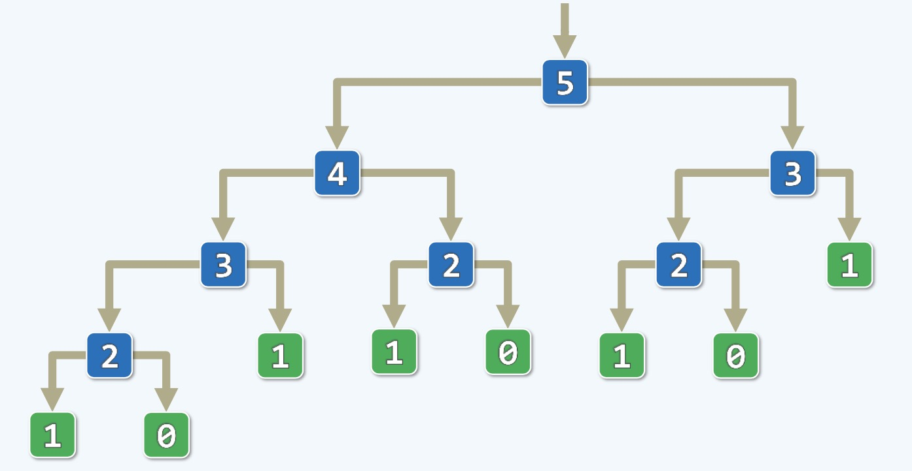
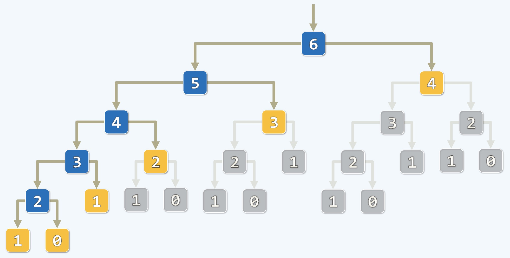
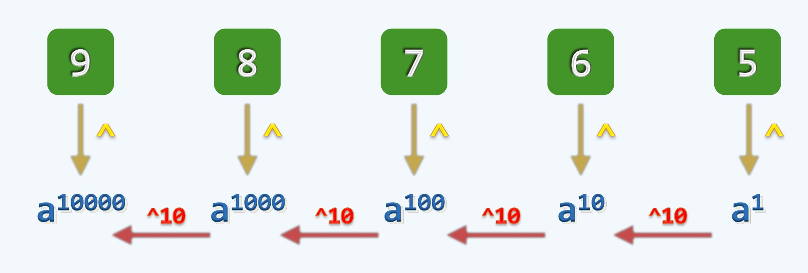
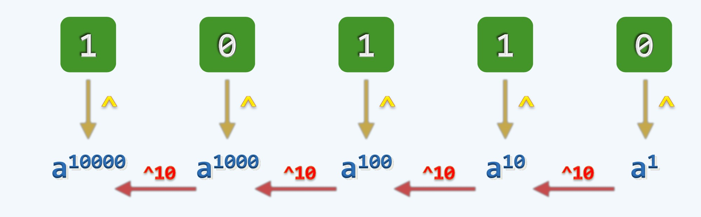
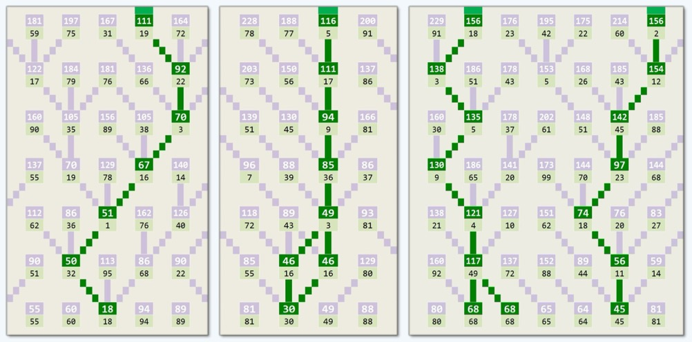
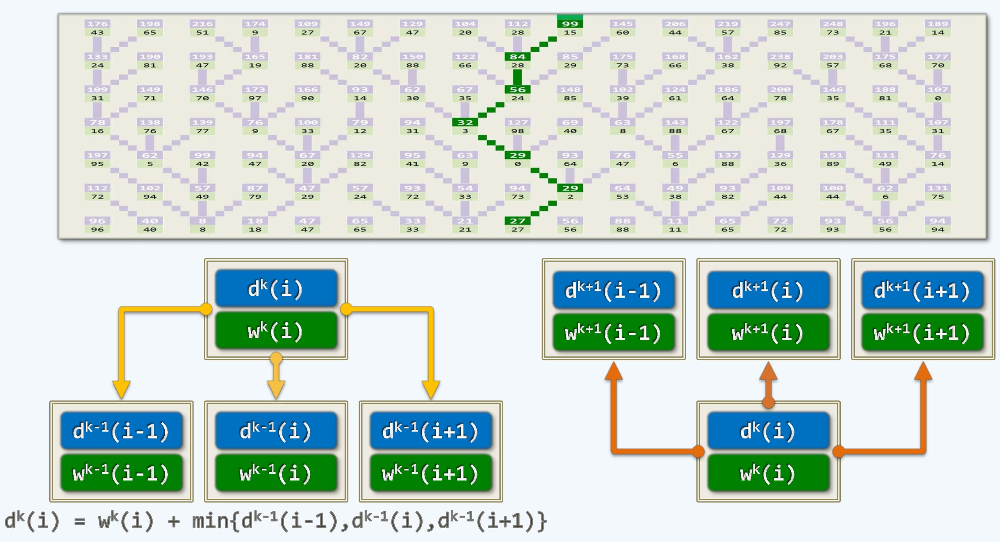
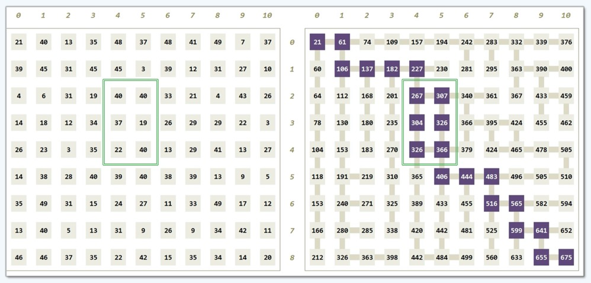
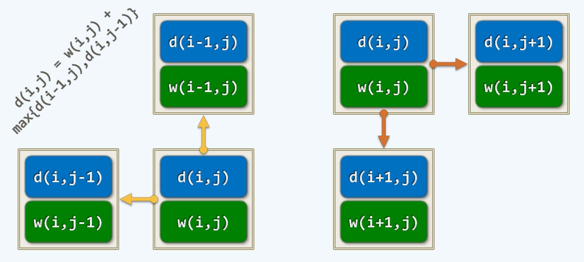

动态规划 Dynamic Programming(DP)
---

### 引语

- 算法的设计不是无中生有的而是有些套路和规律的
- 拿分而治之来说，其中是有一些假设的，假设可以把问题分开包括分得比较均匀
- 如果能做到这样，分治才能变成一个有效的策略，如果分出来的两个问题是有耦合的，此中有彼，彼中有此
- 也就是两个问题不是彼此独立，这时候就会出现很麻烦的事情，比如在企业中，就会出现内耗，资源的浪费
- 这就导致在某一方面工作量的巨大爆炸，因为这时候的沟通成本非常的巨大，工作的推进就会非常的困难
- 在算法中来说，这种爆炸是呈指数级别的，尤其是在递归的时候，动态规划可以有效的发现这一问题
- 当然它也不是万能的，动态规划可以解决问题彼此相关的子任务的同时工作，这些工作重复的东西很多
- 实际上，它只是用了我们常见的策略, 就是把重复的不该重复计算的东西节省下来，仅此而已
- 动态规划只是设计算法的有效的策略之一

### Fibonacci: Recursion 斐波那契数列计算

- 斐波那契数列举例：

<div align="center">
    
    <br />
    <div style="text-align:center">备注：图片托管于github，请确保网络的可访问性</div>
    <br />
</div>

- 斐波那契数的一般计算公式：$fib(n) = fib(n-1) + fib(n-2)$
- 这里的n从0开始，非负数，从2开始，每一项是前两项的和，这个数列其实是呈指数爆炸的
- 我们可以设计一个算法来表达这个公式 `int fib(n) {return (n<2) ? n : fib(n-1) + fib(n-2);}`
- 我们可以看到这个公式的数学定义是一种递归的形式，功能上没问题，我们要关心速度
- 在一般的计算机上，比如我们的笔记本在实现这一算法的时候就会在n=44左右的时候开始慢下来了，它会越来越慢
- 而且我们可以看到这一单线程的程序占用了一定量的CPU资源，我们知道这个算法是不太合理的，只能计算较小的数
- 我们可以简单的来分析一下，我们可以把任何一个递归算法在执行过程中生成的递归实例逐个画出来
- 每个递归实例用方框表示，里面写上数字，数字表示当前计算的项数

<div align="center">
    
    <br />
    <div style="text-align:center">备注：图片托管于github，请确保网络的可访问性</div>
    <br />
</div>

- 我们可以看到某种意义上来说这是一种分治，只是分的不好，一个是计算它的前一项，一个是计算前两项
- 在没有达到0, 1的时候，就会上行下效的进行递归计算，5分成4,3; 4分成3,2; 3分成2,1 ... 
- 直到图上的绿色方块，一旦碰到绿块，就会递归返回，从而自底而上，逐级拼凑，最终得到计算结果
- 我们可以看到为了计算第5项，竟然生成了这么多的递归实例，如果项数级别高了，我们已经预感到了爆炸
- 这些递归实例很多都是无谓的，也就是重复的，越是底层的递归实例，被调用的越频繁，这是上面算法的缺陷
- 我们可以用递推式来计算下时间
    * 1 ) $T(n) = T(n-1) + T(n-2) + 1 > 2 \cdot T(n-2) + 1 = O((\sqrt{2})^n)$
        * 在上面第一个式子中，求解第n项，分而治之转化为计算第n-1项和第n-2项，其时间复杂度分别为：$T(n-1), T(n-2)$
        * `+1` 是算法中的三目判断和加法计算所需时间
    * 2 ) $T(n) = T(n-1) + T(n-2) + 1 = O(fib(n+1)) = O(\phi^n), \phi = (1 + \sqrt{5}) / 2 = 1.618...$
        * 按照这种思路递推下去得到结果, 计算斐波那契数第n项的时间, 从渐进的来说就是斐波那契数本身，区别是向后平移一位`fib(n+1)`
        * 从常数意义上来说，无非是 $\phi^n$, 斐波那契数本身是有通项的，其通项取决于$\phi$和$\phi$的共轭数$(1 - \sqrt{5}) / 2$
        * $\phi$和它共轭的数一个是1.618，一个是0.618，二者就差了1, 通过Big-O记号来去粗存精，保留>1的项，也就是把$\phi$记下来
- 也就是说计算斐波那契数第n项的时间是$\phi^n$，我们知道>1的数字，其指数是爆炸型的
- 这里有一个技巧叫做"封底估算"(back-of-envelope evaluation), 也就是我们在信封的背面稍微划上几笔就能算出
- 为此我们要积累一些经验，懂得一些技巧，比如$10^3 \approx 2^{10}$, 对于$\phi$来说，$\phi^5 \approx 10$, 这个比较粗糙
- 有一个更接近的估算为：$\phi^{36} \approx 2^{25}$, 更好记的方式是：$\phi^{6^2} \approx 2^{5^2}$
- 我们一般的计算机用的都是GHZ, 其数值大概1s的吞吐量是$10^9 \approx 2^30 \approx \phi^{43}$
- 所以，我们可以看到为什么上述算法在计算40多项的时候开始变慢了，这是因为这时候计算该项CPU要跑1秒钟，所以人会感觉到延迟
- 如何解决这个慢的问题呢，我们就需要用到动态规划

### Fibonacci: Memoization 记忆化

- 通常的递归操作是在一次计算中，会通过一个递归实例唤醒另一个递归实例，接着继续唤醒下一个...最终协同计算出结果
- 如何避免递归中的重复事情，所谓记忆化就是好记性不如烂笔头，在计算过程中创建一个look-up table查询表
- 专门用于存储和查询，在Fibonacci这个案例中，可以把查询表设计成一个一维数组
- 将重复的数据存储在其中，经过一次查询即可知道是否进行复杂的递归操作
- 比如4这个递归实例, 先不贸然进行分治，因为贸然去做可能会演化出爆炸，所以需要慎重
- 可以现在这个查询表中查询一下，是否存在4所对应的结果，如果存在则直接返回，不存在，则递归并存储
- 每计算出一个值就将该值记录，下一次只需要查询就不必进行计算了，进而节省了大量重复的计算
- 在这个过程中，我们的时间收获会非常大，而只不过多了一张查询表，而这张表的空间并不大, 查询和存储时间也很快
- 不仅是Fibonacci这个案例，其他的一般递归计算也同样适用，比如下面这个比较简单但低效的算法
    ```python
    def f(n)
        if(n<1) return trivial(n) # 足够小的时候是一个trivial case
        return f(n-X) + f(n-Y) * f(n-Z); # 递归调用此前计算的各个项，这里不是Fibonacci的二分支了，而是三个，甚至可以是更多
    ```
- 通过look-up table进行改进，改进后的算法示例，伪代码实现
    ```python
    T M[N] # 初始化一个一维表, T表示基本类型视应用而定，N表示足够的项数

    def f(n)
        if(n<1) return trivial(n)
        # 必要时再递归并存储结果
        # 判断是否存在M[n]
        if(M[n] == UNDEFINED)
            M[n] = f(n-X) + f(n-Y) * f(n-Z)
        return M[n] # 将结果return出去
    ```
- 这时候，我们可以通过下图来看下节省后的时间，不失一般性，我们还用Fibonacci的案例

<div align="center">
    
    <br />
    <div style="text-align:center">备注：图片托管于github，请确保网络的可访问性</div>
    <br />
</div>

- 灰色部分是节省下来的递归实例，黄色的实例表示不用递归，直接终止
- 蓝色部分是真正有效的递归实例，可以看到没有重样的，特别说明一下黄色部分
    * 一些计算实例不仅可以提前终止，因为上层被提前终止了，所以它们实际上并不存在
    * 不存在是指不会被生成出来，当然从逻辑上来说是存在的，实际上不会花费任何时间
- 这样就解决了指数爆炸的问题，所以这是一个非常好的解决方案
- 动态规划就是这样一种解决指数爆炸的问题，Memoization是动态规划中的一种基本策略

### Power: $a^{98765}$ 指数计算

- 给一个任意整数来计算它的高阶次方，也就是幂运算，如标题所示，98765次方需要多少时间
- 一般而言，一个个计算需要98765次，也就是n次方需要O(n)的时间，如何优化呢?
- 任何十进制的数字都可以分解成若干项，比如：
    * $a^{98765} = a^{9 \cdot 10^4 + 8 \cdot 10^3 + 7 \cdot 10^2 + 6 \cdot 10^1 + 5 \cdot 10^0}$
    * $= (a^{10^4})^9 \cdot (a^{10^3})^8 \cdot (a^{10^2})^7 \cdot (a^{10^1})^6 \cdot (a^{10^0})^5$
- 这里隐藏的奥妙是，有多少位就分解为多少子任务, 98765有5位

<div align="center">
    
    <br />
    <div style="text-align:center">备注：图片托管于github，请确保网络的可访问性</div>
    <br />
</div>

- 任何一个位的计算都会有一个基底base, 我们可知，个十百千万这5位各个位数的基底分别是：$a^1, a^{10}, a^{100}, a^{1000}, a^{10000}$
- 前后每一位基底的差异是10次方的关系，可以从前一个基底很方便的得到下一个基底，得到每一个基底只需要O(1)的时间
- 得到基底之后，为了得到每个子任务的解，只需要再花一个O(1)的时间就够了，也就是乘一个倍数
- 之后再进行各个位数的加法运算，同样是O(1)即可得到最终结果，这样看来，我们并不需要O(98765)的时间了，算法得以大幅优化
- 一般来说，关于数值计算问题的规模并不是用n来度量的，我们计算$a^n$, 这个问题的规模并不是n
- 一个问题的规模应该是用于描述这个问题所需空间的量，为了描述计算$a^n$这个问题，只需要log n的空间即可
- 比如，我们表示1万，不用1万个1来表示，而是通过进制来表示：10000，所以对这个问题来说log 10000=4才是问题的规模
- 我们一般管这种问题规模叫做r, $r = log n$, 对于我们的指数运算案例来说，从最原始的计算需要: $O(n)=O(2^r)$ 也就是指数算法
- 现在通过D.P.只需要：$O(2r)=O(r)=O(log n)$, 两者之间的效率是有非常巨大的鸿沟的, 这个才算得上是一个算法
- 而且，我们10进制的运算并不快，可以把它翻译成2进制，如下是二进制计算的案例

### Power: $a^{10110b}$ 二进制指数计算

- 如果要计算$a^{10110b}$这个二进制指数运算，我们知道
- $a^{10110b} = a^{1 \cdot 2^4 + 0 \cdot 2^3 + 1 \cdot 2^2 + 1 \cdot 2^1 + 0 \cdot 2^0} = (a^{2^4})^1 \cdot (a^{2^3})^0 \cdot (a^{2^2})^1 \cdot (a^{2^1})^1 \cdot (a^{2^0})^0$

<div align="center">
    
    <br />
    <div style="text-align:center">备注：图片托管于github，请确保网络的可访问性</div>
    <br />
</div>

- 十进制的10次方，在二进制的10次方来说就是平方，所以二进制每平方一次就会得到下一个基底
- 同时很多运算还可以转化为移位运算，如下

### Power: O(r) = O(log n)

- 二进制可以通过移位来进行更快的运算，如下

```cpp
int power(int a, int n) {
    int pow = 1, p = a; // O(1+1)
    while(o < n) { // O(logn)
    if(n & 1) // O(1)
        pow *= p; // O(1)
        n >> = 1; // O(1)
        p *= p; // O(1)
    }
    return pow; // O(1)
}
```

- 指数运算可以在O(logn)也就是位数O(r)的时间里求得结果
- 有意思的是，回到最开始的Fibonacci案例中，如果熟悉矩阵运算的话，可以写成这么一个矩阵：$A = \begin{bmatrix} 0 & 1 \\ 1 & 1 \end{bmatrix} = \begin{bmatrix} fib(0) & fib(1) \\ fib(1) & fib(2) \end{bmatrix}$
- 一般来说，这个A不断乘下去，通过数学归纳法，有：$A^n = \begin{bmatrix} fib(n-1) & fib(n) \\ fib(n) & fib(n+1) \end{bmatrix}$
- 可以看到左下角，右上角，对角线上是Fibonacci数的相邻三项，对角线重复的那两项，就是第n项，左上角是前一项n-1, 右下角是后一项n+1
- 这说明Fibonacci运算可以转化成矩阵运算，如果这里的A视作刚才的a, 也可以使用上述同样的算法也就是O(r)的时间计算出第n项的Fibonacci数
- 话说回来，这个通过O(r)的时间来计算Fibonacci数在理论上可行，在实际应用中还需要做一些补救措施，加上之后，速度又会降低一些，这里不再赘述

### SPU: Shotest Path Upward

<div align="center">
    
    <br />
    <div style="text-align:center">备注：图片托管于github，请确保网络的可访问性</div>
    <br />
</div>

- 上图的问题描述是：在一个由非负整数构成的矩阵中，找出从最底层通往最高层的一条路径使得路径总长(沿途所经整数的总和)最小
- 我们可以做一个类比，如上图所示，假如你在一家超市结账，结账流程是分门别类去结账，也就是不是像我们生活中的结账
- 而是根据你所购买的类型来结账，比如上图，加入你购物车中购买了如上图所示的7种类型
- 你需要按照流水线逐个类别进行结账，而且是从下到上的(比如，结账的入口是最底层，结账的出口是最上层)
- 每个结账的柜台(格子)由不同的操作员进行结账，而操作员因经验不同，结账的效率不同
- 每个格子由上下两部分组成，下面浅绿色格子内的数字代表操作员结账的效率，上面浅紫色格子内的数字表示当前效率的累计(可以理解为当前花费的效率总成本计算)
- 每次结完账之后，只有三种选择(直接向上，右上方，左上方)如图所示, 进而往上进行下一类的结账
- 也就是说，除了最左右两边的选择只有2种，其他格子都会有三种向上的选择方式
- 我们希望用最快的速度结完账！换句话说是从底向上找到一条花费最小的路线
- 注意：由于作图保持简洁性的原因，除了最两边的格子(2种向上方案)，中间的每个格子都可以找到三种方案
- 当然，这个问题可能会存在一些歧义性
    * 1 ) 最优路线可能会有多分叉，如上图(中)，可以看到有两个相邻的都是16，其结果一样
    * 2 ) 最优路线可能会是多条路径，如上图(右)，其最终结果一致
    * 我们不管这些歧义点，先把问题收敛起来，如何解决最小时间成本的问题

**Recursion vs. DP 递归与动态规划**

<div align="center">
    
    <br />
    <div style="text-align:center">备注：图片托管于github，请确保网络的可访问性</div>
    <br />
</div>

- 我们可以先尝试分而治之，其实它的效率非常的低，如上图下半部分(左)
- 我们可以把上面格子上下两部分数字分别标记为d和w
    * d表示从该格子出来需要的时间(delay)
    * w可以看作是权重weight或等待时间(waiting time)
- 在这里，这个柜台(格子)是分为一行一行的，用肩膀上的k表示第几行(注意：从下到上的顺序)
- i表示在这一行中这个格子是第几列，我们如果想要写出一个通用的算法
- 我们自然而然想到在最上层中m个格子中，找到最小d的格子，它所代表的结账路径就是我们最佳的求解方案
- 我们把这个问题一般化，我们希望得到这么一个算法，在某一给定第k层的某一i单元格子，它所对应的delay是多少
- 当然它本身所需要花费的效率，也就是w是固定的(给定的), 如果我们要从该单元格出来，无非在其前一步中的k-1层最多有三种可能
- 要么从它的正下方进入，要么从它的左下或右下方进入，如图所示，所以第k层该单元的解应该是第k-1层中的三个单元格子的最优者
- 所以，我们分而治之的思路是，分解为左中右三份，分别记为：L,M,R
- 我们形式化描述为：$d^k(i) = w^k(i) + min\{ d^{k-1}(i-1), d^{k-1}(i), d^{k-1}(i+1) \}$, 之后交给递归来处理
- 这种策略虽然可以解决问题，但是和之前的Fibonacci问题一样，也有致命伤，即大量的重复
    * 抽象来说，在第k行，比如第i个格子，它可以分解为下面一层的三个子任务，也就是一分为三
    * 现在的问题是它有邻居，不考虑最左和最右两边，一般性而言，在一层中一个格子有左右2个邻居，也就是$d^k(i-1),d^k(i+1)$
    * 每个邻居同样需要一分为三，分别唤醒它下层的三个格子，可以自己作图看下，这样来说，一般性而言
    * 第k-1行的一个格子就会被重复3次(不考虑左右两头)，而且这才是2层，如果有更多层，就会发生指数爆炸
    * 很快，这个策略就会失效，不是一个好算法
- 那还有什么策略呢，我们知道动态规划中的策略是：凡重复的东西都不要重复的去做
- 我们用之前Memoization记忆化的方案是行得通的，但我们还想更彻底一些，如上图下半部分(右)
- 流程我们都知道了，其实我们可以把它颠倒过来，同样是求解$d^k(i)$, 假设我们已经算出它的值
- 它会对更高层(上层：k+1层)哪些格子的任务有所帮助，不失一般性，不考虑最两边的格子，同样是3个
- 这时候我们有个很好的条件就是递归基，也就是第1行(按程序上说，我们可以称为第0行，也就是最下层)
- 我们把这一行每个格子作为一个子任务，它的解是最平凡的，也就是trivial case，它的解直接可以得到
- 这点很容易理解，这样，我们可以逐层的给上一层的三个格子提供offer, 这样一来，一般性而言
- 上一层(第二层)上的格子就会收到3个offer(暂不考虑两端格子)，这时候就可以用上面的数学公式取最小值了
- 其实本质上的计算和之前一样，只是次序颠倒了过来，一旦第二层的格子都得到了最优解，就可以效仿同样的逻辑
- 继续向着上一层提供offer, 逐层而上到达最上层, 在最上层中找到最小值，就是我们花费的最少时间
- 所以，我们知道，通过动态规划解决这一问题最好的方式不是Memoization而是逆向思维(也就是递推)

### LMP: Longest Manhattan Path 最长曼哈顿路径

<div align="center">
    
    <br />
    <div style="text-align:center">备注：图片托管于github，请确保网络的可访问性</div>
    <br />
</div>

- 这个问题是这样的，你在曼哈顿街区(不失一般性, 比如矩形区域)居住，同样公司也在这里
- 你家在左上角，公司在右下角，每走过一个格子就会有一个红包可以领取
- 我们在不耽误上班(不走回头路, 只能向右向下)的情况下找到一条最好的路径让沿途红包总量最大
- 我们把这个问题叫做最长的曼哈顿道路，这也是一个典型的动态规划的问题，我们来看下这个问题如何解决

**LMP: Recursion vs. DP**

<div align="center">
    
    <br />
    <div style="text-align:center">备注：图片托管于github，请确保网络的可访问性</div>
    <br />
</div>

- 我们把抵达到每个格子得到红包最大数作为一个子任务，用上图(左)来描述
- 比如第i行，第j列捡到的红包总量定义为：d(i,j), 格子本身的红包用：w(i,j)表示
- 从这里我们也可以分而治之来看，不失一般性，如果要到达d(i,j)这个格子
- 只有两种情况：从上边过来和从左边过来，如果要到达d(i,j)最大
- 只有要么d(i,j-1)最大,要么d(i-1,j)最大，我们只要对比一下两者的大小
- 即：`d(i,j) = w(i,j) + max{d{i-1,j}, d(i,j-1)}`
- 这样的话，一般性而言，我们会想到，从公司到你家来计算
- 每个局部都是向上和向左蔓延，总体来说，通过递归的分而治之，从公司一直到你家里
- 好在有递归基，最上面一行和最左边一列的解是可以直接得到的
- 但是，这个过程也同样蕴含很多的风险，也就是大量的重复，指数爆炸
    * 我们可以把一个任务分解成2个子任务，站在子任务的角度来说，在整个往左上角递归向上的过程中
    * 每个子任务可能被多次唤醒，可能是它右边格子唤醒，也可能由它下面的格子唤醒
    * 因为右边格子和下面格子本身都会多次被唤醒，这样迭代起来就会出现指数爆炸
    * 所以这样，也不是一个好的算法，只能计算较小的数值
    * 如何解决这个问题呢？
- 我们同样倒过来思考，也就是直接从你家到公司，也就是递推, 如上图(右)
    * 刚才是立足于某一个未知问题的求解，降解成两个较小的问题，这会造成指数爆炸
    * 现在倒过来思考，立足于相对更小的问题，假设它已经解决了(因为有递归基的存在，假设成立)
    * 通过它给和它相关的一个或多个更大的问题提供一个解决问题的候选方案
    * 这个候选对于更大问题只需要记下来并不断优化即可，所以这是一个更好的方案
- 这个方案和上面的SPU案例类似