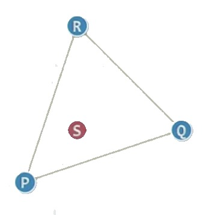
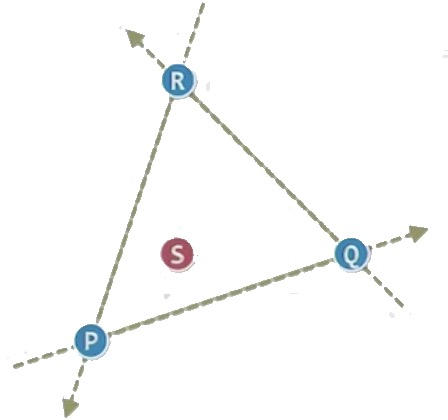

### 概述

- 计算几何是算法设计和分析的几何版本，距今也就40多年的时间

### 关于测试点在三角形内的算法(In-Trangle Test)

<div align=center>
    
</div>

1 ） **问题描述**

- 三角形的三个顶点(PQR), 一个点(S)
- 判断点落在三角形内

2 ) **比较复杂的一些解决方案**

- 思路1：相对点S为中心，遍历三角形的三个点，看下它张开的有向角度加起来是多少
- 思路2：或者发一条射线来判断奇偶次数来判断内外
- ...
- 图形学中的一些方法，不过太复杂

3 ） **简单的实现**

<div align=center>
    
</div>

- 转化为点与三条有向直线的相对位置关系
- 你的面朝向剪头方向, 点在有向直线的左右两半, 是左还是右?

```c++
// 判断点在线的左侧
bool ToLeft() {
    // ... TODO
}

// 最终实现方案
bool InTriangle(P, Q, R, S) {
    l1 = ToLeft(P, Q, S)
    l2 = ToLeft(Q, R, S)
    l3 = ToLeft(R, P, S)
    return l1 == l2 && l2 == l3
}
```