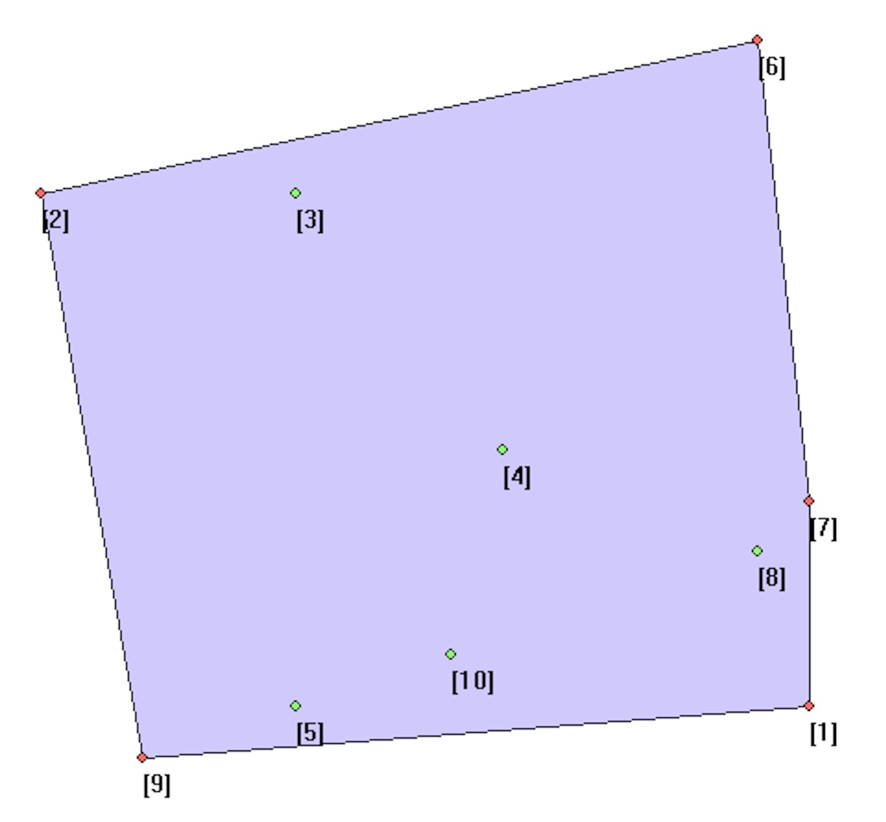

### 描述

- 给定n个二维平面上的点，求距离最近的一对点，输出他们的距离。

### 输入

- 第一行包含一个正整数n
- 接下来n行，每行包含两个整数x,y，表示一个点的坐标

### 输出

- 输出距离最近的一对点的距离，保留两位小数

### 样例输入

- 10
- 7 9
- -8 -1
- -3 -1
- 1 4
- -3 9
- 6 -4
- 7 5
- 6 6
- -6 10
- 0 8

### 样例输出

- 1.41

### 样例解释

    
     
    
备注：图片托管于github，请确保网络的可访问性

     

- 距离最近的点为7和8，距离为 $\sqrt{(7-6)^2 + (5-6)^2} = \sqrt{2} \approx 1.41$

### 限制

- 对于70%的数据，2 ≤ n ≤ 2000，每个点坐标的绝对值不超过$10^5$；
- 对于100%的数据，2 ≤ n ≤ 3×$10^5$，每个点坐标的绝对值不超过$10^9$。
- 时间：10 sec
- 空间：512 MB
