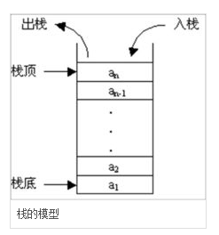

### 栈排序

1 ） **栈结构**

<div align=center>
    
</div>

遵循LIFO原则，last in first out

2 ) **排序**

这里通过插入排序来分析

通过cpp方式实现

```cpp
// 这里使用万能头
#include <bits/stdc++.h>
using namespace std;

stack<int> sorting(stack<int>);

int main() {
    int n;
    cin >> n; // 输入总个数
    stack<int> myStack;
    for (int i = 0; i < n; ++i) {
        int tmp;
        cin >> tmp; // 逐个输入
        myStack.push(tmp);
    }

    stack<int> result = sorting(myStack);
    vector<int> answer;
    while (!result.empty()) {
        answer.push_back(result.top());
        result.pop();
    }
    // 这里可行，auto在c++11中使用
    for (auto it = answer.rbegin(); it != answer.rend(); ++it){
        cout << *it << endl;
    }
    return 0;
}

// myStack：输入栈，栈中的所有元素即是待排序的元素
// 返回值：输出栈，即排序后的序列，满足从栈底至栈顶为升序
stack<int> sorting(stack<int> myStack) {
    stack<int> result; // result存放返回值，即输出栈
    // 输入的随机栈是空的，那么直接返回空的输出
    if(myStack.empty())
        return result;

    int tmp = myStack.top(); // 记录下一个要插入result栈中的数，cpp语言pop后不会返回，通过pop获取栈顶元素
    myStack.pop(); // 弹出栈顶元素
    // 注意这里循环条件的边界判断, 输入栈不能是空的 或 
    // 在输入栈空的前提下，最后一个使输入栈空的弹出元素tmp 小于 输出栈的栈顶元素, 最后一次满足循环条件
    while(!myStack.empty() || (!result.empty() && tmp < result.top())) {
        // 栈顶元素比临时值小，正常push 注意边界条件: 栈空了可以直接接push
        if(result.empty() || result.top() <= tmp) {
            result.push(tmp);
            tmp = myStack.top();
            myStack.pop(); // 更新tmp
        } else {
            myStack.push(result.top());
            result.pop();
        }
    }
    // 输入栈myStack迭代空了，且其最后一个元素tmp大于输出栈result的栈顶元素
    result.push(tmp);
    return result;
}
```

python版本

```python
#!/usr/bin/env pypy3
# -*- coding: UTF-8 -*-

# 用于测试的数据
def sorting(stack):
    '''
        此方法用于栈排序的方法
    '''
    # 边界检测
    if len(stack) != num:
        print('wrong input, please check!')
        return None;
    result = []
    # 检测边界: 初始值为空, 返回自身
    if len(stack) == 0:
        return stack
    # 栈顶出栈并返回栈顶元素 记录下一个要插入result中的数
    aTop = stack.pop()
    # 开始循环
    while (len(stack) != 0) or ((len(result) != 0 and result[len(result) - 1] > aTop)):
        if (len(result) == 0 or (result[len(result) - 1] <= aTop)):
            result.append(aTop) # 直接进栈
            aTop = stack.pop() # 准备下一个元素
        else:
            stack.append(result.pop())
    result.append(aTop)
    return result

if __name__ == '__main__':
    # input 输入
    num = int(input()) # Enter an integer length: 
    stackStr = input() # Enter a list of number split by a space: 
    stack = stackStr.split(" ") # 解析成列表
    stack = [int(stack[i]) for i in range(len(stack))]  # for循环，把每个字符转成int值
    # 进行排序
    res = sorting(stack)
    if res is None:
        print('wrong answer!')
    else:
        # print(res)
        for item in res:
            print(item)
```

输入样例为:

```shell
4
4 3 2 1
```

输出样例为:

```shell
1
2
3
4
```

3 ) **思路**

这里主要思路是：准备2个栈，myStack是初始状态随机输入的栈无序，result是最终的输出栈，有序。将myStack栈顶元素与result中的所有元素做比较，找到合适的位置后将result栈中该位置后面的元素全部依次存到myStack栈顶，之后再将这些移动的元素请回result栈中，达到一次插入排序，如此循环操作，核心思想是：myStack中取出的栈顶与result栈中的栈顶元素做比较。

4 ) **说明**

- sorting函数是主要的排序程序，注意各种边界条件的判断, 参考注释内容
- 问题在哪里: 来回比较效率不高，如果空间紧张且只能用栈来做，也许这是最好的办法
- 这里涉及一个就地(inplace)的问题, 要求算法所使用的空间只有一个单位的常数空间
- 拿cpp版本中`result.empty() || result.top() <= tmp`来说 这里 `<=` 换成 `<` 是不行的
    * 如果存在重复元素，它会进进出出，会出现死循环
    * 输入序列中有两个以上重复元素就会使排序出现稳定性问题，需要注意边界问题
    * 等号成立的时候直接push即可
- 关于逆序对的问题
    * 例如cpp版本中`if(result.empty() || result.top() <= tmp) { ... }` 这里什么时候result是空的，会有几次
    * 初始状态下result一定是空的，也就是压入第一个元素的时候
    * 其他情况下，result被掏空的的情况在tmp比result最小的元素还要小
    * 也就是说，如果原输入栈myStack是有序的，如：...4321这样 ,最多时result被掏空的次数为输入栈的个数
    * 如果原输入栈是有序的，这样：1234...，那么result在最初始化的时候只有一次为空
    * 那么这个else分支为执行几次呢? 这个次数为原输入栈的逆序对数目
    * 对于一个序列如：2967，它有两个逆序对，首先逆序对是两个位置(i,j)
    * 如果i < j 并且 $a_i > a_j$ , 我们说(i,j)是一个逆序对
    * 直白的说，两个元素，相对位置关系和相对大小关系是相反的，这就是一个逆序对
    * 上面2967有两个逆序对,也就是9,6、9,7分别对应的位置，如果从0开始的话是(1,2),(1,3)
    * 在这里输出栈result是单调递增的, 当result栈顶元素要被弹出的时候，一定是tmp小于这个栈顶元素，而tmp在之前输入栈myStack中是栈顶，也就是栈的最右边
    * 最右边位置较大，而值较小，相比之下两者则构成一个逆序对