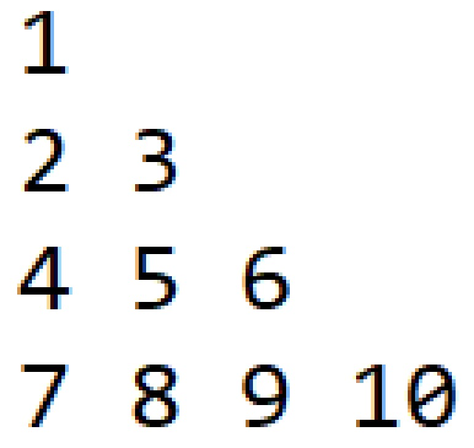

### 问题描述

- 给定一个高度为 n 的“数字三角形”，其中第 i 行（1<=i<=n）有 i 个数（例子如下图所示）

<div align="center">
    
    <br />
    <div style="text-align:center">备注：图片托管于github，请确保网络的可访问性</div>
    <br />
</div>

- 初始时，你站在“数字三角形”的顶部，即第一行的唯一一个数上
- 每次移动，你可以选择移动到当前位置正下方或者当前位置右下方的位置上
- 即如果你在 (i,j)（表示你在第i行从左往右数第j个数上，下同），你可以选择移动到 (i+1,j) 或 (i+1,j+1)
- 你想让你经过的所有位置（包括起点和终点）的数字总和最大。求这个最大值

### 输入格式

- 第一行一个正整数 n，表示数字三角形的大小
- 第 2 行到第 n+1 行，第 i+1 行为 i 个用空格隔开的非负整数，描述数字三角形的第 i 行

### 输出格式

- 一行一个整数，表示经过路径上数的最大总和

### 样例输入

```
4
1
2 3
4 5 6
7 8 9 10
```

### 样例输出

- 20

### 样例解释

- 不停地向右下走即可

### 数据范围

- 对于 50% 的数据，保证 n<=5
- 对于 100% 的数据，保证 n<=1,000，保证数字三角形内的数不超过 $10^6$

### 限制

- 时间限制：2 sec
- 空间限制：256 MB