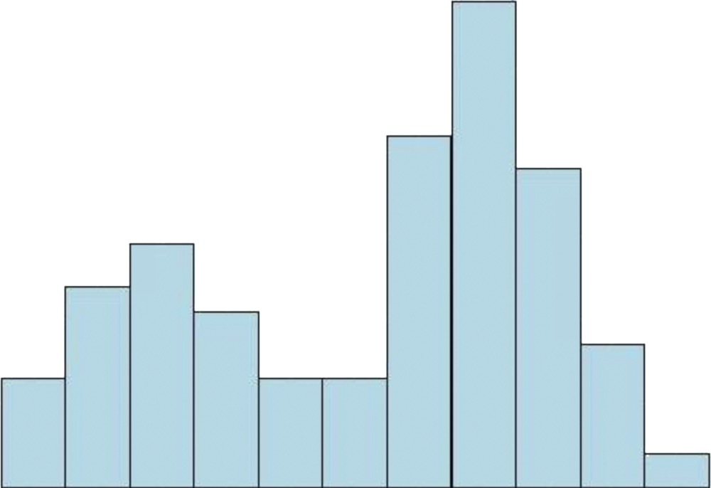

### 直方图最大面积

**问题描述**

- 有n列的直方图，第j列高度为$h_j$, 求一个面积最大的子矩阵

<div align="center">
    
    <br />
    <div style="text-align:center">备注：图片托管于github，请确保网络的可访问性</div>
    <br />
</div>

**格式要求**

- 输入第一行正整数n，第二行n个空格隔开的非负整数
- 数据范围: 所有直方图的列不会超过30000

**数据范围**

- 对于 30% 的测试点，保证 n<=4
- 对于 70% 的测试点，保证 n<=1000
- 对于所有测试点，保证 n<=50000
- 保证所有 h[i] 不超过 32767

### 关键算法实现

1 ) **算法1：时间复杂度为: $O(n^3)$的实现**

**分析**

- 矩形面积为底和高的乘积
- 底部从a到b，那么底边长为: b-a+1
- 高为：$min \{h_i | a \leq i \leq b \}$
- 面积：(b-a+1) * $min \{h_i | a \leq i \leq b \}$
- 蛮力算法：枚举每一条可能的底边, 计算出高, 求出面积再取一个最大的
- 这里效率较低，可能通不过所有数据点，因为普通计算机的瓶颈是10的8次方
- 当n为1000的时候，复杂度是$O(n^3) = (10^3)^3 = 10^9$ 所以无法在1s内通过所有数据测试点

```cpp
/*
* n：表示n列直方图
* h：表示高度的数组，h[i]表示第i列的高度(下标从1开始)
*/
int getResult(int n, int *h) {
    // 最后答案
    int res = 0;
    // 第一层循环枚举直方图左边界位置
    for (int a = 1; a <= n; ++a) {
        // 第二层循环枚举直方图右边界位置
        for (int b = a; b <= n; ++b) {
            // 要求，保证所有 h[i] 不超过 32767，记录最小高度, 这里只做数据的初始化，取一个比最大值大的值即可
            int minH = 50000;
            // 第三层循环从a到b更新最小高度
            for (int c = a; c <= b; ++c) {
                minH = min(minH, h[c]); // 更新最小高度
            }
            res = max(res, (b - a + 1) * minH); // 更新最大面积
        }
    }
    return res;
}
```

总结：太慢了，属于比较原始的蛮力算法，没有任何优化的算法, 这是能够直接想到的

2 ) **算法2：减少循环, 时间复杂度为: $O(n^2)$的实现优化版本**

**分析**

- 考虑无法修改从a到b的底边位置的双重循环枚举，但是可以优化对最小高度的求解
- 从a到b最小高度$H_1$, 和 从a到b+1的最小高度$H_2$之间的关系: $H_2 = min\{ H_1, h_{b+1} \}$

```cpp
int getResult(int n, int *h) {
    // 最后答案
    int res = 0;
    // 第一层循环枚举直方图左边界位置
    for (int a = 1; a <= n; ++a) {
        // 要求，保证所有 h[i] 不超过 32767，记录最小高度, 这里只做数据的初始化，取一个比最大值大的值即可
        int minH = 50000;
        // 第二层循环枚举直方图右边界位置
        // 思路：a到b的最小高度H1 和 a到b+1的最小高度H2的关系：H2=min(H1, h_{b+1})
        // 由此减少了一次循环
        for (int b = a; b <= n; ++b) {
            minH = min(minH, h[b]); // 更新最小高度
            res = max(res, (b - a + 1) * minH); // 更新最大面积
        }
    }
    return res;
}
```

总结：优化思路是在a和b的底之间找到最小高度

3 ) **算法3：通过卡位来计算，时间复杂度为: $O(n^2)$的实现优化版本**

- 对于每一列，找到左右两端的卡位点，左卡位点lo, 右卡位点hi, 形成矩形的面积：$S = (hi - lo - 1) * h_i$
- 枚举所有列需要O(n), 每列找到卡位点也需要O(n)，合起来是$O(n^2)$

```cpp
// 卡位计算, 蛮力算法
int getResult(int n, int *h) {
    // 最后答案
    int res = 0;
    // 第一层循环枚举直方图所有的列, 从1~n, 表示第1列到第n列
    for (int a = 1; a <= n; ++a) {
        // 取出当前列的高度
        int curH = h[a];
        // 左卡位点
        int lo = 0;
        // 右卡位点
        int hi = 0;
        // 第二层找到当前列的左右卡位点，并计算最大矩形面积
        // 找到左卡位点
        for (lo = a - 1; lo >= 1; lo --){
            if(h[lo] < curH) {
                break;
            }
        }
        // 找到右卡位点
        for (hi = a + 1; lo <= n; hi++){
            if(h[hi] < curH) {
                break;
            }
        }
        // 计算当前最大面积
        res = max(res, (hi - lo - 1) * curH);
    }
    return res;
}
```

4 ) **算法4：通过单调栈来计算，时间复杂度为: $O(n)$的实现优化版本**

- 从左至右枚举直方图的每一列，然后维护一个从栈底到栈顶是高度单调上升的栈
    * 比如，当前在k列，经过一系列扫描, 扫描k之前的元素，栈顶元素的高度是当前栈中最大的高度
    * 这个栈存放的是直方图所有列的索引(编号)
- 根据下一个需要插入的列与栈顶的关系，进行弹出栈顶并更新答案或将该列压入栈中
    * 如果当前k的元素高度比栈顶元素的高度要大，那么当前元素k进栈，循环继续往前走
    * 如果要小，则当前的k会作为矩形的右卡位点，栈顶元素作为矩形的左卡位点，栈顶元素的高度作为矩形的高度，算出当时的面积，栈顶元素出栈(已计算完成,出栈)
    * 进而累计得出当前最大面积
    * 循环继续往前走，每次进行判断，进栈和出栈，计算得到当前最大矩形面积
    * 循环结束后即可得到整体最大矩形面积
- 技巧在于左右两边加上哨兵
    * 如果不在左右加上，需要判断各种边界条件
    * 这是一个小trick
- h是高度数组，h[i]表示第i列的高度(下标从1开始)，数组大小为n+2
- 其中前后两端都加一个哨兵，分别是：h[0], h[n+1], 高度均为0

```cpp
// 单调栈方式实现
int getResult(int n, int *h) {
    // 最后答案
    int res = 0;
    // 单调栈，记录的是在h数组中的位置，栈顶所对应的高度是最高的，也就是单调递增
    stack<int> myStack;
    // 初始化单调栈，提前压入一个哨兵，总体有前后两个哨兵，分别是h[0]和h[n+1]，高度都是0
    myStack.push(0);

    // 进行栈过滤, 从1到n+1, 最后一个也是一个哨兵0, 可以循环n+1次
    for (int i = 1; i <= n + 1; ++i) {
        // 如果栈顶元素高度大于当前元素的高度时，则弹出栈顶
        while(h[myStack.top()] > h[i]) {
            // 记录栈顶元素高度
            int nowHeight = h[myStack.top()];
            // 弹出栈顶
            myStack.pop();
            // 比较最大面积
            res = max(res, (i - myStack.top() - 1) * nowHeight);
        }
        // 将当前下标插入栈中
        myStack.push(i);
    }
    return res;
}
```

如果不考虑while, 程序变形:

```cpp
// 单调栈方式实现 形式转换
int getResult(int n, int *h) {
    // 最后答案
    int res = 0;
    // 单调栈，记录的是在h数组中的位置，栈顶所对应的高度是最高的，也就是单调递增
    stack<int> myStack;

    // 初始化单调栈，提前压入一个哨兵，总体有前后两个哨兵，分别是h[0]和h[n+1]，高度都是0
    myStack.push(0);

    // 进行栈过滤, 从1到n+1, 最后一个也是一个哨兵0, 可以循环n+1次
    for (int i = 0; i <= n+1;) {
        if(myStack.empty() || h[myStack.top()] <= h[i]) {
            // 进栈
            myStack.push(i);
            i++;
        } else {
            // 记录当前栈顶元素高度
            int nowHeight = h[myStack.top()];
            // 弹出栈顶
            myStack.pop();
            // 比较最大面积
            res = max(res, (i - myStack.top() - 1) * nowHeight);
        }
    }
    return res;
}
```

总结：对于每一列, 找到左右两端的卡位hi和lo, 形成的矩形面积为：底×高, 即：(hi - lo - 1) * h, 可见这是一个线性的算法O(n)

**算法5：通过分治策略来处理**

**分析**

- 同样是基于卡位点来实现的
- 找到某一点作为pivot来分开左右两边(lo,h) k = findPivot(h, lo, hi), 
- 分完之后, 还要考虑merge的方式，即左右和左右贯穿
    * (1) 计算 maxRect(h,lo,k) 左矩形面积
    * (2) 计算 maxRect(h,k+1,hi) 右矩形面积
    * (3) 计算 h[k] * (hi - lo - 1) 左右贯穿矩形面积
    * 找到上面三个的最大值作为局部最大值
- 此算法框架的复杂度取决于所使用的技术(可以考虑使用线段树的相关知识减少复杂度，此处不做过多说明)

### 通用的输入程序

```cpp
int main() {
    int n;
    cin >> n;
    int *height = new int[n + 2]();
    // 在这里控制输入中的height[0]和height[n+1]均为0
    for (int i = 1; i <= n; ++i) {
        cin >> height[i];
    }
    cout << getResult(n, height) << endl;
    delete[] height;
    return 0;
}
```

### 测试输入数据

- 输入：
    * 5
    * 2 3 3 3 2
- 输出：10

### 相关说明

- 如果没有什么高效的好的算法，先从蛮力算法开始解决问题，在这个过程中可能启发我们想到更高效的做法
- 最后可以用蛮力算法来验证新算法的正确性
- 一般而言，算法优化顺序是：蛮力 => 贪心 => 减治和分治

### 扩展

- 还有一种结构叫做 LookUpTable, 需要考虑 构造、存储和查询的复杂度，尽管查询很快，只需要O(1), 但是构造和查询很复杂$O(n^2)$, 效率令人堪忧
- 另一种是线段树 Segment Tree, 构，存，查的复杂度分别为：nlogn、n、logn
