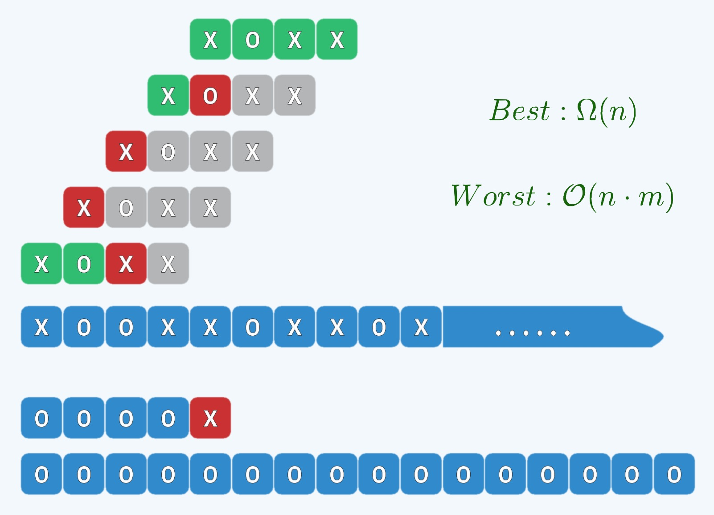
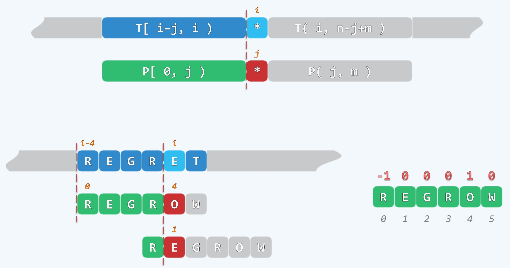
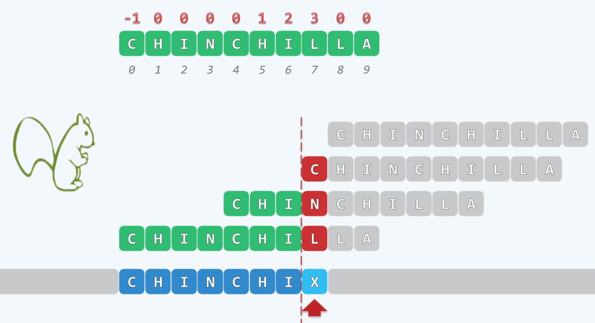
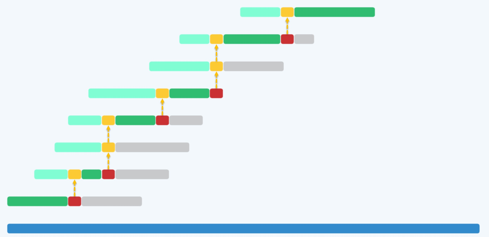
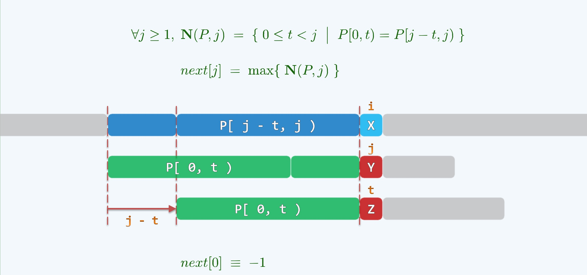
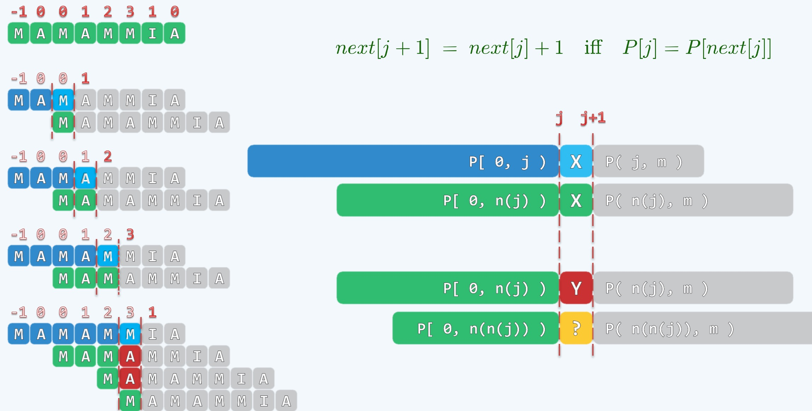

### 字符串

- 字符串是一个很有意思的结构：由一连串字符的东西排成了一个线性序列
- 它的特点可以归纳为两个方面
    * 相比于向量可以存储复杂的结构，字符串里面的元素只能是字符
    * 它是一个整体，一般很长，通过整体或局部整体性进行计算
        * 经常从里面挑出一段，我们称之为pattern，访问方式是 call-by-pattern
        * 这个模式，里面蕴含诸多技巧

### PM: Preliminaries 预备知识

- 既然是线性序列，我们就可以把它排个队，通过下标来访问(或通过一个秩的东西来访问，一个意思)
    * 下标从0~n-1, 假设在n的位置有一个虚拟的哨兵，我们叫界桩，同样在处理的时候在-1的位置也有一个哨兵
    * 通过这种方式来帮助我们理解一些算法实现
- 字符串还有一个概念叫做substr, 也就是它的局部, 一般它有由两个东西来的定义，i，k
    * S.substr(i,k) = S[i, i+k], 0 <= i < n, 0 <= k
    * i是起始字符的rank, k是长度，左闭右开
    * [i, i+k) 是一个切片
- 字符串还有一个概念叫做prefix前缀
    * 当上面的i为0的时候, 长度为k的子串叫做原字符串的前缀: [0, k)
    * S.prefix(k) = S.substr(0, k) = S[0,k), 0 <= k <= n
- 和prefix相反的概念，还有一个叫做suffix
    * 后缀：[n-k, n)
    * S.suffix(k) = S.substr(n-k, n) = S[n-k, n), 0 <= k <= n
- 这样，字符串的substr，可以通过前缀和后缀的操作来得到
    * S.substr(i, k) = S.prefix(i+k).suffix(k) = S.suffix(n-i).prefix(k)
    * 这个很容易理解

### PM: Pattern Matching 模式匹配

- 字符串中研究很经典的问题是模式匹配问题
    * Text: now is the time for all good people to come
    * Pattren: people
    * 我们的people这个Pattern能否在原文本Text中出现
- 搜索引擎的本质其实和字符串搜索没区别
- 通常我们把原始字符串的长度记为：n = |T|
- 我们把模式记为：m = |P|
- 其中：2 << m << n
    * 这里m也是一个足够大的变量
    * 其中n的数量级是非常大的
- 将来如果有了一个算法，你如何来评价它的性能好坏
    * 我们可以随机生成一个Text和Pattern，跑一次算法
    * 再随机生成，跑一跑算法
    * 写一个脚本，生成足够数量的随机Text和Pattern，进行算法测试
    * 其实，这是一个非常不妥的算法，因为随机中，成功的可能非常小
    * 因为随机生成的Text和Pattern都是完全混沌的，如果是26个英文字母
    * Text的可能有26^n种，Pattern的可能有26^m种
    * 成功的概率是: n / (26^m) 很低很低了
    * 分母会出现指数爆炸并很快超过分子，整体很快趋于0
    * 所以你测试再多，成功的可能依然很低
    * 所以这种测试是非常有问题，而且是非常糟糕的
    * 正确的做法是随机生成一个Text，然后在Text中选择出一个Pattern

### PM: Brute-Force 暴力算法

<div align="center">
    
    <br />
    <div style="text-align:center">备注：图片托管于github，请确保网络的可访问性</div>
    <br />
</div>

- 如果给定一个Text和Pattern, 任何一个Pattern串要和Text某个地方匹配上
- 命中位置一定在0 ~ n-m的位置，这里是一个非常简单的算法
    * 通过在Text中移位Pattern进行对比，如上图所示，但是效率堪忧
    * 上图绿色的是经过一轮比对后，成功的位置
    * 红色是当前对齐中失败的位置，灰色是省下时间的位置
    * 我们知道红色和绿色成本是一样的，都是经过一次对比
- 由上图可知
    * Best: O(n)
        * 一般认识是上来就命中，但是这一般不作为我们的Best case. 我们不考虑运气问题
        * 我们考虑常规性问题，一般在失败意义上而言，从头到尾跑一遍
        * Pattern的第一个就不匹配，赶紧移动，匹配或不匹配
    * Worst: O(n·m)
        * 每次匹配到Pattern的最后一个才发现不匹配，并且在Text中从头到尾跑了一遍
        * 无论最终是匹配或不匹配

**算法实现：版本1**

```cpp
int match(char * P, char * T) {
    size_t n = strlen(T), i = 0;
    size_t m = strlen(P), j = 0;
    // 自左向右逐次比对
    while(j < m && i < n) {
        if(T[i] == P[j]) {
            // 若匹配则转到下一对字符
            i ++;
            j ++;
        } else {
            // 否则，T回退，P复位
            i -= j-1; // 注意这里每个时刻i和j的差都是i-j, 移动一格就是i-j+1，写法不同，意义相同
            j = 0;
        }
    }
    return i-j; // 如何通过返回值，判断匹配结果：最后出格，通过判断i-j在允许的范围内
}
```

**算法实现：版本2**

```cpp
int match(char * P, char * T) {
    size_t n = strlen(T), i = 0;
    size_t m = strlen(P), j;
    for(i=0; i<n-m+1; i++) {
        // T[i]与P[0]对齐后，逐次比对
        for(j=0; j<m; j++) {
            if(T[i+j] != P[j]) {
                break; // 失配，转下一对齐位置
            }
        }
        if(m <= j) {
            break; // 完全匹配
        }
    }
    return i;
}
```

- 以上是两种蛮力算法的实现

### PM: KMP: Good Prefix + Look-up Table

<div align="center">
    
    <br />
    <div style="text-align:center">备注：图片托管于github，请确保网络的可访问性</div>
    <br />
</div>

- 由上图可知，Pattern字符串中第一个字符是R, 当进行一次对比后，就可以记录下，当前对比中是否存在是R的字符
- 如果存在，下次对比，直接记录并挪动到该位置，这样省去了中间，比如上图的EGR之间的对比，直接跨过来
- 如上图的例子: 
    * 当前在0号位置对齐，移位到4号位置出现不匹配的错误
    * 这时候，就没有必要在EG的位置移动位置了，因为不匹配
    * 直接到R进行移位，也就是3号位的R
    * 这里需要借助一个look-up table来处理
- 通过这个Pattern字符串, 不用出现主串, 我们可以给它预处理，记录一些笔记
- 如果在某个位置适配了，应该拿哪个字符和它对齐，我们看到失败是在O这个位置上
- 那么我们给O记录一个笔记1，如上图所示，这个意思就是说，如果失败在O字符上，
- 我们应该拿1号字符E和O进行对齐

<div align="center">
    
    <br />
    <div style="text-align:center">备注：图片托管于github，请确保网络的可访问性</div>
    <br />
</div>

- 上面又是另一个例子，我们看到，上面对齐的过程，直到L和X适配，发现失败了
- 蛮力算法是移动一位，现在我们有了一个查询表，我们看到在L的位置失败了，用L上记录的3
- 也就是Pattern上的3号字符也就是N，来和刚才失败的位置对齐
- 换句话说是用N来替代刚才失败的L来和X对齐，然后就可以继续对比下去...
    * 首先我们可以看到这个过程移动非常的快，在这个例子中移动了4个位置，这4步跳过去都是安全的
    * 并且剩下的3个字符CHI也是可以完美匹配成功的，所以这个查询表很重要，它可以让你大步移动
    * 并且剩下的字符可以不用对比，必然能匹配成功，所以，接下来，只需要在刚才失败的位置继续努力即可
- 这时候，N和X对比，显然又失败了，这时候，找到N头上记录的0，也就是Pattern的0号位C来对齐
- 这时候C是首字符了，仍然C和X适配失败，C头上记录的是-1，这时候的意思是整体向前移过去1位
- 其实-1代表的是通配符，天生就是绿色的，以此来解开僵局，这个算法就变得更加鲁棒简明
- 这就是著名的KMP算法

**KMP算法具体实现**

```cpp
int match(char * P, char * T) {
    int * next = buildNext(P); // 构造一个查询表
    int n = (int) strlen(T), i=0;
    int m = (int) strlen(P), j=0;
    while(j < m && i < n) {
        if(0 > j || T[i] == P[j]) {
            i++;
            j++;
        } else {
            j = next[j];
        }
    }
    delete [] next;
    return i - j;
}
```

**直观的对比**

<div align="center">
    
    <br />
    <div style="text-align:center">备注：图片托管于github，请确保网络的可访问性</div>
    <br />
</div>

- 只有绿色和红色部分花时间，最坏情况下也是线性的算法
- 青色的部分被KMP跳过去了, 灰色的部分并没有出现
- 总的时间复杂度不超过O(n)

### PM: KMP: Understanding next[] 理解查询表

<div align="center">
    
    <br />
    <div style="text-align:center">备注：图片托管于github，请确保网络的可访问性</div>
    <br />
</div>

- 在某个位置上对齐之后，我们经过一系列的成功，在Y的位置和主串的X适配
- 之后，我们需要胆子大一些快速的滑动，能滑动多少我们不知道，但是我们知道
- 前面多一截的P[0,t)不用考虑，接下来的计算是通过Z替代Y继续和主串的X适配
- 为什么我们可以不用顾及P[0,t), 因为我们可以判定可以不用顾及
- 因为P[0,t)与主串上的P[j-t, j)完全一致，也就是说如果当时失败在j的位置
- 那么在比j小的t的前缀，和某个t长度的后缀它们是相等的，只有这种情况下
- 移动相应的距离，残留下来长度为t的前缀才会和那个后缀相逢
- 它们之间的比较就可以省下来

### PM: KMP: Constructing next[] 构造表

<div align="center">
    
    <br />
    <div style="text-align:center">备注：图片托管于github，请确保网络的可访问性</div>
    <br />
</div>

- 这里我们用到递增的策略，任何一个Pattern串给定之后，我们可以首先把0项字符
- 对应的查询表记录为-1，如上面的M头上记录-1，递增的意义是逐个字符处理
- 以next[0]为基础算next[1],然后算next[2],next[3]...
- 这种基于一个基础，接下来算下一个，再算下一个...我们称为递增的策略
- 假如这个next[]表已经算到第j项了，接下来计算第j+1项
- 我们的核心问题是在第j项之前算到第j+1项，解决这么一个通用的问题
- 所有问题反复借用即可

**构造算法**

```cpp
int * buildNext(char * P) {
    size_t m = strlen(P), j = 0;
    int *N = new int[m];
    int t = N[0] = -1;
    while(j < m -1) {
        (0 > t || P[j] == P[t]) ? N[++j] = ++t : t = N[t]; 
    }
    return N;
}
```

### TODO

- 未完...