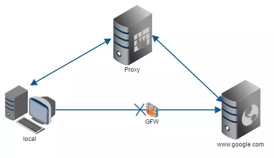
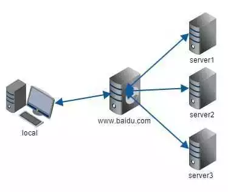

### 代理

所谓代理就是让别人帮你办事，将结果反馈给你。

1） **正向代理(Proxy)**
- 例如：你无法去国外，让能出国的朋友去国外购买商品后再转交给你。
- 例如：中国无法访问google.com, 我们通过代理服务器访问google，之后代理服务器把结果返回给你
- 再比如：路人甲缺钱想找马云先生借钱,路人甲无法联系马云但与刘老师比较熟,而刘老师和马云比较熟, 路人甲委托刘老师在马云那里借到了钱(马云并不知道钱是路人甲借的)

2 ） **反向代理(Reverse Proxy)**
- 例如：拨打中国电信客服电话10000，每一次为你服务的客服都可能不是一个人, 我们并不关心他们内部如何运作, 那么中国电信10000对于你来说就是反向代理了
- 例如：我们访问百度，其实百度是由多台服务器构成的，我们并不知道是那一台服务器响应我们的，`www.baidu.com` 域名对应的服务器对于我们电脑来说就是反向代理

3 ） **两者区别**

- 正向代理代理的对象是客户端，它隐藏了真实的请求客户端，服务端不知道真实的客户端是谁，客户端请求的服务都被代理服务器代替来请求
- 反向代理代理的对象是服务端，反向代理服务器会帮我们把请求转发到真实的服务器那里去。Nginx就是性能非常好的反向代理服务器，用来做负载均衡。