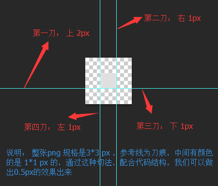

使用css3做0.5px的细线
---

Webapp中的CSS3实现 0.5px的细线

### 方法一：使用渐变来做

html代码：

```html
<div class="bd-t"></div>
```

css代码：

```css
.bd-t{
  position:relative;
}

.bd-t::after {
  content: " ";
  position: absolute;
  left: 0;
  top: 0;
  width: 100%;
  height: 1px;
  background-image: linear-gradient(0deg, transparent 50%, #e0e0e0 50%);
}
```

Be careful ! 注意此处有坑！！！： 
对于不同浏览器的兼容，我们需要使用不同的前缀如：

```css
-webkit-linear-gradient
-ms-linear-gradient 
-o-linear-gradient
```

坑就在这些前缀里： 我们把代码里的height 1px 变成 100px , 参数同为 0deg, transparent 50%, #e0e0e0 50% 并使用最新版的chrome来测试 。

linear-gradient 有如下结果： 


经过一系列的测试总结，我们可以推理出下面的渐变方式： 


webkit-linear-gradient 的代码效果图如下：


经总结，我们看到-webkit前缀的渐变方式为： 


其他的前缀如果用到，还请小伙伴们自己来尝试填坑！

说明： 
    推荐这种写法，这是百度糯米移动站的做法(如果没改版的话)：http://m.nuomi.com/ ，从上述代码的描述中，可以看到，为了实现盒子顶部边框0.5px的伪代码：border-top：0.5px solid #e0e0e0; 的效果，使用after，作为一个钩子，宽度100%，高度1px,背景渐变，一半透明，一半有颜色，这么干是可以的。同理，底部，左边和右边的细线，都是同一个道理了。当然，如果需要组合使用，盒子之间的嵌套使用，也是可以的，或者你有自己的想法(当然做法有很多种！)…


### 方式二： 使用缩放

html代码

```html
<div class="bd-t"></div>
```

css 代码

```css
.bd-t{
  position:relative;
}

.bd-t:after{
  content: "  ";
  position: absolute;
  left: 0;
  top: 0;
  width: 100%;
  height: 1px;
  background-color: #e0e0e0;
  /* 如果不用 background-color, 使用 border-top:1px solid #e0e0e0; */
  -webkit-transform: scaleY(.5);
  transform:scaleY(.5);
}
```

说明: 
    这是实现盒子上边框0.5px的做法， 不是很推荐这种做法，因为经过测试，一些手机端浏览器显示的不是太好。这种实现的原理是： 在Y轴方向上，压缩一半。就像上面注释的那样 
    如果你觉得效果不太好，这里有一个 fallback or workaround， whatsoever： 就是上面注释掉的那种做法：可以尝试使用border-top:1px solid #e0e0e0; 代替background-color的做法，京东就是这么做的(如果没改版的话)： http://m.jd.com/

### 方式二的拓展 : 如果要实现四周全是0.5px的线条的话

html代码：

```html
<div class='bd-all'></div>
```

css代码

```css
 .bd-all{
      position:relative;
  }

 .bd-all:after{
      content: "  ";
      position: absolute;
      left: 0;
      top: 0;
      z-index:-1;
      width: 200%;
      height:200%;
      border:1px solid #e0e0e0;
      -webkit-transform-origin: 0 0;
      transform-origin: 0 0;
      -webkit-transform: scale(.5, .5);
      transform: scale(.5, .5);
 }
```

说明 : 

    这是实现一个盒子四周0.5px的做法， 如果加入border-radius圆角效果，会发现，有些手机会有圆角发虚的情况，不过影响不是很大。如果有两个盒子，上面一个盒子没有边框效果，下面盒子有边框效果，两个盒子一样宽，上下在一起的布局方式，你会发现，在手机上有时候会对不齐… 错开了0.5px，原因已经很明了了…还有那个z-index ，可以根据不同需求来调整使用，如果可以的话，不使用也是可以的。

### 方式三： 使用background-image和css3的九宫格裁减

京东之前是这么做的，现在已经不被使用了。具体做法，请看下面demo结构：

```
├─demo/ ························ demo 目录
        └─┬─ test.html  ··············· test.html 文件
        └─── pic.png ·················· png 图片文件
```

在test.html 中 有如下关键代码：

html结构

```html
<div class="bd-t"></div>
```

css 结构

```html
.bd-t{
   position: relative;
}
.bd-t::after {
content: " ";
position: absolute;
left: 0;
top: 0;
width: 100%;
border-top: 1px solid transparent;
/* 下面用 stretch 和 round 都可以 */
border-image: url('pic.png') 2 1 1 1 stretch; 
-webkit-border-image: url('pic.png') 2 1 1 1 stretch;
}
```

而 pic.png 的九宫格切法，如下图：



- 具体有关 border-image 的用法，网上有很多：
    * w3c 上的这个讲的不是很具体：http://www.w3school.com.cn/cssref/pr_border-image.asp
    * 在 MDN 上 有明确的介绍，并且有很多配图，包括兼容性等等：https://developer.mozilla.org/en-US/docs/Web/CSS/border-image
    * 但是不推荐这种写法，毕竟图片质量比较大，能用代码解决的，不用图片。在这里border-width 是 1px , 但是 背景是有2px的距离，所以在1px的border-top上，显示出有颜色的高度就是0.5px, 同理，底边，左边和右边的0.5px，也都很容易实现。 这个就是css3的魅力体现(这个现在兼容性也不是很好，在一些较低端的安卓浏览器和一些版本的safari 支持的也不是很好)。


### 方式四 (推荐)： weui的实现方式

这是一款微信团队开发的UI 组件 详情见： weui , 它的使用方式是这样的

```css
.weui-cell:before{
   content: " ";
   position: absolute;
   left: 0;
   top: 0;
   right: 0;
   height: 1px;
   border-top: 1px solid #D9D9D9;
   color: #D9D9D9;
   -webkit-transform-origin: 0 0;
   transform-origin: 0 0;
   -webkit-transform: scaleY(0.5);
   transform: scaleY(0.5);
}
```

### 方式五： 使用同周边相似的浅色，利用视觉效果，让用户产生错觉

这个就考验设计师的功力了 ：)

### 其他说明

不是很推荐使用渐变来做 , 在移动设备上可以看到，但在一些浏览器上看不到，不便于调试。

### 扩展

 更多花式渐变作为参考(内容太多，如果你能记住的话)：

- http://www.runoob.com/css3/css3-gradients.html
- http://www.zhangxinxu.com/wordpress/2013/09/%E6%B7%B1%E5%85%A5%E7%90%86%E8%A7%A3css3-gradient%E6%96%9C%E5%90%91%E7%BA%BF%E6%80%A7%E6%B8%90%E5%8F%98/
