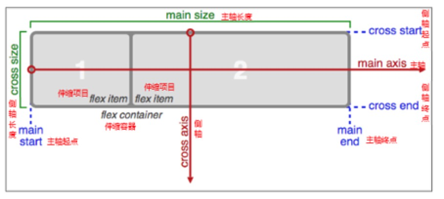

### CSS3 动画 animation

动画是CSS3中具有颠覆性的特征之一，可通过设置多个节点来精确控制一个或一组动画，常用来实现复杂的动画效果。

- 必要元素
    * a、通过@keyframes指定动画序列；
    * b、通过百分比将动画序列分割成多个节点；
    * c、在各节点中分别定义各属性	
    * d、通过animation将动画应用于相应元素；

- 关键属性
    a、animation-name设置动画序列名称
    b、animation-duration动画持续时间
    c、animation-delay动画延时时间
    d、animation-timing-function动画执行速度，linear、ease等
    e、animation-play-state动画播放状态，play、paused等
    f、animation-direction动画逆播，alternate等
    g、animation-fill-mode动画执行完毕后状态，forwards、backwards等
    h、animation-iteration-count动画执行次数，inifinate等

### CSS3 Flex 布局

CSS3在布局方面做了非常大的改进，使得我们对块级元素的布局排列变得十分灵活，适应性非常强，其强大的伸缩性，在响应式开中可以发挥极大的作用。

- 主轴：Flex容器的主轴主要用来配置Flex项目，默认是水平方向
- 侧轴：与主轴垂直的轴称作侧轴，默认是垂直方向的
- 方向：默认主轴从左向右，侧轴默认从上到下
- 主轴和侧轴并不是固定不变的，通过flex-direction可以互换。	
- 必要元素：
    * a、指定一个盒子为伸缩盒子 display: flex
    * b、设置属性来调整此盒的子元素的布局方式 例如 flex-direction
    * c、明确主侧轴及方向
    * d、可互换主侧轴，也可改变方向

- 各属性详解
    * a、flex-direction调整主轴方向（默认为水平方向）
    * b、justify-content调整主轴对齐
    * c、align-items调整侧轴对齐
    * d、flex-wrap控制是否换行
    * e、align-content堆栈（由flex-wrap产生的独立行）对齐
    * f、flex-flow是flex-direction、flex-wrap的简写形式
    * g、flex控制子项目的缩放比例
    * h、order控制子项目的排列顺序

### CSS3 多列 布局

CSS3 可以将文本内容设计成像报纸一样的多列布局，存在很大的兼容问题，暂不推荐使用

- column-count	 指定元素应该被分割的列数。
- column-fill	指定如何填充列
- column-gap	指定列与列之间的间隙
- column-rule	所有 column-rule-* 属性的简写
- column-rule-color	指定两列间边框的颜色
- column-rule-style	指定两列间边框的样式
- column-rule-width	指定两列间边框的厚度
- column-span	指定元素要跨越多少列
- column-width	指定列的宽度
- columns	设置 column-width 和 column-count 的简写

### Web字体

开发人员可以为自已的网页指定特殊的字体，无需考虑用户电脑上是否安装了此特殊字体，从此把特殊字体处理成图片的时代便成为了过去。支持程度比较好，甚至IE低版本浏览器也能支持

各种字体格式：

- TureTpe(.ttf)格式：
.ttf字体是Windows和Mac的最常见的字体，是一种RAW格式，支持这种字体的浏览器有IE9+、Firefox3.5+、Chrome4+、Safari3+、Opera10+、iOS Mobile、Safari4.2+；

- OpenType(.otf)格式：
.otf字体被认为是一种原始的字体格式，其内置在TureType的基础上，支持这种字体的浏览器有Firefox3.5+、Chrome4.0+、Safari3.1+、Opera10.0+、iOS Mobile、Safari4.2+；

- Web Open Font Format(.woff)格式：
woff字体是Web字体中最佳格式，他是一个开放的TrueType/OpenType的压缩版本，同时也支持元数据包的分离，支持这种字体的浏览器有IE9+、Firefox3.5+、Chrome6+、Safari3.6+、Opera11.1+；

- Embedded Open Type(.eot)格式：
.eot字体是IE专用字体，可以从TrueType创建此格式字体，支持这种字体的浏览器有IE4+；

- SVG(.svg)格式：
.svg字体是基于SVG字体渲染的一种格式，支持这种字体的浏览器有Chrome4+、Safari3.1+、Opera10.0+、iOS Mobile Safari3.2+；

- 字体图标的优点：
    * 将所有图标打包成字体库，减少请求
    * 具有矢量性，可保证清晰度
    * 使用灵活，便于维护

- 常用字体站：
    * https://icomoon.io/
    * http://www.zhaozi.cn/
    * http://www.youziku.com/ 
    * http://www.fontawesome.com.cn/
    * http://www.iconfont.cn/
    * http://www.iconpng.com/icon/66900
    * http://www.bootcss.com/p/font-awesome/
    * http://fontawesome.dashgame.com/
    * http://www.iconsvg.com/

### CSS3 兼容问题

- 通过 http://caniuse.com/ 可查询CSS3各特性的支持程度
- 一般兼容性处理的常见方法是为属性添加私有前缀，如不能解决，应避免使用，无需刻意去处理CSS3的兼容性问题