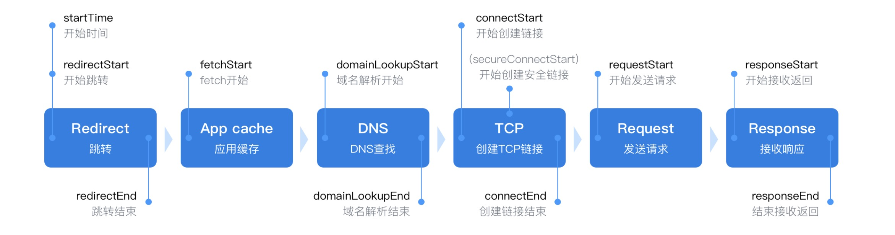

### 理解HTTP协议的重要性

- 很多搞了多年开发的研发人员可能都不会对HTTP有太深入的理解
- 生活中的HTTP应用：通过url打开网页，ajax获取数据，img加载图片等
- HTTP status code, HTTP method有多少种，有多少人知道的比较清楚
- HTTP的优化有多少种？举一个例子，缓存优化如何优化，客户端缓存，代理服务器缓存，以及缓存验证可用性等
    * 1 ) 关于Cache-Control的例子
    * 这个可以设置"Cache-Control:max-age=100"对应的静态资源缓存100s
    * 还可以给它设置public、private来控制只能在客户端进行缓存，还是可以通过代理服务器进行缓存
    * 设置must-revalidate控制在缓存过期之后，必须到服务端去验证才能继续使用
    * 设置no-cache,no-store来控制是否使用缓存
    * 缓存验证：last-modified配合if-modified-since来进行验证，还可以用etag配合if-none-match验证
    * 缓存是web服务中对性能提升最大的一关
    * 2 ) 关于HTTP的其他头的说明
    * Content-Type、Content-Encoding来约束数据类型
    * Cookie保持会话信息，我们的Session方案是基于Cookie的
    * CORS实现跨域并保持安全性限制
    * 合理配置优化可以为网站带来更高的收益
    * 3 ) 深入TCP层面
    * 什么是三次握手
    * HTTPS链接的创建过程，为什么HTTPS就是安全的
    * 什么是长链接，为什么要长链接
    * HTTP2的信道复用为什么又能提高性能
- 浏览器输入URL后HTTP请求返回的完整过程
    * 下图中每个节点都代表HTTP协议所做的事情
    * 每个节点都可以有一些优化的方法
    * 在浏览器API中有一个Performance,它会记录下图的每个时间点
    * 每个过程的时间消耗都会通过这个API来记录
    * 开发者可以根据时间耗时的多少来做一些对应的优化，下面是具体的步骤
    * 1 ) Redirect：在发起请求的一开始就要做一个Redirect, 因为浏览器可能记录这个地址已经永久跳转成新的地址了
    * 所以，一开始浏览器需要判断是否需要Redirect，以及Redirect到哪里
    * 2 ) App cache：看缓存，因为请求的资源，可能已经被缓存过了，所以要到App cache里找是否存在
    * 如果没有缓存就要去实际的服务器上请求资源了
    * 3 ) DNS查找：因为一般服务器对应的是一个域名, 域名要找到对应的ip地址才能访问资源
    * 4 ) 创建TCP链接：有了ip地址之后，就要创建TCP链接，经过TCP三次握手，才能创建起来
    * 如果是HTTPS的协议，创建HTTPS链接和TCP的三次握手又不一样，里面有保证数据传输安全的过程
    * 5 ) Request：链接创建好了之后，就可以发送HTTP请求的数据包
    * 6 ) Response：数据包发送之后，服务器接收到这个数据进行操作后返回响应内容，整个过程才算完成

    
     
    
备注：图片托管于github，请确保网络的可访问性

     

