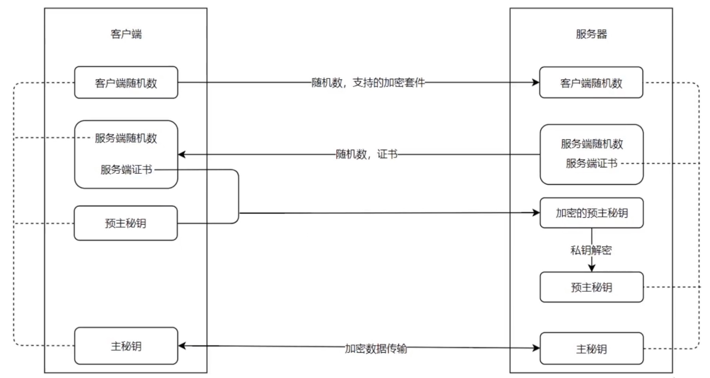

### HTTPS

- HTTPS = HTTP + Security
- HTTP是不安全的，因为它是明文传输的，在互联网的每一层都可能会被获取和篡改
    * 如果使用HTTP，不能传输重要的数据
- HTTPS的安全性
    * 公钥：互联网上人人都可以拿到的一串加密字符串，用于加密传输信息
    * 私钥：只存在于服务端用于解密的一串加密字符串
    * 客户端通过公钥加密传输到服务器上，服务端只有通过私钥才能把加密后的内容解密

### HTTPS握手的过程

<div align="center">
    
    <br />
    <div style="text-align:center">备注：图片托管于github，请确保网络的可访问性</div>
    <br />
</div>

- 客户端发起一个ClientHello
    * 先生成一个随机字符串
    * 再带上客户端支持的加密套件Cipher Suite(里面有很多不同的加密方法)，以供服务端选择
    * 将两者传输到服务端
- 服务端也发送一个Serve Hello
    * 在拿到随机字符串后先存着
    * 自己也生成一个随机字符串，并且自己选择一个合适的Cipher Suite加密套件
    * 之后把这个随机字符串，服务端证书(公钥)等内容传输给客户端
- 客户端拿到了服务端随机数和公钥
    * 并用它们生成了一个加密的预主密钥(新的随机字符串)
    * 到这个阶段，随机字符串的数量已经是3个了
    * 客户端将这个加密后的预主密钥发送给服务端
- 服务端用私钥进行解密得到预主密钥，拿到了这个随机字符串
- 客户端和服务端同时对这三个随机字符串进行一个算法的操作，生成一个主密钥
    * 这个过程中涉及到一个加密套件进行算法的操作
- 中间任何人都无法获取和破解这个主密钥，后期传输的数据全是由这个主密钥来加密和解密
- 所以HTTPS传输是一个安全的传输协议，可以自己使用Wireshark等抓包软件看这个过程

### 使用Nginx来部署一个HTTPS的服务

- 要部署HTTPS服务，首先要生成HTTPS的公钥(public key)和私钥(private key)
    * Windows下一般需要在nginx安装目录/certs 目录中生成
    * Mac下要在一个目录下生成，并使用绝对路径来引用
    * 证书生成命令: $ `openssl req -x509 -newkey rsa:2048 -nodes -sha256 -keyout localhost-privkey.pem -out localhost-cert.pem`
    * 一路回车下去即可，不需要特别配置
    * 在这里会生成两个文件：localhost-cert.pem,localhost-privkey.pem
- 生成好之后，需要在nginx中来配置
    ```conf
    proxy_cache_path cache levels=1:2 keys_zone=my_cache:10m

    server {
        listen                  443;
        server_name             test.com;
        ssl                     on;
        ssl_certificate         ../certs/localhost-cert.pem
        ssl_certificate_key     ../certs/localhost-privkey.pem

        location / {
            proxy_cache      my_cache
            proxy_pass       http://127.0.0.1:8000;
            proxy_set_header Host $host;
        }
    }
    ```
- 特别注意，针对我们的server_name，本机也要进行一些host的配置，此处不再赘述
- HTTPS默认使用端口443
- ssl_certificate对应的是公钥
- ssl_certificate_key对应的是私钥
- 上述配置是Windows下的配置，配置好之后，这个nginx就支持了HTTPS，重启nginx
- 启动对应的nodejs的服务，使用浏览器访问：https://test.com
- 这时候有个红色的提示：您的连接不是私密连接，这个时候就证明了https可以访问了
    * 提示红色的原因是，目前主流浏览器在验证https安全证书的时候，都要权威机构来签发
    * 权威机构签发时要先验证域名是合法的，安全的
    * 一般个人会使用certbot来签发, 此处不再赘述
    * 这时候，因为我们是测试，直接点击高级，选择继续前往test.com(不安全)
- 能够正常访问，说明我们的https的服务部署成功了
- 如果我们要在访问http的时候，自动跳转到https，可以如下配置
    ```conf
    proxy_cache_path cache levels=1:2 keys_zone=my_cache:10m

    server {
        listen                  80 default_server;
        listen                  [::]:80 default_server;
        server_name             test.com
        return 302 https://$server_name$request_uri;
    }

    server {
        listen                  443;
        server_name             test.com;
        ssl                     on;
        ssl_certificate         ../certs/localhost-cert.pem
        ssl_certificate_key     ../certs/localhost-privkey.pem

        location / {
            proxy_cache      my_cache
            proxy_pass       http://127.0.0.1:8000;
            proxy_set_header Host $host;
        }
    }
    ```
- 重启nginx, 重新访问http页面，即可立即跳转到https网页
