### 关于项目管理

职能部门越卖力，企业越像官僚？ 赔钱的项目也要，老板是不是疯了？ 日报，周报，月报...然并卵，项目照旧失控，都是惹不起的“爷”，先招呼谁？项目到底有完没完？做项目累？那是你“姿势”不对！ 

“做得更聪明”的一个方法就是建立透明的制度。**德鲁克说，管理是一套关于价值观和信念的文化和制度**。其实绝大多数管理问题都可以通过公开透明的制度来实现，这可以大量地减少人为干预的资源浪费，还能发挥员工的自主精神。

现在的企业在转型升级过程当中，都在追求更加高效的，面对项目的这种管理模式，就是以项目为单元的精细化的管理模式，这种管理模式的特征是什么？就是公司里的所有资源都面向项目，因为项目是实现企业战略的落地的载体，这种组织形式，它以矩阵形式为特征，也就是说我既有职能划分的这样的专业部门，也有从各个专业部门抽调的员工组成的项目团队，所以它有两个维度，竖着划分是专业、职能部门，横着我们再组建成一个一个的项目团队，这种组织结构方式是有非常多优势，这种矩阵形的组织，才有可能让组织的资源，也就是说我们企业的人力、物力、财力，得到最大化的利用，所以我们的工作努力都是面向企业的战略。

### 项目开发的类型与模型

**【迭代型的开发】**：在动画片《喜洋洋和灰太狼》里灰太狼有一句经典的台词，"我一定会回来的"。其实灰太狼在每一集当中，都是想心心念念地抓一只羊，送给它的老婆红太狼做羊汤，但其实每一集，它都没抓着。但灰太狼是屡战屡败、屡败屡战，从来都没有放弃过，说，再来，我这次失败了，我下一集再来，所以这就叫迭代。就是说我这个项目的开发是一版一版的不断地更新、不断地升级，这就叫迭代。

**【增量型的开发】**：就像搭积木一样，我是一部分一部分的交付，我先干完一块，然后你先用，我再干下一块。增量开发的好处，是客户能够提前了解到你工作的成果，能够把控这个项目的质量和客户之间就多了一些交流的机会，增量开发是每一部分交付，都是一个完成状态，只是我像搭积木一样，是一块一块地交付给你。对比而言，迭代开发，它是一开始是个非常粗的轮廓非常简单的，用最低的成本最快的速度，画一个最简的方案，那么根据你的需求，根据你的反馈，我不断地完善不断地细化，这就叫做迭代开发。

**【适应型地开发】** 或称为 **【敏捷开发】**：在《终结者》系列电影中，施瓦辛格主演的科幻电影，他的这个机器人的型号叫T800很厉害，很抗揍，就是打得已经遍体鳞伤了，回去修补修补还能用。在第二部电影中，施瓦辛格的这个角色，他的对手敌人是一个更新的型号的机器人叫T1000，这T1000更厉害，就根本打不坏，它就是一坨液态金属，这个子弹打穿身体，马上就恢复了，它的适应能力就要比这个T800要强。在第三部新型号的敌方机器人TX，它不光是打不坏，而且根据环境的变化，可以随时改变自己的状态，它平常看起来就是一个美女，但一转眼就变成一个冷血杀手，它的适应能力极强。所以什么才是最厉害，不是我结实我抗揍，而是我能够根据需求，根据环境进行快速地适应。在敏捷开发当中常见的一个开发模型，叫做【Scrum模型】，它的意思就是说你有什么需求随时提，你提出来，我把你这个需求写成一个【用户故事】，然后放在我的这个需求库里。我现在有精力做，那我就及时给你实现，那如果做不到，那怎么办，下个版本去实现你现在的需求。所以能够让我们的团队，能够有节奏地进行持续地适应性地开发，这就叫敏捷开发。

    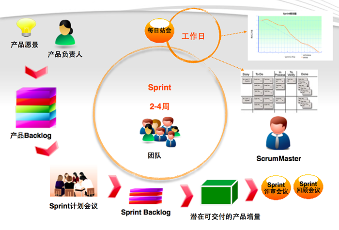

**【预测型的开发】**：预测型的生命周期指的是我还没做这个项目之前，我已经对这个项目的结果心中有数。比如说，我们的工程建设项目，在北京CBD，中国尊是非常高的一座高楼，我还没做之前，这楼还没有，我就知道这楼未来长这样，而且我不单知道它未来外形长这样，里边的结构、里边的电梯布置等等，其实都在我的设计之中，还有我不光知道它建成之后长什么样，我其实知道未来每个时间点，就是比如说开工一个月以后它长什么样，两个月以后这楼长什么样，其实我都心中有数，都在我的预测之中。在IT软件行业当中，最经典的就是瀑布开发模型，一款软件，如果用瀑布开发模型来做的话，那它是分这么几个阶段，先是需求分析、然后方案设计、代码开发、测试、最后上线运维。在需求分析阶段，客户提出一个需求，一个新需求，一个变更，客户可以随便提，提什么都可以。但是如果说我在交付验收阶段，客户提出说要改这个改那个，这时候它的代价实在是太大，可能比重新做一个新的项目还要费劲。瀑布开发模型，就是这样一个从上往下，顺序地这样的一个过程。预测型指的是我一开始啥都想明白了，我都规划好设计好了。对比敏捷开发，敏捷型开发是一开始根本没法确定没法想好，是根据现实的情况，你随时提我随时改，所以它的适应性更强。

**【Stacey矩阵】**：Stacey是研究企业的复杂性和它的适应性这样的一个学者，他提出了一个Stacey矩阵。这个Stacey矩阵有两个维度，竖的这个轴说的是需求是否明确，横着这个轴说的是技术是否确立，所有的项目其实可以分成这么几个区间，第一个区间就是说需求很明确，技术方案怎么实现也很明确，那这部分就叫简单的项目。第二个区间说的是需求很清楚，但是怎么实现却并不能够确定，到底怎么解决，怎么搞定它，现在其实心里没数。

    

那哪种类型的项目应该用哪种开发方式？Stacey就给出了一些建议：

- 简单的项目，需求很清楚，怎么实现也很清楚，那就应该用预测型。这样成本最优，也是完全在我们掌控之内。
- 第二种就是需求清楚，不知道怎么实现，这类项目可以用迭代的方式，就是说我不断地尝试，这版不理想，我下一个版本去优化。
- 第三类就是我们说的烧脑的项目，就是虽然我们实现的方法，并没有什么创新的技术，但是需求说不清楚，这怎么办？这类项目其实可以用增量的方式，就是说你能说清楚一部分，我给你实现一部分，你再想明白一部分，我再给你再实现一部分，这就是增量开发的方式。
- 那混乱的，既说不清需求，也不知道怎么做，这类项目应该用什么开发方式？这类项目不要碰，尽量地躲远点！
- 最后一种就是模糊的项目，用的应该就是敏捷的方法，就是适应性很强的这种开发模式，才能够做出这种需求和方案都不是很清楚，都处于模糊状态的这样的项目类型。

### 项目开发过程的划分

    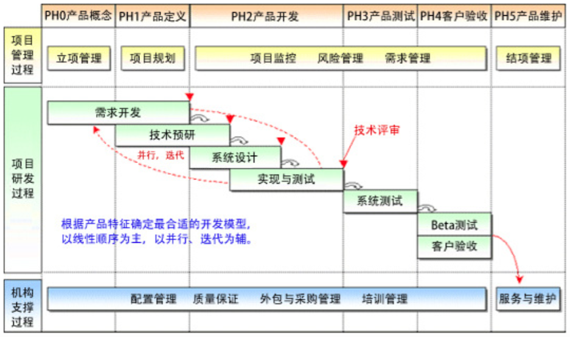

- 本规定对一个完整的开发过程按“软件过程改进方法和规范”把产品生命周期划分为6个阶段:
    * 产品概念阶段(记为 PH0)
    * 产品定义阶段(记为 PH1)
    * 产品开发阶段(记为 PH2)
    * 产品测试阶段(记为 PH3)
    * 用户验收阶段(记为 PH4)
    * 产品维护阶段(记为 PH5)
- 软件项目的过程有三大类: **项目管理过程**、**项目研发过程**和**机构支持过程**。
- 而这三类过程可以细分为19个主要过程域,分布在PH0到PH5的各个阶段。
- 项目管理过程包6个过程域,分为:**立项管理**、**结项管理**、**项目规划**、**项目监控**、**风险管理**、**需求管理**。
- 项目研发过程包8个过程域,分为:**需求开发**、**技术预研**、**系统设计**、**实现与测试**、**系统测试**、 **Beta测试**、**客户验收**、**技术评审**。
- 机构支撑过程包5个过程域,分为:**配置管理**、**质量保证**、**培训管理**、**外包与采购管理**、**服务与维护**。
- 企业应根据自身情况(如发 展战略、研发实力等)适当地修改使用

### 项目开发流程

    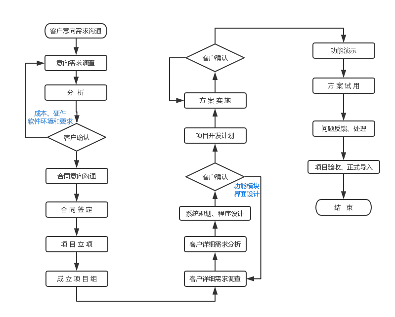

    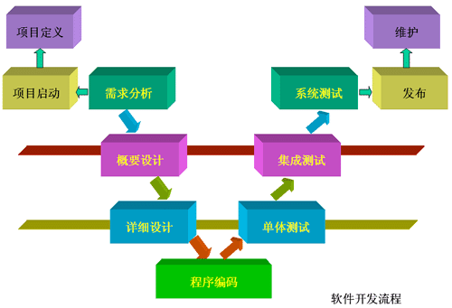

### 项目开发过程域遵循的标准文档

    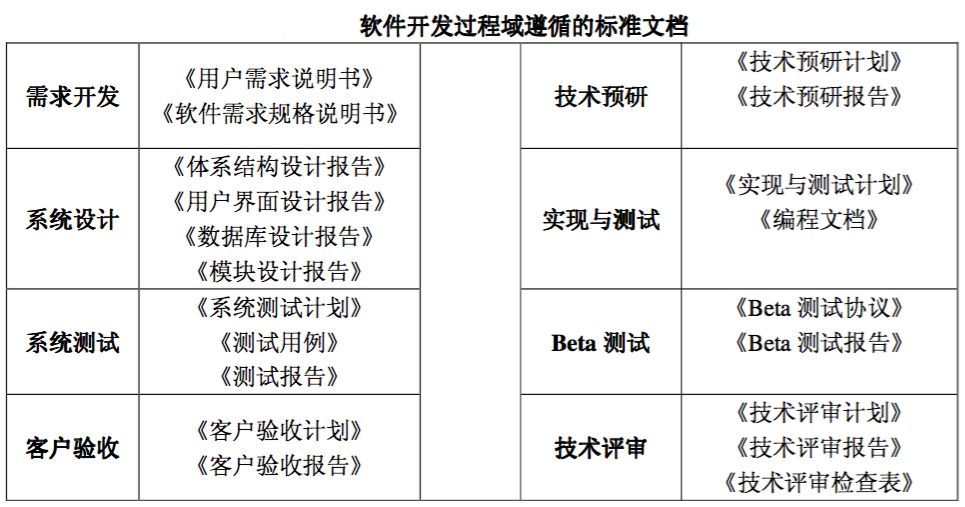

### 项目需求分析

    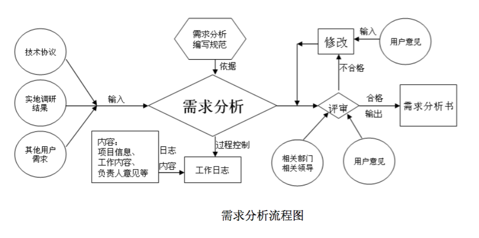

- 需求调研的主要收集方式有 以下方面:
    * 与用户交谈,向用户提问题。
    * 参观用户的工作流程,观察用户的操作。
    * 向用户群体发调查问卷。
    * 与同行、专家交谈,听取他们的意见。
    * 分析已经存在的同类产品,提取需求。
    * 从行业标准、规则中提取需求。
    * 从 Internet 上搜查相关资料。
- 输出：新产品概念书、调研报告、《需求说明书》、《项目建议书》、计划书和计划表

### 项目系统设计

    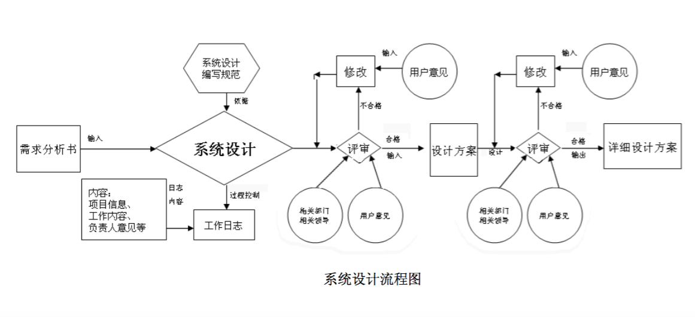

- 输入部分包括:《项目建议书》、《需求说明书》、软件设计过程中的标准与规范、软、硬件开发环境。
- 输出:《系统设计说明》、用户界面原型、《数据库设计说明》、《功能模块设计说明》、《使用说明书初稿》。

### 编码测试

    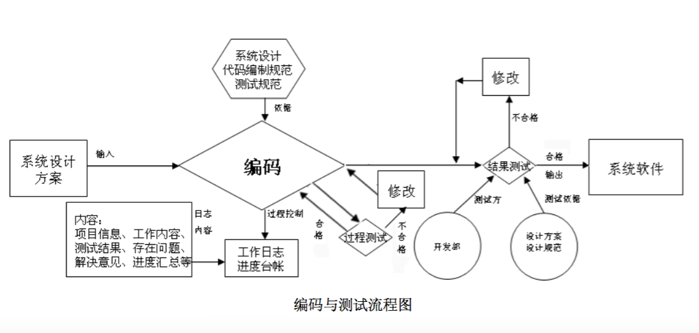

- 软件实现是指通过编程、调试、优化、内部测试和代码审查等活动,开发出符合用户需求、质量合格的产品。
- 软件的优化指的是提高软件的运行速度、提高对内存资源的利用率、加强用户界面的友好化等方面。

### 试运行

    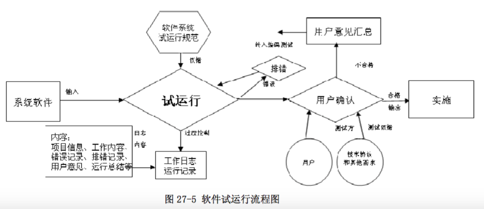

### 实施

    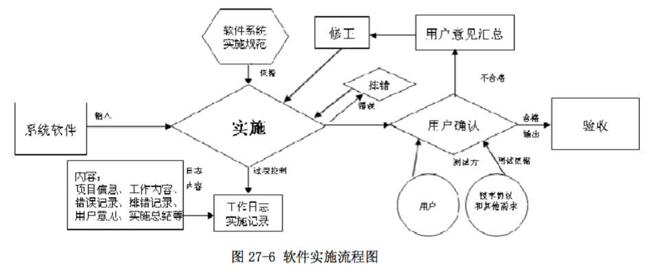

### 验收

    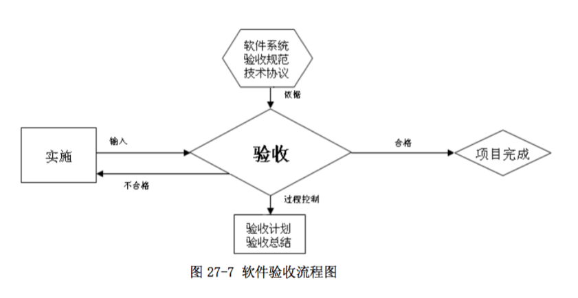

### 服务与维护

    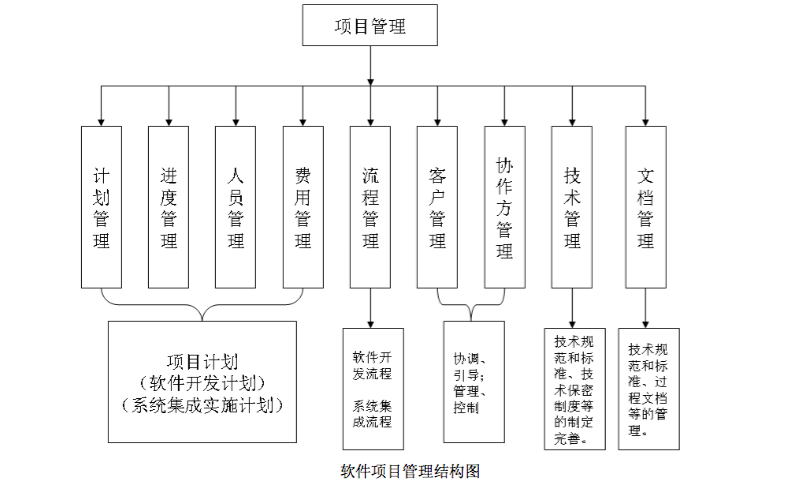

### 商城项目案例

1 ） **确立项目**

- 商城项目（B2C）单商家模式

2 ） **项目功能介绍**

本商城项目分为网站前台和网站后台管理两部分

2.1 网站前台

- 网站首页商品展示：推荐商品，分类展示部分商品，热卖商品，新商品等展示
- 商品列表页：分页展示某类别或指定条件（搜索）的部分商品列表信息。
- 商品详情页：通过商品ID号来展示指定商品详情信息。
- 购物车管理：添加、查看、删除、清空等自己的购物信息。
- 会员模块：注册，登录、退出以及进入会员中心
- 会员中心：个人信息管理、我的订单信息
- 订单处理
- 其他扩展：商品评论、商品多图；会员收货地址管理，商品收藏；首页轮播图；站内公告、新闻；友情链接；

2.2 网站后台管理

- 后台操作：登录、退出
- 会员信息管理：查看、修改会员状态、重置密码
- 商品类别信息管理：添加、删除、修改、查看商品类别信息
- 商品信息管理：添加、删除、修改、查看
- 订单信息管理：查看订单、订单详情、处理订单
- 其他扩展：商品评论管理、商品多图管理；会员收货地址管理，商品收藏；首页轮播图管理；站内公告、新闻管理；友情链接管理

3 ） **绘制项目的功能模块和操作流程图**

3.1 商城项目功能模块图

    

3.2 商城前台用户操作流程图

    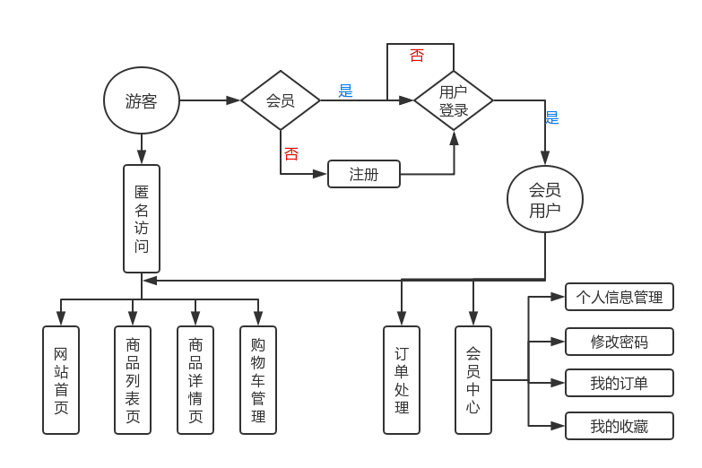

3.3 商城后台管理员操作流程图

    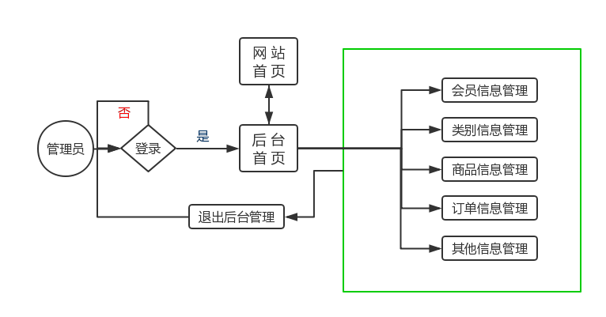

4 ） **具体功能描述**

- 针对与商场网站的每个功能块进行详细描述，主要包含以下几个方面：
    * 功能名称、编号、设计者、时间
    * 功能框图及说明
    * 操作权限
    * 需要哪些输入
    * 具体执行过程内容
    * 输出结果
    * 业务数据流：DFD图
    * 功能效果预览

5 ） **项目运行环境要求**

- 服务器环境要求：服务器数量，类型和用途；以及每台服务器的配置要求
- 软件环境：Python、MySQL、框架Django的版本要求
- 各种接口标准要求（支付、微信、短信等接口）

6 ） **项目具体完成时间和报价**

- 项目开发进度计划表，时间周期的安排
- 项目总体报价，以及每个模块的报价、付款方式
- 项目违约处理，后期功能附加条款处理等事项说明

7 ） **验收标准**

- 项目模块功能的完成情况
- 项目的执行性能（如：网站的响应时间值：正常<=3秒)