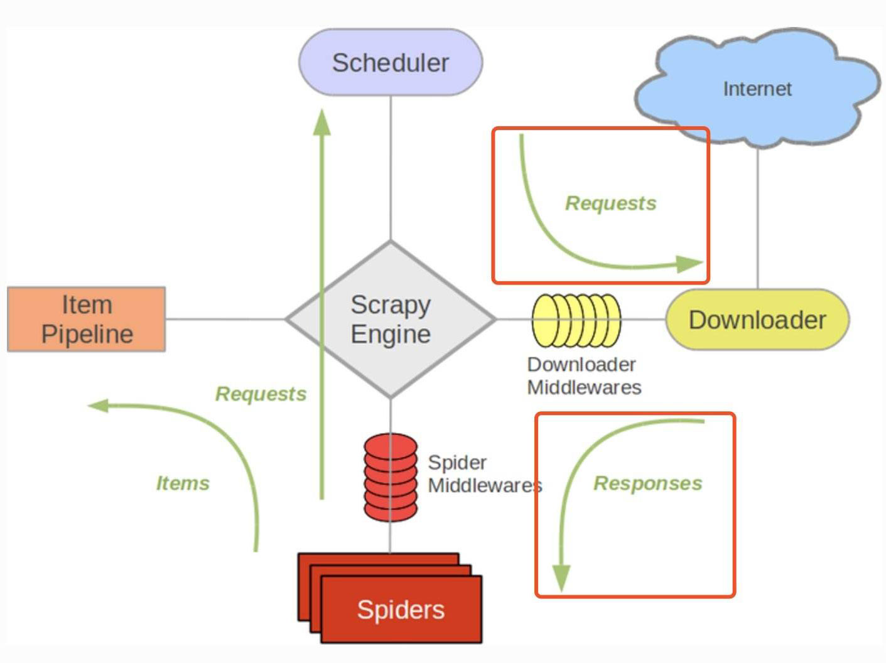

### 关于Scrapy框架

- Scrapy是: 由Python语言开发的一个快速、高层次的屏幕抓取和web抓取框架，用于抓取web站点并从页面中提取结构化的数据。
- Scrapy用途广泛，可以用于数据挖掘、监测和自动化测试。
- Scrapy吸引人的地方在于它是一个框架，任何人都可以根据需求方便的修改。它也提供了多种类型爬虫的基类，如BaseSpider、sitemap爬虫等，最新版本又提供了web2.0爬虫的支持。

### Scrapy框架的架构图与运行原理及各个组件

1）架构图：

2）运行原理：

- Scrapy的整个数据处理流程由Scrapy引擎进行控制，其主要的运行方式为：
- 引擎打开一个域名，时蜘蛛处理这个域名，并让蜘蛛获取第一个爬取的URL。
- 引擎从蜘蛛那获取需要爬取的一个URL，然后作为请求在调度器中进行调度。
- 引擎从调度那获取接下来进行爬取的页面。
- 调度将下一个爬取的URL返回给引擎，引擎将它们通过下载中间件发送到下载器。
- 当网页被下载器下载完成以后，响应内容通过下载中间件被发送到引擎。
- 引擎收到下载器的响应并将它通过蜘蛛中间件发送到蜘蛛进行处理。
- 蜘蛛处理响应并返回爬取到的项目，然后给引擎发送新的请求。
- 引擎将抓取到的项目项目管道，并向调度发送请求。
- 系统重复第二部后面的操作，直到调度中没有请求，然后断开引擎与域之间的联系。

3）各个组件

- 引擎(Scrapy Engine)
    * 用来处理整个系统的数据流处理, 触发事务(框架核心)

- Item 项目，它定义了爬取结果的数据结构，爬取的数据会赋值成改Item对象

- 调度器(Scheduler)
    * 用来接受引擎发过来的请求, 压入队列中, 并在引擎再次请求的时候返回.
    * 可以想像成一个URL（抓取网页的网址或者说是链接）的优先队列, 由它来决定下一个要抓取的网址是什么, 同时去除重复的网址

- 下载器(Downloader)
    * 用于下载网页内容, 并将网页内容返回给蜘蛛(Scrapy下载器是建立在twisted这个高效的异步模型上的)

- 爬虫(Spiders)
    * 爬虫是主要干活的, 用于从特定的网页中提取自己需要的信息, 即所谓的实体(Item)。用户也可以从中提取出链接,让Scrapy继续抓取下一个页面

- 项目管道(Pipeline)
    * 负责处理爬虫从网页中抽取的实体，主要的功能是持久化实体、验证实体的有效性、清除不需要的信息。当页面被爬虫解析后，将被发送到项目管道，并经过几个特定的次序处理数据。

- 下载器中间件(Downloader Middlewares)
    * 位于Scrapy引擎和下载器之间的框架，主要是处理Scrapy引擎与下载器之间的请求及响应。

- 爬虫中间件(Spider Middlewares)
    * 介于Scrapy引擎和爬虫之间的框架，主要工作是处理蜘蛛的响应输入和请求输出。

- 调度中间件(Scheduler Middewares)
    * 介于Scrapy引擎和调度之间的中间件，从Scrapy引擎发送到调度的请求和响应。

### Scrapy的安装

这里默认在Mac平台 python3环境

- $`pip3 install scrapy`

### Scrapy爬虫框架的使用

1. 选择一个网站
2. 定义您想抓取的数据
3. 编写提取数据的spider
4. 执行spider, 获取数据
5. 查看提取到的数据
