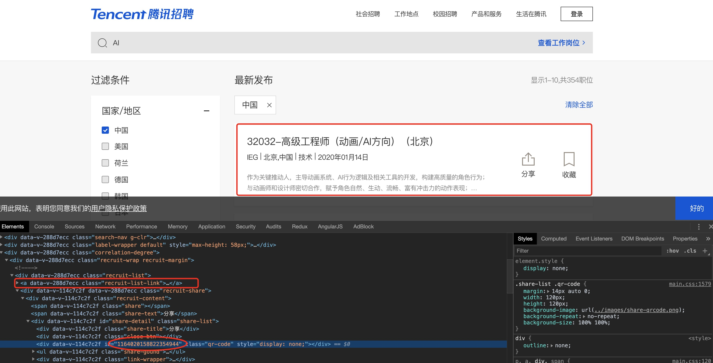
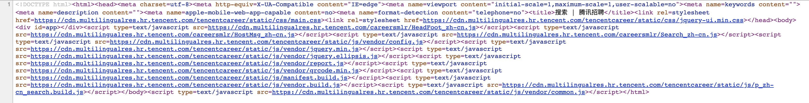
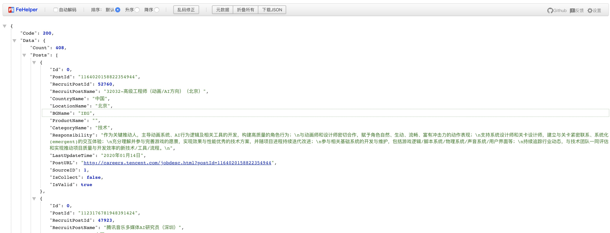
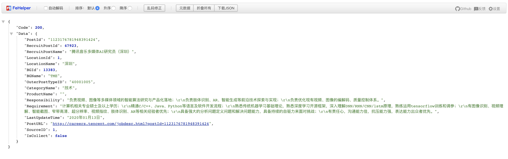

### 概述

本项目通过Scrapy框架的爬虫实战案例来巩固练习

任务：

- 爬取`careers.tencent.com`中关于指定条件的所有社会招聘信息
- 搜索条件为`中国`
- AI关键字的就业岗位
- 并将信息存储到MySql数据库中
- 地址：https://careers.tencent.com

步骤：

- 首先爬取每页的招聘信息列表
- 再爬取对应的招聘详情信息

分析：

方案1
- 经过页面分析详情页所需id可在列表页分享下结构的div中获取(如果页面上没有具体链接地址，那么跳转程序就很可能在js脚本中或者跳转地址在接口数据中) 
- 打开源代码查看，发现代码非常少，经过构建程序处理过，并且所有数据都是后加载出来的
- 此方案不可取

    
    <hr />
    

    （方案1 图例）

方案2
- 解析ajax请求数据并进行处理
- **列表接口**举例：`https://careers.tencent.com/tencentcareer/api/post/Query?timestamp=1578972041752&countryId=1&cityId=&bgIds=&productId=&categoryId=&parentCategoryId=&attrId=&keyword=&pageIndex=1&pageSize=10&language=zh-cn&area=cn`
- 简化**列表接口**请求参数：`https://careers.tencent.com/tencentcareer/api/post/Query?timestamp=1578972041752&keyword=AI&pageIndex=1&pageSize=10&language=zh-cn&area=cn`
- **详情页数据接口**举例：`https://careers.tencent.com/tencentcareer/api/post/ByPostId?timestamp=1578975250208&postId=1123176781948391424&language=zh-cn`
- 经分析我们可以从列表页接口中拿id, 从详情页接口中获取数据即可
- 此接口可直接访问，没做反爬和权限验证处理, 如下图
- 此方案可行

    
    <br />
    

    （方案2 图例）

备注：

- 因时间问题可能会导致技术和网站结构变更，从而导致代码失效，本文只提供设计思路！
- [点击此处查看代码仓库](https://github.com/johnnynode/python-spider/tree/master/basic/contents/code/job)

### 创建项目

- 在命令行编写下面命令，创建项目 job, $`scrapy startproject job`
- 项目目录结构：
    ```log
    job
    ├── job
    │   ├── __init__.py
    │   ├── __pycache__
    │   ├── items.py        # Items的定义，定义抓取的数据结构
    │   ├── middlewares.py  # 定义Spider和DownLoader的Middlewares中间件实现。 
    │   ├── pipelines.py    # 它定义Item Pipeline的实现，即定义数据管道
    │   ├── settings.py     # 它定义项目的全局配置
    │   └── spiders         # 其中包含一个个Spider的实现，每个Spider都有一个文件
    │       ├── __init__.py
    │       └── __pycache__
    └── scrapy.cfg    #Scrapy部署时的配置文件，定义了配置文件路径、部署相关信息等内容
    ```

### 进入项目目录，创建爬虫spider类文件

- 执行genspider命令，第一个参数是Spider的名称，第二个参数是网站域名。$ `scrapy genspider careers careers.tencent.com`
- 新的目录结构
    ```log
    ├── job
    │   ├── __init__.py
    │   ├── __pycache__
    │   │   ├── __init__.cpython-36.pyc
    │   │   └── settings.cpython-36.pyc
    │   ├── items.py
    │   ├── middlewares.py
    │   ├── pipelines.py
    │   ├── settings.py
    │   └── spiders
    │       ├── __init__.py
    │       ├── __pycache__
    │       │   └── __init__.cpython-36.pyc
    │       └── careers.py  #在spiders目录下有了一个爬虫类文件careers.py
    └── scrapy.cfg
    ```

### 创建Item

- Item是保存爬取数据的容器，它的使用方法和字典类型，但相比字典多了些保护机制。
- 创建Item需要继承scrapy.Item类，并且定义类型为scrapy.Field的字段：
    * 职位id号，名称、位置、类别、职责、要求
    * 具体代码如下：（创建一个类名为CareersItem）
    
    ```python
    # -*- coding: utf-8 -*-

    # Define here the models for your scraped items
    #
    # See documentation in:
    # https://docs.scrapy.org/en/latest/topics/items.html

    import scrapy

    class JobItem(scrapy.Item):
        # define the fields for your item here like:
        # name = scrapy.Field()
        pass

    class CareersItem(scrapy.Item):
        '''
        人事招聘信息封装类
        （职位id号，名称、位置、类别、职责、要求）
        '''
        table = "careers"  #表名
        id = scrapy.Field() 
        name = scrapy.Field()
        location = scrapy.Field()
        cate = scrapy.Field()
        duty = scrapy.Field()
        requirement = scrapy.Field()

    ```

### 解析Response

- 在careers.py文件中，parse()方法的参数response是start_urls里面的链接爬取后的结果。
- 如果是纯粹爬取页面，那么提取的方式可以是CSS选择器、XPath选择器或者是re正则表达式，但是目前我们是爬取ajax数据，直接解析接口数据即可

    ```python
    # -*- coding: utf-8 -*-
    import scrapy, time, json
    from job.items import CareersItem

    class CareersSpider(scrapy.Spider):
        name = 'careers'
        allowed_domains = ['careers.tencent.com']
        pageSize = 10
        p = 1 # 当前页数
        start_urls = ['https://careers.tencent.com/tencentcareer/api/post/Query?keyword=AI&language=zh-cn&area=cn&pageSize='+ str(pageSize) +'&pageIndex=1&timestamp=' + str(int(round(time.time() * 1000)))]

        def parse(self, response):
            #解析当前招聘列表信息的url地址：
            # print('=' * 60)
            obj = json.loads(response.text)
            if obj['Code'] != 200:
                print('list error occur: ' + response.text)
                return
            data = obj['Data']
            count = data['Count'] # 总数
            posts = data['Posts'] # 当前数据
            # print(posts)
            # 开始批量请求【详情页】接口
            for ps in posts:
                pid = ps.get('PostId')
                if pid:
                    detail_url = 'https://careers.tencent.com/tencentcareer/api/post/ByPostId?language=zh-cn&timestamp=' + str(int(round(time.time() * 1000))) + '&postId=' + pid
                    url = response.urljoin(detail_url)
                    yield scrapy.Request(url = url, callback = self.parseNext)

            self.p += 1 # 自增处理
            # 例：如果有32条，每页有10条，那么最多爬取4次
            # 爬取完所有的数据 向上取整 进行比较，符合条件请求下一个列表页的数据
            if -(-count // self.pageSize) >= self.p:
                next_url = 'https://careers.tencent.com/tencentcareer/api/post/Query?keyword=AI&language=zh-cn&area=cn&pageSize='+ str(self.pageSize) +'&pageIndex='+ str(self.p) +'&timestamp=' + str(int(round(time.time() * 1000)))
                url = response.urljoin(next_url)
                yield scrapy.Request(url = url, callback = self.parse)
    
        def parseNext(self, response):
            obj = json.loads(response.text)
            if obj['Code'] != 200:
                print('detail error occur: ' + response.text)
                return
            data = obj['Data']
            item = CareersItem()
            item["name"] = data['RecruitPostName']
            item["location"] = data['LocationName']
            item["cate"] = data['CategoryName']
            item["duty"] = data['Responsibility']
            item["requirement"] = data['Requirement']
            yield item

    ```

### 创建数据库和表

- 在mysql中创建数据库job和数据表careers

    ```sql
    SET NAMES utf8mb4;
    SET FOREIGN_KEY_CHECKS = 0;

    -- ----------------------------
    --  Table structure for `careers`
    -- ----------------------------
    DROP TABLE IF EXISTS `careers`;
    CREATE TABLE `careers` (
    `id` int(10) unsigned NOT NULL AUTO_INCREMENT,
    `name` varchar(255) DEFAULT NULL,
    `location` varchar(255) DEFAULT NULL,
    `cate` varchar(255) DEFAULT NULL,
    `duty` varchar(1000) DEFAULT NULL,
    `requirement` varchar(1000) DEFAULT NULL,
    PRIMARY KEY (`id`)
    ) ENGINE=InnoDB AUTO_INCREMENT=376 DEFAULT CHARSET=utf8;
    ```

### 使用Item Pipeline

- 在Item管道文件中，定义一个MysqlPipeline，负责连接数据库并执行信息写入操作

    ```python
    # -*- coding: utf-8 -*-

    # Define your item pipelines here
    #
    # Don't forget to add your pipeline to the ITEM_PIPELINES setting
    # See: https://docs.scrapy.org/en/latest/topics/item-pipeline.html

    import pymysql

    class JobPipeline(object):
        def process_item(self, item, spider):
            return item

    class MysqlPipeline(object):
        def __init__(self,host,user,password,database,port):
            self.host = host
            self.user = user
            self.password = password
            self.database = database
            self.port = port

        @classmethod
        def from_crawler(cls,crawler):
            return cls(
                host = crawler.settings.get("MYSQL_HOST"),
                user = crawler.settings.get("MYSQL_USER"),
                password = crawler.settings.get("MYSQL_PASS"),
                database = crawler.settings.get("MYSQL_DATABASE"),
                port = crawler.settings.get("MYSQL_PORT"),
            )

        def open_spider(self, spider):
            '''负责连接数据库'''
            self.db = pymysql.connect(self.host,self.user,self.password,self.database,charset="utf8",port=self.port)
            self.cursor = self.db.cursor()

        def process_item(self, item, spider):
            '''执行数据表的写入操作'''
            #组装sql语句
            data = dict(item)
            keys = ','.join(data.keys())
            values=','.join(['%s'] * len(data))
            sql = "insert into %s(%s) values(%s)"%(item.table,keys,values)
            #指定参数，并执行sql添加
            self.cursor.execute(sql,tuple(data.values()))
            #事务提交
            self.db.commit()
            return item

        def close_spider(self, spider):
            '''关闭连接数据库'''
            self.db.close()

    ```

### 修改配置文件

- 打开配置文件：`settings.py` 开启并配置`ITEM_PIPELINES`信息，配置数据库连接信息
- 当有`CONCURRENT_REQUESTS`，没有`DOWNLOAD_DELAY` 时，服务器会在同一时间收到大量的请求。
- 当有`CONCURRENT_REQUESTS`，有`DOWNLOAD_DELAY` 时，服务器不会在同一时间收到大量的请求。

    ```python
    # 忽略爬虫协议
    ROBOTSTXT_OBEY = False

    # 并发量
    CONCURRENT_REQUESTS = 1 

    #下载延迟
    DOWNLOAD_DELAY = 0

    ITEM_PIPELINES = {
        #'job.pipelines.JobPipeline': 300,
        'job.pipelines.MysqlPipeline': 301
    }

    MYSQL_HOST = 'localhost'
    MYSQL_DATABASE = 'job' # 数据库名称
    MYSQL_USER = 'root' # 用户名称
    MYSQL_PASS = '123456_mysql' # 你的登录密码
    MYSQL_PORT = 3306
    ```

### 开始执行爬取

$ `scrapy crawl careers`