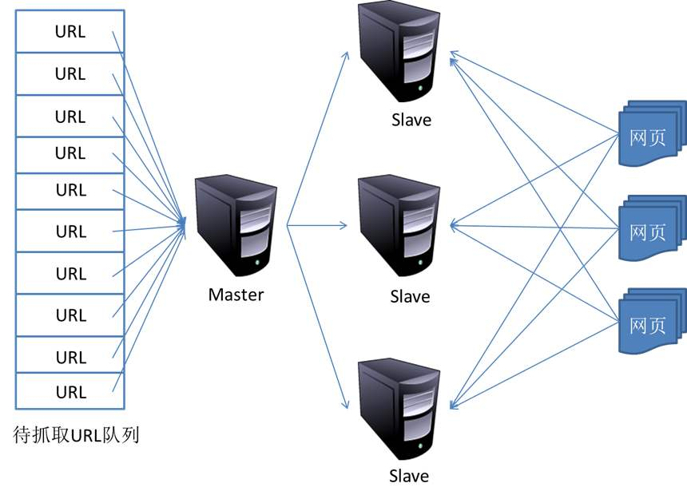
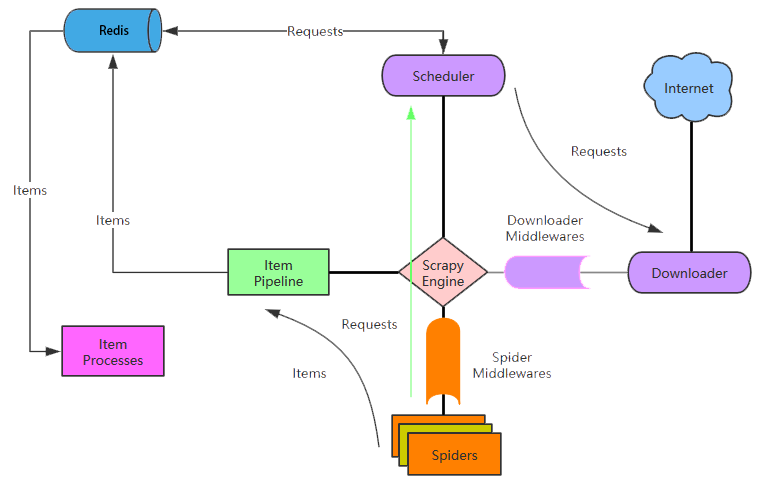

分布式爬虫原理
---

### 概述

- Scrapy框架虽然爬虫是异步多线程的，但是我们只能在一台主机上运行，爬取效率还是有限。
- 分布式爬虫则是将多台主机组合起来，共同完成一个爬取任务，将大大提高爬取的效率。

### 分布式爬虫架构

1 ） **Scrapy单机架构回顾**

- Scrapy单机爬虫中有一个本地爬取队列Queue，这个队列是利用deque模块实现的。
- 如果有新的Request产生，就会放到队列里面，随后Request被Scheduler调度。
- 之后Request交给Downloader执行爬取，这就是简单的调度架构。

2 ） **分布式爬虫架构**

2.1 在多台主机上同时运行爬虫任务, 架构图如下：



2.2 维护爬取队列

- 爬取队列是基于内存存储的Redis, 它支持多种数据结构，如：列表、集合、有序集合等, 存取的操作也非常简单。
- Redis支持的这几种数据结构，在存储中都有各自优点：
    * 列表(list)有lpush()、lpop()、rpush()、rpop()方法，可以实现先进先出的队列和先进后出的栈式爬虫队列。
    * 集合(set)的元素是无序且不重复的，这样我们可以非常方便的实现随机且不重复的爬取队列。
    * 有序集合有分数表示，而Scrapy的Request也有优先级的控制，我们可以用它来实现带优先级调度的队列。

2.3 数据去重

- Scrapy有自动去重，它的去重使用了Python中的集合实现。用它记录了Scrapy中每个Request的指纹（Request的散列值）。
- 对于分布式爬虫来说，我们肯定不能再用每个爬虫各自的集合来去重了，因为不能共享，各主机之间就无法做到去重了。
- 可以使用Redis的集合来存储指纹集合，那么这样去重集合也是利用Redis共享的。
- 每台主机只要将新生成Request的指纹与集合比对，判断是否重复并选择添加入到其中。即实例了分布式Request的去重。

2.4 防止中断

- 在Scrapy中，爬虫运行时的Request队列放在内存中。爬虫运行中断后，这个队列的空间就会被释放，导致爬取不能继续。
- 要做到中断后继续爬取，我们可以将队列中的Request保存起来，下次爬取直接读取保存的数据既可继续上一次爬取的队列。
- 在Scrapy中制定一个爬取队列的存储路径即可，这个路径使用`JOB_DIR`变量来标识，命令如下：
    * $`scrapy crawl spider -s JOB_DIR=crawls/spider`
- 官方文档：http://doc.scrapy.org/en/latest/topics/jobs.html
- 在Scrapy中，把爬取队列保存到本地，第二次爬取直接读取并恢复队列既可。
- 在分布式框架中就不用担心这个问题了，因为爬取队列本身就是用数据库存储的，中断后再启动就会接着上次中断的地方继续爬取。
- 当Redis的队列为空时，爬虫会重新爬取；当队列不为空时，爬虫便会接着上次中断处继续爬取。

2.5 架构实现

- 首先实现一个共享的爬取队列, 还要实现去重的功能。
- 重写一个Scheduer的实现, 使之可以从共享的爬取队列存取Request。
- Scrapy-Redis 分布式爬虫的开源包, 直接使用就可以很方便实现分布式爬虫。

Scrapy分布式爬虫
---

### Scrapy-Redis 介绍

- Scrapy-Redis则是一个基于Redis的Scrapy分布式组件。
- 它利用Redis对用于爬取的请求(Requests)进行存储和调度(Schedule)，并对爬取产生的项目(items)存储以供后续处理使用。
- Scrapy-redis重写了Scrapy一些比较关键的代码，将Scrapy变成一个可以在多个主机上同时运行的分布式爬虫。
- Scrapy-Redis的官方网址：https://github.com/rmax/scrapy-redis
- 架构图
    

### 准备工作

- scrapy
- scrapy-redis
- redis
- mysql
- python的mysqldb模块
- python的redis模块

### 模块安装

- $ `pip3 install scrapy-redis`  
- $ `pip3 install redis`

### 关于Scrapy-redis的各个组件

1 ） **connection.py**

- 负责根据setting中配置实例化redis连接。
- 被dupefilter和scheduler调用。
- 总之涉及到redis存取的都要使用到这个模块。

2 ） **dupefilter.py**

- 负责执行requst的去重，实现的很有技巧性，使用redis的set数据结构。
- 但是注意scheduler并不使用其中用于在这个模块中实现的dupefilter键做request的调度，而是使用queue.py模块中实现的queue。
- 当request不重复时，将其存入到queue中，调度时将其弹出。

3 ） **queue.py**

- FIFO的SpiderQueue，SpiderPriorityQueue，以及LIFI的SpiderStack。
- 默认使用的是第二中，这也就是出现之前文章中所分析情况的原因（链接）。

4 ） **pipelines.py**

- 用来实现分布式处理，它将Item存储在redis中以实现分布式处理。
- 在这里需要读取配置，所以就用到了from_crawler()函数。

5 ) **scheduler.py**

- 此扩展是对scrapy中自带的scheduler的替代（在settings的SCHEDULER变量中指出），正是利用此扩展实现crawler的分布式调度。其利用的数据结构来自于queue中实现的数据结构。
- scrapy-redis所实现的两种分布式：爬虫分布式以及item处理分布式就是由模块scheduler和模块pipelines实现。上述其它模块作为为二者辅助的功能模块。

6 ) **spider.py**

- 设计的这个spider从redis中读取要爬的url, 然后执行爬取, 若爬取过程中返回更多的url, 那么继续进行直至所有的request完成。
- 之后继续从redis中读取url, 循环这个过程。

### 具体的配置和使用(对Scrapy改造)

1 ) **首先在settings.py中配置redis**

在scrapy-redis 自带的例子中已经配置好

```python
# 指定使用scrapy-redis的去重
DUPEFILTER_CLASS = 'scrapy_redis.dupefilters.RFPDupeFilter'

# 指定使用scrapy-redis的调度器
SCHEDULER = "scrapy_redis.scheduler.Scheduler"

# 在redis中保持scrapy-redis用到的各个队列，从而允许暂停和暂停后恢复，也就是不清理redis queues
SCHEDULER_PERSIST = True

# 指定排序爬取地址时使用的队列，
# 默认的 按优先级排序(Scrapy默认)，由sorted set实现的一种非FIFO、LIFO方式。
SCHEDULER_QUEUE_CLASS = 'scrapy_redis.queue.SpiderPriorityQueue'

REDIS_URL = None # 一般情况可以省去
REDIS_HOST = '127.0.0.1' # 也可以根据情况改成 localhost
REDIS_PORT = 6379
```

2 ) **item.py的改造**

```python
from scrapy.item import Item, Field
from scrapy.loader import ItemLoader
from scrapy.loader.processors import MapCompose, TakeFirst, Join

class ExampleItem(Item):
    name = Field()
    description = Field()
    link = Field()
    crawled = Field()
    spider = Field()
    url = Field()

class ExampleLoader(ItemLoader):
    default_item_class = ExampleItem
    default_input_processor = MapCompose(lambda s: s.strip())
    default_output_processor = TakeFirst()
    description_out = Join()
```

3 ) **spider的改造**

- star_turls变成了redis_key从redis中获得request，继承的scrapy.spider变成RedisSpider。

```python
from scrapy_redis.spiders import RedisSpider

class MySpider(RedisSpider):
    """Spider that reads urls from redis queue (myspider:start_urls)."""
    name = 'myspider_redis'
    redis_key = 'myspider:start_urls'

    def __init__(self, *args, **kwargs):
        # Dynamically define the allowed domains list.
        domain = kwargs.pop('domain', '')
        self.allowed_domains = filter(None, domain.split(','))
        super(MySpider, self).__init__(*args, **kwargs)

    def parse(self, response):
        return {
            'name': response.css('title::text').extract_first(),
            'url': response.url,
        }
```

- 启动爬虫 $`scrapy runspider my.py`
    * 可以输入多个来观察多进程的效果。
    * 打开了爬虫之后你会发现爬虫处于等待爬取的状态，是因为list此时为空。
    * 所以需要在redis控制台中添加启动地址,这样就可以愉快的看到所有的爬虫都动起来啦。
    * $`lpush mycrawler:start_urls http://www.***.com`

- 关于 settings.py 的配置

```python
# 指定使用scrapy-redis的调度器
SCHEDULER = "scrapy_redis.scheduler.Scheduler"

# 指定使用scrapy-redis的去重
DUPEFILTER_CLASS = 'scrapy_redis.dupefilters.RFPDupeFilter'

# 指定排序爬取地址时使用的队列，
# 默认的 按优先级排序(Scrapy默认)，由sorted set实现的一种非FIFO、LIFO方式。
SCHEDULER_QUEUE_CLASS = 'scrapy_redis.queue.SpiderPriorityQueue'
# 可选的 按先进先出排序（FIFO）
# SCHEDULER_QUEUE_CLASS = 'scrapy_redis.queue.SpiderQueue'
# 可选的 按后进先出排序（LIFO）
# SCHEDULER_QUEUE_CLASS = 'scrapy_redis.queue.SpiderStack'

# 在redis中保持scrapy-redis用到的各个队列，从而允许暂停和暂停后恢复，也就是不清理redis queues
SCHEDULER_PERSIST = True

# 只在使用SpiderQueue或者SpiderStack是有效的参数，指定爬虫关闭的最大间隔时间
# SCHEDULER_IDLE_BEFORE_CLOSE = 10

# 通过配置RedisPipeline将item写入key为 spider.name : items 的redis的list中，供后面的分布式处理item
# 这个已经由 scrapy-redis 实现，不需要我们写代码
ITEM_PIPELINES = {
    'example.pipelines.ExamplePipeline': 300,
    'scrapy_redis.pipelines.RedisPipeline': 400
}

# 指定redis数据库的连接参数
# REDIS_PASS是我自己加上的redis连接密码（默认不做）
REDIS_HOST = '127.0.0.1'
REDIS_PORT = 6379
#REDIS_PASS = 'redisP@ssw0rd'

# LOG等级
LOG_LEVEL = 'DEBUG'

#默认情况下,RFPDupeFilter只记录第一个重复请求。将DUPEFILTER_DEBUG设置为True会记录所有重复的请求。
DUPEFILTER_DEBUG =True

# 覆盖默认请求头，可以自己编写Downloader Middlewares设置代理和UserAgent
DEFAULT_REQUEST_HEADERS = {
    'Accept': 'text/html,application/xhtml+xml,application/xml;q=0.9,image/webp,*/*;q=0.8',
    'Accept-Language': 'zh-CN,zh;q=0.8',
    'Connection': 'keep-alive',
    'Accept-Encoding': 'gzip, deflate, sdch'
}
```

