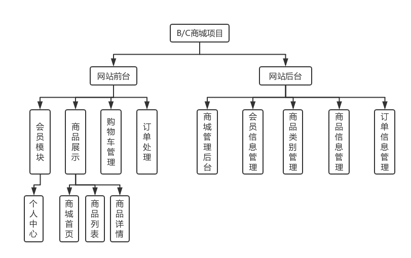
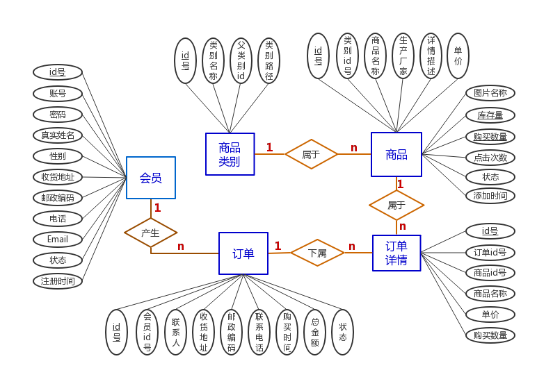
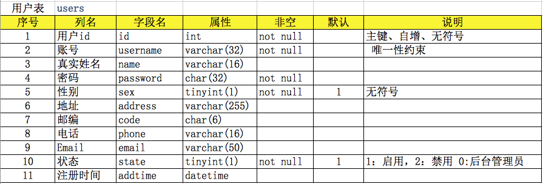
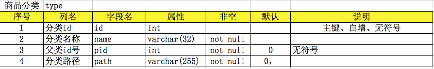
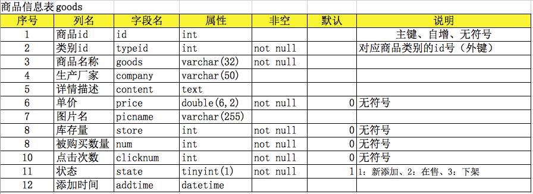
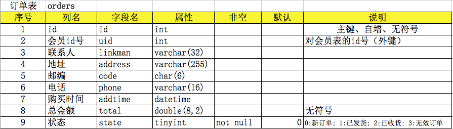
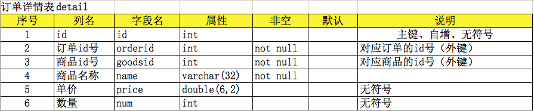

### 概述

需要根据《项目建议书》、《需求说明书》、界面原型、各种标准规范对数据库进行设计, 我们目前先参考这一设计图

<div align="center">
    
</div>

### 结构设计

1 ） **找实体**

- 实体是实体-关系模型的基本对象, 是现实世界中各种事物的抽象。
- 凡是可以相互区 开并可以被识 的事、物、概念等对象均可认为是实体。
- 基本的实体列表如下:
    * 会员
    * 类别
    * 商品
    * 订单
    * 订单详情
    * 收货地址
    * 商品评论
    * 商品图片
    * 友情链接
    * 站内公告
    * ...

2 ) **找属性**

- 每个实体都有一组特征或性质,称为实体的属性。
- 实体的属性值是数据库中存储的主要 数据,一个属性实际上相当于表中的一个列。
- 如会员实体：账号、密码、真实姓名、性别、地址、邮编、电话、邮箱、状态、注册时间
- 商品实体：商品名称、厂家、简介、单价、图片、状态、库存量、购买量、点击次数、添加时间
- ...

3 ） **找关系**

- 每个商品属于一个类别，每个类别下可以有多个商品，那么类别与商品的关系为：1:n(1对多关系)
- 每个订单属于一个会员，每个会员下可以有多个订单，那么会员与订单的关系为：1:n(1对多关系)
- 每个订单详情属于一个订单，每个订单下可以有多条购买商品，那么关系为：1:n(1对多关系)

4 ） **绘制E-R图**

<div align="center">
    
</div>

在线画图：https://www.processon.com/

5 ) **其他说明**

- 在一开始的时候，表的设计多一些少一些都没太大关系，随着项目的展开，会有调整(加字段,加属性,加表,减表,分库,分表等)
- 项目开发时, 数据库一旦形成后期处理的时候必须交由一个人来处理(DBA来做), 完成之后会更新日志通知大家表结构更改了, 让大家同步最新的表

### 逻辑结构设计

在上面实体之间的关系基础上,将实体、属性和实体之间的联系转换为关系模式。

1 ） **确定关系模式**

- 根据转换算法,E-R 图中有5个实体类型,可以转换成4个关系模式:
    * 会员(id号、账号、密码、真实姓名、性别、收货地址、邮政编码、电话、Email、状态、注册时间)
    * 商品类别(类别id号，类别名称，父类别id，类别路径)
    * 商品(商品id、类别id、商品名称、生产厂家、详情描述、单价、图片名称、库存量、购买数量、点击次数、状态、添加时间)
    * 订单(订单id号、会员id号、联系人、收货地址、邮政编码、联系电话、购买时间、总金额、状态)
    * 订单详情(id号、订单id号、商品id号,商品名称、单价、购买量)

2 ) **消除冗余**

- 冗余数据和冗余联系容易破坏数据库的完整性,给数据库的维护增加困难,应当予以消除。
- 本系统的冗余数据和冗余关系已经在概念结构设计中处理过了,这里不再进行过多的叙述。

### 物理结构设计

- 数据库设计的最后阶段是确定数据库在物理设备上的存储结构和存取方法,即物理数据模型。
- 物理数据模型的设计其实也是在设计表结构。
- 一般地,实体对应于表,实体的属性对应于表的列(字段),实体之间的关系成为表的约束。

1 ) **设计数据表结构**

1.1 用户表：users
<div align="center">
    
</div>

2.2 商品分类表：type
<div align="center">
    
</div>

2.3 商品信息表：goods
<div align="center">
    
</div>

2.4 订单表：orders
<div align="center">
    
</div>

2.5 订单详情表：detail (或 order_detail 比较好)
<div align="center">
    
</div>

2 ） **通过数据表结构来创建数据表**

sql脚本

```sql
-- 会员信息表（后台管理员信息也在此标准，通过状态区分）
CREATE TABLE `users`(
  `id` int(11) unsigned NOT NULL AUTO_INCREMENT,
  `username` varchar(32) NOT NULL,
  `name` varchar(16) DEFAULT NULL,
  `password` char(32) NOT NULL,
  `sex` tinyint(1) unsigned NOT NULL DEFAULT '1',
  `address` varchar(255) DEFAULT NULL,
  `code` char(6) DEFAULT NULL,
  `phone` varchar(16) DEFAULT NULL,
  `email` varchar(50) DEFAULT NULL,
  `state` tinyint(1) unsigned NOT NULL DEFAULT '1',
  `addtime` datetime DEFAULT NULL, 
  PRIMARY KEY (`id`),      
  UNIQUE KEY `username` (`username`)
)ENGINE=MyISAM AUTO_INCREMENT=1 DEFAULT CHARSET=utf8;

-- 商品类别表
CREATE TABLE `type`(
  `id` int(11) unsigned NOT NULL AUTO_INCREMENT,
  `name` varchar(32) DEFAULT NULL,
  `pid` int(11) unsigned DEFAULT '0',
  `path` varchar(255) DEFAULT NULL,
  PRIMARY KEY (`id`)
)ENGINE=MyISAM AUTO_INCREMENT=1 DEFAULT CHARSET=utf8;

-- 商品信息表
CREATE TABLE `goods`(
  `id` int(11) unsigned NOT NULL AUTO_INCREMENT,
  `typeid` int(11) unsigned NOT NULL,
  `goods` varchar(32) NOT NULL,
  `company` varchar(50) DEFAULT NULL,
  `content` text,
  `price` double(6,2) unsigned NOT NULL,
  `picname` varchar(255) DEFAULT NULL,
  `store` int(11) unsigned NOT NULL DEFAULT '0', 
  `num` int(11) unsigned NOT NULL DEFAULT '0',
  `clicknum` int(11) unsigned NOT NULL DEFAULT '0',
  `state` tinyint(1) unsigned NOT NULL DEFAULT '1',
  `addtime` datetime DEFAULT NULL,
  PRIMARY KEY (`id`),
  KEY `typeid` (`typeid`)
)ENGINE=MyISAM AUTO_INCREMENT=1 DEFAULT CHARSET=utf8;

-- 订单信息表
CREATE TABLE `orders`(
  `id` int(11) unsigned NOT NULL AUTO_INCREMENT,
  `uid` int(11) unsigned DEFAULT NULL,
  `linkman` varchar(32) DEFAULT NULL,
  `address` varchar(255) DEFAULT NULL,
  `code` char(6) DEFAULT NULL,
  `phone` varchar(16) DEFAULT NULL,
  `addtime` datetime DEFAULT NULL,
  `total` double(8,2) unsigned DEFAULT NULL,
  `state` tinyint(1) unsigned DEFAULT NULL,
  PRIMARY KEY (`id`)
)ENGINE=MyISAM AUTO_INCREMENT=1 DEFAULT CHARSET=utf8;

-- 订单信息详情表
CREATE TABLE `detail`(
  `id` int(11) unsigned NOT NULL AUTO_INCREMENT,
  `orderid` int(11) unsigned DEFAULT NULL,
  `goodsid` int(11) unsigned DEFAULT NULL,
  `name` varchar(32) DEFAULT NULL,
  `price` double(6,2) DEFAULT NULL,
  `num` int(11) unsigned DEFAULT NULL,
  PRIMARY KEY (`id`)
)ENGINE=MyISAM AUTO_INCREMENT=1 DEFAULT CHARSET=utf8;


-- 在user上表中添加一条后台管理员账户数据
insert into users values(null,'admin','管理员',md5('admin'),1,'北京市','100086','15311111111','xyzabc@xx.com',0,now())
```

### 安全保密设计

- 本数据库系统采用安全的用户名加口令方式登录。用户名的权限限制为只能进行基本的 增删改查数据功能。
- 数据库应用对数据一般都具有一定的限制,这种限制称为完整性。
- 关系数据库系统应该保证输入的值符合其规定的数据类型,并保证值在系统支持的范围内。
- 关系数据库系统都支持 3 种完整性: `域约束`、`实体完整性约束`和`关联完整性约束`。
