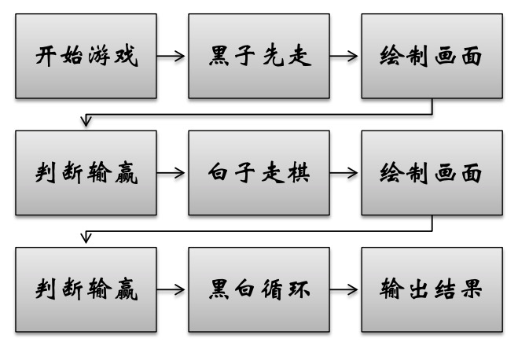
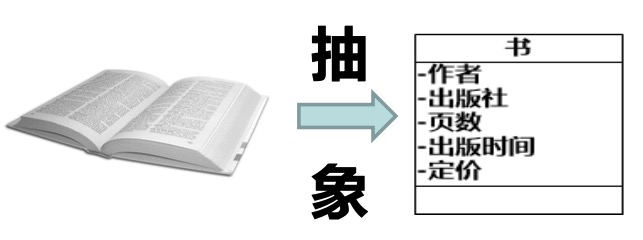
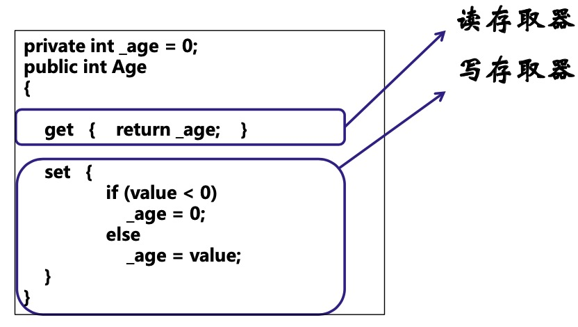
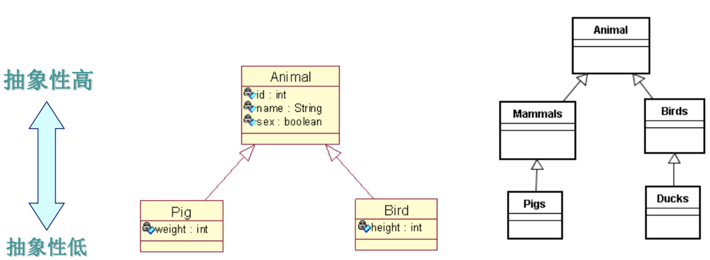

面向对象核心概念和基本特性
---

--- 笔记整理自 北京理工大学 计算机学院

### 问题导入

如何设计一个五子棋游戏?

1 ) **面向过程**

分析出解决问题所需要的步骤 ，然后用函数把这些步骤一步一步实现，使用的时候依次调用。

面向过程设计

    

备注：图片托管于github，请确保网络的可访问性

2 ) **面向对象**

把构成问题的事务分解成各个对象。建立对象的目的不是为了完成一个 步骤，而是为了描叙某个事务在 整个解决问题的步骤中的行为。

面向对象设计

- 对象的初步识别
    * 黑白棋对象:接受用户输入 
    * 规则对象:判定诸如犯规、输赢等 
    * 棋盘对象:绘制画面

- 对象之间的协作过程
    * 序列图
    * 状态图

### 扩展性比较

- 扩展1:悔棋
    * 面向过程:影响很大
    * 面向对象:主要涉及棋盘对象

- 扩展2:把五子棋程序改造为围棋程序
    * 面向过程:改动困难，不如重新设计
    * 面向对象:主要涉及规则对象

### 面向对象知识结构及扩展

1. 一切皆对象!
2. 如何识别对象?
3. 如何确定对象之间的关系? 4. 如何确定对象的职责?
5. 如何设计出良好的对象模型?

    

备注：图片托管于github，请确保网络的可访问性

### 核心概念:类和对象

- 类:标准，共性，模板，包含属性和方法
- 对象:具有模板所属特性的个体
- 在软件系统构造过程中尽可能运用人类的自然思维方式
- 面向对象技术追求解决问题的方法空间与客观世界问题的结构空 间一致
- 对象可具体:人地点和事件等
- 对象可抽象:逻辑等

### 基本特性之抽象

- 抽象是一种研究问题的方法
- 定义一个类实际上就是把一类事物的共有的属性和行为提取(抽象)出来，形成一个物理模型(模版)
- 这个模板刻画了实物的本质特性，忽略了所有不相关的不重要的信息

    

备注：图片托管于github，请确保网络的可访问性

### 属性取决于观察角度

身份不同，目的不同，观察的角度不同，得到的结果也不同!

如何抽象出汽车类的属性?

- 从销售人员的角度
    * 型号
    * 价格
    * 颜色
    * 里程数

- 从维修人员的角度
    * 马达类型
    * 传动类型
    * 维修记录

### 操作取决于观察角度

身份不同，目的不同，观察的角度不同，得到的结果也不同!

如何抽象出汽车类的操作?

- 从销售人员的角度
    * 处理客户定单
    * 准备销售合同
    * 加入清单
    * 从清单中删除

- 从维修人员的角度
    * 测试刹车
    * 修理刹车
    * 转动轮胎
    * 检查马达速度

### 适度抽象

在系统分析和设计过程中，进行 “适当的”抽象是问题的关键

1 ） **适当的抽象**

- 系统易于维护 
- 功能易于扩展 
- 代码易于测试

2 ） **过度的抽象**

- 系统变得过于复杂 
- 代码读起来让人困惑
- 调试变得更加困难

### 基本特性之封装

- 对象向外界隐蔽内部的实现细节，可以看成是一个黑盒
- 外界通过接口来访问对象

    

备注：图片托管于github，请确保网络的可访问性

### 封装的作用

- 实现信息隐藏，外部代码无法随意访问底层数据，只能以合乎规范的方式操作数据
- 封装不仅仅可以隐藏数据，同时还可以隐藏底层数据存储 方式、算法等具体实现细节
- 维护数据的有效性和一致性
- 适当的封装，使得代码易于理解和重用
- 可以统一地实现业务逻辑，协同开发难度降低

 
通过封装实现了信息隐藏是面向对象更适应大型软件开发的根本原因之一

### 基本特性之继承

- 在一个类基础上定义一个新类，继承是一个从一般到特殊的过程 
- 继承构建了一个分类的树型模型，从上到下抽象性逐渐降低
- 在实际开发中继承实现了代码复用
- 利用继承实现多态

    

备注：图片托管于github，请确保网络的可访问性

### 基本特性之多态

- 不同子类对同一消息做出的不同反应
- 多态允许将子类类型的指针赋值给父类类型的指针，亦即子类重新定义父类的虚函数
- 多态是晚绑定(运行时确定子类的虚函数地址)
- 多态的主要目的是提升代码的可扩展性
- 适度使用多态可以简化程序流程，提升代码的可维护性
- 多态的滥用，会给程序添加不必要的复杂性，增大理解难度
- 应追求“中庸”

### 总结

- 软件系统当中的类和对象是对现实事物的裁剪和变通
- 抽象是对事物本质特征的精炼和抽取
- 封装可以隐藏实现细节，使得代码模块化，用于代码复用
- 继承可以扩展已存在的代码模块(类)，用于代码复用
- 多态通过抽象类和抽象方法等技术，运用运行时绑定技术，实现了接口重用
- 应用继承实现了对象的统一管理
- 应用接口定义了对象的行为特性
