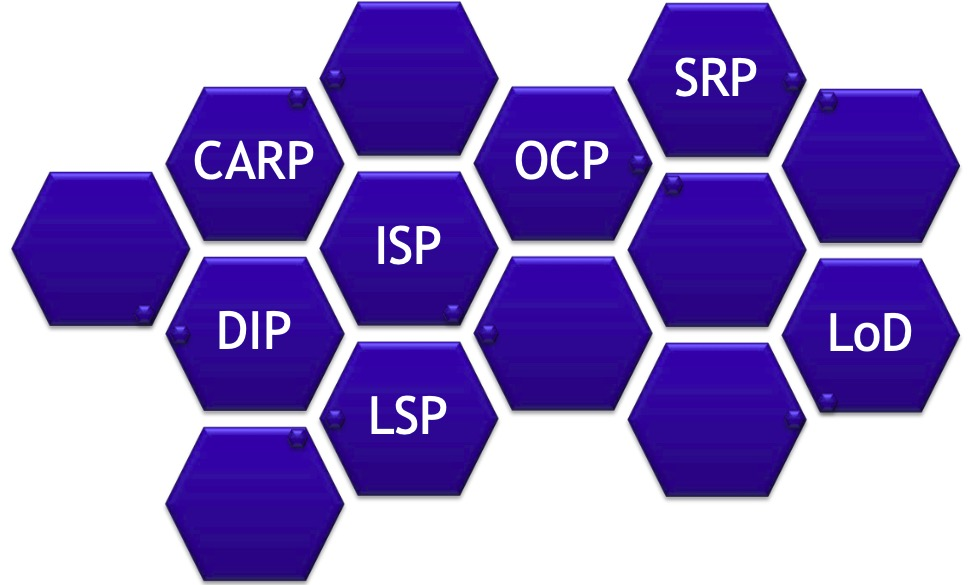
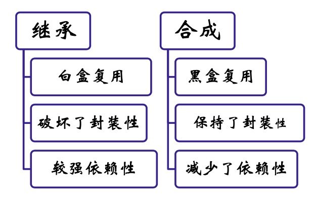

面向对象设计基本原则
---

--- 笔记整理自 北京理工大学 计算机学院

###  面向对象设计基本原则

<div align="center">
    
</div>

备注：图片托管于github，请确保网络的可访问性

### 基本原则之SRP

- Single Responsibility Principle(单一职责)
- 每一个类应该专注于做一件事情
- SRP是低耦合高内聚在面向对象原则上的引申
- 职责过多，可能引起它变化的原因就越多，将会导致职责依赖，相互之间就会产生影响，从而影响内聚性和耦合度
- OOD的实质就是合理分配类的职责

### 基本原则之OCP

- Open-Close Principle (开闭原则)
- 面向扩展开放，面向修改关闭
- 变化来临时，可以通过扩展来满足变化，而不需要修改代码
- 实现开闭原则的关键是抽象
- 抽象层相对稳定，不需修改，需求变化后通过重新定义抽象层的新实现来完成

### 基本原则之DIP

- Dependecy-Inversion Principle(依赖倒置) 
- 要依赖抽象，不要依赖于具体
- 针对接口编程，不要针对实现编程
- 应当使用接口和抽象类进行
    * 变量的类型声明
    * 参量的类型声明
    * 方法的返还类型声明
    * 数据类型的转换等
- 通过大量辅助类实现DIP，可能给维护带来不必要的麻烦

### 基本原则之LSP

- Liskov-Substituion Principle(里氏替换)
- 在任何父类出现的地方都可以用它的子类来替代，而不影响功能
- LSP是对开闭原则的扩展
- 采用开闭原则必然用到抽象和多态，离不开继承
- 里氏替代原则对如何良好继承提出了要求
- LSP是继承复用的基石

### 基本原则之CARP

- Composition/Aggregation Reuse Principle(合成复用) 
- 优先使用对象组合，而不是类继承
- 类继承和对象组合(聚合)是常用的两种功能复用方法

<div align="center">
    
</div>

备注：图片托管于github，请确保网络的可访问性

### 基本原则之ISP

- Interface-Segregation Principle(接口隔离)
- 多个专用接口优于一个单一的通用接口
- 本原则是单一职责原则用于接口设计的自然结果
- 当某个客户程序的要求发生变化而迫使接口发生改变时，影响到其他客户程序的可能生性小
- 接口分离的手段
    * 委托分离
    * 多重继承分离

### 基本原则之LoD

- Law of Demeter(迪米特原则)又叫最少知识原则，不和陌生人说话原则
- 一个软件实体应当尽可能少的与其他实体发生相互作用 
- 在一个对象的方法中，只能给下述(熟人)对象发送消息
    * 该对象自己
    * 这个方法的一个参数
    * 该对象的一个属性
    * 该对象的一个属性集合中的一个元素
    * 在该方法中创建的一个对象

### 违反LoD的代码示例

```java
Class Client {
    private: ClassA * m_pClassA; 
    Public: void func() {
        // 有一长串不认识的方法，最终调用了GetTimer方法，造成严重的依赖
        m_pClassA-> GetClassB()-> GetClassC()-> GetClassD()-> GetTimer();
    }
};
```

解决方案: 

- 为ClassA添加一个职责:GetTimer() 
- Client只和ClassA发生耦合，不会和其他类耦合 
- ClassA的GetTimer实现的变化不影响Client

### 基本原则总结

- 遵循设计原则，可以使软件更具灵活性，强壮性
- 灵活是需要付出代价的，由多态带来的性能损失就是最明显的一个问题
- 需要权衡，在灵活与性能之间做出选择
- 只在需求可能频繁发生变化的地方使用