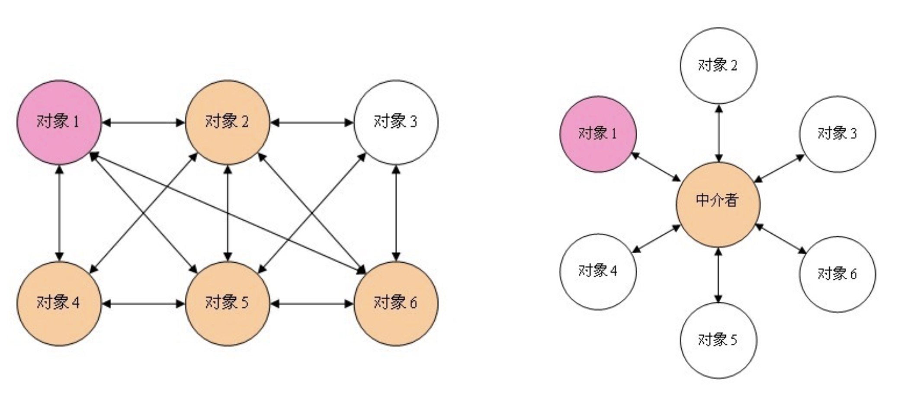

通用职责分配模式(grasp)
---

--- 笔记整理自 北京理工大学 计算机学院

### 什么是GRASP?

- General Responsibility Assignment Software Patterns(通用职责分配软件模式)
- GRASP包括4个基本模式和5个扩展模式，描述了对象设计和职责分配的基本原则
- 职责是一个类的契约或义务
- “做”型职责是通过类的方法来实现的
- “知道”型职责是通过类内部封装的属性以及类间关系来 体现
- GRASP是如何设计一个面向对象系统的基础

### GRASP的9个模式

- 专家 :应该将职责分配给信息专家(谁的数据谁负责)
- 创建者 :创建对象的职责(何时，由谁来创建和销毁)
- 低耦合 :类间的关系代表了类之间的耦合程度
- 高内聚 :一个类的职责之间的相关程度和集中程度
- 控制者 :把协调处理系统消息的职责分配给不同控制类
- 多态 :为不同的派生类分配具体的工作，具有相同接口
- 纯虚构 :非实体类，从其他类中抽取相关高内聚职责
- 中介者 :隔离藕合度过大的多个类，可能是虚构的
- 受保护变化:把易于变化部分封装起来便于扩展

### 信息专家

- Information Expert
- 信息专家模式是面向对象设计的最基本原则
- 如果某个类拥有完成某个职责所需要的所有信息，那么这个职责就应该分配给这个类来实现
- 示例:网上购物系统的购物车设计
    * 需求:需要让每种商品只在购物车内出现一次，购买相同商品，只需要更新商品的数量即可
    * 方案1:判断相同的职责与商品ID相关，它存在商品类中
    * 方案2:商品类为实体类，商品ID相关职责太多，应分散

### 创建者

- 尽可能少的建立对象之间的耦合和依赖关系
- 一般情况下，只在下列情况下才由类A来创建类B，即A是B的创建者:
    * 1.A是B的聚合 
    * 2.A是B的容器 
    * 3.A持有初始化B的信息(数据) 
    * 4.A记录B的实例 
    * 5.A频繁使用B

### 低耦合

- 低耦合降低了因一个类的变化而影响其他类的范围，而且让类更简单，更容易理解
- 造成类A、B之间耦合的情况:
    * 1. A是B的属性
    * 2. A调用B的实例的方法
    * 3. A的方法中引用了B，包括B是A方法的返回值或参数 
    * 4. A是B的子类，或者A实现了B
- 遵循一些面向对象设计的基本原则可以降低类间耦合，如LoD，信息专家(职责迁移)，避免夸模块类之间的直接访问等

### 高内聚

- 给类尽量分配内聚的职责，即功能性内聚的职责
- 功能性紧密相关的职责应该放在一个类里，并共同完成有限的功能
- 高内聚更有利于类的理解和重用，也便于类的维护
- 高内聚也是一种隔离

### 控制者

- 将处理系统事件消息的职责分派给代表下列事物的类:
    * 代表整个系统的类
    * 代表整个企业或组织的类 
    * 代表真实世界中参与职责的主动对象类 
    * 代表一个用例中所有事件的人工处理者类

- 控制者模式的相关原则:
    * 1.系统事件的接收与处理通常由一个高级控制者类来代替 
    * 2.一个子系统会有很多控制者类，分别处理不同的事务 
    * 3.控制者一般将需要完成的工作分配给其他对象

### 多态

- 含义同面向对象的基本特性中的多态
- 当相关的可选择的方法或行为随着类型变化时，将行为的职责分配给那些行为变化的类型
- 典型编程应用:用多态的方法判断具体应该用哪个类，而不是用if来判断类该执行什么行为
- 指导:尽量对抽象层编程

### 纯虚构

- 纯虚构与纯虚函数意思相近
- 高内聚低耦合是系统设计的终极目标
- 从某种角度看，内聚和耦合永远都是矛盾对立的
- 高内聚要求拆分出更多的类，但对象之间需要更多的协作来完成任务，这又造成了高耦合，反之亦然。
- 用纯虚构模式，由一个纯虚构的类来协调内聚和耦合，可以在一定程度上解决二者之间的矛盾

### 中介者

当多个类之间存在复杂的信息交互时，引入一个中介者类，把多个类之间的关联职责分配给它，从而降低类之间的耦合程度

    

备注：图片托管于github，请确保网络的可访问性

### 受保护变化

- 预先找出不稳定的变化点，使用统一的接口封装起来，如果未来发生变化的时候，可以通过接口扩展新的功能，而不需要去 修改原来旧的实现
- 与OCP(开闭原则)类似，即一个软件实体应当对扩展开发，对修改关闭
- 在设计一个模块的时候，要保证这个模块可以在不需要被修改 的前提下可以得到扩展
- 通过扩展给系统提供了新的职责，以满足新的需求，同时又没有改变系统原来的功能

### 在迭代中使用GRASP

- 使用GRASP的根本原因是为了满足需求的变更
- 敏捷方法通过快速的迭代来刺激变化，让变化及早暴露，再根据变化进行相应改动，并让这种改动遵循GRASP，力图使代码以及代码所表达的设计保持干净
- 软件开发活动就是各种权衡:在简单与复杂之间权衡，在一种方案与另一种方案之间权衡
- 不可能把每个问题、每个权衡的利弊都考虑清楚和全面

### GRASP与设计模式

- GRASP是学习使用设计模式的基础
- GRASP着重考虑设计类的原则及职责分配，比设计模式更重要
- 设计模式是关于类和对象的一种高效、灵活的使用方式，是对面向对象的基本原则的多种良好的实现或经验的总结
- GoF设计模式提供具体的类结构，考虑设计的实现、类的交互和软件的质量
- GoF设计模式背后都遵循的就是永恒的设计原则和模式 
- GoF设计模式就是符合GRASP模式要求的面向对象设计模式
