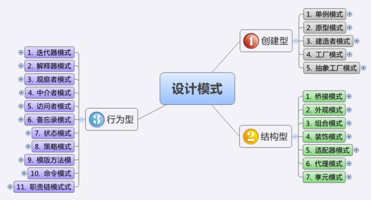
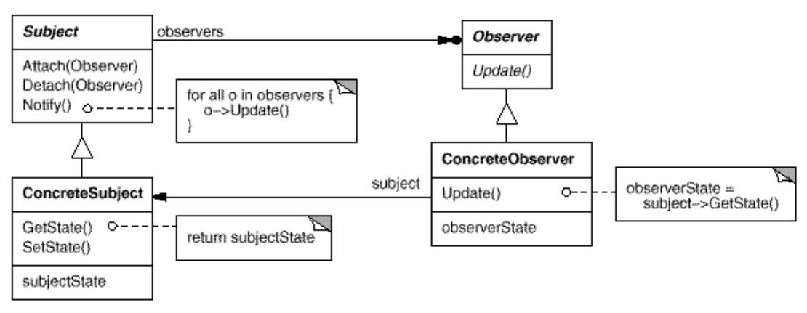

从重构到模式
---

--- 笔记整理自 北京理工大学 计算机学院

### 什么是模式

- 模式记录了专家的经验，并且让非专家也能理解，其核心是对真实世界的抽象和组织
- 模式是发展的，是经过验证的专家经验的重用
- 模式的名称构成了一份词汇表，帮助开发者更好的交流，更快的理解一个系统，更容易的重组一个系统
- 模式的构成
    * 语境
    * 问题
    * 解决方案

### 模式分类

- 代码模式——特定编程语言相关
- 分析模式——透过需求表面了解本质问题
- 设计模式——局部强化
- 架构模式——软件系统的基础结构组织模型
- 建议学习顺序
    * 代码模式(忽略) 
    * 设计模式(重点) 
    * 分析模式(了解) 
    * 架构模式(了解)

### 架构模式

- 架构模式描述软件系统里的基本的结构组织或纲要
- 架构模式提供一些事先定义好的子系统，指定它们的责任，并给出把它们组织在一起的原则和指南
- 部分架构模式和设计模式重叠
- 架构模式常常可以分解成很多个设计模式的联合使用

### 设计模式

- 建筑模式:《建筑的永恒之道》(The Timeless Way of Building)
- 专家们使用迁移的思想得出软件设计模式理论
- 设计模式是一种对一套相互作用的类的描述
- 设计模式是一种实践的总结，是OOP最直接的表现 
- 设计模式的根本意图是适应需求变化
- 程序员应该掌握设计模式

### Gof设计模式分类

- 结构型模式 将一组对象组合成更大的结构
- 行为型模式 定义系统内对象间的通信，以及复杂程序中的流程控制
- 创建型模式 通过使用更复杂的创建对象的方法取代new，换取了对需求变更的从容应对

    

备注：图片托管于github，请确保网络的可访问性

### 工厂模式

- 工厂模式专门负责将大量有共同接口的类实例化
- 工厂模式可以动态决定将哪一个类实例化，不必事先知道每次要实例化哪一个类
- 工厂模式的形式
    * 简单工厂模式(Simple Factory) 
    * 工厂方法模式(Factory Method) 
    * 抽象工厂模式(Abstract Factory)
- 简单工厂模式根据提供给它的数据，返回几个可能类中的一个类的实例
- 简单工厂模式实际上不属于GoF设计模式，但作为入门比较容易理解

### 单件模式

- 单件模式做为“全局变量”的替代品出现
- 具有全局变量的特点:全局可见、贯穿应用程序的整个生命期 
- 也具有全局变量不具备的性质:同类型的对象实例只可能有一个
- 单件模式实现方法
    * 隐藏(private)构造函数
    * 类内维护一个静态、私有的本类对象的引用
    * 提供静态公共函数，如GetInstance()，返回类型为该类的唯一对象的引用

### 观察者模式

- 定义对象间的一种一对多的依赖关系
- 当一个对象的状态发生改变时, 所有依赖于它的对象都得到通知并被自动更新
- 应用场景:当对一个对象的改变需要同时改变其它对象, 而不知道具体有多少对象有待改变
- 典型应用:MVC架构中，将表示层和数据逻辑层分开，逻辑层数据变化后需要通知多个表示层

### 观察者模式结构

    

备注：图片托管于github，请确保网络的可访问性

### 设计模式不是全部

- 滥用设计模式造成过度设计
- 程序结构的灵活性设计不是基于需求变更的要求 
- 设计模式不应该是一开始就应该关注的
- 重构的主要目的不是为了多用设计模式
- 程序结构的好坏与使用的设计模式的多少无关 
- 体现设计意图，适度设计

### 从需求到达设计模式

- 模式尤其是设计模式常常扮演着过度设计的角色 
- 解决避免过度设计的方法:重构
- 从需求通过重构到达模式
- 重构的结果未必一定为某种设计模式
- 设计模式是面向对象设计的基石
- TDD和重构是设计演进的基石

### 推荐书籍

《REfactoring To Patterns》

### 模式小结

- 不同的模式位于不同的层次
- 架构模式——大尺度，系统级，全局
- 设计模式——中等尺度，子系统，局部
- 分析模式——策略，业务模型
- 代码模式——小尺度，特定语言，编程技巧 
- 下级层次不会影响到上一级层次
