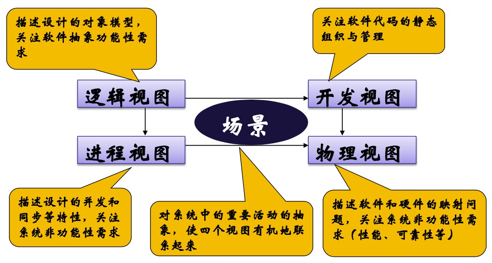
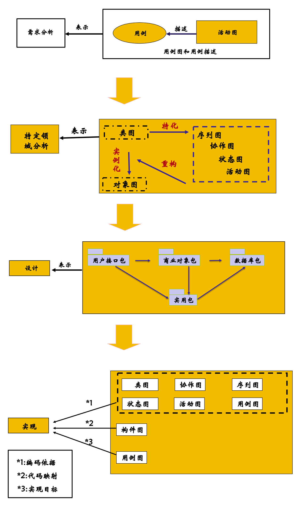
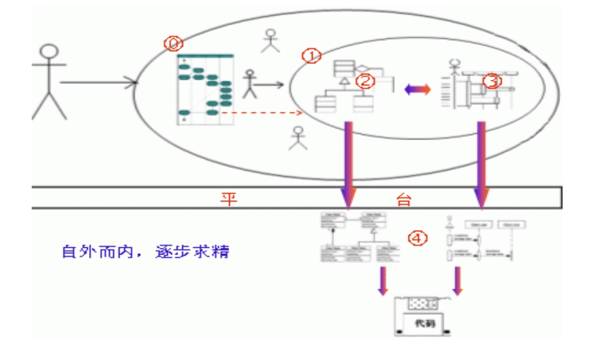

使用UML设计面向对象系统
---

--- 笔记整理自 北京理工大学 计算机学院

### UML的设计目标

- 运用面向对象概念来构造系统模型
- 建立起从概念模型直至可执行体之间明显的对应关系
- 着眼于那些有重大影响的问题
- 创建一种对人和机器都适用的建模语言
- UML为软件系统建立一个供项目组全体成员共享的模型，成为软件开发人员沟通与交流的工具
- 不是软件开发过程和开发方法 
- 提供一种标准表达方式

### UML版本

- 1997年被OMG接收为标准建模语言 
    * 1.0—1.5(2003) 
    * 2.0(2004)—2.5(2013)
- 1999年的UML1.3是目前广泛使用的版本
- UML建立在三大方法(Booch，OMT，OOSE)的基础之上
- Unified:统一多个工种人员的交流、融合多种流派的做法，贯通多种类型的工作内容
- Modeling:直观表达和详细描述面向对象的分析设计内容，并基于这些内容形成文档和代码 
- Language:一套不断完善和扩展的语法和语意规则

### 主要模型图

- 用例图
- 静态图(类图，对象图，包图) 
- 行为图(状态图，活动图)
- 交互图(序列图，合作图)
- 实现图(构件图，配置图)

### 软件结构4+1视图

    

备注：图片托管于github，请确保网络的可访问性

### UML模型图映射关系

    

备注：图片托管于github，请确保网络的可访问性

### 自外而内逐步求精

    

备注：图片托管于github，请确保网络的可访问性

- 从需求开始，确定系统边界，确定系统使用角色(参与者)，确定业务流程
- 打开用例黑盒子通过活动图, 流程图等工具识别出类, 确定对应关系, 明确对象间的消息传递顺序等
- 以上是与平台和编程语言无关的, 然后进入编程实现阶段，根据所用语言和平台的特征推出最有效，最简洁的实现方法
- 最终生产出让用户满意的软件产品