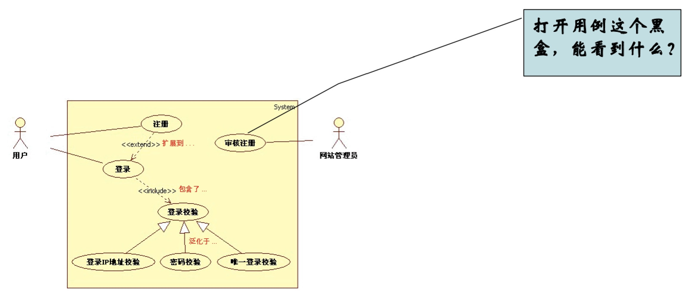

主要UML模型图绘制技巧
---

--- 笔记整理自 北京理工大学 计算机学院

### 用例图与用例分析

- 用例分析技术是Ivar Jacobson于1986年总结发布的一项源于实践的需求分析技术
- 用例图对系统、子系统或类与外部参与者的交互行为进行了可视化
- 为软件需求规格化提供了一个可验证可度量的基本元素
- 是项目计划、进度控制、测试等环节的基础
- 用例图可以使开发团队与客户之间的交流更加顺畅
- 用例分析技术的核心是用例描述而不是用例

### 用例图元素

- 参与者(actor):代表系统用户，驱动系统运转 
- 系统边界(system scope):确定系统的范围
- 用例(use case):代表系统提供的服务
- 关系(association):关联、包含，扩展与泛化

    

备注：图片托管于github，请确保网络的可访问性

### 用例描述

- 前置条件:指在用例启动时，参与者与系统应置于什么状态，这个状态应该是系统能够检测到的、可观测的
- 后置条件:用例结束时，系统应置于什么状态，这个状态也应该是系统能够检测得到的、可观测的
- 基本事件流:基本事件流是对用例中常规、预期路径的描述，也被称为Happy day场景，即大部分时间所遇到的场景;它将体现系统的核心价值
- 扩展事件流:主要是对一些 异常情况和选择分支的描述

### UML用例

- 用例是用户与计算机之间为达到某个目的的典型交互 
- 用例的执行结果对参与者来说是可观测的和有意义的 
- 用例必须由一个参与者发起
- 用例应以动宾短语形式命名
- 用例是指对系统提供的功能的描述
- 用例对应一个层次性用户目标 
    * 概要级
    * 目标级 
    * 子功能级

### 如何获取参与者

- 谁使用系统的主要功能(主要使用者)?
- 谁需要系统支持他们的日常工作?
- 谁来维护、管理系统使其能正常工作(辅助使用者)? 
- 系统需要控制哪些硬件?
- 系统需要与其他哪些系统交互?
- 对系统产生的结果感兴趣的是哪些人?

### 如何获取用例

- 参与者要求系统提供哪些功能?
- 参与者需要读、产生、删除、修改或存储系统中的信息有哪些类型?
- 必须提醒参与者的系统事件有哪些?
- 参与者必须提醒系统事件有哪些?
- 怎样把这些事件表示成用例中的功能?

### 编写用例时的建议

- 使用简单的语法，主语明确，语义易于理解
- 明确写出"谁控制球":在事件流描述中，让读者直观地了解是参与者在控制还是系统在控制
- 从俯视角度编写，即从第三者的角度:指出参与者的动作，以及系统的响应，显示过程
- 向前推移:每一步都有前进的感觉
- 显示参与者的意图而非动作

### 学习用例分析技术

- 学习用例分析技术的"守、破、离"的三个阶段:
    * 守:练习基本功夫，遵循规则，照章行事
    * 破:能突破传统，因地制宜地灵活应用
    * 离:超脱任何招式与规则，达到无招胜有招的境界
- 把捕获的需求整理为易理解的用例图(图形化) 
    * 识别参与者
    * 识别用例
    * 构建用例图
- 补充用例描述(详细完整的描述需求) 
- 重构用例(识别用例间关系，组织用例)
