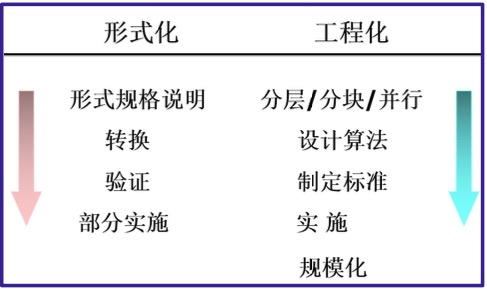
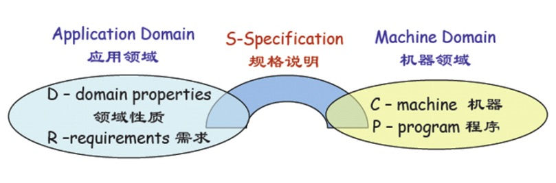
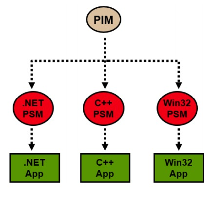
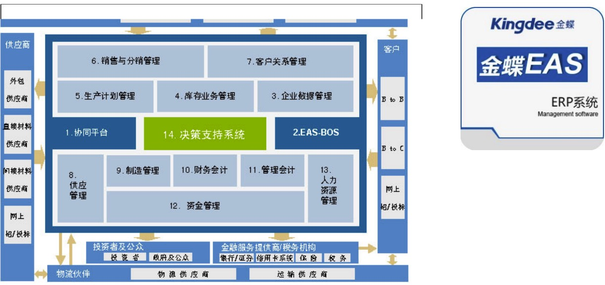
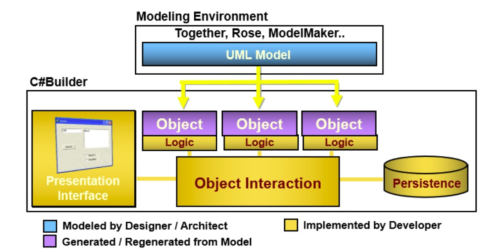
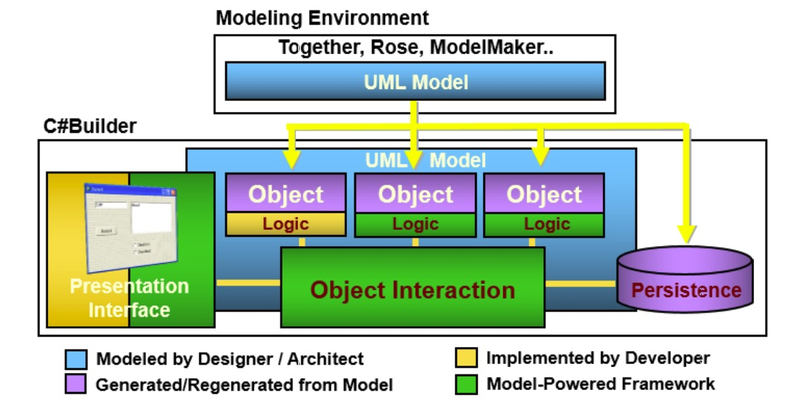

软件自动化概述
---

--- 笔记整理自 北京理工大学 计算机学院

### 自动编程的传说

- OlivaNova : 这是来自芝加哥的报道，据说一家软件公司向外界公布了一项最新的研究成果，这款OlivaNova的软件，可以把应用程序的开发速度提高47倍，减少编程错误，错误只有手工编程的7%，支持windows,Unix,Linux等平台，可自动生成VB6, Java, Ejb, Jsp, .Net等，还可用于开发Webservice等各类程序

- Genux ERP：Genux 将软件开发的开发过程通过自己的平台重新定义为需求捕获，建模，自动化实现和部署，据说一个复杂的ERP系统，不懂编程语言的2个业务专家在2~3个月就完成了，演示的时候，当场增加几个数据库字段，在复杂的界面之上再调整出几个更加复杂的界面, 几分钟后修改便完成了

这些可能有夸张的成本，但是人们对自动化编程的追求是永无止境的

### 愿景

- 人们对自动编程的研究无止境的
- AI+形式化=自动编程
- 高级自动化:告诉计算机软件要实现的功能，就能够自动生成软件
- 智能机器人统治世界?

当我们技术水平达到高级自动化的时候，软件开发公司就可能彻底消失了

### 自动化基础

- 软件工程发展方向
    * 形式化：从数学方面来关注软件开发技术的基础，研究如何表达做什么
    * 工程化：主要关注的是怎么做，从个人到团队，从设计到实施

    
     
     
    
备注：图片托管于github，请确保网络的可访问性

- 形式化方法的应用限制
    * 数学理论限制了使用
    * 缺乏全周期支持的工具 
    * 延缓周期，增加费用

### 形式化方法

- 广义：借助数学的方法来解决软件工程领域的问题，主要包括建立精确的数学模型以及对模型的分析活动

- 狭义：运用形式化语言，进行形式化的规格描述、模型推理和验证的方法

    
     
     
    
备注：图片托管于github，请确保网络的可访问性

- 数学逻辑方法 -》 开发可靠的软件产品
- 形式化方法 = 形式化描述 + 形式化开发
- 形式化方法在软件开发中的作用
    * 对软件需求的描述
    * 对软件设计的描述
    * 对软件编程的代码自动生成
    * 测试自动化

### 形式化方法研究内容

- 基础研究：数学理论组合、复用模型、符合、抽象、数据结构、算法等

- 形式化方法与面向对象方法的结合
    * Statecharts、Petri网、Z语言、VDM等用形式化方法来分析面向对象的语义
    * Objectcharts、面向对象Petri网、Object-Z、Z++、VDM++等用面向对象结构提高形式符号的表达能力

- 形式化工具开发
    * 收效快的
    * 多阶段可用的
    * 容易使用的

### MDA

- 背景：各种组织和公司都致力于自动编程
- MDA（Module Driven Architechture）的提出
- 目标：实现从UML企业化模型到最终代码的自动化生成
- MDA框架支持软件设计和模型的可视化、存储和交换技术
- 典型MDA软件：XDE、Together等
- MDA将导致软件蓝领大量失业
- 创造性思维的能力

### MDA模型

- 平台独立模型（PIM）：具有高抽象层次，独立于任何实现技术的模型
- 平台相关模型（PSM）：为某种特定实现技术量身定做，用特定技术中可用的任何实现技术来描述系统的模型
- 代码：用源代码对系统的描述，每个PSM都将被变换成代码

    
     
    
     
     
    
备注：图片托管于github，请确保网络的可访问性

### 金蝶采用MDA开发模式

    
     
     
    
备注：图片托管于github，请确保网络的可访问性

- 93年推出基于DOS的财务软件
- 96年推出基于Windows的财务软件
- 98年推出基于三层架构的管理软件
- 在各个时期，金蝶被迫做出了很多次的产品升级
- 管理软件对技术平台的依赖加重了软件厂商的成本，也给用户造成了很大影响，增加了系统的维护成本
- 金蝶EAS从4.0开始就按照MDA的模型进行开发，首先建立原模型，将管理软件的所有应用原子化，为业务语言开发打下了基础
- 在原模型基础之上，使用建模工具建立业务模型包括组织模型，功能模型，信息模型，流程模型等等，这些模型属于平台无关的模型
- 根据不同的平台，对业务模型进行模型的编译，生成对应平台的实现模型
- 这种开发方法将传统的业务模型和平台相关的实现进行了分离，摆脱了管理软件对技术基础平台的依赖
- 同时从业务模型到不同平台的实现都保留了一致性，同一套模型既可以在j2ee平台上实现，也可以在.net平台上实现

### 传统开发环境示例

    
     
     
    
备注：图片托管于github，请确保网络的可访问性

- UML 模型是设计师或架构师完成的，运用一小部分框架可以自动生成，如类的声明和属性等
- 编程人员完成了MVC的所有内容，包括用户界面，业务逻辑和数据访问等

### MDA环境

    
     
     
    
备注：图片托管于github，请确保网络的可访问性

- UML模型跨越了建模工具和开发工具，架构师或设计师的创造性工作得以扩展，这对产品质量的提高具有重要意义
- 其次，从UML模型自动生成了涵盖了数据访问部分, 尤其是ORM工具的日益成熟，极大降低了开发者的劳动强度
- MDA模型根据之前的形式化描述可以完成大部分的业务逻辑自动生成, 开发者只需编写核心的复杂逻辑，以及对一些不满意地方的手工调整