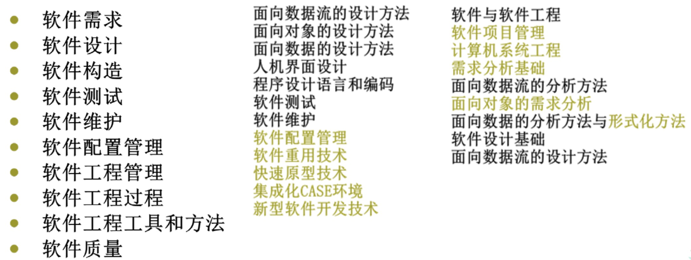
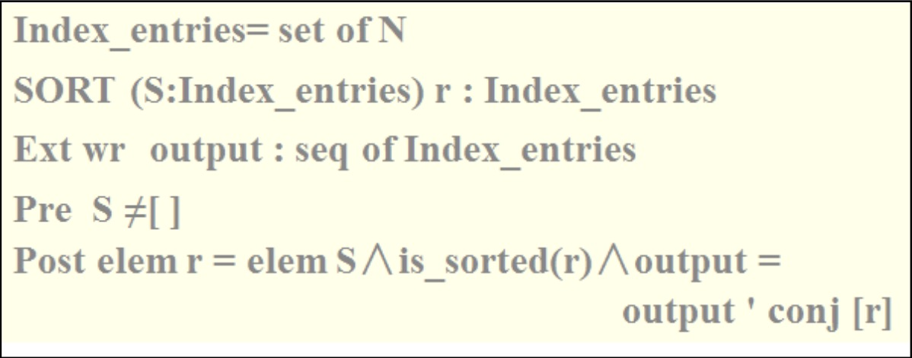

软件工程前生今世
---

--- 笔记整理自 北京理工大学 计算机学院

### 软件工程的历史

- 软件开发
    * 50-60年代：手工作坊
    * 60-70年代：合作生产
    * 70年代以后：工程化

- 1968年"软件危机"概念出现
    * 之后出现了软件工程的概念
    * 也就是把软件开发活动工程化

- 三角模型：质量、进度、成本
   * 软件质量满足不了我们的需求
   * 软件规模大了之后，难以控制，总是出现延期，进度失控
   * 预算不够用，就像一个黑洞把客户的钱大量吸进去
   * 这三个要素出现了严重的问题

- 人们被迫研究软件生产中的技术手段和管理方法

### 关于软件工程

- 软件工程是应用计算机科学、数学及管理科学等原理开发软件的工程。它借鉴传统工程(比如：土木工程)的原则、方法，以提高质量，降低成本为目的。
- 软件工程三要素: 方法、过程、工具 共同作用于软件的质量

### CS学科

荣升一级学科

1 ）计算机科学与技术 0812

- 081201 计算机系统结构
- 081202 计算机软件与理论
- 081203 计算机应用技术
- 081204 计算机网络与信息安全

2 ） 软件工程 0835

- 083501软件工程理论与方法 
- 083502软件工程技术 
- 083503软件服务工程 
- 083504领域软件工程

### 软件工程的知识体系

2001年SWEBOK(Software Engineering Body of Knowledge)把软件工程 主体知识分为10个领域

    

备注：图片托管于github，请确保网络的可访问性

### 软件工程的跨界

软件工程的研究除计算机软件本身外，还涉及众多其他的领域 ，如管理科学、心理学、经济学、人机工程学等，因此，它是一门综合性学科。

- 《完美软件开发：方法与逻辑》
- 《软件工程经济学》
- 《自动化软件测试》
- 《人机工程学》
- 《软件心理学》

### 软件自动化级别

- 问题的非形式描述
- 软件功能描述
- 软件设计描述
- 编码
- 测试

后面三个属于 低级自动化
后面四个属于 中级自动化
全部则属于 高级自动化

关于高级自动化，举个例子：比如我们用语音描述自己想要的软件样子, 机器一下就生成了这样的软件, 比较科幻，但是我们相信这是一个在不远的将来可实现的科幻

### 软件主要开发活动所占比例

1 ）传统比例
- 分析：20%
- 设计：15%
- 编码：20%
- 测试：45%

投入大量的人力测试是因为我们要保证软件的质量，一般编码人员和测试人员的比例是：1：1.2 或 1：1.5，体现了对测试的重视

2 ) 当前比例

- 分析：30%
- 设计：15%
- 编码：30%
- 测试：25%

随着我们工具能力的提高，我们对分析更加的重视, 分析的比较好，设计就可以快速完成，有很多自动化的工具可以帮助我们测试，所以测试比例有所减少，由于我们自动编码的技术还不是很成熟，所以编码环节占了30%

3 ) 将来期望比例 CASE 目标比例

- 分析：45%
- 设计：40%
- 测试：15%

编码没有了，我们希望通过自动化工具自动产生代码

### 软件工程的发展

    

备注：图片托管于github，请确保网络的可访问性

上图这是一段描述语言，也可以说是伪代码，用来形式化描述系统要干什么，也就是做什么的问题

- 形式化 -> 如何描述“做什么”问题
- 工程化 -> 总结软件开发过程的规律，解决“怎么做”
- 软件危机促进了软件自动化的发展
- 软件自动化的目标是解决软件问题：质量、成本、进度