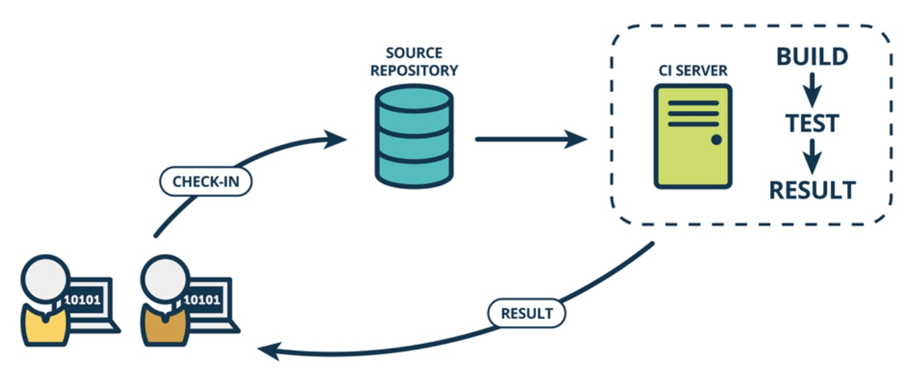
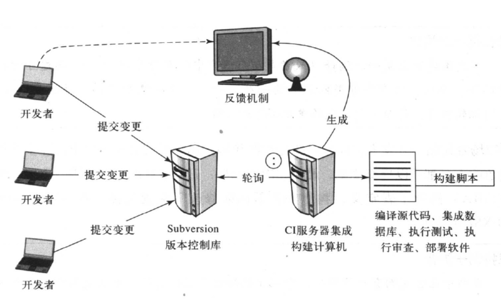

持续集成
---

--- 笔记整理自 北京理工大学 计算机学院

### 从版本号说起

    
     
     
    
备注：图片托管于github，请确保网络的可访问性

     

- 14是主版本号
- 0是次版本号
- 4760是编译版本号
- 1000是修正版本号
- 一般来说前面的数字变化表示软件改动很大，后面的数字变动说明软件的变化很小
- 从上面数字可见，至少发生了几千次的小版本变化
- 可见, PPT的软件开发自动化程度很高!

### 构建与集成

- 手工构建:编译，单元测试，集成，除虫(修正bug)
- 自动化构建:编写构建脚本(Daily Build，Nightly Build) 
- 经常的频繁的构建:持续集成

    
     
     
    
备注：图片托管于github，请确保网络的可访问性

     

### 持续集成

- 持续集成(Continuous Integration)是一种软件开发实践
- 目的:验证集成正确性，尽早发现错误

    
     
     
    
备注：图片托管于github，请确保网络的可访问性

     

### CI基本流程

    
     
     
    
备注：图片托管于github，请确保网络的可访问性

     

- 首先，开发人员在完成了代码编写之后向版本控制库提交代码，当然在提交代码之前需要在本地执行一次私有构建，确保自己的代码修改正确
- 同时，集成服务器(CI)会不停轮询版本控制库的版本变更情况, 一旦检测到变更, CI服务器就会在版本控制库拉取最新代码到集成服务器上执行构建脚本对软件进行编译,单元测试,代码规范检查, 甚至文档自动化生成等操作
- 完成之后，CI服务器根据构建结果给相应的项目成员反馈集成的结果，比如向项目经理发送集成的摘要信息, 向测试发送bug信息等，CI服务器继续监控版本控制库的代码变更，等待进入下一次的持续集成
- 从这一流程中可看出CI的特征

### CI的特征

- 与版本控制系统的连接
- 构建脚本
- 反馈机制
- 集成源代码变更的过程

### CI的价值

- 在企业做CI不是一件容易的事情，这反应了CI它本身的价值
- 减少风险(多次集成，测试，审查，更易于追踪项目，降低缺陷)
- 减少重复过程(减少了程序员的工作)
- 在任何地点任何时间生成可部署的软件(可看到实际跑的产品)
- 增强项目的可视性(减少未知，减少恐惧，对项目发展趋势做出正确判断)
- 对软件产品建立起更大的信心

### 为团队引入CI实践

- 经常提交代码(提倡任务完成之后,马上提交代码)
- 不要提交无法构建的代码
- 立即修复无法集成的构建(优先级最高,避免影响团队协作)
- 编写自动化的单元测试
- 必须通过所有测试和审查 
- 执行私有构建
- 避免签出无法构建的代码

### 阻碍CI的因素

- 增加了维护CI系统的开销
- 变化太大(增量方式引入)
- 失败的构建太多(团队成员的操作和测试问题影响)
- 额外的硬件和软件成本(投入和收益都要考虑,成本不值一提)
- 管理者的观点

### 持续数据库集成

- 如果DBA把大部分时间都花在数据库配置,权限访问控制等琐碎工作上,那么就不能集中精力进行数据规范化,改进性能,制定新的标准等高级工作中去
- 通过自动化脚本来自动化数据库集成
- 通过脚本给每个开发者建立本地的数据库沙盒,每个开发者对数据库的变更和测试都不会影响到其他开发人员
- 数据库脚本和代码一样纳入持续集成活动中去，所有数据库集成都可以通过构建脚本完成
- 利用版本控制库共享数据库资产 
- 让开发者能够修改数据库
- 让DBA成为开发团队中的一员

### 持续审查

- 降低代码复杂度
- 持续进行设计复查
- 通过代码审查维持组织机构的标准
- 判断代码覆盖率
- 减少重复的代码

### 持续部署

- 为代码库打标签
- 干净的环境
- 为每一个构建版打标签
- 执行所有的测试
- 创建构建反馈报告
- 回滚构建的过程能力

### 持续反馈

- 如果没有反馈，持续集成变得毫无意义
- 反馈的目的:触发快速而准确的行动
    * 正确的信息(警报信息优先)
    * 正确的人(角色) , 分类发送
    * 正确的时间(不要太频繁)
    * 正确的方式

### 持续集成小结

- 持续集成是一种循序渐进的开发实践
- 持续集成是对各种测试、代码审查的自动化工具的集成
- 持续集成并不能消除Bug，而是让它们非常容易发现和改正 
- 持续集成的目标是快速发现错误
- 数据库集成可以纳入持续集成
- 快速对持续集成的反馈进行处理
