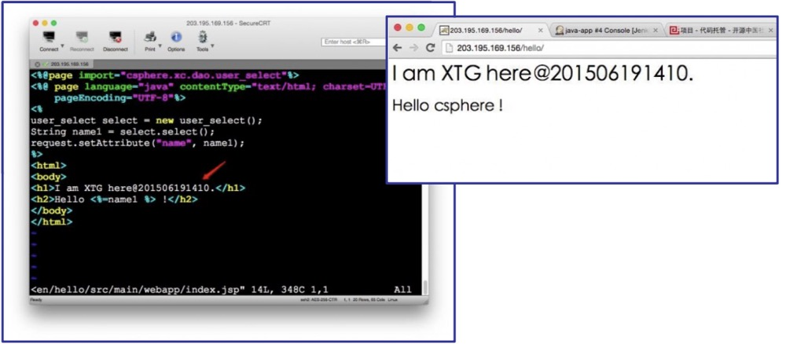
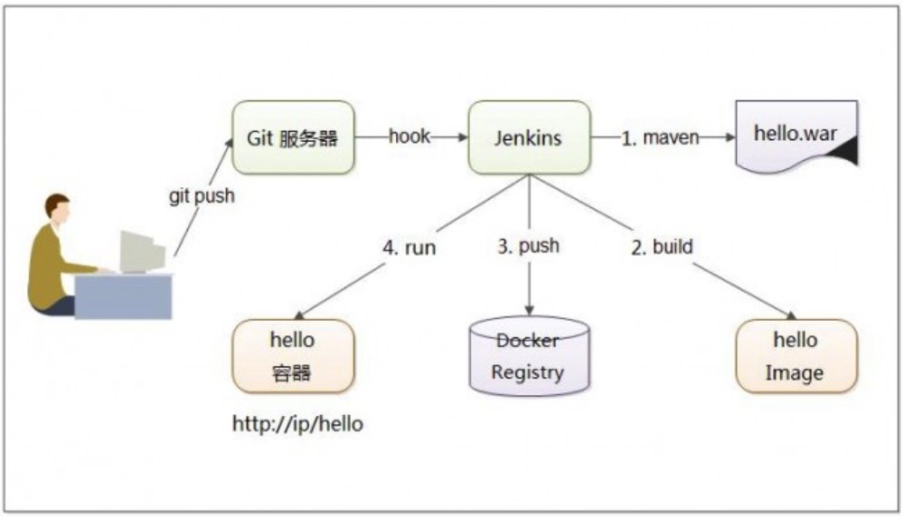
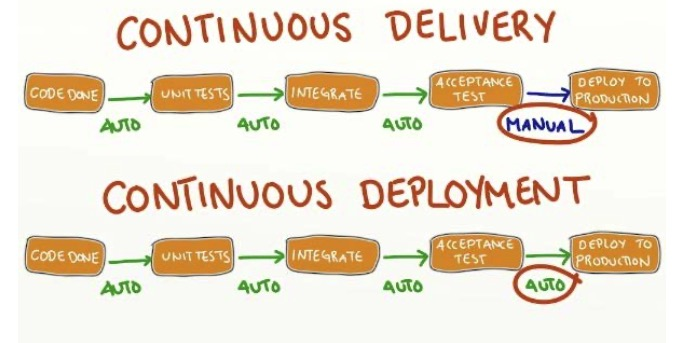
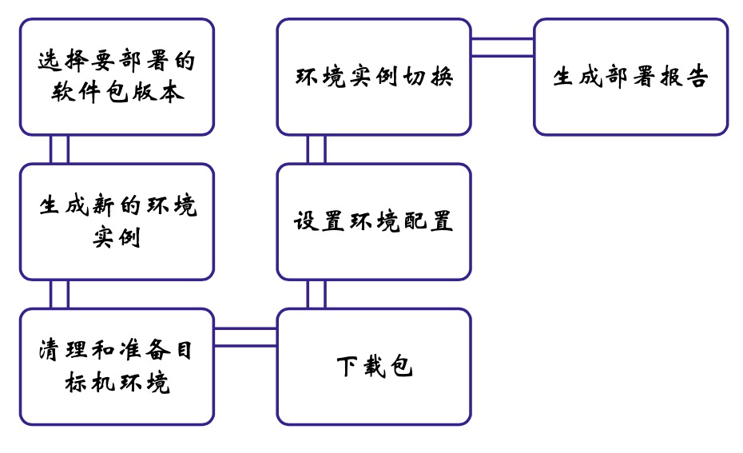
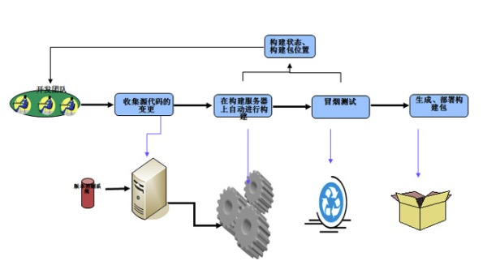
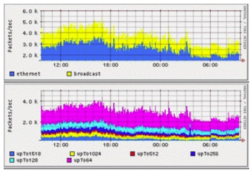

持续交付和部署
---

--- 笔记整理自 北京理工大学 计算机学院

### Hello World!

    
     
     
    
备注：图片托管于github，请确保网络的可访问性

     

- 这是一个jsp小程序发布到云端，用户可以直接访问
- 这是软件发布的第一个版本，假设现在需求发生了变化
- 程序员修改了代码，提交到版本控制库, 经过后台的持续集成和持续部署
- 如果没有错误发生，第二个版本就直接可以给用户发布使用了
- 持续部署极大缩短了从开发到部署的过程, 减轻了手工部署的工作量，提高了开发和部署的可靠性

### 示例架构

    
     
     
    
备注：图片托管于github，请确保网络的可访问性

     

- 上图所用工具都可以通过其他类似工具代替
- 开发者可以使用任意编辑器修改代码
- 然后提交到版本控制服务器上去
- 经过git和jenkins的配合完成自动化部署的发布，全程不需要运维人员的参与
- 具体做法是在git服务器上设置一个push的钩子,每次提交代码,git都会给一个远程http的地址发送一个post请求
- 在jenkins中设置一个token供git在远程调用的时候使用，jenkins在接收到git传递过来的消息之后, 触发一个远程构建命令到目标服务器
- 目标服务器按照预先定义的任务，执行一系列的工作，比如利用maven构建一个hello.war项目包，然后重建容器，构建一个新的image, push到docker的私有库中
- 最后重新把docker容器部署起来，就完成了一个持续部署流程

### 不满足于CI

- 持续交付和持续部署正是为了解决持续集成到最后发布之间的最后一公里
- 持续集成的目的:验证集成正确性，尽早发现错误
- 客户不关心持续集成等开发过程，只想看到发布的结果
- 软件开发团队做到持续集成是不够的
- 软件手工发布的风险很大

    
     
     
    
备注：图片托管于github，请确保网络的可访问性

     

### 持续交付

- 持续交付和持续部署都可以认为是持续集成的延续
- 持续交付( Continuous Delivery )是任何的修改都已证明可以在任何时候实施部署，是在持续集成的基础上将集成后的代码部署到更接近真实生产环境的预生产环境中去
    * 比如在完成单元测试后将代码部署到数据库环境中进行更多的测试，如果代码没有问题可以手动部署到生产环境之中
    * 是每家企业都应该追求的目标
- 持续部署(Continuous deployment)是持续交付的更高阶段:自动的部署到产品环境里，是在持续交付的基础之上把部署到生产环境的过程自动化
    * 如果企业没有制约的情况下，应该以持续部署为目标
    * 在很多场景中一种业务需要等待另外的功能出现之后才能上线，这样就没有办法完成持续部署了
    * 所有，持续部署是否适合某一家企业是基于业务需求而非技术限制
- 开发团队能够交付代码的时候它们才能有信心在短短几分钟时间内，把刚刚修改好的结果提交给客户，为客户提供真正的有价值的服务

    
     
     
    
备注：图片托管于github，请确保网络的可访问性

     

### 软件部署的一般过程

    
     
     
    
备注：图片托管于github，请确保网络的可访问性

     

- 持续部署需要考虑部署到哪些环境，是测试环境还是生产环境，还有各个依赖包的版本，环境的配置等
- 一般情况下，从安装软件到启动环境，第一步是选择要部署的软件包的版本，根据生产环境的要求，生成新的部署实例
- 同时，要对目标机环境进行清理和配置，以满足软件产品的要求，如硬盘，内存以及第三方的依赖等等
- 将软件包下载到目标机之后就可以进行软件配置了，消除运行故障，确保程序可以正常运行
- 最后将用户的访问请求从旧版切换到新版，完成新版软件的部署
- 为了记录部署过程和为后续软件维护提供支持，往往需要生成一份部署报告来记录软件相关的配置参数

### 软件交付:部署流水线

- 部署流水线指一个应用程序从构建，部署，测试到发布整个过程的自动化实现
- 部署流水线大致工作方式是这样的
    * 应用程序的配置，源代码，环境，或数据的每一个变化都会创建一个新的流水线实例
    * 流水线首要工作之一是创建二进制文件和安装包
    * 其余工作都是针对这些二进制文件和安装包所做的一系列的测试
    * 开发人员会更加相信这些二进制文件，配置信息，环境和数据所构成的特殊组合能够正常工作
    * 如果这个产品通过了所有测试就可以发布了
- 部署流水线以持续集成为理论基础，是持续集成的自然结果
- 部署流水线对每个组织都是不同的，取决于每个组织对软件发布的价值流的定义，其背后的原则都是一样的

    
     
     
    
备注：图片托管于github，请确保网络的可访问性

     

### 部署流水线的目标

- 让构建、部署、测试和发布过程对所有人可见，促进合作
- 在整个过程中改善反馈，更早的发现和解决问题
- 通过一个完全自动化的过程在任意环境上部署和发布软件的任意版本
- 这是为客户提供最终价值的体现

    
     
     
    
备注：图片托管于github，请确保网络的可访问性

     

### 软件交付的原则

- 为软件的发布创建一个可重复且可靠的过程 
- 将几乎所有的事情自动化
- 把所有的东西都纳入版本控制
- 提前并频繁的做让你感到痛苦的事情
    * 如果集成让你觉得痛苦, 你就应该在提交代码之后马上进行集成
    * 如果测试让你痛苦，在一开始的时候就应该不断的进行测试
    * 如果软件发布让你痛苦，就应该尝试在每次代码提交并通过所有自动化测试之后马上进行发布，如果不能发布到生产环境中去，就发布到预生产环境中
    * 越早发现缺陷，修复它们的成本就越低
- 内建质量
- 完成意味着发布
- 交付过程是每个成员的责任 
- 持续改进

### 持续部署带来的问题

- 部署性能问题
    * 大量的持续部署，回滚，文件传输给持续部署系统带来了很大的压力
    * 还要考虑未来更大规模的扩展性问题
- 目标机环境管理
    * 多环境部署的时候资源复用问题和新旧机器(环境)的切换问题
- 部署一致性事务问题
    * 如果有多台服务器的时候，有依赖关系的包被部署到了不同机器上，是要求它们一次性成功还是全部失败最后回滚
- 部署环境的版本控制问题
    * 当目标机部署的版本越来越多的时候, 各个环境的包的版本开始出现混乱, 各种依赖的版本也会出现不统一的情况
- 部署计划
    * 计划过多
    * 不同的部署策略都会产生不同的部署计划
- 部署的监控和维护
    * 当规模上去以后
    * 部署系统的监控和维护就会变得非常复杂，往往不亚于一个大型的互联网应用

    
     
     
    
备注：图片托管于github，请确保网络的可访问性

     

不简单，需要根据团队规模，自动化开发程度，项目特点等等因素综合考虑，逐步推进

### 新的趋势

- 持续集成、持续交付和持续部署的出现及流行反映了新的软件开发模式发展趋势
- 工作职责和人员分工的转变
    * 软件开发人员运用自动化开发工具进行持续集成，进一步将交付和部署扩展
    * 而原来的手工运维工作也逐渐被分派到了开发人员的手里
    * 运维人员的工作也从重复枯燥的手工作业转化为开发自动化的部署脚本，并逐步并入开发人员的行列之中
- 大数据和云计算基础设施的普及进一步给部署带来新的飞跃
    * 云计算的出现使得计算机本身也可以自动化的创建和回收
    * 这种环境管理的范畴将进一步的扩充
    * 部署和运维工作也会脱离具体的机器和机房，可以在远端进行
    * 部署能力和灵活性也会出现质的飞跃
- 研发运维的融合
    * 减轻运维的压力，把运维和研发融合在一起

### 总结

- 持续交付和持续部署是一个很复杂的话题，在逐步提高团队自动化开发的水平之上逐步推进，扎扎实实做好每一个细节
- 最后才能踏上持续部署的这趟告诉列车，才能享受软件自动化给团队和客户的实实在在的好处