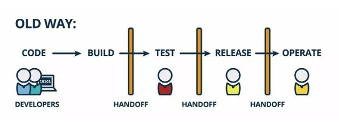
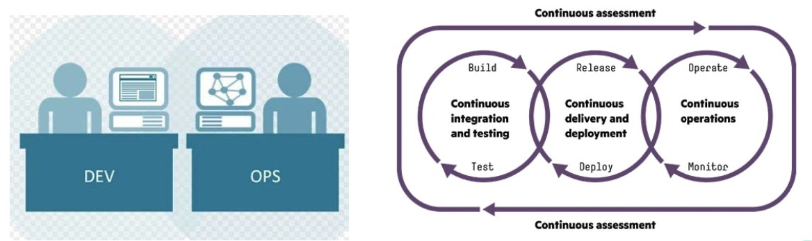
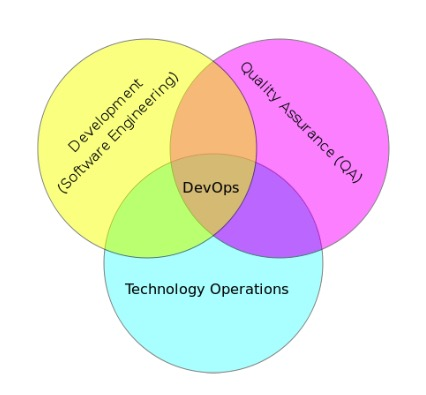
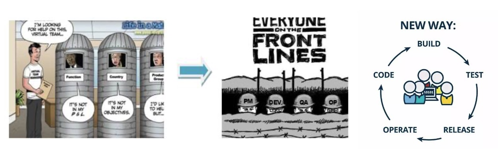
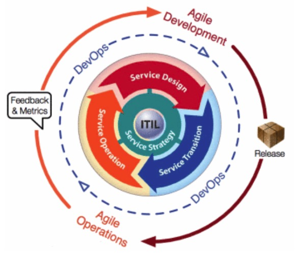
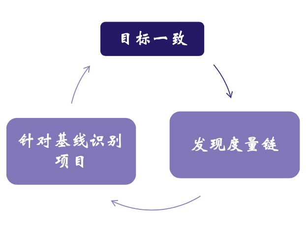

DevOps
---

--- 笔记整理自 北京理工大学 计算机学院

### 故事

- 开发部门
    * 最新最炫的技术
    * 没日没夜的加班 
    * 如期完成任务
    * 开始了自己的庆功会为公司又挣到了一大笔钱
- 运维部门
    * ( ⊙ o ⊙ )啊！
    * 从接到产品的那一刻，运维部充满了恐惧
    * 运维的生产环境太老了，无法支撑新技术
    * 运维的体系结构和环境模型不匹配
    * 运维压根搞不懂这款新的技术
    * 抱怨中，运维部门把这款产品安装好了，由于做了很多不合理的修改和强迫运行
    * 用户体验贼差，客户拒绝接受这款产品
    * 运维部门把责任推到了开发部门的头上
- 开发部门
    * 回应非常理直气壮
    * 这不是我们的错，我们的代码运行的非常好
    * 是运维部署太差劲了，不懂新技术
- 最后公司和客户蒙受了巨大的损失

### 问题产生的原因

- 软件公司按照软件流程划分部门: 产品、研发、测试、运维, 工种之间的隔阂存在已久，源于软件开发企业的组织架构
- 开发部门的驱动力是频繁交付新特性(通常与业务需求直接相关)
- 运维部门的驱动力是客户，给客户提供稳定性和非功能性的需求
- 开发人员缺乏对软件运行时环境的了解
- 运维人员缺乏对软件内部技术的了解
- 之间的鸿沟进一步减慢了产品交付的速度
- 运维是IT公司发展到一定的程度必须出现的一类服务人员，他们需要对用户负责，通过监控，架构优化，自动部署等等来保证服务的及时变更和稳定
- 对大部分软件开发人员来说，缺乏运维的工作经历, 很难从运维的角度来考虑代码的优化和约束
- 也就是说开发人员在开发的时候面对的是无限的资源和技术，而运维人员在部署的时候面临着有限的资源和各种各样的约束
- 开发和运维的隔阂越来越大，最终导致了一场名为DevOps的运动

    
     
    
备注：图片托管于github，请确保网络的可访问性

     

### 什么是DevOps

- DevOps = Development + Operations 可以看成是一组过程，方法和系统的统称
- DevOps用于促进开发、技术运营和质量保障部门之间的沟通、协作与整合
- 软件行业清晰的认识到按时交付软件的产品和服务，开发和运维必须紧密工作
- 开发和运维部门在趋势上会合并到一起，开发人员必须会运维，运维人员必须了解开发，工种将逐渐合二为一

    
     
    
备注：图片托管于github，请确保网络的可访问性

     

### QA融入DevOps

- DevOps看作开发、运维和质量保障三者的交集
- DevOps需要考虑针对部门间沟通与协作问题的流程和方法 
- DevOps的高部署频率与QA和信息安全
    * 开发可以做到一天部署10次，但是信息安全却要用4个月的时间来评估系统的安全性
    * 在代码开发和安全审计方面存在频率不匹配的现象
    * 另一方面开发会通过持续集成和好的发布惯例来维持高频率的部署
    * 代码一提交，自动化测试就开始运行，一旦发现问题, 马上解决
    * 通过把单元测试，集成测试，信息安全测试和质量保证都加入到CI和CD的流程之中
    * 可以更快的发现，解决问题，从而更好的保证产品的质量

    
     
    
备注：图片托管于github，请确保网络的可访问性

     

### 新的工作方式

    
     
    
备注：图片托管于github，请确保网络的可访问性

     

- 传统的软件开发的各个角色通常只关注自己的工作，虽然大家都处在一个项目当中，但各自划分了领地
- 产品经理就应该将市场需求文档PRD，MRD 写得清清楚楚, 如果写得不清楚，极大增加了沟通成本
- 开发人员按照文档开发，却很少考虑可测性和易测性的问题
- 测试人员只会按照MRD上的内容来测试，有问题通过内部工作量平台，提交问题单
- 而运维人员只会根据开发人员提交的上线操作单进行操作
- 这样可能会在这个过程中出现很多问题，如果换一种工作方式呢？
- 各个角色都能协同工作，以项目的最终交付作为共同的目标，积极讨论需求，优化实现
- 所有角色的紧密合作，让不同的人对角色的工作都有了深入的了解
- 开发人员耐心的为技术经理解释技术的实现，说明计划安排
- 测试人员，开发人员共同讨论验收条件
- 开发人员让运维人员了解架构设计，耐心听取运维建议进行技术改造使部署工作更加快捷有效

### DevOps与敏捷

- DevOps与敏捷开发方法存在密切的关系
- 敏捷开发的基本原则是更快的频率交付最小化可用的软件
- 在敏捷的目标里最明显的就是在每个迭代周期的末尾都给出一个可交付的软件
- 敏捷高频率的交付能力导致大量部署工作堆积在运维人员面前
- 这种堆积导致了客户眼睁睁的看着近在咫尺的软件产品却无法使用，无法得到任何商业价值
- DevOps的目的是希望把运维纳入到敏捷开发和敏捷运维过程中去，让每个迭代周期都能直接完成自动化的部署
- 完成整个流水线，从而使软件开发企业重新获得客户的信任
- DevOps超越了敏捷，它的关注点是从SDLC中移除浪费

    
     
    
备注：图片托管于github，请确保网络的可访问性

     

### DevOps的价值

- 跨职能团队的培养
    * 开发团队的KPI是交付新功能
    * 运维团队的KPI是系统稳定性
    * 两者必然会产生矛盾
    * 采用DevOps的一个跨职能团队负责所有工作包括交付新特性和系统稳定性
    * 团队采用很多实践比如：共享代码库，持续集成，测试驱动，自动化部署等等
    * 不管是代码问题，测试问题，配置问题都可以很快暴露出来得到修复
    * 问题修复周期变得更短了, 提高了效率为企业为用户创造更高的价值
- 技术价值
    * 持续的软件交付
    * 更少的复杂问题需要修复 
    * 更高的问题解决效率
- 商业价值
    * 更快的更快的价值交付
    * 更稳定的线上环境
    * 从修复维护到新增价值

### 是时候引入DevOps了

- 使用敏捷或其他软件开发过程与方法
- 业务负责人要求加快产品交付的频率
- 虚拟化和云计算基础设施日益普遍
- 数据中心自动化技术和配置管理工具的普及
- 需要DevOps来克服占主导地位的传统美国式管理风格引发的开发与运营之间的鸿沟
- 需要DevOps来改善团队协作关系，提高组织效率，降低生产环境风险

### 如何引入DevOps

- 弄清意图，统一思想，团队的职责是创造服务
- 实现组织合作 
    * 教导基本概念
    * 让所有人目标一致，可借助一系列分析工具和方法，如时间线分析，浪费分析
    * 发现度量链，对价值交付链中各个活动进行度量，发现各个活动相互之间的影响
    * 针对基线识别项目，识别哪些活动偏离了基线，采取纠正措施
- 持续改进循环
    * 制定计划
    * 实现计划
    * 测量输出
    * 决定如何持续改善流程
    * 推动团队建设, 持续集成和部署，优化软件开发过程

    
     
    
备注：图片托管于github，请确保网络的可访问性

     

### 正确对待DevOps

- 目前DevOps拥有十几种不同的定义
- 并不是所有的企业都适合采用DevOps
- 开发人员可以承担其他的角色
- 其他角色却无法承担开发者角色
- DevOps变成了让开发人员承担所有的工作
- 专业知识、协作关系与知识共享之间需要找到合适的平衡点，只有这样才能人尽其才、物尽其用
- 采纳DevOps的文化壁垒非常高，是一个值得探索的漫长过程

### 关于软件自动化的总结

- 软件自动化的概念并不复杂就是将原来手工要做的事情变成代码的自动化
- 自动化的内容也有很多，比如：办公自动化，审批自动化，软件开发自动化
- 这个技术本身没有太多需要探讨的，更多的是探讨管理的思想和流程的优化
- 自动化在业界提的并不多，我们更多听到的是持续集成和持续部署这些持续化的过程
- 自动化将敏捷的思想固化到自动化流程之中，快速开发，部署和迭代
- CI就是对项目持续的自动编译，自动测试，保证代码质量的手段，CI技术目前为止已经非常成熟和流行
- 自动化测试的用例可以保证项目规则的正确性，防止程序员的不小心重构导致的毁坏以前的规则
- 大量的测试用例每天都被运行来保证项目的质量和规则
- 大量的测试用例的运行会导致测试变慢，可以考虑把一些重要的测试用例抽离出来变成小的集合
- 每个程序员小代码的提交都会被CI系统自动触发一次小集合的测试(small-test)
- 如果有任何一个测试用例失败，那么CI系统会自动通知QA,通知最后提交代码的程序员尽快fix这次的failure
- 因为这次的失败会block其他代码的提交
- 为了运行大量的测试用例，需要搭建一个测试服务器集群，来提高验证fix的效率
- CD持续化部署其实是CI的一个自然的延续，将测试完的代码进行封装成可发布容器的image，并部署到生产环境
- CD的发展随着微服务架构的流行变得越来越重要, 微服务是相对于一个单应用而言的
- 单应用的概念就是说一个应用程序它是一个比较大的打包好的应用, 逻辑上有很多业务模块，这些模块都在一个大的应用程序里面
- 部署的时候是相同的应用部署在很多服务器上，运维比较简单，因为是同样的打包放到不同的服务器上，但是扩展不灵活
- 比如某一个模块达到瓶颈进行扩展，扩展的时候，因为某一模块不能单独去运行, 只能所有其他的模块打包在一个大的服务里同时扩展好多份
- 这样会降低服务器的利用效率，另一方面在有些条件下，单个模块的扩展就会遇到各类阻碍变得非常困难
- 单应用的问题是微服务架构风格很好解决的点，微服务相对来说是把原来的一些逻辑的模块剥离成一个独立运行和独立部署这样的一个服务
- 一个大型系统一般来说会包含几十个甚至上百个微服务，这些微服务之间其实还会有一些相互逻辑的依赖关系，比如服务A需要调服务B的API
- 这样一个逻辑结构使得这样的一个系统从拓扑结构上来说会变得非常的复杂，对运维人员来说变成了一个非常大的一个挑战
- 因为由原来部署一个应用，变成了部署几十个甚至上百个应用，而且应用于应用之间的运行环境是不同的，部署的步骤也可能是不同的
- 手工部署会出现很多问题，易出错而且效率不高，CD正是解决这一一个难题而出现的，CD就是说将微服务的部署变成一个自动化的过程
- 而且同时在结合CI的技术将很多应用纳入到CI测试的范畴，如服务和服务之间的集成测试来保证某一个服务在发布的时候可以和别的服务兼容
- 这些就是CD所解决的一些问题，CD更多的像是一个pipe-line, 从头开始是代码的提交, 自动编译, 自动打包, 自动测试, 最后容器化，发布容器的image
- 再到部署至生产环境，这是一个完整的流程，在这个流程的过程中，有很多次的check-points, 满足之后才会最终发布到生产环境
- 关于自动化其实还有自动化检测报警，如某一个阈值出现后会自动通知运维人员去检查问题，甚至还有一些分析的程序
- 自动化是一个非常大的话题，在这里面可以做的事情太多了，我们能做的是持续的完善改进这样一个过程
- 自动化最终的目的是保证软件开发的质量达到要求，最终满足客户的价值

### 扩展

[DevOps并非你想的那么简单](http://os.51cto.com/art/201404/436824.htm)