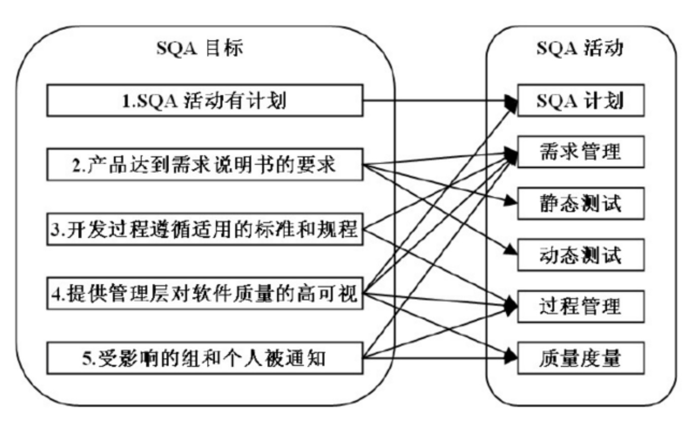
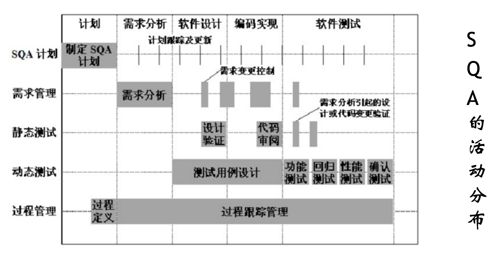

质量与质量保证
---

--- 笔记整理自 北京理工大学 计算机学院

### 从饭店说起

- 车站饭店 vs 闹区饭店
    * 车站饭店管人吃饱
    * 闹区饭店注重口味
- 软件质量越高越好么?
    * 对大多数企业来说, 提高质量是为了盈利而非创造完美无缺的产品
    * 将提高质量的努力控制在预算之内
    * 质量太高或太低都不利于企业获取利润
- 商业目标决定质量目标
- 数学家陈省身:不要考100分
    * 从95分~100分会耗费几倍的精力
    * 为什么不把这些精力拿来做更有意义的事情呢

### 什么是软件质量

- 质量不是孤立的，与上下文和观察的角度密切相关
- 软件产品质量满足规定的和隐含的与需求能力有关的全部特征和特性
    * 软件产品质量满足用户要求的程度 
    * 软件各种属性的组合程度
    * 用户对软件产品的综合反映程度
    * 在使用中满足用户要求的程度

### 质量体系

- 为保证产品、过程或服务质量，满足规定或潜有的要求，由组织机构、职责、程序、活动、能力和资源等构成的有机整体
    * 质量管理体系
    * 质量保证体系

- 质量体系文件
    * 质量手册
    * 质量程序
    * 详细的工作文件

### SQM/SQC/SQA

- SQM:软件质量管理
- SQC:软件质量控制 
- SQA:软件质量保证
- SQM = SQC + SQA
- 软件测试是SQC的一项核心活动

### 目标与活动的关系

    
     
    
备注：图片托管于github，请确保网络的可访问性

     

### 以过程为中心

    
     
    
备注：图片托管于github，请确保网络的可访问性

     

### 如何提高质量保证能力

- 定义恰当的质量目标
- 让每个人都知道质量的重要性
- 调整团队和个人的目标, 纳入质量考核体系
- 获取正确的需求
- 测试重点放在最关键和高风险处
- 提高设计质量
- 合理使用自动化测试工具

### SQA人员

- 如何保证软件质量保证的客观性
- SQA人员的角色
    * 项目组的助手
    * 管理者的耳目
    * 质量改进的源泉
    * 客户利益的代表
- SQA人员易犯的错误
    * 不与项目组作对,要为项目组提供切实有效的建议，有价值的经验教训
    * 不做画蛇添足的工作，尽可能参与到软件开发的过程中去，而非指手画脚做出检查
    * 发现问题不能隐瞒，要兼顾严格的执法和适度的灵活