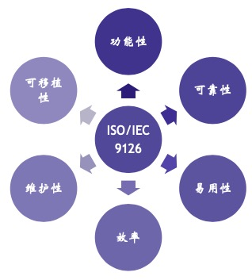
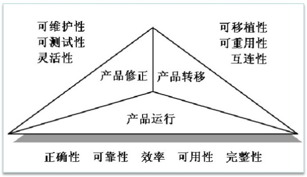
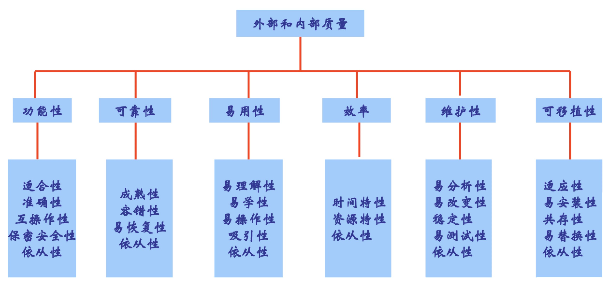
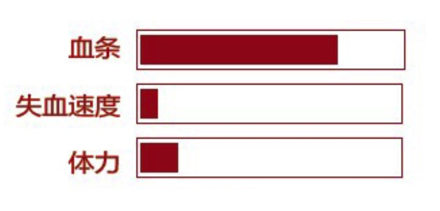
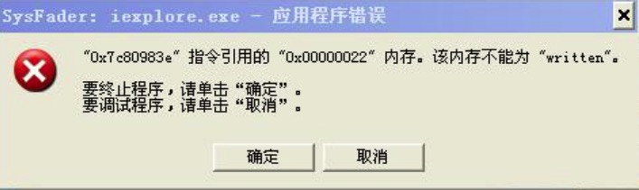
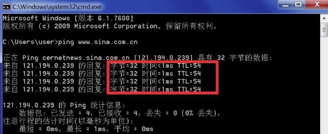
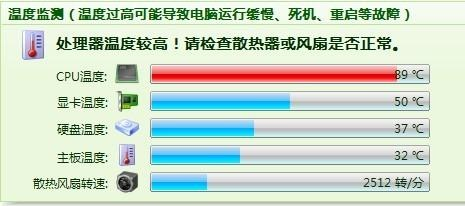

软件质量模型
---

--- 笔记整理自 北京理工大学 计算机学院

### 常见软件质量模型

- 软件产品的质量标准
- 通过度量质量属性来评估软件质量
- 常见质量模型
    * McCall 模型(1977) 
    * Boehm 模型(1978) 
    * ISO9126(1993) 世界上最畅销的模型
    * ISO25010(2011)

    
     
    
备注：图片托管于github，请确保网络的可访问性

     

### McCall质量模型

- 软件特性是软件质量的反映 
- 特性分组
- 根据质量目标对特性进行取舍
- 将11个产品特性分成了3组：产品修正、产品转义、产品运行
- 理论上质量模型应该兼顾所有的特性，在实际问题中其实这构成了一个不可能三角
- 项目管理人员必须权衡利弊做出取舍，在满足某一个指标之外牺牲另外一个或几个指标
- 为了按期实现交付，比如在第一个版本中实现高优先级功能，在第二个版本中实现低优先级功能
- 在项目开启的时候，项目经理应该根据客户的需求和项目的特点选择一组特定的管理目标
- 对着目标设计出一套数据的测量和统计的方法，这组目标应该与软件产品与软件过程的属性相关
- 这些属性又能反映出目标实现的概率，比如从使用的角度出发，我们可以选择管理目标包括：
- 需求的质量、产品的质量、开发的有效性，测试的有效性
- 这组目标能够反映出产品的质量属性，又反应了软件过程的质量属性
- 一旦项目经理选定了管理目标, 并且建立好了相关的质量属性，就应该着手定义测试标记
- 这些测试标记适用于整个软件的生命周期，有助于在项目开发初期发现潜在的问题

    
     
    
     
    
备注：图片托管于github，请确保网络的可访问性

     

### ISO9126软件质量模型

    
     
    
备注：图片托管于github，请确保网络的可访问性

     

- 建立在 McCall、Boehm 的模型之上同时满足一些功能性的要求，包括识别软件产品的内部和外部质量属性
- 将质量的概念分解成一些列质量因子，强化形成了一套分级，分层的质量模型
- 由6个特性和27个子特性构成，子特性又包含了多个度量指标，形成了一个具有三层结构的质量模型

### 软件的功能性

- 合适性:满足需求的能力
- 准确性:结果是否符合业务所需精度(小数点后四位)
- 互操作性:交互能力
- 安全性
    * 未授权
    * 已授权
- 功能性的依从性

### 软件可靠性

- 成熟性:防止系统内部错误扩散 
- 容错性:防止外部接口错误扩散 
- 易恢复性:能力恢复的程度和速度
- 可靠性的依从性

    
     
    
备注：图片托管于github，请确保网络的可访问性

     

### 易用性

- 易理解性:反馈信息准确、清晰、易懂 
- 易学性:辅助手段帮助用户学习和使用 
- 易操作性:降低用户使用门槛
- 吸引性:界面美观，功能新颖
- 易用性的依从性

    
     
    
备注：图片托管于github，请确保网络的可访问性

     

### 软件效率

- 时间效率: 响应时间
- 资源效率: 系统资源消耗情况
- 效率依从性

    
     
    
     
    
备注：图片托管于github，请确保网络的可访问性

     

### 软件可维护性

- 易分析性: 系统提供辅助测试手段
- 易改变性: 系统易修复
- 稳定性: 不易产生意外结果
- 易测试性: 提供测试手段并易观察运行状态 
- 维护性的依从性

    
     
    
备注：图片托管于github，请确保网络的可访问性

     

### 软件可移植性

- 适应性: 平台无关性
- 易安装性: 安装简单
- 共存性: 与其他系统共存无干扰的能力 
- 易替换性: 自我升级能力
- 可移植性的依从性

    
     
    
备注：图片托管于github，请确保网络的可访问性

     

