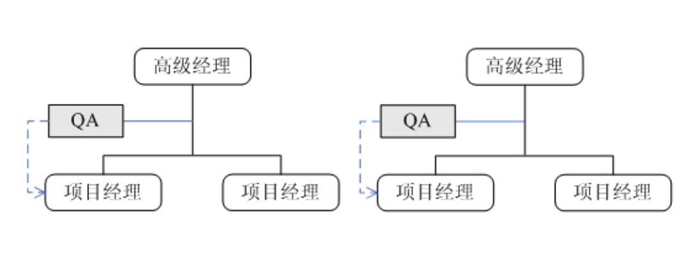
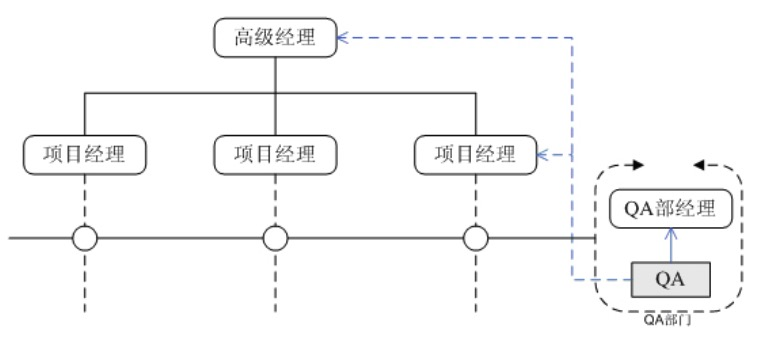
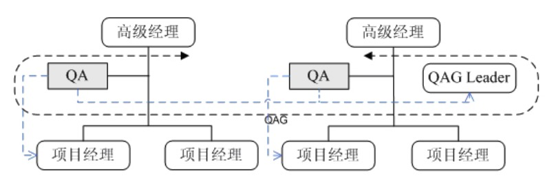
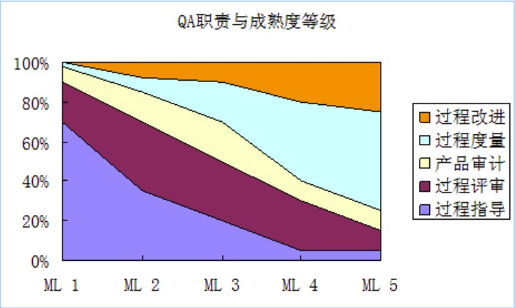

SQA组织与职责
---

--- 笔记整理自 北京理工大学 计算机学院

### SQA组织结构

- 组织结构 
    * 决定岗位的职责
    * 决定资源配置

- 分类
    * 职能结构
    * 矩阵结构 
    * 柔性结构(混杂了职能和矩阵)

### 职能结构

- 各部门自设QA岗位
- QA位于高级经理之下, 独立于项目组, 直接对高级经理负责，但在业务上需要向项目经理汇报，属于项目成员
- QA和项目组工作在一起
- 优点
    * QA易融入项目组
    * 易发现实质性问题 
    * 易解决问题
- 缺点
    * 缺乏交流(各职能部门相互独立)
    * 重复投资
    * QA被忽视(高级经理专注于业务的发展，往往会忽略QA的发展)

    
     
    
备注：图片托管于github，请确保网络的可访问性

     

### 矩阵结构

- 设立专门QA部门，与各个业务部门平级
- QA行政上向行政经理负责，业务上向高级经理和项目经理汇报
- 优点
    * QA具有独立性和客观性
    * 组织和项目利益平衡 
    * QA资源集中共享 
    * QA独立发展
- 缺点
    * 脱离项目组(属于空降兵)
    * 不易发现问题 
    * 不易解决问题

    
     
    
备注：图片托管于github，请确保网络的可访问性

     

### 柔性结构

- 是一种混合结构
- QA工作组是专业小组，不是行政机构
- 优点
    * QA融入项目组
    * 部门经验共享
    * QA能力提高
- 改进
    * QA组长的权限分配

    
     
    
备注：图片托管于github，请确保网络的可访问性

     

### 岗位职责

- 原始职责
    * 过程评审 
    * 产品审计
- 增加职责
    * 过程指导 — 培训与指导
    * 过程度量 — 搜集、统计、分析
    * 过程改进 — 位于一线，了解情况

### 岗位职责的变化

- 业务需求的变化 
    * 协助评审
    * 监控外包方
    * 其他
- 过程成熟度水平
    * 低 -> 过程指导
    * 高 -> 过程优化
- 企业文化
    * 服务的职责
    * 监督的职责

### 成熟度对QA的影响

    
     
    
备注：图片托管于github，请确保网络的可访问性

     

- x轴是企业的软件开发过程的成熟度等级，等级越高，开发水平相应的就越高
- y轴是QA的工作职责构成百分比
- 在低成熟度的等级下，QA需要花费大量的时间精力抽取各个项目的最佳实践来定义过程并指导过程的实施
- 随着过程的完善和制度化，QA的重点主键转向了过程评审和产品审计
- 当企业的成熟度达到4，5级的时候，对过程的遵守已经达到了员工的习惯，这时候过程的评审和产品的审计需求变少,而度量和过程的优化又成了QA的主要工作重点

### 岗位配置方式

- 岗位配置影响因素
    * 公司团队规模
    * 项目规模
    * 企业文化
    * 组织制度
- 专职
- 兼职
- 轮岗(QA和项目经理岗位轮换)
    * 把一定时间QA的工作经历当做项目经理上岗的必备条件
    * 让项目经理在QA的岗位上充分发挥自己的实践和工作经验,当好一个过程指导者
    * QA的工作经历可以让项目经理以旁观者的角度来审视自己的管理工作，有利于项目经理的自我提升

### 只有SQA是不够的

- 过程规范的制定，应用，反馈和修正
- 过程规范的可操作性与抽象性的权衡
- 过程规范与技能
    * 规范科学合理
    * 规范动态修正
    * 技能与规范要匹配
    * 通过培训和训练提高技能
