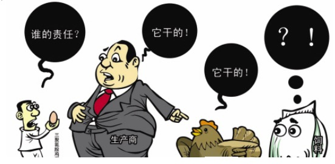
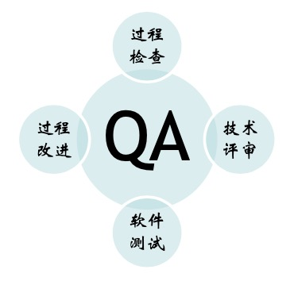
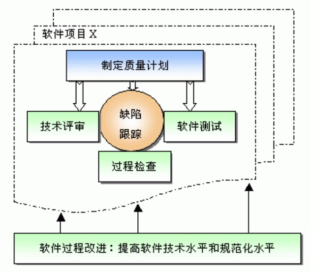
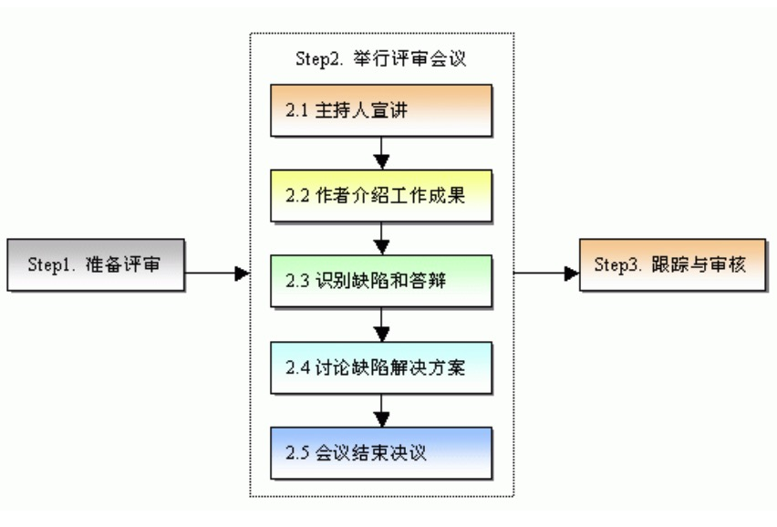
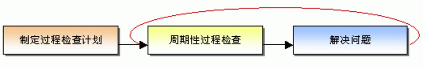
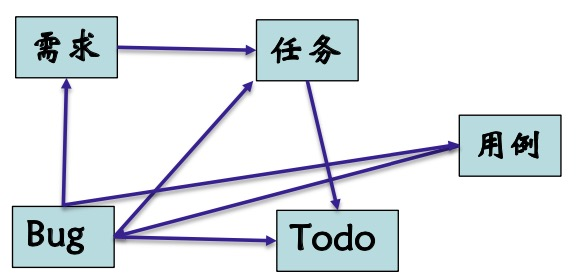

全面软件质量管理
---

--- 笔记整理自 北京理工大学 计算机学院

### 质量保证能保证质量吗?

- 质量保证是保证质量的必要手段，而非充分手段
- 质量保证:检查软件项目的工作过程和工作成果是否符合既定的规范
- 过程质量与产品质量存在因果关系 
    * 好的过程产生好的产品
    * 差的过程产生差的产品
    * 影响产品质量的不只有过程

### 全面软件质量管理

- 借鉴于传统生产行业的全面质量管理
- 提高软件质量
    * 提高技术水平
    * 提高规范化水平
- 谁对软件质量负责?
    * 任何软件开发与管理的工作人员都会对产品的质量产生影响，都应该对产品质量负责
    * 不要把质量人员全部推给质量保证人员，研发人员或测试人员
- 谁对软件质量负最大的责任?
    * 虽然质量保证人员每天和质量打交道，他们个人并不会对产品质量产生最大的影响，也没有最大的权利，更不应该负最大的责任
    * 在电影中说能力越大责任越大
    * 在现实中权利越大，责任越大
    * 所以在整个项目中谁的权利最大，谁负最大的责任

    
     
    
备注：图片托管于github，请确保网络的可访问性

     

### 全面质量管理模型

    
     
    
     
    
备注：图片托管于github，请确保网络的可访问性

     

- 要根据企业的情况，客户的情况，项目的情况来确定适当的质量目标
- 根据质量目标来制定质量计划，随后的开发活动就是在计划的指导下，以曲线跟踪为核心
- 综合采用技术评审，软件测试和过程检查的方法尽快的对开发成果进行质量检查，及时找出并消除工作成果的缺陷
- 在公司层面经过对不同项目采用全面质量管理要及时收集反馈信息，改进软件过程，提高软件的开发技术水平，规范化水平
- 在采用全面软件质量管理模型的企业当中，质量管理人员的典型工作分配是这样的
- 负责制定质量计划，工作很重要，但工作量比较少，此处不计入总量
- 负责过程检查，大约占个人工作量的20%
- 参与技术评审，大约占工作量的30%
- 参加软件测试，大约占工作量的30%
- 参与面向整个机构的软件过程改进，大约占工作量的20%

### 质量管理计划

- 目的: 实现质量目标(质量目标是由商业目标决定的)
- 量身定制，勿追求过高的质量
- 计划制定
    * 核心成员协商
    * 质量人员起草 
    * 项目经理审批
- 计划内容
    * 质量要素分析
    * 质量目标
    * 人员与职责
    * 过程检查计划
    * 技术评审计划
    * 软件测试计划
    * 缺陷跟踪管理工具

### 技术评审

    
     
    
备注：图片托管于github，请确保网络的可访问性

     

- 目的是：尽早的发现工作中的缺陷，帮助开发人员及时消除缺陷，从而有效的提高产品的质量
- 技术评审最初是由IBM公司为了提高软件质量和程序员的生产率而创造的
- 技术评审工作可以在任何软件开发阶段进行，越早消除缺陷，就能越早降低开发成本
- 有了技术评审，开发人员可以及时得到同行专家的帮助和指导，加深对工作成果的理解，更好的预防缺陷，提高开发生产率
- 技术评审有两种
    * FTR(Formal Technical Review) 正式的技术评审，参加评审会议的人很多 
    * ITR (Informal Technical Review) 非正式技术评审，形式较为灵活，在开发人员之间展开

### 软件测试

- 与技术评审的区别
    * 技术评审不需要运行软件
    * 技术评审是手工静态的
    * 技术评审一般在测试之前
    * 软件测试一般需要借助测试工具 
    * 软件测试的工作量较大
    * 软件测试可以是静态的和动态的
- QA人员一定要参与软件测试，以便更深入了解软件特质和为开发小组提供强有力的帮助
- 小企业没有测试人员，开发人员可以兼职，但一定要避免自己测自己的程序

### 过程检查

- 质量保证的核心:过程检查
- 符合规范的工作成果不见得是高质量的，不符合规范的一定是不合格的
- 过程检查的要点是找到那些明显不符合规范的工作过程和成果，及时纠正
- 制定检查计划
    * 主要检查项
    * 检查时间(频率)
- 避免吹毛求疵
- 过程问题纳入缺陷管理工具
- 先尝试解决再上报

    
     
    
备注：图片托管于github，请确保网络的可访问性

     

### 缺陷跟踪工具

- 缺陷跟踪工具的必要性 
    * 提高工作效率
    * 加快项目进度
    * 提升产品质量
- 优秀的工具
    * 功能扩展

    
     
    
备注：图片托管于github，请确保网络的可访问性

     

### 质量保证案例

- 一个软件公司刚创立起步，主要精力放在软件开发上，项目经理都是研发出身，没有受过系统的项目管理的培训
- 缺少有效的管理方法的指导，公司缺少系统化制度化的研发管理流程，缺少像QA这种指导和监督机制，使得产品的交付时间很难预计
- 后来公司增设QA岗位, 并把QA列为项目启动的三个人员之一，QA岗位分为三级
    * QA：独立于项目组之外，为项目组提供规范流程，作为产品开发的依据，指导和审核项目组是否按规范执行，敏锐识别问题产生的原因, 将经验和纠正措施固化到流程之中，施行过程改进，避免以后的项目出现类似问题
    * 资深QA：在完成QA的工作之外，要求具备多年的项目管理和质量管理经验，根据企业的商业和业务需求，负责质量体系的架构设计，承担主要的规范文件的制定和改进工作，并指导QA的项目经理进行有效的工作
    * QA主管：要求具备扎实的资深的QA基本功之外，还要求跟踪和熟悉企业产品和业务，能够洞察不规范和责任定义不清的管理灰色地带，以指导员和医生的角度识别和标识出问题，发现问题，不是对比流程，不是查看实际操作与流程的不符之处，而是要找出影响质量，左右进度，降低效率，削弱效果，破坏组织目标达成的不良现状，这些现状包括：流程问题，技术问题，工具问题，管理问题等，针对这些问题，在流程方面，工程方法推行方面, 技术改进方面, 管理实施方面，人员激励方面给出解决方案或协调各方力量，组织专题会议，推进共同改进

### 扩展

- [怎么把质量保证（QA）的工作做好？](https://www.zhihu.com/question/19941597)
- [QA这个职位主要做什么？重要么？](https://www.zhihu.com/question/19685881)
- [质量管理精华贴](https://www.zhihu.com/topic/19641683/top-answers?page=5)
